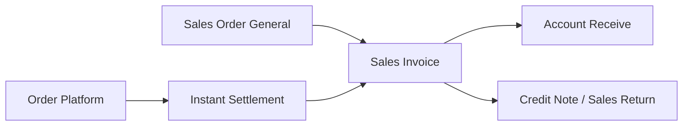
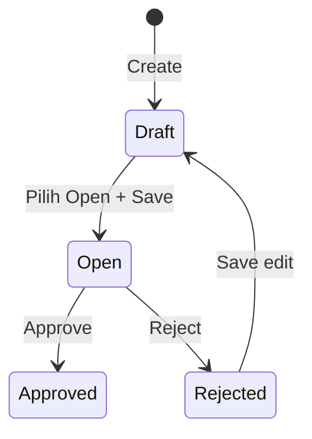

# Sales Invoice — Panduan Pengguna

**Siapa yang baca:** finance AR, sales admin, operations support  
**Menu di sistem:** Accounting → **Sales Invoice**  
**Kode transaksi:** diawali `SI-`  
**Feature Map / Lingo:** [feature-map.md](./feature-map.md)

---

## 1. Apa Itu & Kenapa Penting

Sales Invoice adalah dokumen untuk **menagih pelanggan** atas penjualan yang sudah ada di Sales Order. Lewat menu ini piutang dan penjualan tercatat di sistem, lalu pelunasan dilanjutkan di Account Receive.

Tanpa Sales Invoice yang di-approve, piutang pelanggan belum resmi — dan pembayaran tidak punya dasar yang jelas.

---

## 2. Overview Flow & Proses Bisnis

### Rantai proses

**Versi teks:**

1. Sales Order General disetujui (atau order platform di-settle lewat Instant Settlement).  
2. Buat / terima **Sales Invoice** ([jalur create](#sf-lingo:SF-SI-01)).  
3. **Approve** → piutang + jurnal penjualan ([Net Sales](#sf-lingo:SF-SI-03)).  
4. Terima bayar di **Account Receive**.  
5. Koreksi/retur lewat Credit Note / Sales Return bila perlu.

### Siklus status

| Status | Artinya | Bisa diubah? |
|--------|---------|--------------|
| **Draft** | Belum siap approve | Ya |
| **Open** | Siap Approve / Reject | Ya |
| **Approved** | Terkunci; piutang sudah jalan | Tidak |
| **Rejected** | Ditolak; setelah Save biasanya kembali Draft | Ya |

---

## 3. Sebelum Mulai (Flow Sebelum)

Pastikan:

- [ ] Ada **Sales Order General** approved dengan sisa belum ditagih (untuk create manual).
- [ ] **Customer** punya akun piutang (AR) yang sudah dikonfigurasi.
- [ ] Produk punya akun **Sales** (dan pengaturan PPN penjualan jika dipakai).
- [ ] **Tanggal** transaksi dalam periode fiskal terbuka.
- [ ] Order **platform** — jangan create manual; tunggu / cek dari Instant Settlement ([batas platform](#sf-lingo:SF-SI-04)).

🎬 [Interactive demo akan ditambahkan di sini]

---

## 4. Setelah Selesai (Flow Sesudah)

Setelah SI **di-approve**:

1. Qty “sudah di-invoice” di Sales Order naik.  
2. Jurnal piutang + penjualan (+ PPN / biaya / diskon lain bila ada) terbit.  
3. SI muncul sebagai outstanding di **Account Receive**.  
4. Opsional: Print PDF invoice.

> Invoice dari [platform](#sf-lingo:SF-SI-04) biasanya tidak bisa di-reject atau dihapus seperti invoice biasa.

🎬 [Interactive demo akan ditambahkan di sini]

---

## 5. Yang Perlu Diperhatikan

- **Kalau status masih Draft**, Approve tidak jalan — pilih **Open** dulu lalu Save.  
- **Kalau kamu mau tagih sebagian qty satu SKU** (mis. 5 dari 10) lewat Use, sistem tidak mengizinkan — yang diambil adalah **seluruh sisa** baris itu ([Outstanding SO Use](#sf-lingo:SF-DET-01)).  
- **Kalau mau ganti customer/tanggal/kurs** setelah ada baris barang, hapus baris dulu.  
- **Kalau akun piutang / penjualan / pajak belum dikonfigurasi**, Approve gagal dengan pesan konfigurasi.  
- **Kalau periode fiskal tutup** untuk tanggal SI, simpan/approve ditolak.  
- **Kalau invoice dari platform**, Reject/Delete tidak tersedia.  
- **Kalau [import Excel](#sf-lingo:SF-IMP-01)**, isi Order Number **atau** Platform Order ID (salah satu); hanya SO internal/general; hasilnya status Open — Approve manual supaya jurnal jalan.  
- **Kalau satu baris import rusak**, seluruh file gagal.

---

## 6. Langkah-Langkah (Step by Step)

### Cek dulu

1. SO General approved + sisa qty.  
2. COA customer & produk siap.

### Langkah 1 — Buat header

1. Buka **Sales Invoice → Create** ([How SI is created](#sf-lingo:SF-SI-01)).  
2. Cek Customer, tanggal, mata uang, kurs (sering terisi dari invoice terakhir).  
3. Simpan. Jika masih Draft, set **Open** sebelum approve.

### Langkah 2 — Tambah barang dari SO

1. Buka panel Outstanding Sales Order.  
2. Pilih per baris SKU atau per seluruh SO ([Outstanding SO Use](#sf-lingo:SF-DET-01)).  
3. Qty mengikuti sisa penuh baris — tidak diedit partial di layar ini.  
4. Opsional: tambah [Other Cost / Other Discount](#sf-lingo:SF-SI-02).

🎬 [Interactive demo akan ditambahkan di sini]

### Langkah 3 — Approve

1. Pastikan status **Open**.  
2. Klik **Approve**.  
3. Cek [Net Sales](#sf-lingo:SF-SI-03) / piutang siap di Account Receive.

### Langkah 4 — Import saldo awal (opsional)

1. Ikuti [Import saldo awal](#sf-lingo:SF-IMP-01) — template 3 kolom.  
2. Upload → SI berstatus Open.  
3. Buka SI → **Approve** agar jurnal terbit.

### Langkah 5 — Lanjutan

| Kebutuhan | Lakukan |
|-----------|---------|
| Terima bayar | **Account Receive** |
| Cetak | **Print** |
| Koreksi | **Credit Note** / Sales Return (sesuai kebijakan) |

---

## 7. Tips & Hal yang Sering Bikin Bingung

- **Create langsung Draft?** Wajar saat ini — pilih Open sebelum Approve.  
- **Satu SO, dua invoice?** Boleh — bedakan per SKU/line yang di-Use ([Outstanding SO Use](#sf-lingo:SF-DET-01)).  
- **Contoh:** SO punya SKU-A 10 & SKU-B 10 → invoice pertama hanya SKU-A (qty 10); SKU-B menunggu invoice berikutnya.  
- **Harga di layar 10.000 (termasuk PPN)?** Angka yang kamu lihat tetap seperti di SO; sistem menghitung dasar sebelum PPN di belakang untuk jurnal.  
- **Import platform?** Tidak boleh — hanya order internal/general ([Import](#sf-lingo:SF-IMP-01)).  
- **Setelah Reject, status jadi Draft?** Normal — set Open lagi lalu Approve.

---

## 8. Referensi

| Dokumen | Isi |
|---------|-----|
| [feature-map.md](./feature-map.md) | Indeks sub-feature + Lingo |
| [knowledge-base.md](./knowledge-base.md) | SOP operator, troubleshooting, FAQ |
| [requirement.md](./requirement.md) | Aturan bisnis, validasi, gap |
| [technical.md](./technical.md) | API, jurnal, import teknis |

**Menu terkait:** Sales Order · Instant Settlement · Account Receive · Credit Note · Sales Return

---

*Derivatif dari requirement / knowledge-base / technical v2.0 — Feature Map v1.0 ditautkan untuk Lingo.*
