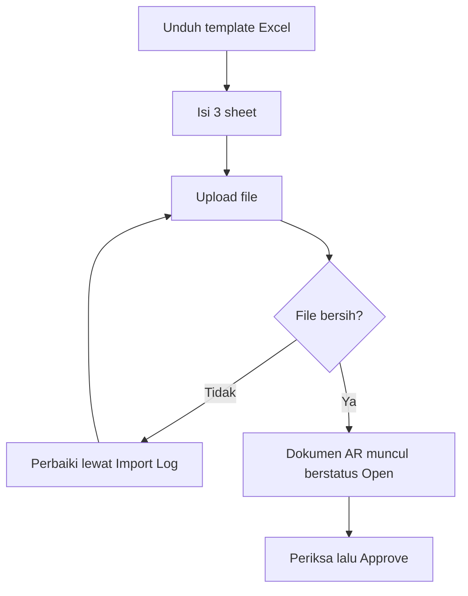

# Account Receive — Knowledge Base

## Apa itu menu ini

Menu **Account Receive** mencatat uang yang masuk dari customer dan mencocokkannya dengan tagihan (Sales Invoice) yang belum lunas. Satu dokumen bisa melunasi beberapa tagihan sekaligus.

| Item | Nilai |
|------|-------|
| Menu | Accounting → **Account Receive** |
| Route UI | `/accounting/customer-payment` |

## Kapan dipakai

- Ada transfer masuk di rekening dan Anda perlu mencatat tagihan mana yang terlunasi.
- Ada banyak pelunasan sekaligus dalam satu hari — pakai **Import** supaya tidak perlu input satu per satu.
- Customer membayar memakai deposit (Credit Note) yang sudah disetujui sebelumnya.

## Alur kerja standar

**Keterangan langkah:**

- **Unduh template** — selalu pakai template dari sistem. File buatan sendiri akan ditolak karena nama sheet dan judul kolomnya tidak dikenali.
- **Isi 3 sheet** — sheet pertama berisi uang masuk (satu baris satu transaksi bank), sheet kedua berisi tagihan yang dilunasi, sheet ketiga hanya diisi kalau ada selisih. Sheet ketiga boleh dibiarkan kosong; dua sheet pertama wajib terisi.
- **Angka pengikat** — di sheet kedua dan ketiga ada kolom yang meminta **nomor baris Excel** dari sheet pertama. Isi dengan nomor baris yang terlihat di kiri layar Excel, bukan nomor urut data. Salah isi di sini membuat tagihan menempel ke transaksi bank yang keliru.
- **Upload** — proses berjalan di belakang layar. Tunggu sampai selesai, jangan upload ulang berkali-kali.
- **Periksa lalu Approve** — hasil import selalu masuk berstatus **Open**, belum masuk jurnal. Ini memang disengaja supaya Finance sempat memeriksa dulu.

## Mengisi sheet pertama (uang masuk)

Satu baris berarti satu dokumen pelunasan. Kalau di rekening ada 3 transfer masuk, tulis 3 baris — walaupun banknya sama dan tanggalnya sama. Sistem tetap membuat 3 dokumen terpisah.

Kolom sumber dana bisa diisi dua macam: **kode akun bank** yang aktif, atau **nomor Credit Note** kalau customer membayar dengan deposit. Sistem mengenali sendiri mana yang Anda maksud, jadi tidak ada pilihan tipe yang perlu diisi.

Kolom deskripsi boleh dikosongkan. Kalau kosong, sistem menuliskan sendiri "Payment for" diikuti nomor-nomor tagihan yang dilunasi.

## Mengisi sheet ketiga (selisih)

Sheet ini dipakai kalau uang yang masuk tidak persis sama dengan nilai tagihan.

| Situasi | Yang diisi | Hasilnya |
|---|---|---|
| Uang masuk **lebih besar**, kelebihan mau disimpan sebagai deposit customer | Ketik `CREDIT NOTE` di kolom kode akun, isi kelebihannya di kolom **Credit** | Sistem membuat Credit Note baru atas nama customer |
| Uang masuk **lebih besar**, kelebihan mau langsung diakui sebagai pendapatan | Isi kode akun pendapatan, nilainya di kolom **Credit** | Kelebihan masuk ke akun itu, tanpa Credit Note |
| Uang masuk **lebih kecil** dari tagihan | Isi kode akun biaya, selisihnya di kolom **Debit** | Tagihan tetap tercatat lunas penuh, selisihnya masuk akun biaya |

Dalam satu baris, isi **salah satu** saja — Debit atau Credit, tidak boleh dua-duanya.

**Contoh kelebihan bayar:** tagihan 500.000, uang masuk 550.000. Ketik `CREDIT NOTE` dengan Credit 50.000. Hasilnya tagihan lunas 500.000 dan customer punya deposit 50.000 untuk dipakai lain kali.

**Contoh kekurangan bayar:** tagihan 500.000, uang masuk 493.500. Isi kode akun biaya dengan Debit 6.500. Tagihan tetap dianggap lunas penuh 500.000, selisih 6.500 tercatat sebagai biaya.

## Troubleshooting

| Gejala | Penyebab | Solusi |
|---|---|---|
| Seluruh file ditolak padahal cuma satu baris salah | Sistem memang membatalkan semuanya kalau ada satu kesalahan, supaya tidak ada pelunasan yang masuk separuh | Buka panel **Import Log**, perbaiki semua baris yang dilaporkan sekaligus, lalu upload ulang |
| Muncul keluhan angka tidak cocok | Total tagihan di sheet kedua ditambah selisih di sheet ketiga tidak sama dengan uang masuk di sheet pertama | Jumlahkan ulang per nomor baris pengikat; pesan errornya menyebut baris mana yang timpang |
| Tagihan ditolak karena melebihi sisa, padahal terlihat belum dibayar | Ada dokumen pelunasan lain yang masih Open dan sudah memesan sebagian nilainya | Cek dokumen AR lain untuk tagihan itu; pesan errornya menyebutkan nilai yang tertahan |
| Kode bank ditolak walau ada di master | Akun atau data banknya sedang nonaktif | Aktifkan kembali akun bank tersebut lalu ulangi |
| Muncul keluhan input dikenali sebagai dua hal sekaligus | Ada kode akun bank dan nomor Credit Note yang kebetulan persis sama | Ubah salah satu penamaannya |
| Upload ditolak karena ada proses lain | Hanya boleh ada satu proses import berjalan | Tunggu sampai import sebelumnya selesai |
| Pembayaran pakai deposit ditolak | Credit Note belum disetujui, saldonya kurang, atau pemiliknya beda dengan customer di tagihan | Pastikan CN sudah Approved, saldo mencukupi, dan customernya sama |
| Muncul permintaan mengatur akun deposit customer | Akun deposit customer belum diisi di data perusahaan atau data store | Lengkapi dulu pengaturan akun deposit customer tersebut |

## Relasi Instant Settlement

| Yang perlu Anda tahu | Penjelasan singkat |
|----------------------|-------------------|
| Kapan AR otomatis muncul | Setelah upload settlement selesai dan Anda klik **Approve** di Instant Settlement |
| Berapa dokumen AR | Biasanya satu dokumen per batch upload (per store), berisi banyak referensi tagihan |
| Tanggal & jam AR dari settlement | Tanggal = tanggal SI (semua SI batch harus hari yang sama); jam = jam SI paling akhir di batch |
| AR manual sebelumnya | Tagihan yang sudah punya AR manual tidak dibuatkan lagi |
| Reject settlement | Tidak membuat AR — tagihan dan dokumen lain tetap ada |
| Delete settlement | Diblokir kalau ada tagihan dengan AR manual |

**Prasyarat:** Cash/Bank Receiving di pengaturan store harus terisi sebelum Approve settlement. Approve Instant Settlement juga ditolak jika tanggal SI di batch campur beda hari.

## FAQ

**Kenapa transfer di bank dan tanggal yang sama jadi dua dokumen?** Karena pemisahan mengikuti baris transaksi bank, bukan gabungan bank dan tanggal.

**Hasil import langsung masuk pembukuan?** Belum. Semuanya masuk berstatus Open dan baru masuk jurnal setelah di-Approve.

**Boleh mencampur tagihan dari beberapa customer dalam satu transaksi bank?** Tidak boleh. Satu transaksi bank hanya untuk satu customer.

**Sheet ketiga wajib diisi?** Tidak. Isi hanya kalau ada selisih antara uang masuk dan nilai tagihan.

**Detail lengkap ada di mana?** Lihat [requirement.md](./requirement.md) untuk aturan rinci dan [user-guide.md](./user-guide.md) untuk panduan langkah.
