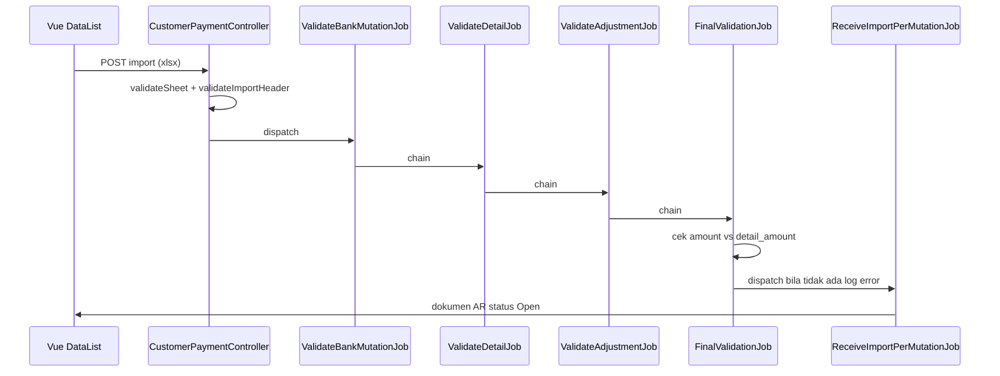

# Account Receive — Technical

## 1. File Map

### Backend

| Berkas | Peran |
|---|---|
| `Modules/Accounting/Http/Controllers/CustomerPaymentController.php` | Endpoint import, download template, progress, log, history; validasi sheet dan heading |
| `Modules/Accounting/Http/Controllers/CustomerPaymentDetailController.php` | Detail dokumen AR + jalur import detail lama |
| `Modules/Accounting/Http/Controllers/CustomerPaymentDetailAdjustmentController.php` | Baris adjustment pada dokumen AR |
| `Modules/Accounting/Exports/AccountReceiveTemplateExport.php` | Definisi tiga sheet + konstanta nama sheet |
| `Modules/Accounting/Exports/AccountReceiveBankMutationTemplateSheet.php` | `REQUIRED_HEADINGS` Sheet 1 |
| `Modules/Accounting/Exports/AccountReceiveDetailTemplateSheet.php` | `REQUIRED_HEADINGS` Sheet 2 |
| `Modules/Accounting/Exports/AccountReceiveAdjustmentTemplateSheet.php` | `REQUIRED_HEADINGS` Sheet 3 |
| `Modules/Accounting/Import/ReceiveValidateBankMutationImport.php` | Sheet mapper Sheet 1 |
| `Modules/Accounting/Import/ReceiveValidateBankMutationSheet.php` | Validasi Sheet 1 |
| `Modules/Accounting/Import/ReceiveValidateDetailImport.php` | Sheet mapper Sheet 2 |
| `Modules/Accounting/Import/ReceiveValidateDetailSheet.php` | Validasi Sheet 2 |
| `Modules/Accounting/Import/ReceiveValidateAdjustmentImport.php` | Sheet mapper Sheet 3 |
| `Modules/Accounting/Import/ReceiveValidateAdjustmentSheet.php` | Validasi Sheet 3 |
| `Modules/Accounting/Jobs/ImportReceiveValidateBankMutationJob.php` | Rantai validasi tahap 1 |
| `Modules/Accounting/Jobs/ImportReceiveValidateDetailJob.php` | Rantai validasi tahap 2 |
| `Modules/Accounting/Jobs/ImportReceiveValidateAdjustmentJob.php` | Rantai validasi tahap 3 |
| `Modules/Accounting/Jobs/ImportReceiveFinalValidationJob.php` | Amount Mismatch check + penentuan sukses/gagal |
| `Modules/Accounting/Jobs/ReceiveImportPerMutationJob.php` | Pembentukan dokumen AR, detail, adjustment, dan Credit Note |
| `Modules/Accounting/Entities/CustomerPayment.php` | Model dokumen AR |
| `Modules/Accounting/Entities/CustomerPaymentDetail.php` | Model alokasi ke invoice |
| `Modules/Accounting/Entities/CustomerInvoice.php` | Sumber outstanding lewat `invoice_remaining_after_vat` |
| `Modules/Accounting/Import/CustomerPaymentImport.php` | Jalur import lama satu sheet — menambah detail ke dokumen AR yang sudah ada |
| `Modules/Accounting/Policies/CustomerPaymentPolicy.php` | Otorisasi |

### Frontend

| Berkas | Peran |
|---|---|
| `olshoperp-frontend/src/pages/Accounting/AccountReceivable/Receive/DataList.vue` | Datalist, export, riwayat import |
| `olshoperp-frontend/src/pages/Accounting/AccountReceivable/Receive/ImportLog.vue` | Panel error hasil screening |
| `olshoperp-frontend/src/pages/Accounting/AccountReceivable/Receive/Form.vue` | Form dokumen AR |
| `olshoperp-frontend/src/pages/Accounting/AccountReceivable/Receive/DatalistDetail.vue` | Datalist detail invoice terlunasi |
| `olshoperp-frontend/src/pages/Accounting/AccountReceivable/Receive/AvailableData.vue` | Modal Available Sales Invoice |
| `olshoperp-frontend/src/pages/Accounting/AccountReceivable/Receive/Adjustment.vue` | Baris adjustment |
| `olshoperp-frontend/src/pages/Accounting/AccountReceivable/Receive/ApprovalDialog.vue` | Dialog approve |

## 2. API Routes

| Method | Path | Handler |
|---|---|---|
| POST | `accounting/customer-payment/import` | `CustomerPaymentController@import` |
| GET | `accounting/customer-payment/import/template` | `CustomerPaymentController@importTemplate` |
| GET | `accounting/customer-payment/import/progress` | `CustomerPaymentController@importProgress` |
| GET | `accounting/customer-payment/import-log` | `CustomerPaymentController@importLog` |
| GET | `accounting/customer-payment/import-history` | `CustomerPaymentController@importHistory` |
| GET | `accounting/customer-payment/import-history-detail/{historyId}` | `CustomerPaymentController@importHistoryDetail` |
| GET | `accounting/customer-payment/{payment}/outstanding-customer-invoice` | `CustomerPaymentController@outstanding_customer_invoice` |
| GET | `accounting/customer-payment/{payment}/select2-outstanding-invoice` | `CustomerPaymentController@select2OutstandingCustomerInvoice` |

## 3. Database Key Tables

| Tabel | Peran |
|---|---|
| `accounting_customer_payments` | Header dokumen AR — `transaction_status`, `grand_total`, `actor_reference_id`, `actor_reference_class` |
| `accounting_customer_payment_details` | Alokasi per invoice |
| `import_receive_temps` | Staging antar sheet; kolom kunci `type_id`, `row`, `identifier`, `identifier_class`, `amount`, `detail_amount`, `bank_mutation_id` |
| `import_receive_logs` | Kumpulan pesan error satu sesi import |
| `payment_import_histories` | Riwayat import beserta hitungan baris sukses/gagal |
| `accounting_customer_invoices` | `prepared_to_payment_amount`, `processed_to_payment_amount`, `grand_total_after_vat` |

`identifier_class` bersifat polymorphic: `ChartOfAccount::class` untuk pembayaran bank, `Payment::class` untuk Credit Note.

## 4. Flow utama

## 5. Invariants

- Per baris mutasi sebelum dokumen dibentuk: `amount == detail_amount`, di mana `detail_amount` adalah akumulasi Sheet 2 ditambah adjustment Sheet 3 (Debit disimpan negatif, Credit positif).
- Per invoice: `prepared_to_payment_amount + processed_to_payment_amount <= grand_total_after_vat`.
- `invoice_remaining_after_vat = grand_total_after_vat - (prepared_to_payment_amount + processed_to_payment_amount)`.
- Dokumen AR hasil import selalu lahir dengan `transaction_status = open`.
- `grand_total` dokumen AR = amount mutasi dikurangi total adjustment bertipe Credit Note.
- Satu baris adjustment hanya boleh mengisi Debit atau Credit, tidak keduanya.

## 6. Validation Highlights

- Validasi berlapis: ekstensi dan mime XLSX di controller, keberadaan sheet wajib di `validateSheet`, judul kolom di `validateImportHeader`, lalu validasi isi per sheet di kelas `ReceiveValidate*Sheet`.
- Seluruh pesan error ditulis ke `ImportReceiveLog` dengan format `Row {row} at Sheet {index}: {Column} {message}`; nomor sheet berasal dari posisi fisik sheet di file.
- Tanggal menerima serial number Excel maupun string tanggal kalender, lalu disimpan dengan jam 23:59:59 — lihat GAP-AR-03 di requirement.
- COA adjustment dibatasi ke class `Expense`, `Revenue`, `Other Revenue & Expenses`, harus aktif, dan bukan COA induk.
- Daftar pesan lengkap ada di [requirement §6](./requirement.md).

## 7. Frontend Behaviors

- Datalist memuat panel riwayat import (`has_import_history`) dan komponen `ImportLog.vue` untuk menampilkan hasil screening.
- Progress import di-poll lewat endpoint `import/progress`.
- Modal Available Sales Invoice mengambil data dari endpoint outstanding invoice pada dokumen AR terkait.

## 8. Failure Modes & Transaction Boundary

- Import bersifat all-or-nothing: bila `ImportReceiveLog` berisi entri apa pun saat `ImportReceiveFinalValidationJob` berjalan, riwayat ditandai gagal dan `ReceiveImportJob` tidak pernah di-dispatch — tidak ada dokumen tertulis sebagian.
- Exception di validasi akhir dicatat sebagai `Something went wrong: {pesan}`, riwayat ditandai gagal, lalu exception dilempar ulang supaya job masuk failed queue.
- Berkas upload dihapus pada tahap validasi akhir.
- Penguncian sesi memakai kombinasi cache lock dan pengecekan `ImportReceive` yang belum `ended_at`. Cache key alur AR memakai penanda milik AP — lihat GAP-AR-07.
- Pembentukan dokumen berjalan per baris mutasi di job terpisah; kegagalan satu job tidak otomatis merollback dokumen dari baris mutasi lain yang sudah selesai.

## 9. Data Lifecycle

| Tahap | Flag / kolom | Efek |
|---|---|---|
| Import lolos validasi | Baris di `import_receive_temps` | Data staging siap dibentuk |
| Dokumen AR dibentuk | `transaction_status = open` | `prepared_to_payment_amount` invoice bertambah |
| AR di-Approve | `transaction_status = approved` | Nilai pindah dari prepared ke `processed_to_payment_amount`, jurnal terbentuk |
| AR di-Reject atau Void | status berubah | Alokasi dilepas dari invoice |
| Adjustment `CREDIT NOTE` | Credit Note baru status open | Tertaut ke dokumen AR lewat `transaction_reference_id` |

## 10. Tests & QA Notes

- Test case aktif menu ini ada di `test-cases/` — mencakup bulk approve dan insert Sales Invoice, belum mencakup alur import multi-sheet (lihat GAP-AR-09).
- Assertion pesan error wajib mengikuti string di §6 requirement, bukan string di raw requirement lama.
- Fixture import sebaiknya memakai template hasil endpoint `import/template` supaya nama sheet dan heading selalu sinkron.

## 11. Known Issues

| GAP | Ringkas |
|---|---|
| GAP-AR-01 | Nama kolom template di requirement raw berbeda dengan heading resmi |
| GAP-AR-02 | Credit Note dibentuk saat import, bukan setelah Approve |
| GAP-AR-03 | Jam transaksi 23:59:59, bukan 00:00:00 |
| GAP-AR-04 | Matching amount ikut menghitung Sheet 3 |
| GAP-AR-05 | Class COA adjustment lebih luas dari requirement raw |
| GAP-AR-06 | Pesan error tidak identik dengan requirement raw |
| GAP-AR-07 | Cache lock dan pesan penolakan memakai penanda Account Payment |
| GAP-AR-08 | Requirement raw §7 sebenarnya milik menu Instant Settlement |
| GAP-AR-09 | Alur manual belum punya sumber requirement |

Detail lengkap: [requirement §8](./requirement.md).
