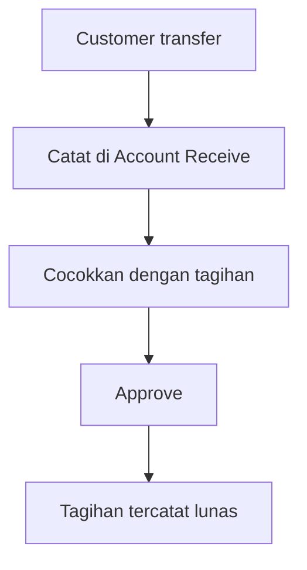

# Account Receive — User Guide

## 1. Apa Itu & Kenapa Penting

**Account Receive** adalah tempat Anda mencatat uang yang masuk dari customer dan menandai tagihan mana yang sudah terbayar.

Tanpa pencatatan ini, tagihan akan terus terlihat belum lunas walaupun uangnya sudah masuk ke rekening. Menu ini yang menutup jarak antara mutasi rekening dan daftar piutang.

Kalau dalam sehari ada puluhan pelunasan, Anda tidak perlu membuat dokumen satu per satu — tersedia fitur **Import** yang membaca satu file Excel dan membuat semua dokumennya sekaligus.

## 2. Overview Flow & Proses Bisnis

**Kalau diagram di atas tidak tampil, alurnya begini:**

1. Customer mengirim uang.
2. Anda mencatatnya di Account Receive, manual atau lewat Import.
3. Anda menentukan tagihan mana yang dilunasi uang tersebut.
4. Dokumen di-Approve.
5. Tagihan tercatat lunas dan pembukuan ikut terbarui.

## 3. Sebelum Mulai (Flow Sebelum)

Pastikan hal-hal ini sudah siap:

- **Tagihan sudah disetujui.** Tagihan yang masih draft atau sudah dibatalkan tidak bisa dilunasi.
- **Akun bank sudah terdaftar dan aktif.** Kalau akun banknya sedang nonaktif, pencatatan akan ditolak.
- **Periode pembukuan masih terbuka** untuk tanggal transaksi yang Anda pakai.
- **Kalau customer membayar dengan deposit**, pastikan Credit Note-nya sudah disetujui dan saldonya cukup.

## 4. Setelah Selesai (Flow Sesudah)

- Dokumen yang baru dibuat berstatus **Open** — sudah tercatat, tapi belum masuk pembukuan.
- Setelah Anda **Approve**, pembukuan terbarui dan tagihan resmi berkurang.
- Kalau ada kelebihan bayar yang Anda tandai sebagai deposit, sistem membuatkan Credit Note baru atas nama customer tersebut untuk dipakai di transaksi berikutnya.

🎬 [Interactive demo akan ditambahkan di sini]

## 5. Yang Perlu Diperhatikan

- **Satu transaksi bank, satu dokumen.** Kalau di rekening ada tiga transfer masuk, tulis tiga baris — meski banknya sama dan tanggalnya sama. Sistem tetap membuat tiga dokumen terpisah.
- **Satu kesalahan membatalkan seluruh file.** Ini disengaja, supaya tidak ada file yang masuk separuh dan menyisakan pelunasan menggantung.
- **Satu transaksi bank hanya untuk satu customer.** Tagihan milik beberapa customer tidak boleh digabung dalam satu baris uang masuk.
- **Hasil import belum masuk pembukuan.** Selalu ada tahap Approve setelahnya.
- **Hanya boleh ada satu proses import berjalan.** Kalau ditolak karena ada proses lain, tunggu sampai selesai.

## 6. Langkah-Langkah (Step by Step)

### Mencatat lewat Import

1. Buka **Accounting → Account Receive**.
2. Unduh template Excel dari menu. Selalu pakai template ini — file buatan sendiri akan ditolak.
3. Isi **sheet pertama** dengan uang yang masuk: tanggal, sumber dana, dan jumlahnya. Satu baris untuk satu transaksi bank. Kolom deskripsi boleh dikosongkan; sistem akan mengisinya sendiri dengan daftar nomor tagihan.
4. Isi **sheet kedua** dengan tagihan yang dilunasi: nomor tagihan, jumlah yang dibayarkan, dan **nomor baris Excel** dari sheet pertama sebagai penanda pengikat.
5. Isi **sheet ketiga** hanya kalau ada selisih antara uang masuk dan nilai tagihan. Kalau tidak ada selisih, biarkan kosong.
6. Upload file. Proses berjalan di belakang layar — tunggu, jangan upload berulang kali.
7. Kalau ada yang salah, buka panel **Import Log**. Semua kesalahan ditampilkan sekaligus lengkap dengan nomor sheet dan nomor barisnya.
8. Perbaiki semua yang dilaporkan, lalu upload ulang.
9. Setelah berhasil, dokumen muncul di daftar berstatus **Open**. Periksa lalu **Approve**.

### Mengisi penanda pengikat

Kolom penanda di sheet kedua dan ketiga meminta **nomor baris Excel** dari sheet pertama — angka yang terlihat di sisi kiri layar Excel, bukan nomor urut data Anda.

Misalnya uang masuk ada di baris 5 sheet pertama, maka semua tagihan yang dilunasi uang itu diisi angka 5 di kolom penanda. Salah isi di sini membuat tagihan menempel ke transaksi bank yang keliru.

### Kalau uang masuk tidak persis sama dengan tagihan

| Situasi | Yang Anda isi di sheet ketiga | Hasilnya |
|---|---|---|
| Uang masuk lebih besar, kelebihan disimpan sebagai deposit | Ketik `CREDIT NOTE`, isi kelebihannya di kolom **Credit** | Sistem membuatkan deposit baru untuk customer |
| Uang masuk lebih besar, kelebihan diakui sebagai pendapatan | Isi kode akun pendapatan, nilainya di kolom **Credit** | Kelebihan masuk ke akun tersebut |
| Uang masuk lebih kecil dari tagihan | Isi kode akun biaya, selisihnya di kolom **Debit** | Tagihan tetap lunas penuh, selisih tercatat sebagai biaya |

Dalam satu baris isi salah satu saja — Debit atau Credit, tidak boleh dua-duanya.

## 7. Tips & Hal yang Sering Bikin Bingung

**"Tagihan 500.000, uang masuk 550.000."** Ketik `CREDIT NOTE` di sheet ketiga dengan Credit 50.000. Tagihan lunas 500.000 dan customer punya deposit 50.000 untuk dipakai lain kali.

**"Tagihan 500.000, uang masuk cuma 493.500."** Isi kode akun biaya di sheet ketiga dengan Debit 6.500. Tagihan tetap dianggap lunas penuh, selisih 6.500 tercatat sebagai biaya.

**"Kenapa angkanya dibilang tidak cocok?"** Jumlah tagihan di sheet kedua ditambah selisih di sheet ketiga harus sama persis dengan uang masuk di sheet pertama, dihitung per nomor penanda. Pesan yang muncul menyebutkan baris mana yang timpang.

**"Tagihan ini kelihatan belum dibayar, kenapa ditolak?"** Kemungkinan ada dokumen pelunasan lain yang masih Open dan sudah memesan sebagian nilainya. Pesan yang muncul menyebutkan nilai yang tertahan itu.

**"Kode bank saya ada di master, kenapa ditolak?"** Biasanya karena akun atau data banknya sedang nonaktif.

**"Kenapa muncul keluhan input dikenali sebagai dua hal sekaligus?"** Ada kode akun bank dan nomor deposit yang kebetulan persis sama. Ubah salah satu penamaannya.

**"Dokumen AR muncul sendiri, dari mana?"** Kalau Anda menyetujui batch di menu Instant Settlement, sistem otomatis membuat dokumen pelunasan untuk tagihan hasil batch itu. Tagihan yang sudah Anda lunasi manual tidak akan dibuatkan lagi. Tanggal AR mengikuti tanggal Sales Invoice (semua SI di batch harus hari yang sama); jam AR mengambil jam SI paling akhir di batch.

## 8. Referensi

| Kebutuhan | Dokumen |
|---|---|
| Aturan rinci dan daftar pesan penolakan | [requirement.md](./requirement.md) |
| Panduan operasional dan troubleshooting | [knowledge-base.md](./knowledge-base.md) |
| Detail teknis untuk developer | [technical.md](./technical.md) |
| Menu tagihan | [Sales Invoice](../accounting-customer-invoice/user-guide.md) |
| Menu deposit customer | [Credit Note](../accounting-credit-note/user-guide.md) |
| Menu settlement | [Instant Settlement](../accounting-settlement-upload/user-guide.md) |
