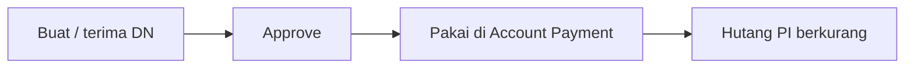
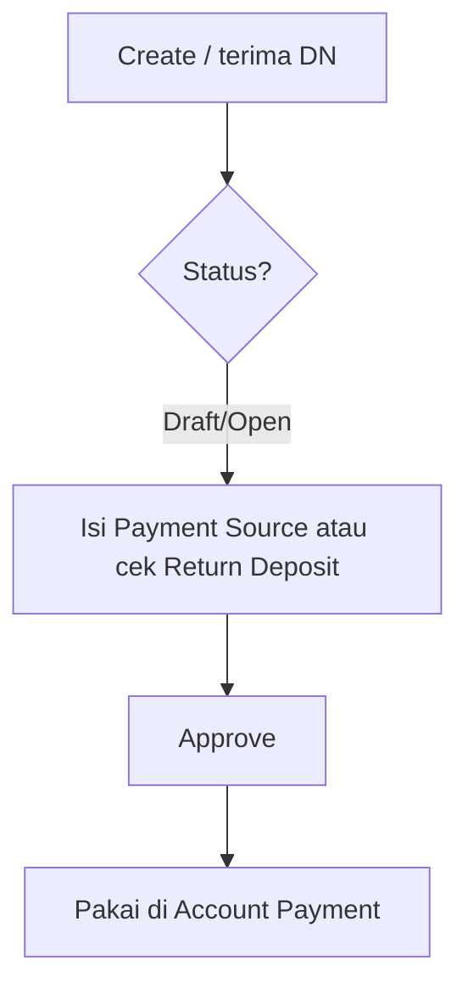

# Debit Note — Knowledge Base

> **Audience:** Finance / Account Payable · **Route:** `/accounting/debit-note`

---

## 1. Apa itu?

**Debit Note (DN)** = dokumen klaim/deposit ke **supplier** — nilai yang supplier “berutang” balik ke perusahaan. Setelah **Approved**, DN dipakai di **Account Payment** untuk **memotong hutang** tanpa mengeluarkan kas penuh.

DN bukan tagihan baru; ini “saldo kredit” ke supplier yang nanti dipakai saat bayar [Purchase Invoice](../accounting-supplier-invoice/README.md).

**Tiga asal umum:**

1. **Manual** — buat di menu DN + isi Payment Source (kas/bank).  
2. **Purchase Return** — otomatis saat retur billed ke PI.  
3. **Import Account Payment** — baris Adjustment bertipe `DEBIT NOTE`.

---

## 2. Glosarium

| Istilah | Arti awam |
|---------|-----------|
| **Payment Source** | Baris kas/bank yang “mendanai” DN manual |
| **Return Deposit** | Baris nilai DN dari barang retur ke PI |
| **Outstanding** | Sisa DN belum dipakai di Account Payment |
| **Paid** | Nilai DN yang sudah dipakai di AP approved |
| **Trx Ref** | Link ke dokumen sumber (PR atau AP) |
| **Auto-save last trx** | Saat Create, sistem isi dari DN terakhir lalu simpan header otomatis |

---

## 3. Alur kerja standar

**Keterangan:**

1. **Create** — bisa langsung redirect ke edit jika ada DN sebelumnya (auto-save).  
2. Isi **Payment Source** (manual) atau cek baris **Return Deposit** (dari PR).  
3. **Approve** → jurnal terbentuk.  
4. Di **Account Payment**, pilih DN sebagai sumber potong hutang.

---

## 4. Cara pakai (manual)

1. Buka **Debit Note** → **Create**.  
2. Pilih **Supplier** (**tampil kode**; cari by nama/kode OK — bukan toko marketplace). Nama tidak di daftar/export; hanya di **Print**.  
3. Isi tanggal, currency, rate.  
4. Tambah **Payment Source** — pilih rekening kas/bank (currency harus sama).  
5. Set status **Open** → **Save** → **Approve**.

**Contoh:** Supplier PT ABC, DN Rp 5.000.000 dari rekening BCA → setelah approve, Rp 5 jt bisa dipakai potong PI di Account Payment.

---

## 5. Dari Purchase Return

Saat retur billed ke PI disetujui, sistem buat DN status **Open** dengan baris **Return Deposit** (bukan kas/bank). User tetap **Approve** manual. Trx Ref menunjuk ke kode Purchase Return.

---

## 6. Troubleshooting

| Gejala | Penyebab | Solusi |
|--------|----------|--------|
| Create gagal auto-save | Fiscal period / currency / bank | Cek tanggal di period Open; pastikan ada Cash/Bank currency sama |
| Tidak bisa approve | Bukan Open; belum ada fund/deposit | Isi Payment Source atau pastikan PR deposit ada |
| Cash/Bank tidak muncul | Currency beda atau inactive | Sesuaikan currency header; aktifkan rekening |
| Amount ditolak | Melebihi sisa saldo kas/bank | Kurangi amount atau pilih rekening lain |
| Tidak bisa potong di AP | DN belum approved / beda supplier / outstanding 0 | Approve DN dulu; cek supplier & currency sama |
| Export With Details kosong untuk DN PR | Bug export hanya baca fund | Pakai Without Details atau tunggu perbaikan |

---

## 7. FAQ

**Q: Kenapa langsung masuk halaman edit setelah Create?**  
A: Sistem auto-save dari DN terakhir supaya cepat. Kalau gagal, tetap di form create dengan pesan error.

**Q: Bisa pakai supplier toko marketplace?**  
A: Tidak — supplier DN = **General Company** yang recognize as supplier.

**Q: Beda Reference Doc vs Trx Ref?**  
A: Reference Doc = catatan bebas. Trx Ref = link otomatis ke PR/AP.

**Q: Setelah Reject?**  
A: Save edit tanpa ubah status → kembali **Draft**; pilih **Open** → siap approve lagi.

**Q: Mirror Credit Note?**  
A: Credit Note = sisi customer (AR). Debit Note = sisi supplier (AP).

**Q: Kenapa supplier hanya kode?**  
A: Kebijakan tampilan code-only. Cari by nama/kode OK; nama hanya di **Print**; export tanpa nama.

---

## Related Documents

| Doc | Path |
|-----|------|
| Requirement | [requirement.md](./requirement.md) |
| Technical | [technical.md](./technical.md) |
| User Guide | [user-guide.md](./user-guide.md) |
| Account Payment | [../accounting-supplier-payment/knowledge-base.md](../accounting-supplier-payment/knowledge-base.md) |
| Credit Note (mirror) | [../accounting-credit-note/knowledge-base.md](../accounting-credit-note/knowledge-base.md) |
