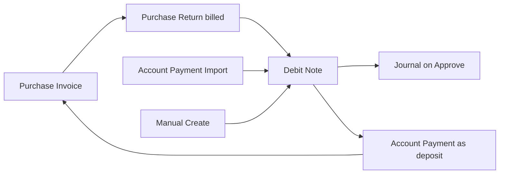
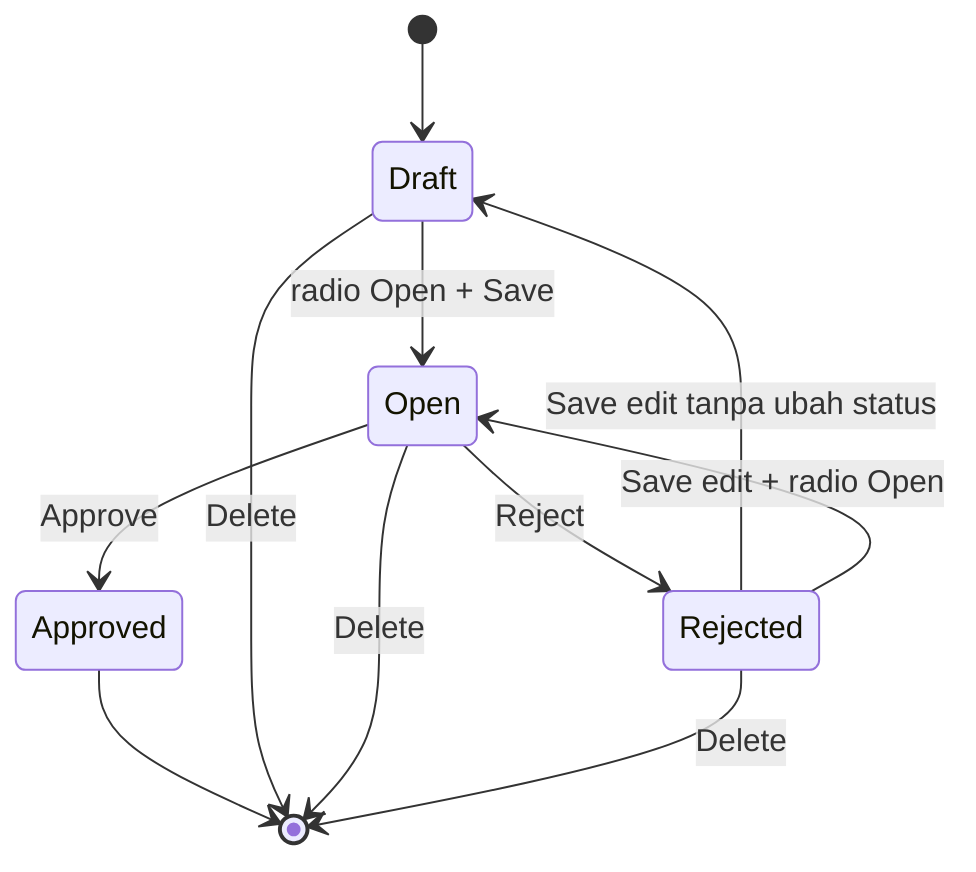

# Debit Note — Requirement Documentation

**Modul:** Finance & Accounting / Account Payable  
**Prefix:** `DN`  
**Audience:** PM, Finance, QA  
**UI route:** `/accounting/debit-note`  
**SoT:** `_meta/sot/accounting-debit-note-source-of-truth.md` v1.0 (12 Agustus 2026)

Downstream: [Account Payment](../accounting-supplier-payment/requirement.md) · Upstream billed return: [Purchase Return](../accounting-purchase-return/) · Mirror AR: [Credit Note](../accounting-credit-note/requirement.md)

> AS-IS diverifikasi 12 Agu 2026 (`DebitNoteController`, `DebitNoteService`, AP import, FE `DebitNote/*`).

---

## 0. Metadata & Changelog

| Version | Date | Author | Changes |
|---------|------|--------|---------|
| 1.0 | 2026-08-12 | QA - Yemima | Full 5-file dari SoT v1.0; Gap `GAP-DN-01..05`; relasi AP/PR/PI/CN |
| 1.1 | 2026-09-02 | QA - Yemima | Supplier display **code-only** (ETM-15727 / parent ETM-15721) |

---

## 1. Ringkasan Eksekutif

**Debit Note (DN)** mencatat klaim/deposit ke **supplier** (nilai yang supplier “berutang” ke perusahaan), lalu dipakai sebagai **Payment Source** di **Account Payment** untuk memotong hutang tanpa/kurangi kas keluar. Secara teknis DN adalah subtype Payment (`type = Debit Note`, prefix `DN`).

| Jalur terbit | Hasil status |
|--------------|--------------|
| Manual (form) + Payment Source Cash/Bank | Open — perlu approve manual |
| Purchase Return billed ke PI | Open — perlu approve manual |
| Import Account Payment — Adjustment `DEBIT NOTE` | Open — perlu approve manual |

Audience: Finance / Account Payable.

---

## 2. Prasyarat

| Prasyarat | Sumber | Catatan |
|-----------|--------|---------|
| Supplier aktif + COA supplier lengkap (`is_supplier = 1`) | General Company | Select2 **hanya** General Company — bukan Store/Platform |
| Minimal satu Cash/Bank aktif currency match | Cash Bank Account | Wajib create/update header manual |
| Currency aktif; primary currency ter-set | Currency / Company | Rate dipaksa 1 jika primary (IDR) |
| Fiscal period terbuka untuk tanggal transaksi | Fiscal Period | Blok create / update tanggal / approve |
| Deposit to Supplier COA (manual) / Deposit of Purchase Return + Inventory COA (PR) | Company Accounting / Product COA | Wajib saat approve agar journal sukses |
| Privilege menu Debit Note | Gate | create / update / delete / approval |

---

## 3. Siklus Status

| Status | Editable? | Tombol baris (privilege-aware) |
|--------|-----------|--------------------------------|
| **draft** | Ya | Edit, Delete, Print |
| **open** | Ya | Edit, Delete, Print, Approve/Reject |
| **approved** | Tidak (show) | Show, Print — tanpa Delete/Approve |
| **rejected** | Ya | Edit, Delete, Print |

**Reject → Save edit (GAP-DN-01 — Resolved):** jika user **tidak** ubah status (hanya edit field lain) → **draft**; jika user pilih radio **Open** lalu Save → **open**.

**Void / Closed:** belum didefinisikan end user untuk DN — **skip** (GAP-DN-05 deferred).

Field kritikal (Supplier, Currency, Rate, Date) terkunci jika sudah ada baris fund/deposit — clear detail dulu untuk ubah.

---

## 4. Datalist

**Route:** `/accounting/debit-note` · API scoped `type = Debit Note`.

### 4.1 Kolom

| Kolom | Default visible | Catatan |
|-------|-----------------|---------|
| Trx Code \| Trx Date | Ya | Link edit; PR ref bisa tampil tanggal dari dokumen ref |
| Supplier | Ya | Tampil **Supplier Code**; General Company supplier; defensive Store name jika legacy (display tetap code) |
| Description | Ya | Excerpt + tooltip |
| Trx Ref | Ya | PR / AP / `-` — klikable |
| Curr / Rate | Ya | |
| Total Amount | Ya | Manual: Σ funds; PR: `grand_total` |
| Paid | Ya | Σ pemakaian DN di AP **approved** |
| Outstanding | Ya | Total − Paid |
| Trx Status | Ya | Badge |
| Journal | Ya | Kode setelah approve atau `-` |
| Created by \| Created at | Ya | Standar |
| Action | Ya | §4.3 |

### 4.2 Toolbar

Global search, Advanced filter, Create, Show deleted, Column show/hide, Export (Without/With Details, Active Page), Bulk delete, Bulk approve, Multi-select.

### 4.2b Supplier Display (code-only) — ETM-15727

Parent: [ETM-15721](https://erpintegration.atlassian.net/browse/ETM-15721). Identitas operasional = **Supplier Code**. Berlaku semua role.

| Surface | Rule |
|---------|------|
| Datalist / detail / modal | Tampil **code** saja |
| Column Show/Hide (ColVis) | **Tanpa** opsi Supplier Name |
| Select2 / Search / Advanced Filter | Match **code + name**; tampilan = **code**; **tanpa** hover nama |
| Basic Information » Supplier | Code only; **jangan** tambah field read-only Supplier Name |
| Export | **Tanpa** name |
| Print | Name **boleh** |

### 4.3 Action per baris

| Tombol | Muncul jika |
|--------|-------------|
| Edit | Belum approved |
| Show | Approved atau tanpa update privilege |
| Print | **Selalu** (semua status) |
| Delete | draft / open / rejected |
| Approve / Reject | **open** + eligible + detail lengkap |

### 4.4 Export

| Mode | Isi |
|------|-----|
| Without Details | Satu baris per DN — header kolom standar |
| With Details | Satu baris per Payment Source fund + kolom fund |
| Active Page | Subset halaman aktif |

**GAP-DN-02 (bug):** With Details hanya loop **cash/bank fund** — DN dari **Purchase Return** (return deposit) bisa **tidak muncur / tanpa baris detail** di Excel.

---

## 5. Form & Field

### 5.1 Basic Information

| Field | Wajib | Catatan |
|-------|-------|---------|
| Transaction Code | Unique; auto `DN…` | Disabled setelah create |
| Transaction Date | Ya | Default now; min ≈ 6 bulan; max now; fiscal period |
| Supplier | Ya | General Company supplier + COA tag lengkap; **display = code** (§4.2b) |
| Reference Doc | Tidak | Free text max 150 — hanya source Default |
| Transaction Reference | — | Disabled jika PR; hyperlink ke PR/AP |
| Transaction Currency | Ya | Harus ada Cash/Bank match |
| Exchange Rate | Ya, > 0 | IDR dipaksa 1 + disabled |
| Description | Tidak | Max 150; format auto §6.3 |
| Attachment | Tidak | Editable jika `can_update` |

### 5.2 Payment Source (manual & AP-import)

Select Cash/Bank (active, currency match), GL Account info, Bank fields jika tipe bank, Amount > 0, validasi **remaining balance** saat add/update.

### 5.3 Purchase Return Detail (source PR)

Read-only return deposit; total = `grand_total`; **tanpa** Payment Source Cash/Bank.

### 5.4 Approval Log & Audit Log

Standard slideover; sticky Draft/Open radio, Save All, Approve jika eligible.

---

## 6. How It Works

### 6.1 Total / Paid / Outstanding

- **Total (manual):** Σ fund amount (foreign-aware).  
- **Total (PR):** `grand_total`.  
- **Paid:** Σ deposit usage di AP approved.  
- **Outstanding:** Total − Paid.

### 6.2 Create + auto-save last transaction

1. Create → ambil default last DN (supplier, currency, rate).  
2. Jika ada last DN: prefill + `transaction_date = now` → **POST create** → redirect edit.  
3. Jika validasi gagal (fiscal period, currency/bank, dll.): **tetap di create** + notif field — tidak redirect.  
4. Belum pernah ada DN: user isi + Save & Next.

### 6.3 Generate dari luar menu

**A. Purchase Return (billed)** — approve outbound return + link PI → DN **open**; supplier/currency/rate dari PI; description `Auto generated from Purchase Return {code}`; detail return deposits.

**B. Account Payment Import — Adjustment `DEBIT NOTE`** — DN open; supplier/currency/rate dari AP; fund Deposit to Supplier; trx ref → AP.

### 6.4 Approve journal (ringkas)

- Manual: Dr Deposit to Supplier · Cr Cash/Bank fund COA.  
- PR: Dr Deposit of Purchase Return · Cr Inventory COA produk.  
- Setelah approve: eligible deposit di AP (same supplier, same currency, DN date sebelum AP date, outstanding > 0).

### 6.5 Contoh kasus

| # | Situasi | Hasil |
|---|---------|--------|
| 1 | Create, ada last DN, fiscal OK | Auto-create → edit |
| 2 | Create, fiscal tidak ada | Auto-save gagal + notif tanggal |
| 3 | Manual: amount fund > remaining kas/bank | Error insufficient / exceeds remaining |
| 4 | Import AP Adjustment `DEBIT NOTE` | DN open + fund + trx ref AP |
| 5 | Reject lalu Save **tanpa** ubah status | Status → **draft** |
| 5b | Reject lalu Save + radio **Open** | Status → **open** |
| 6 | DN approved | Show + print; dipakai di AP |

---

## 7. Validasi

| Kondisi | Behavior |
|---------|----------|
| Tanggal di luar fiscal period | Blok create/update/approve |
| Supplier kosong / COA tidak eligible | Blok |
| Currency tanpa Cash/Bank match | Blok create/update |
| Rate ≤ 0 | Blok |
| Approve tanpa fund dan tanpa return deposit | Blok |
| Amount fund ≤ 0 | Blok |
| Duplicate COA fund | Blok |
| Amount > remaining cash/bank | `Entered amount exceeds…` / `Insufficient balance…` |
| Delete saat approved | Blok |
| Approve bukan open / tidak eligible | Blok |

---

## 8. Relasi Menu Lain

| Menu | Peran |
|------|-------|
| [Purchase Invoice](../accounting-supplier-invoice/README.md) | Hutang; hulu PR billed |
| [Purchase Return](../accounting-purchase-return/README.md) | Sumber DN PR |
| [Account Payment](../accounting-supplier-payment/requirement.md) | Konsumen DN approved; Import spawn DN |
| [Journal](../journal/README.md) | Hasil approve |
| [General Company](../generalsetting-general-company/README.md) | Supplier master |
| [Cash/Bank Account](../accounting-company-detail-bank/README.md) | Payment Source manual |
| [Fiscal Period](../accounting-fiscal-period/README.md) | Gate tanggal |
| [Credit Note](../accounting-credit-note/README.md) | Mirror sisi AR (bukan scope DN) |

---

## 9. Acceptance Criteria

| ID | Kriteria |
|----|----------|
| DN-01 | Manual create wajib supplier General Company + currency + fiscal; Payment Source Cash/Bank |
| DN-02 | PR billed & AP import Adjustment `DEBIT NOTE` menghasilkan DN open dengan trx ref benar |
| DN-03 | Approve wajib detail (fund atau return deposit) + journal; approved terkunci |
| DN-04 | Paid/Outstanding dari pemakaian AP approved |
| DN-05 | Reject → Save: draft default; Open jika dipilih |
| DN-06 | Gap registry terdokumentasi |

---

## 10. FAQ

**Q: Kenapa Create langsung ke edit?**  
A: Auto-create dari last DN. Kalau validasi gagal, tetap di create + notif.

**Q: Supplier dari Store marketplace?**  
A: Tidak — supplier = General Company dengan COA supplier lengkap.

**Q: Beda Reference Doc vs Trx Ref?**  
A: Reference Doc = teks bebas (Default). Trx Ref = link sistem ke PR/AP.

**Q: Kapan DN bisa potong hutang?**  
A: Setelah **approved**, di Account Payment sebagai Debit Note source.

**Q: Reject lalu apa?**  
A: Save tanpa ubah status → **draft**; pilih **Open** → **open**.

---

## 11. Gap Registry

| ID | Deskripsi | Status |
|----|-----------|--------|
| GAP-DN-01 | Reject → Save: draft default; Open jika dipilih | **Resolved** |
| GAP-DN-02 | Export With Details hanya fund — DN PR bisa hilang di Excel | Open (bug) |
| GAP-DN-03 | Cabang Store di list/export legacy; create = Company supplier only | Open — note for Dev |
| GAP-DN-04 | Validasi balance kas/bank di approve DN: non-blocker jika belum ada | Open |
| GAP-DN-05 | Void/Closed deferred — belum definisi end user | Open — deferred |

---

## Related Documents

| Doc | Path |
|-----|------|
| Knowledge Base | [knowledge-base.md](./knowledge-base.md) |
| Technical | [technical.md](./technical.md) |
| User Guide | [user-guide.md](./user-guide.md) |
| Account Payment | [../accounting-supplier-payment/requirement.md](../accounting-supplier-payment/requirement.md) |
