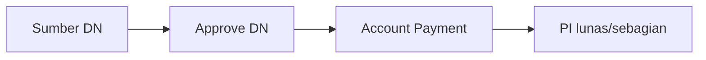

# Panduan Pengguna — Debit Note

**Siapa yang baca:** tim Finance / Account Payable  
**Menu:** Finance Accounting → Debit Note  
**Route:** `/accounting/debit-note`

---

## 1. Apa Itu & Kenapa Penting

**Debit Note** mencatat klaim ke supplier — misalnya retur barang atau kelebihan bayar — yang nantinya dipakai untuk **memotong hutang** saat **Account Payment**, tanpa harus keluarkan kas penuh.

Tanpa DN yang benar, tim AP tidak bisa alokasi potong hutang dari retur atau adjustment import.

---

## 2. Overview Flow & Proses Bisnis

**Versi teks:**

1. DN muncul dari **manual**, **[Purchase Return](#sf-lingo:SF-DN-04)**, atau **import AP** ([jalur pembuatan](#sf-lingo:SF-DN-01)).  
2. Tim finance **Approve** DN (jurnal terbentuk).  
3. Saat bayar supplier, pilih DN di **[Account Payment](#sf-lingo:SF-DN-03)** sebagai potong hutang.

### Status

| Status | Arti |
|--------|------|
| Draft | Masih disusun |
| Open | Siap approve |
| Approved | Terkunci; bisa dipakai di AP |
| Rejected | Ditolak — edit lalu simpan ulang |

---

## 3. Sebelum Mulai

- Supplier sudah terdaftar sebagai **supplier** di General Company (+ COA lengkap).  
- Ada **Cash/Bank** dengan currency yang sama (untuk DN manual).  
- **Fiscal Period** untuk tanggal transaksi masih **Open**.

🎬 [Interactive demo akan ditambahkan di sini]

---

## 4. Setelah Selesai

- DN **Approved** → muncul di pemilihan Debit Note saat **[Account Payment](#sf-lingo:SF-DN-03)**.  
- Kolom [**Paid** / **Outstanding**](#sf-lingo:SF-DN-02) di datalist DN menunjukkan sisa yang masih bisa dipakai.  
- Setelah outstanding = 0, DN tidak bisa dipakai lagi di AP.

---

## 5. Yang Perlu Diperhatikan

- Supplier DN **bukan** toko marketplace — pilih **General Company supplier**.  
- Kalau kamu klik **Create** dan langsung masuk edit, itu **auto-save** dari DN terakhir — kalau gagal, cek pesan di tanggal/fiscal period.  
- Kalau kamu tambah [**Payment Source**](#sf-lingo:SF-DET-01) melebihi saldo kas/bank, sistem menolak.  
- DN dari **[Purchase Return](#sf-lingo:SF-DN-04)** tidak pakai kas/bank — cek baris **Return Deposit**.  
- Setelah **Reject**: simpan tanpa ubah status → **Draft**; pilih **Open** kalau mau approve lagi.  
- **Contoh:** Retur billed Rp 2 jt → DN open → approve → bayar PI Rp 10 jt di AP bisa potong Rp 2 jt pakai DN, sisanya kas.

---

## 6. Langkah-Langkah (manual)

1. Buka **Debit Note** → **Create** ([jalur manual](#sf-lingo:SF-DN-01)).  
2. Pilih supplier, tanggal, currency.  
3. Tambah [**Payment Source**](#sf-lingo:SF-DET-01) (rekening kas/bank + amount).  
4. Set **Open** → **Save** → **Approve**.  
5. Buka **[Account Payment](#sf-lingo:SF-DN-03)** → tambah sumber **Debit Note** → alokasi ke PI.

🎬 [Interactive demo akan ditambahkan di sini]

---

## 7. Tips & Hal yang Sering Bikin Bingung

- **Langsung ke edit setelah Create?** Normal — auto-save dari transaksi terakhir.  
- **Tidak bisa approve?** Pastikan status Open dan sudah ada [Payment Source](#sf-lingo:SF-DET-01) atau Return Deposit.  
- **Tidak muncul di AP?** DN harus Approved, supplier & currency sama, masih ada [outstanding](#sf-lingo:SF-DN-02).  
- **Export Excel With Details kosong untuk DN retur?** Known issue — pakai export Without Details dulu.  
- **Credit Note vs Debit Note?** CN untuk customer (piutang); DN untuk supplier (hutang).

---

## 8. Referensi

| Sumber | Untuk apa |
|--------|-----------|
| [Knowledge Base](./knowledge-base.md) | Troubleshooting |
| [Feature Map](./feature-map.md) | Indeks Lingo / sub-feature |
| [Requirement](./requirement.md) | Validasi & Gap |
| [Technical](./technical.md) | Developer |
| [Account Payment](../accounting-supplier-payment/user-guide.md) | Pakai DN saat bayar |
| [Purchase Return](../accounting-purchase-return/) | Sumber DN retur |
| [Credit Note](../accounting-credit-note/user-guide.md) | Mirror sisi AR |
