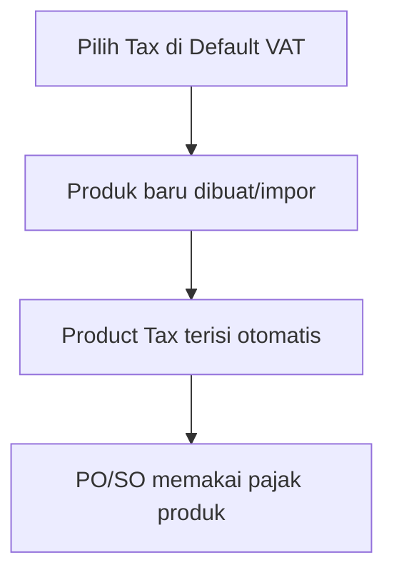

# Default VAT — Knowledge Base

> **Audience:** Finance / Accounting. **Route:** `/accounting/default-vat`

---

## 1. Apa itu?

**Default VAT** = template pajak default perusahaan untuk **Purchase** dan **Sales**. Saat produk baru dibuat atau diimpor, sistem menyalin setting ini ke pajak produk — supaya tidak input manual satu-satu.

Bukan kalkulator PPN di PO/SO. Mengubah Default VAT **tidak** mengubah produk yang sudah ada.

---

## 2. Glosarium

| Istilah | Arti awam |
|---------|-----------|
| **Select VAT** | Pilih master Tax yang jadi default |
| **Mirror** | Field Code/Name/Tariff/COA ikut Tax — tidak diedit di sini |
| **Auto Add Trx** | Pajak otomatis nempel ke transaksi produk |
| **Include / Exclude** | Harga sudah termasuk pajak / pajak di luar harga |
| **Seed** | Isi otomatis pajak produk baru dari Default VAT |

---

## 3. Cara pakai

1. Buka **Default VAT**.  
2. Accordion **Purchase VAT** → pilih Tax → atur Include/Exclude & Auto Add (tersimpan otomatis).  
3. Ulangi untuk **Sales VAT**.  
4. Clear Select VAT = hapus default type itu (produk baru berikutnya tanpa seed type tersebut).

Ubah Code/Tariff/COA → lewat menu **Tax**.

---

## 4. Troubleshooting

| Gejala | Solusi |
|--------|--------|
| Produk baru tanpa pajak otomatis | Isi Default VAT Purchase dan/atau Sales |
| Ganti Default, produk lama sama | By design — ubah manual di System Product |
| Tax tidak muncul di Select | Tax inactive / deleted di menu Tax |
| Tidak bisa save Tax tertentu | Tax soft-deleted atau inactive |

---

## 5. FAQ

**Q: PO baca Default VAT langsung?**  
A: Tidak — baca pajak di produk.

**Q: Boleh dua Purchase default?**  
A: Desainnya satu; sistem belum mengunci ketat di database.

---

## Related Documents

| Doc | Path |
|-----|------|
| Requirement | [requirement.md](./requirement.md) |
| Technical | [technical.md](./technical.md) |
| User Guide | [user-guide.md](./user-guide.md) |
| Tax | [../accounting-tax/README.md](../accounting-tax/README.md) |
