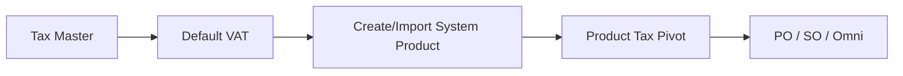
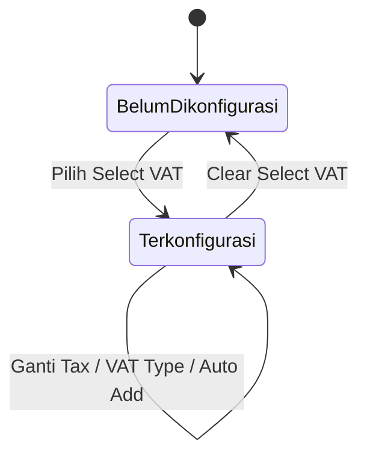

# Default VAT — Requirement Documentation

**Modul:** Finance Accounting → Master  
**UI route:** `/accounting/default-vat`  
**API prefix:** `accounting/default-vat`  
**Audience:** PM, Finance/Accounting, QA, Developer  
**PM source:** Default VAT Source of Truth **v1.0** (5 Agustus 2026)

> AS-IS diverifikasi 5 Agu 2026 (`DefaultVatController`, `DefaultVatRequest`, seed di `ProductController` / `ProductImport`, FE `DefaultVAT/*`).

---

## 0. Metadata & Changelog

| Version | Date | Author | Changes |
|---------|------|--------|---------|
| 1.0 | 2026-08-05 | QA - Yemima | Full 5-file dari SoT v1.0; Gap `GAP-DV-01..04`; seed Product Tax; Sales COA mirror di Sales accordion |

---

## 1. Ringkasan Eksekutif

**Default VAT** menetapkan konfigurasi VAT default **Purchase** dan **Sales** per company, masing-masing merujuk ke satu baris master **Tax**. Dipakai sebagai **template seed**: saat System Product baru dibuat/diimpor, sistem mengisi Product Tax (purchase/sales) dari Default VAT. Bukan alat hitung PPN transaksi; **tidak** mengubah produk existing.



---

## 2. Prasyarat

| Prasyarat | Sumber | Catatan |
|-----------|--------|---------|
| Tax Active | Menu Tax | Soft-deleted / inactive ditolak saat save |
| Tax punya Purchase/Sales COA | Menu Tax | Default VAT hanya **mirror** COA — tidak edit COA di sini |

---

## 3. Siklus status

Bukan approval flow. Per type: Belum dikonfigurasi ↔ Terkonfigurasi. **Auto-save** (tidak ada tombol Save global).



| Status | Editable? | Catatan |
|--------|-----------|---------|
| Belum dikonfigurasi | Mirror disabled | Sidenav unchecked |
| Terkonfigurasi | VAT Type + Auto Add editable; mirror disabled | Semua perubahan auto-save |

---

## 4. Datalist

**Tidak ada** — halaman form 2 accordion (Purchase VAT, Sales VAT) + sidenav checklist + Audit Log. Maksimal satu konfigurasi bermakna per type per company (desain).

---

## 5. Form & field

### 5.1 Purchase VAT

| Field | Wajib UX | Catatan |
|-------|----------|---------|
| Select VAT | Ya untuk isi config | Tax active; clear → **hapus** record type purchase |
| VAT Type | Include / Exclude | Default Include; disabled sebelum Tax dipilih |
| Auto Add Trx | YES default | Boolean; disabled sebelum Tax |
| Code, Name, Tariff, Coefficient, Description | — | Mirror Tax, disabled |
| **Purchase COA** | — | Mirror `purchase_coa_id`; UI disabled (select2 Activa di BE tidak dipakai user) |

### 5.2 Sales VAT

Identik, scope type Sales; COA = **Sales COA** (`sales_coa_id`, Passiva) — bukan Purchase COA.

---

## 6. How It Works

### 6.1 Auto-save

Ganti Select VAT / VAT Type / Auto Add → create atau update API → toast sukses.

### 6.2 Seed ke System Product baru

```
FOR type IN [sales, purchase]:
  IF Default VAT type exists:
    ProductTax = { tax, included, auto_add_transaction } dari Default VAT
```

Tanpa Default VAT type → tidak ada seed untuk type itu (tambah manual di Product).

### 6.3 Tidak memengaruhi produk existing

Ubah/clear Default VAT hanya untuk produk **baru**. Product Tax lama = snapshot.

### 6.4 Bukan sumber tax runtime

PO / SO / Omni baca **Product Tax pivot**, bukan Default VAT live. Variant tanpa pivot parent → null (tidak fallback ke Default VAT di AS-IS).

### 6.5 Clear = delete

`tax_id` null → hapus record type terkait (bukan simpan null).

---

## 7. Validasi

| # | Kondisi | Behavior / pesan |
|---|---------|------------------|
| 1 | `tax_id` null | Delete by type → success DELETED |
| 2 | Tax soft-deleted | `Selected VAT already deleted` |
| 3 | Tax inactive | `Selected VAT is inactive` |
| 4 | Tax valid | Create/update; `is_all_company = 0` |

**Tidak dicek:** COA lengkap di Tax; unique DB per type (GAP-DV-01); wajib eksplisit VAT Type/Auto Add di FormRequest.

**Update VERIFY:** update field lain dengan `tax_id` yang sama tetap **re-check** Tax deleted/inactive — akan gagal jika Tax sudah invalid.

**Seed:** `ProductTaxController@store` — duplicate product+tax+type → error (bisa gagalkan create produk jika collision).

---

## 8. Relasi menu

| Menu | Peran |
|------|-------|
| [Tax](../accounting-tax/README.md) | Sumber tax_id + mirror fields |
| [System Product](../system-product/README.md) | Seed Product Tax saat create |
| Product Import | Seed sama setelah baris tersimpan |
| PO / SO / Omni | Baca Product Tax, bukan Default VAT |
| General Company | Auto-add setting paralel (override kapan attach) |
| Audit Log | Riwayat CRUD Default VAT |

---

## 9. Acceptance Criteria

| ID | Kriteria |
|----|----------|
| DV-01 | Pilih Tax → auto-save; mirror fields terisi |
| DV-02 | Clear Select VAT → record type terhapus |
| DV-03 | Product create/import seed Product Tax dari Default VAT |
| DV-04 | Ubah Default VAT tidak mengubah Product Tax existing |
| DV-05 | Transaksi tidak baca Default VAT langsung |
| DV-06 | Gap registry terdokumentasi |

---

## 10. FAQ

**Q: Ganti Default VAT, produk lama berubah?**  
A: Tidak — hanya produk baru/import berikutnya.

**Q: Clear Select VAT?**  
A: Hapus konfigurasi type itu.

**Q: Edit Code/Tariff/COA di sini?**  
A: Tidak — ubah di menu Tax.

**Q: Default VAT hitung PPN di PO?**  
A: Tidak langsung — PO baca Product Tax.

---

## 11. Gap Registry

| ID | Deskripsi | Status |
|----|-----------|--------|
| GAP-DV-01 | Tidak ada unique (company, type); POST create berulang bisa orphan rows; FE `latest()`/`first()` | Open |
| GAP-DV-02 | Dead code Omni/SO cek `instanceof DefaultVat` sebagai fallback — tidak pernah trigger | Open |
| GAP-DV-03 | UI tanpa edukasi “hanya produk baru” | Open |
| GAP-DV-04 | Clear delete by `type`; type param inkonsisten → risiko hapus type lain | Open |

---

## Related Documents

| Doc | Path |
|-----|------|
| Knowledge Base | [knowledge-base.md](./knowledge-base.md) |
| Technical | [technical.md](./technical.md) |
| User Guide | [user-guide.md](./user-guide.md) |
| Tax | [../accounting-tax/README.md](../accounting-tax/README.md) |
