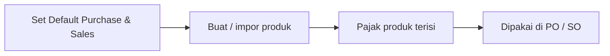

# Panduan Pengguna — Default VAT

**Siapa yang baca:** tim Finance / Accounting  
**Menu:** Finance Accounting → Master → Default VAT  
**Route:** `/accounting/default-vat`

---

## 1. Apa Itu & Kenapa Penting

**Default VAT** menyimpan pajak default perusahaan untuk pembelian dan penjualan. Setiap kali produk baru dibuat atau diimpor, sistem menyalin setting ini ke konfigurasi pajak produk.

Ini menghemat waktu setup produk massal. Perubahan di sini **tidak** mengubah pajak produk yang sudah ada.

---

## 2. Overview Flow & Proses Bisnis

**Versi teks:**

1. Pilih Tax default untuk Purchase dan Sales.  
2. Atur Include/Exclude dan Auto Add.  
3. Buat atau impor produk baru.  
4. Cek di System Product bahwa baris pajak sudah muncul.  
5. Transaksi memakai pajak produk tersebut.

### Status

| Status | Arti |
|--------|------|
| Belum dikonfigurasi | Belum pilih Tax untuk type itu |
| Terkonfigurasi | Tax terpilih; perubahan tersimpan otomatis |

---

## 3. Sebelum Mulai

- Master Tax Active sudah ada (Purchase COA / Sales COA terisi di Tax).  
- Pahami: ini template untuk **produk baru**, bukan update massal produk lama.

🎬 [Interactive demo akan ditambahkan di sini]

---

## 4. Setelah Selesai

- Sidenav Purchase/Sales tercentang sesuai yang diisi.  
- Uji create satu produk baru → Product Tax terisi.  
- PO/SO uji memakai pajak produk.

---

## 5. Yang Perlu Diperhatikan

- Tidak ada tombol Save — setiap perubahan langsung tersimpan.  
- Field Code, Name, Tariff, COA, Coefficient hanya tampilan dari Tax.  
- Mengosongkan Select VAT = **menghapus** default type itu.  
- Ganti Default VAT tidak mengubah produk existing.  
- Auto-add di transaksi juga dipengaruhi setting Customer/Supplier.

---

## 6. Langkah-Langkah

1. Buka **Default VAT**.  
2. Di **Purchase VAT**, pilih Tax → set VAT Type & Auto Add.  
3. Di **Sales VAT**, lakukan hal yang sama.  
4. Buat produk uji → pastikan pajak produk terisi.  

🎬 [Interactive demo akan ditambahkan di sini]

---

## 7. Tips & Hal yang Sering Bikin Bingung

- **"Produk lama tidak ikut berubah."** Memang — ubah di System Product.  
- **"Produk baru tanpa pajak."** Cek Default VAT sudah terisi.  
- **"Mau ubah tarif."** Edit di menu Tax, lalu pilih ulang di Default VAT bila perlu.

---

## 8. Referensi

| Sumber | Untuk apa |
|--------|-----------|
| [Knowledge Base](./knowledge-base.md) | Troubleshooting |
| [Requirement](./requirement.md) | Aturan & Gap |
| [Technical](./technical.md) | Developer |
| [Tax](../accounting-tax/README.md) | Master tarif & COA |
| [System Product](../system-product/README.md) | Product Tax setelah seed |
