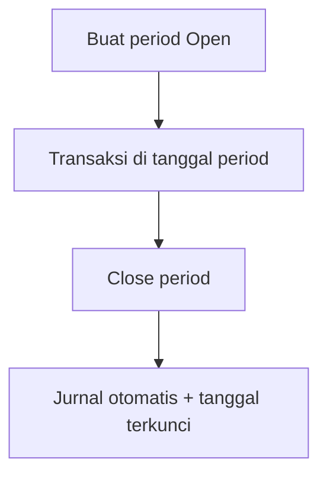

# Fiscal Period — Knowledge Base

> **Audience:** Finance / Accounting. **Route:** `/accounting/fiscal-period`

---

## 1. Apa itu?

**Fiscal Period** = rentang tanggal pembukuan perusahaan. Selama status **Open**, transaksi boleh dibuat pada tanggal di dalam rentang itu. Setelah **Closed**, tanggal tersebut terkunci permanen — hampir semua modul (Accounting, Supply Chain, Omni) menolak transaksi baru di tanggal itu.

Saat Close, sistem otomatis memindahkan saldo laba/rugi berjalan ke laba ditahan lewat jurnal yang langsung approved.

---

## 2. Glosarium

| Istilah | Arti awam |
|---------|-----------|
| **Open** | Periode masih terbuka — transaksi boleh |
| **Closed** | Periode terkunci permanen — tidak bisa dibuka lagi |
| **Current Profit/Loss** | Akun laba/rugi berjalan di setting Internal Company |
| **Retained Profit/Loss** | Akun laba ditahan di setting Internal Company |
| **Auto journal Close** | Jurnal otomatis saat tutup periode (langsung approved) |
| **Gate tanggal** | Cek sistem: tanggal transaksi harus di period Open |
| **Overlap** | Rentang tanggal bentrok dengan period lain |

---

## 3. Cara pakai

1. Pastikan COA **Current Profit/Loss** dan **Retained Profit/Loss** sudah diisi di Internal Company.  
2. **Create** → Name, Start Date, End Date (Description opsional).  
3. Pastikan rentang tidak bentrok dengan period lain.  
4. Transaksi hanya boleh di tanggal period **Open** dan tidak lebih tua dari **6 bulan**.  
5. **Close** dari yang paling awal dulu (period Open yang berakhir lebih dulu harus ditutup sebelum yang berikutnya).  
6. Setelah Closed: tidak bisa Edit / Delete / reopen.

---

## 4. Troubleshooting

| Gejala | Solusi |
|--------|--------|
| Tidak bisa create period | Isi Current & Retained P/L di Internal Company |
| Date already in use | Ubah start/end agar tidak overlap. Contoh: sudah ada period **1–10 Jul**; create **9–31 Jul** → ditolak karena bentrok |
| Tidak bisa Close | Close period Open yang berakhir lebih awal dulu |
| Transaksi: fiscal closed | Pakai tanggal di period Open — Closed tidak bisa dibuka |
| Transaksi: past 6 months | Geser tanggal ke dalam 6 bulan terakhir (tetap di Open) |
| Tidak bisa delete | Biasanya sudah ada Journal di rentang — jangan hapus |

---

## 5. FAQ

**Q: Buka lagi period Closed?**  
A: Tidak. Close bersifat final.

**Q: Beda Fiscal Period vs period Cash Bank Reconcile?**  
A: Fiscal Period mengunci tanggal di hampir seluruh OlshopERP. Period CBR hanya untuk rekonsiliasi rekening — create CBR tetap harus lolos Fiscal Period dulu.

**Q: Apa yang terjadi ke laba rugi saat Close?**  
A: Saldo Current Profit/Loss period dipindah ke Retained Profit/Loss lewat jurnal otomatis, lalu saldo Current P/L period dinolkan.

---

## Related Documents

| Doc | Path |
|-----|------|
| Requirement | [requirement.md](./requirement.md) |
| Technical | [technical.md](./technical.md) |
| User Guide | [user-guide.md](./user-guide.md) |
