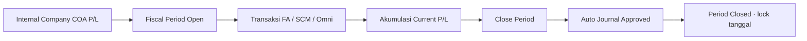
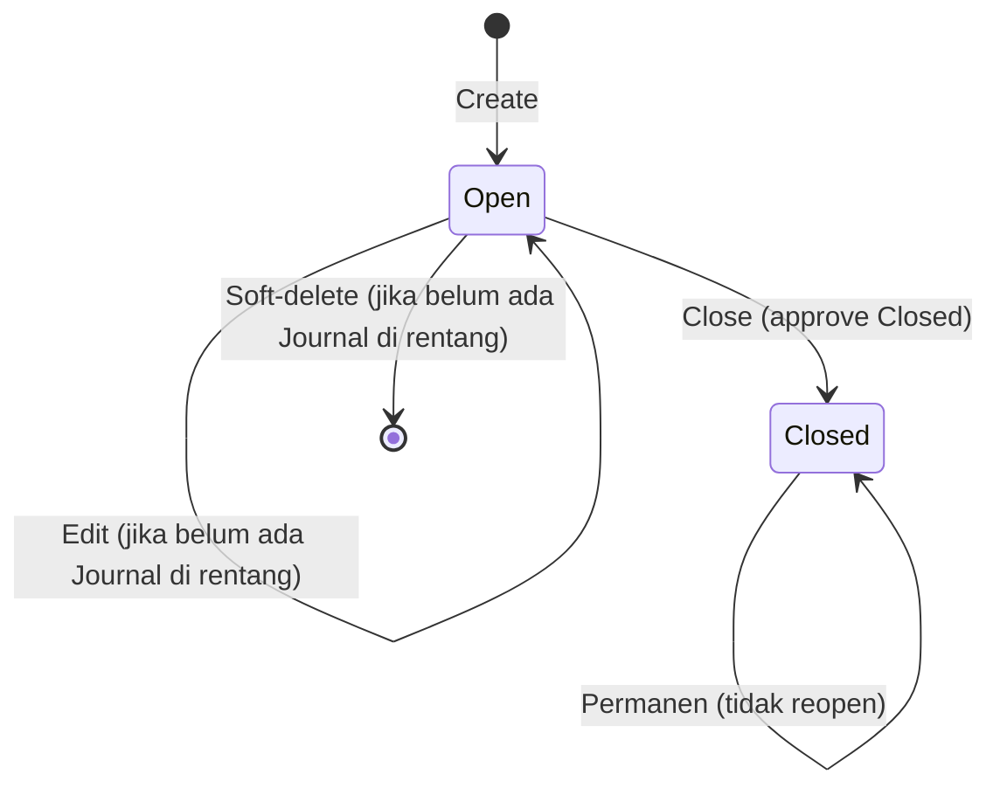

# Fiscal Period — Requirement Documentation

**Modul:** Finance Accounting → Master  
**UI route:** `/accounting/fiscal-period`  
**API:** Accounting resource `fiscal-period` + `POST fiscal-period/{id}/approve`  
**Audience:** PM, Finance/Accounting, QA, Developer  
**PM source:** Fiscal Period Source of Truth **v1.0** (7 Agustus 2026)  
**SoT path:** `_meta/sot/accounting-fiscal-period-source-of-truth.md`

> AS-IS diverifikasi 7 Agu 2026 (`FiscalPeriodController`, `validate_fiscal_period()`, FE `FiscalPeriod/*`).

---

## 0. Metadata & Changelog

| Version | Date | Author | Changes |
|---------|------|--------|---------|
| 1.0 | 2026-08-07 | QA - Yemima | Full 5-file dari SoT v1.0; Gap `GAP-FP-01..07` (FP-08 closed by docs) |

---

## 1. Ringkasan Eksekutif

**Fiscal Period** adalah master rentang tanggal akuntansi per company. Status **Open** memungkinkan create/ubah transaksi pembukuan pada tanggal di dalam rentang; **Closed** mengunci tanggal secara permanen (tidak reopen) lewat gate global di Accounting, Supply Chain, dan Omni. Saat Close, sistem membuat jurnal penutup auto-approved yang memindahkan saldo agregat Current Profit/Loss ke Retained Profit/Loss, lalu menolkan saldo period.

---

## 2. Prasyarat

| Prasyarat | Sumber | Catatan |
|-----------|--------|---------|
| COA **Current Profit/Loss** | Internal / General Company (Accounting Setting) | Wajib create & close |
| COA **Retained Profit/Loss** | Internal / General Company | Sama; salah satu kosong → ditolak |
| Privilege Fiscal Period | Gate Role | create / update / delete / approval (Close) |
| Company context | Token Sanctum | `owned_by` = company login |

Tanpa minimal satu Fiscal Period Open yang mencakup tanggal transaksi, hampir semua write transactional ditolak gate global (§6.4).

---

## 3. Siklus status

| Status | Editable? | Tombol datalist |
|--------|-----------|-----------------|
| **Open** | Name, dates, description — kecuali sudah ada Journal di rentang | Edit, Close, Delete |
| **Closed** | Tidak | Hanya Show; Edit / Delete / Close disembunyikan |

**Close berurutan (AS-IS):** ditolak jika masih ada period **Open** lain dengan `period_end` lebih awal.  
**Reopen:** tidak ada path AS-IS.

---

## 4. Datalist

Fitur: Global search, Create, Show deleted, Column show/hide, Export, Bulk delete.

| Kolom | Default | Catatan |
|-------|---------|---------|
| Name | Ya | Judul period |
| Period | Ya | `date_formatted` → `DD-Mmm-YYYY - DD-Mmm-YYYY` |
| Description | Ya | |
| Status | Ya | Badge Open / Closed (`transaction_status`) |
| Active | Ya | `status` = 1 setelah create |
| Created By / At | Ya | Standar |
| Data Owner | Tidak | `owned_by` |
| Action | Ya | Closed → action ubah disembunyikan |

---

## 5. Form & field

| Field | Wajib | Validasi | Catatan |
|-------|-------|----------|---------|
| Name | Ya | required, max 50 | |
| Start Date | Ya | required, date | Learn more panel di FE |
| End Date | Ya | required, date | Learn more panel di FE |
| Description | Tidak | nullable, max 150 | |

**Audit Log:** slideover di edit.  
**Tidak editable setelah Closed.**  
**Edit diblokir BE** jika ada Journal company bertanggal di rentang (pesan memakai kata *delete* — GAP-FP-02).  
**Tidak ada validasi eksplisit** start ≤ end — GAP-FP-07.

---

## 6. How It Works

### 6.1 Create

1. Cek COA Current & Retained P/L di Accounting Setting.  
2. Cek overlap tanggal (non-deleted, same company).  
3. Sukses: `transaction_status = Open`, `status = 1`.

Contoh overlap: period 1–10 Jul; create 9–31 Jul → `The selected date is already in use.`

### 6.2 Edit

Hanya Open. Journal di rentang → ditolak. Overlap (exclude self) → ditolak. Update sukses tetap Open.

### 6.3 Delete

Soft-delete. Ditolak jika ada Journal di rentang. UI sembunyikan Delete untuk Closed.  
**Scope cek AS-IS = Journal saja** (bukan seluruh dokumen SCM/Omni) — GAP-FP-01.

### 6.4 Gate global tanggal transaksi

Helper `validate_fiscal_period()` — dipakai hampir semua write transactional:

| # | Kondisi | Pesan |
|---|---------|-------|
| 1 | Company tidak ketemu | `Company not found.` |
| 2 | 0 fiscal period | `To create any transaction in OlshopERP, an active fiscal period must exist.` |
| 3 | Format tanggal invalid | `Invalid transaction date format.` |
| 4 | Tanggal > 6 bulan ke belakang | `Transaction date must be within the past 6 months.` |
| 5 | Tanggal di period Open | Lolos |
| 6 | Tanggal di period Closed | `Fiscal period {date} is already closed.` |
| 7 | Tanggal di luar semua period | `Date must be in an active fiscal period.` |

Aturan 6 bulan berlaku di **semua** pemanggil gate.

### 6.5 Close Period (irreversible)

1. Privilege approval; payload status Closed (description max 150).  
2. Cek COA P/L; cek tidak ada Open period dengan end lebih awal.  
3. Dalam satu DB transaction:
   - Generate Journal (Open) tanggal = end of day `period_end`, primary currency, rate 1.
   - Detail dari `current_profit_loss` saat close:
     - **&lt; 0:** Credit Current P/L, Debit Retained P/L (abs).
     - **≥ 0 (termasuk 0):** Debit Current P/L, Credit Retained P/L (abs).
   - Auto-approve Journal; set `current_profit_loss = 0`; set period Closed.
4. Success: `The document has been successfully closed.`

Raw requirement selalu Debit Current / Credit Retained — AS-IS bergantung tanda saldo — GAP-FP-03.

### 6.6 Urutan vs Cash Bank Reconcile

- Create CBR: gate Fiscal Period (start & end) **sebelum** cek overlap CBR.  
- Approve Journal: gate Fiscal Period **sebelum** `validate_cash_bank_reconcile_lock`.  
Period lock CBR setelah Approve = concern terpisah (lihat docs CBR).

---

## 7. Validasi

### 7.1 Di menu Fiscal Period

| ID | Kondisi | Pesan / behavior |
|----|---------|------------------|
| V-01–03 | Name / dates / description | Laravel validation |
| V-04 | COA P/L belum set | `Please configure your Profit/Loss COA accounts in Accounting Settings first.` |
| V-05 | Overlap period | `The selected date is already in use.` (+ field `date`) |
| V-06 | Update/delete + Journal di rentang | `Cannot delete fiscal period data because there are existing transactions within this period's date range.` |
| V-07 | Close + earlier Open | `Cannot close this fiscal period because there are earlier open periods.   Please close all previous open periods first.` |
| V-08 | Close + `can_closed` false | `This fiscal perios and it's properties already closed, you can't modify this data anymore.` (typo *perios* — GAP-FP-04) |
| V-09 | Close sukses | Status Closed + auto journal |

### 7.2 Gate konsumen

Kutip pesan §6.4 persis saat regression di menu lain.

---

## 8. Relasi menu

| Menu | Peran |
|------|-------|
| Internal / General Company | Prasyarat COA Current & Retained P/L |
| Chart of Account | COA di-mapping ke setting |
| Journal | Gate tanggal; penerima auto-journal Close |
| SI / PI / CN / DN / Payments / Returns / Instant Settlement / IVA | Gate tanggal |
| Cash Bank Reconcile | Create cek fiscal dulu; lock CBR terpisah |
| Trial Balance / Balance Sheet / GL | Baca saldo; Current P/L terkait period |
| SCM inbound / DO / Mutation / Opname / Assembly / … | Gate tanggal |
| Omni SO / Wave / Handover / Settlement | Gate tanggal |

---

## 9. Acceptance Criteria

| ID | Kriteria |
|----|----------|
| FP-01 | Create wajib Name, Start, End; COA P/L harus configured |
| FP-02 | Overlap rentang ditolak |
| FP-03 | Update/delete ditolak jika ada Journal di rentang |
| FP-04 | Close berurutan (earlier Open harus ditutup dulu); irreversible |
| FP-05 | Close menghasilkan auto-journal 2 baris + `current_profit_loss → 0` + Closed |
| FP-06 | Gate global: Open + ≤6 bulan; Closed / luar period / no period ditolak |
| FP-07 | Gap registry terdokumentasi |

---

## 10. FAQ

**Q: Transaksi ditolak padahal sudah create period?**  
A: Tanggal harus di period Open, ≤6 bulan ke belakang, COA P/L sudah set; cek apakah period tanggal itu sudah Closed.

**Q: Buka lagi period Closed?**  
A: Tidak — Close final.

**Q: Tidak bisa Close Juli, Juni masih Open?**  
A: Wajib tutup Open yang berakhir lebih dulu.

**Q: Tidak bisa hapus period?**  
A: Biasanya sudah ada Journal di rentang (AS-IS cek Journal saja).

**Q: Beda Fiscal Period vs period CBR?**  
A: Fiscal Period mengunci tanggal hampir seluruh OlshopERP; period CBR = rentang rekonsiliasi per akun — create CBR tetap harus lolos gate Fiscal dulu.

**Q: Apa ke laba rugi saat Close?**  
A: Saldo Current P/L period dipindah ke Retained P/L lewat jurnal auto-approved, lalu Current P/L period dinolkan.

---

## 11. Gap Registry

| ID | Deskripsi | Status |
|----|-----------|--------|
| GAP-FP-01 | Requirement: delete diblokir jika ada **transaksi** apa pun. Code: cek hanya **Journal** | Pending Decision — Yemima |
| GAP-FP-02 | Pesan block update memakai copy *Cannot delete…* | Open |
| GAP-FP-03 | Close journal: always Debit Current vs signed AS-IS (`<0` → Credit Current) | Pending Decision — Yemima |
| GAP-FP-04 | Typo message: `fiscal perios` | Open |
| GAP-FP-05 | FE Learn more = closing klasik multi-akun; code hanya transfer Current ↔ Retained | Pending Decision — Yemima |
| GAP-FP-06 | `can_closed` tidak cek sudah Closed — API ulang Close berpotensi journal amount 0 | Open |
| GAP-FP-07 | Tidak ada validasi `period_start` ≤ `period_end` | Open |
| GAP-FP-08 | Docs QA masih draft/pending | **Closed** — 5-file review 2026-08-07 |

---

## Related Documents

| Doc | Path |
|-----|------|
| Knowledge Base | [knowledge-base.md](./knowledge-base.md) |
| Technical | [technical.md](./technical.md) |
| User Guide | [user-guide.md](./user-guide.md) |
| Cash Bank Reconcile | [../accounting-cash-bank-reconcile/README.md](../accounting-cash-bank-reconcile/README.md) |
| Chart of Account | [../accounting-chart-of-account/README.md](../accounting-chart-of-account/README.md) |
