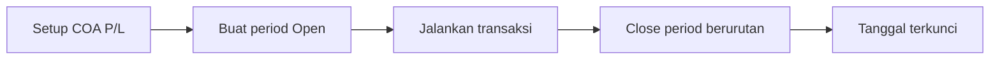

# Panduan Pengguna — Fiscal Period

**Siapa yang baca:** tim Finance / Accounting  
**Menu:** Finance Accounting → Master → Fiscal Period  
**Route:** `/accounting/fiscal-period`

---

## 1. Apa Itu & Kenapa Penting

**Fiscal Period** menentukan rentang tanggal di mana transaksi boleh dicatat. Tanpa period **Open** yang mencakup tanggal dokumen, hampir semua transaksi di OlshopERP akan ditolak.

Menutup (Close) period mengunci tanggal itu secara permanen dan memindahkan saldo laba/rugi berjalan ke laba ditahan.

---

## 2. Overview Flow & Proses Bisnis

**Versi teks:**

1. Isi akun Current & Retained Profit/Loss di Internal Company.  
2. Buat Fiscal Period (Name, Start, End).  
3. Catat transaksi hanya di tanggal period Open (maks. 6 bulan ke belakang).  
4. Close dari period yang berakhir lebih dulu.  
5. Setelah Closed: tidak bisa dibuka lagi.

### Status

| Status | Arti |
|--------|------|
| Open | Transaksi boleh di tanggal dalam rentang |
| Closed | Tanggal terkunci permanen |

---

## 3. Sebelum Mulai

- COA Current Profit/Loss dan Retained Profit/Loss sudah di-set.  
- Privilege create / update / delete / approval (Close).  
- Rencanakan rentang yang tidak overlap.

🎬 [Interactive demo akan ditambahkan di sini]

---

## 4. Setelah Selesai

- Minimal satu period Open untuk tanggal kerja hari ini.  
- Uji create Journal / Invoice dengan tanggal di dalam period.  
- Saat Close: cek jurnal otomatis muncul dan period jadi Closed.

---

## 5. Yang Perlu Diperhatikan

- Close **tidak bisa dibatalkan**.  
- Harus Close period Open yang berakhir lebih awal dulu.  
- Tanggal transaksi tidak boleh lebih tua dari 6 bulan.  
- Tidak bisa hapus period jika sudah ada Journal di rentang tanggal itu.  
- Fiscal Period ≠ period Cash Bank Reconcile (tapi create CBR tetap butuh Fiscal Period Open).

---

## 6. Langkah-Langkah

1. Buka **Fiscal Period** → Create.  
2. Isi Name, Start Date, End Date → Save.  
3. Jalankan transaksi di tanggal period.  
4. Saat mau tutup buku: Action → **Close** (dari period paling awal).  

🎬 [Interactive demo akan ditambahkan di sini]

---

## 7. Tips & Hal yang Sering Bikin Bingung

- **"Please configure your Profit/Loss COA…"** → isi di Internal Company dulu.  
- **"The selected date is already in use."** → rentang overlap. Contoh: sudah ada **1–10 Jul**, lalu create **9–31 Jul** → gagal; geser tanggal agar tidak saling menutupi.  
- **"…earlier open periods…"** → Close period sebelumnya dulu.  
- **"Fiscal period … is already closed."** → pakai tanggal di period Open.  
- **"Transaction date must be within the past 6 months."** → geser tanggal lebih baru.

---

## 8. Referensi

| Sumber | Untuk apa |
|--------|-----------|
| [Knowledge Base](./knowledge-base.md) | Troubleshooting |
| [Requirement](./requirement.md) | Validasi & Gap |
| [Technical](./technical.md) | Developer |
| [Cash Bank Reconcile](../accounting-cash-bank-reconcile/README.md) | Rekonsiliasi (gate fiscal dulu) |
