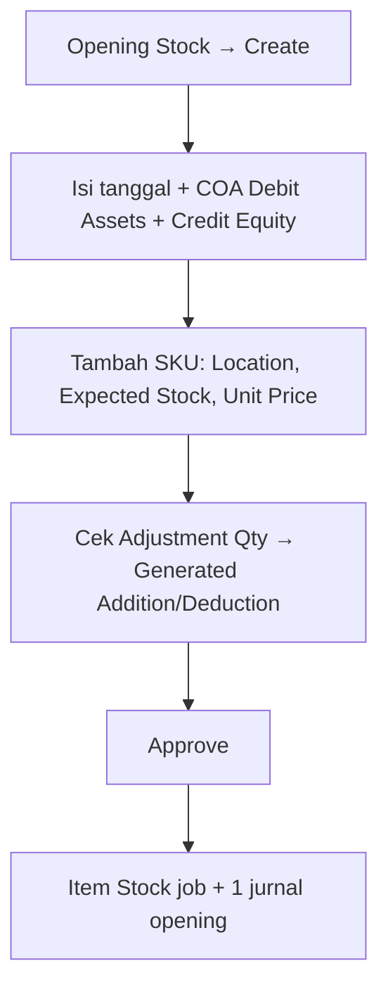

# Opening Stock — Knowledge Base (Operator)

**Audience:** Finance, inventory accounting, support  
**Route:** Accounting → **Opening Stock** (`/accounting/opening-stock`)  
**Kode dokumen:** diawali **OS**

---

## 1. Apa itu Opening Stock?

Opening Stock dipakai saat **mulai inventory accounting**: mencatat **qty + nilai awal** per SKU di lokasi gudang. Setelah di-approve:

- Sistem membuat **Stock Addition** (atau Deduction jika qty turun)
- **Stock ID** digenerate (bisa lama jika ribuan baris — lihat Item Stock Status)
- **Satu jurnal** naik akun Assets & Equity di header

Bukan Stock Opname rutin — tidak ada Building Origin, dan wajib isi dua akun opening (Debit Assets / Credit Equity).

---

## 2. Kapan dipakai?

| ✅ Buat Opening Stock jika | ❌ Jangan jika |
|----------------------------|----------------|
| Mulai stok + nilai awal di FA | Mau opname rutin → pakai **Stock Opname** |
| COA Assets & Equity sudah siap | Periode fiskal tutup |
| Produk Active Single/Variant | Produk Service / random / parent bundle |
| Lokasi rack terkecil Active | Mau cancel dokumen yang sudah Approved (production) |

---

## 3. Alur kerja standar

**Langkah teks:**

1. **Create** — tanggal dalam fiscal period; isi COA Debit (Assets) & Credit (Equity).  
2. **Tambah detail** — pilih SKU, lokasi rack, Expected Stock, Unit Price (bilangan bulat).  
3. Sistem hitung Adjustment vs snapshot stok saat baris dibuat.  
4. **Approve** — tunggu Item Stock Status selesai; cek Generated Trx & jurnal.  
5. Setelah Approved = **final** (tidak dibatalkan di production).

---

## 4. Field penting

| Field | Arti singkat |
|-------|--------------|
| Expected Stock | Qty yang diinginkan setelah opening |
| Transaction Stock | Snapshot stok saat baris dibuat (bukan realtime) |
| Availability | Stok realtime sekarang |
| Adjustment Qty | Expected − Transaction Stock (+ masuk / − keluar) |
| Unit Price | Nilai per unit (bilangan bulat) |
| Item Stock Status | Progress generate Stock ID setelah Approve |
| Generated Trx | Dokumen Addition/Deduction turunan |

---

## 5. Contoh kasus

| Situasi | Hasil |
|---------|--------|
| 500+ baris SKU | Boleh — batas max opname 500 dilewati untuk Opening Stock |
| SKU masih punya Addition Open | Boleh ditambah (beda dari Addition biasa) |
| Approve 3 SKU | 3 Stock ID (job) + **satu** jurnal dari COA header |
| Lokasi beda company | Ditolak |
| Header tanpa Building Origin | By design |

---

## 6. Troubleshooting

| Gejala | Cek / tindakan |
|--------|----------------|
| Tidak bisa Approve | Detail kosong? Location kosong? Fiscal? Unit price desimal? |
| Item Stock Status lama loading | Job queue; banyak baris — tunggu |
| Angka jurnal salah | Total = harga × qty masuk; cek COA Debit/Credit header |
| SKU ditolak | Bukan Service/random; cek duplikat SKU+lokasi |
| Tidak ada Building Origin | Normal untuk Opening Stock |
| Error menyebut “stock opname” | Known copy issue (GAP-OS-09) |

---

## 7. FAQ

**Q: Beda dengan Stock Opname?**  
A: Opname rutin pakai Building Origin & kode SP. Opening Stock = saldo awal, kode OS, wajib COA Assets/Equity.

**Q: Kenapa muncul Stock Addition?**  
A: Sistem otomatis membuat dokumen turunan dari Adjustment Qty.

**Q: Ada menu Opening Stock di SCM?**  
A: Tidak. Menu resmi di Accounting. Di SCM yang terlihat = Addition/Deduction hasil generate.

**Q: Bisa ribuan SKU?**  
A: Ya, tapi pantau loading Item Stock Status & performa layar.

**Q: Setelah Approved bisa dibatalkan?**  
A: Tidak di production.

---

## 8. Relasi menu lain

| Menu | Relasi |
|------|--------|
| Stock Addition / Deduction | Generated Trx setelah isi detail |
| Journal / Balance Sheet | Jurnal opening setelah Approve |
| [Benchmark COGS](../accounting-product-benchmark-price/knowledge-base.md) | Addition dari OS ikut sumber kalkulasi Benchmark |
| [Stock Remapping](../accounting-stock-remapping/knowledge-base.md) | Remap variant terpisah — bukan parent Opening Stock |

---

## Related Documents

| Doc | Path |
|-----|------|
| Requirement | [requirement.md](./requirement.md) |
| Technical | [technical.md](./technical.md) |
| User Guide | [user-guide.md](./user-guide.md) |
| SoT | [../_meta/sot/accounting-opening-stock-source-of-truth.md](../_meta/sot/accounting-opening-stock-source-of-truth.md) |
