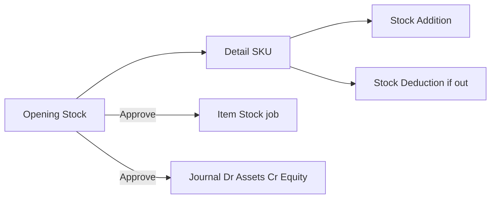
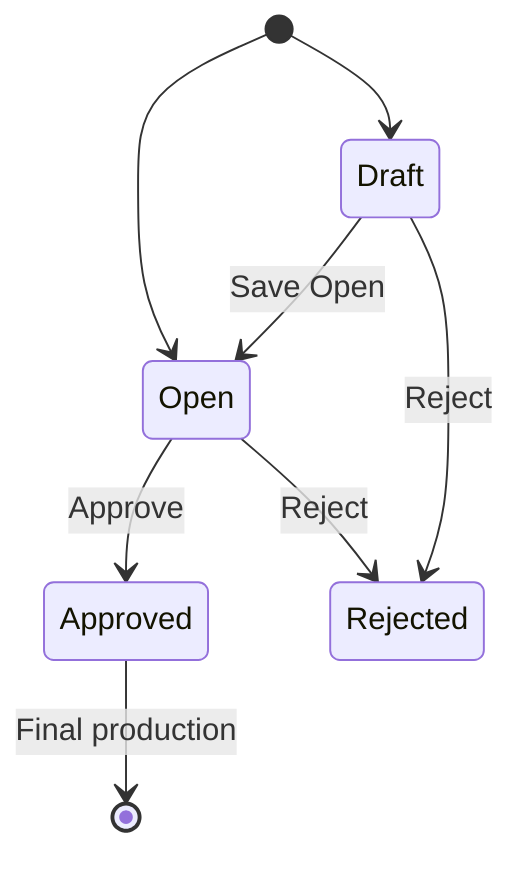

# Opening Stock — Requirement Documentation

**Modul:** Accounting (FA)  
**Prefix:** `OS`  
**Audience:** PM, Finance, QA  
**UI route:** `/accounting/opening-stock`  
**SoT:** `_meta/sot/accounting-opening-stock-source-of-truth.md` v1.0 (13 Agu 2026)

Engine AS-IS = **Stock Opname** + flag `is_opening_stock`. **Standalone** (bukan child Opname/Sales Return). **Approved = final** di production.

---

## 0. Metadata & Changelog

| Version | Date | Author | Changes |
|---------|------|--------|---------|
| 1.0 | 2026-08-31 | QA - Yemima | Full 5-file dari SoT v1.0: Opname engine, COA Assets/Equity, Generated Trx, GAP-OS-01..10; keep Benchmark COGS + Stock Remapping refs |

---

## 1. Ringkasan Eksekutif

**Opening Stock** mencatat **saldo awal persediaan & nilai** saat mulai inventory accounting: qty + unit price per SKU/lokasi. Setelah **Approve**: generate **Stock Addition** (± **Deduction**), **Item Stock** (async job), dan **satu jurnal opening** (Dr Assets / Cr Equity dari header).

| Kebutuhan bisnis | Jawaban Opening Stock |
|------------------|----------------------|
| Saldo awal gudang + neraca | Detail Expected Stock + Unit Price → Adjustment → child Addition/Deduction + journal |
| Ribuan SKU | Path opening **skip** max 500 opname; Item Stock via background job |
| Tanpa Building Origin | Location hanya di detail; `warehouse_origin` null |
| Final setelah Approve | Tidak reverse/cancel di production |

---

## 2. Prasyarat

| Prerequisite | Sumber | Catatan |
|--------------|--------|---------|
| COA leaf **Assets** (Debit) & **Equity** (Credit) | Chart of Account | Wajib di header AS-IS |
| Fiscal period terbuka | Fiscal Period | Create / update / approve |
| Product Active Single/Variant (bukan Service / Parent Bundle / Random) | System Product | |
| Unit stock / alternate aktif | Master Unit | Default primary |
| Warehouse Active, rack terkecil (`space type level` ≥ 20), non-virtual | Warehouse Structure | Per detail |
| Privilege Opening Stock | Gate `accounting/opening-stock` | Entity `OpeningStock` |

---

## 3. Siklus Status

| Status | Editable? | Efek |
|--------|-----------|------|
| **draft** / **open** | Ya | Edit, Delete, Approve/Reject; Item Stock Status = `-` |
| **approved** | Tidak | Show; Item Stock progress; journal + Generated Trx; **final** (unapprove local/dev only) |
| **rejected** | Ya | Edit ulang / delete sesuai privilege |

---

## 4. Datalist

**Route:** `/accounting/opening-stock` · Shared Stock Opname UI (`menu="openingStock"`).

**Toolbar:** Global Search · Advanced Filter · Create · Show deleted · Column show/hide · Export with/without detail · Bulk delete / bulk approve · Multi select.

| Kolom UI | Default | Catatan |
|----------|---------|---------|
| Trx Code \| Trx Date | true | Prefix **`OS`**; link edit |
| Description / Qty / Trx Status | true | |
| **Item Stock Status** | true | Hanya Opening Stock; draft/open = `-`; approved = progress job |
| **Generated Trx** | true | Link Stock Addition (± Deduction) + tooltip journal child |
| Building Origin / GL Trx | — | **Tidak** di Opening Stock |
| Created/Updated by\|at · Action | true | |

Filter BE: `is_opname=1` + `warehouse_origin IS NULL` + `whereHas(openingStockCoa)`.

---

## 5. Form & Field

### 5.1 Header

| Field | Required | Aturan AS-IS |
|-------|----------|--------------|
| Transaction Code | Auto | `OS-` + hex timestamp; editable sampai belum approved |
| Transaction Date | Ya | + fiscal period |
| **Opening Balance COA Debit** | Ya | Select2 **Assets** leaf |
| **Opening Balance COA Credit** | Ya | Select2 **Equity** leaf |
| Description | Tidak | max 150 |
| Attachment | Tidak | Extensi standar |
| Building Origin / Location Destination header | **Tidak ada** | `warehouse_origin` force null |

Default COA dari Opening Stock terakhir. Tippy: Debit = Assets; Credit = Equity (GAP-OS-02 fixed).

### 5.2 Detail

| Field | Editable? | Arti |
|-------|-----------|------|
| Select Product | Add | Single/Variant Active; tolak Service & random |
| **Unit Price** | Inline | Whole numbers; tampil di FA Opening Stock |
| Availability | Read | Stok realtime lokasi |
| Transaction Stock | Read | Snapshot saat insert (`origin_available`) |
| Expected Stock | Inline | Qty target |
| Adjustment Qty | Read | Expected − Transaction Stock → +Addition / −Deduction |
| Unit | Ya | Primary atau alternate aktif |
| Location | Ya | Rack Active; tanpa filter Building Origin |

**Import:** template pola Opname/Addition; opening **skip** max 500 row; **skip** validasi “SKU masih punya Addition open”.

---

## 6. How It Works

### 6.1 vs Stock Addition / Stock Opname

| Aspek | Stock Addition | Opening Stock (AS-IS) |
|-------|----------------|----------------------|
| Engine | Addition | **Stock Opname** + flag opening |
| Max detail | ~100–500 | **Skip** max 500 |
| Jurnal | Inventory COA produk | **1 Assets + 1 Equity** header |
| Open Addition block | Ya | **Skip** |
| Location header | Destination | Tidak |
| Sumber parent | Bisa Opname/SR | **Standalone** |

### 6.2 Adjustment & child

1. Expected Stock → Adjustment = Expected − Transaction Stock.  
2. **+** → Stock Addition (ref OS detail).  
3. **−** → Stock Deduction.  
4. Item Stock setelah Approve via `ApproveInboundOpeningJob`.

### 6.3 Approve

1. Validasi: detail ada; WH Active; fiscal; qty match child; unit price whole; bukan Service.  
2. Approve tiap Addition (opening) → job Item Stock (**tanpa** `stockInboundAutoJournal` standar).  
3. `OpeningStockCoa.total_*` = Σ (unit price × qty base) detail **in**.  
4. `openingStockAutoJournal`: **Dr** Assets, **Cr** Equity (satu pasangan); journal auto-approved; date = Trx Date.  
5. Pesan: *Opening stock has been generated in background.*  
6. Reject → Rejected, tanpa journal.

### 6.4 Location (AC4)

Hanya di detail; rack level ≥ 20, Active, non-virtual; bebas struktur (origin null). WH beda company → tolak (pesan exact: GAP-OS-06).

### 6.5 Contoh kasus

| # | Situasi | Expected |
|---|---------|----------|
| T01 | 500+ row SKU | Save OK — max 500 di-skip |
| T02 | SKU masih punya Addition Open | Boleh insert |
| T03 | Location 2 struktur WH, 1 owner | Boleh |
| T04 | Location beda company | Tolak |
| T05 | COA Credit | Equity only |
| T06 | Approve 3 SKU | 3 Item Stock (job) + **1 journal** header (bukan 3 Debit Product COA — GAP-OS-01) |
| T09 | Import 1000 row | Skip max 500 |
| T11 | Trx Code | `OS-` + hex timestamp |
| T12 | Header tanpa Location Destination | Ya |

---

## 7. Validasi

| Kondisi | Behavior |
|---------|----------|
| Trx Date luar fiscal | Blok |
| COA Debit/Credit kosong | Required |
| Product Service / random | Ditolak |
| Qty / unit price desimal | Blok (whole) |
| Duplikat product + same WH | *Product has been added…* |
| Approve tanpa detail / WH inactive | Blok |
| Qty child mismatch | *failed to generate addition or deduction* |
| Sudah approved | *can't modify* |
| Concurrent approve | Cache — tunggu |

---

## 8. Relasi Menu

| Menu | Relasi |
|------|--------|
| Stock Opname / Opname Approval | Engine & UI shared; filter data beda |
| Stock Addition / Deduction | Child Generated Trx |
| Journal / Item Stock | Hasil approve |
| Balance Sheet | Assets & Equity naik setelah journal |
| Chart of Account / Fiscal / Warehouse / System Product | Master |
| [Benchmark COGS](../accounting-product-benchmark-price/requirement.md) | Setelah approve, addition inbound ikut sumber kalkulasi Benchmark (§7.4) |
| [Stock Remapping](../accounting-stock-remapping/requirement.md) | Remap identitas variant terpisah (bukan parent OS) |

**Bukan sumber:** Sales Return / Stock Opname sebagai parent dokumen OS.

---

## 9. Gap Registry

| ID | Deskripsi | Status |
|----|-----------|--------|
| GAP-OS-01 | TO-BE Debit Product COA per SKU vs AS-IS 1 Assets + 1 Equity header | **Pending Decision** |
| GAP-OS-02 | Tippy Debit/Credit tertukar | **Resolved** |
| GAP-OS-03 | Framing “base Addition” vs engine Opname | **Resolved** (document AS-IS Opname) |
| GAP-OS-04 | Menu SCM Opening Stock terpisah | **Resolved** — FA only; SCM = Generated Trx |
| GAP-OS-05 | Code `OS-20240501` vs `OS-`+hex | **Resolved** — AS-IS hex |
| GAP-OS-06 | Pesan WH beda company exact | Open |
| GAP-OS-07 | Performa UI ribuan row | Open — Dev |
| GAP-OS-08 | `validate_max_details` 100 tidak terlihat dipanggil | Open — watch |
| GAP-OS-09 | Error copy masih “stock opname” | Open |
| GAP-OS-10 | Standalone + Approved final | **Resolved** |

---

## 10. Acceptance Criteria (QA smoke)

1. Create OS + 2 COA Assets/Equity → detail Expected/Price/Location → Adjustment + → Addition generated.  
2. Approve → Item Stock Status progress → 1 journal Dr/Cr header.  
3. 500+ rows insert OK.  
4. SKU dengan Addition open masih bisa di-insert.  
5. Header tanpa Building Origin.  
6. Approved tidak bisa edit; unapprove hanya non-prod.  
7. Import 1000 path opening tidak kena max 500.  
8. Reject → no journal.

---

## 11. FAQ

**Q: Beda dengan Stock Opname?**  
A: Opname rutin: Building Origin, kode `SP`, tanpa COA opening. OS: saldo awal, tanpa origin, wajib Assets/Equity, kode `OS`, Item Stock Status di list.

**Q: Kenapa ada Stock Addition?**  
A: Engine generate child dari Adjustment; Stock ID dari situ + job opening.

**Q: Bisa ribuan SKU?**  
A: Ya (skip max opname). Waspadai performa UI/job (GAP-OS-07).

**Q: Cancel setelah Approved?**  
A: Tidak di production.

**Q: Menu Opening Stock di SCM?**  
A: Tidak — hanya FA. SCM menampilkan Generated Addition/Deduction.

**Q: Debit kosong → Product COA per SKU?**  
A: Tidak di kode AS-IS — Debit & Credit header wajib; jurnal pakai pasangan itu (GAP-OS-01).

---

## Related Documents

| Doc | Path |
|-----|------|
| Knowledge Base | [knowledge-base.md](./knowledge-base.md) |
| Technical | [technical.md](./technical.md) |
| User Guide | [user-guide.md](./user-guide.md) |
| SoT | [../_meta/sot/accounting-opening-stock-source-of-truth.md](../_meta/sot/accounting-opening-stock-source-of-truth.md) |
| Benchmark COGS | [../accounting-product-benchmark-price/requirement.md](../accounting-product-benchmark-price/requirement.md) |
| Stock Remapping | [../accounting-stock-remapping/requirement.md](../accounting-stock-remapping/requirement.md) |
