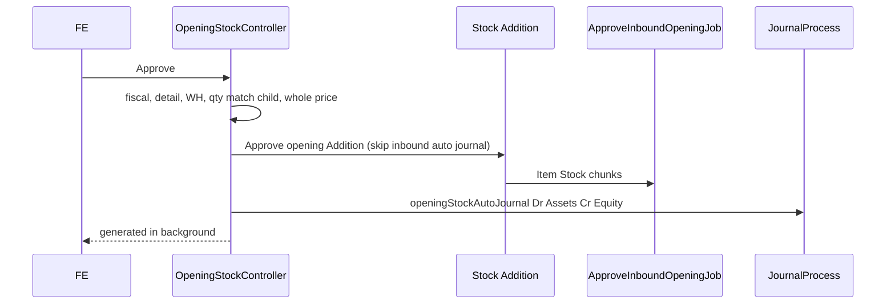

# Opening Stock — Technical Documentation

**API / UI:** `/accounting/opening-stock`  
**Behavior SoT:** [requirement.md](./requirement.md) v1.0  
**Source SoT:** [../_meta/sot/accounting-opening-stock-source-of-truth.md](../_meta/sot/accounting-opening-stock-source-of-truth.md) v1.0

Engine: Stock Opname + `is_opening_stock` · Entity `OpeningStock` extends `StockMutation`.

---

## 1. File Map

### Backend

| Layer | Path / nama |
|-------|-------------|
| Controller | `OpeningStockController`, `OpeningStockDetailController` → Stock Opname engine |
| Engine | `StockOpnameController` / `StockOpnameDetailController` (`is_opening_stock`) |
| Entity | `OpeningStock` · `OpeningStockCoa` |
| Journal | `JournalProcess::openingStockAutoJournal` |
| Item stock | `ApproveInboundOpeningJob` via `ItemStockMutation::approveInbound` |
| Policy | `OpeningStockPolicy` |
| Export | `OpeningStockExportJob`, `OpeningStockExport` |
| Import | `OpeningStockImport` / Opname detail import `menu=openingStock` |

### Frontend

| Layer | Path |
|-------|------|
| Shell FA | `olshoperp-frontend/src/pages/Accounting/OpeningStock/{DataList,Form}.vue` |
| Shared | `…/SCM/StockOpname/{DataListComponen,FormComponen,DatalistDetail}.vue` (`menu=openingStock`) |

---

## 2. List filter & code

| Rule | Value |
|------|-------|
| List scope | `is_opname=1` + `warehouse_origin IS NULL` + `whereHas(openingStockCoa)` |
| Code | `generateCode(..., 'OS')` → `OS-` + hex unix timestamp |
| Header origin | Forced null — no Building Origin |

---

## 3. Approve flow

Totals: `OpeningStockCoa.total_debit/credit` = Σ (unit price × qty base) detail **in**.

---

## 4. Invariants

| ID | Invariant |
|----|-----------|
| INV-OS-01 | List = opname + origin null + has OpeningStockCoa |
| INV-OS-02 | Code identifier `OS` |
| INV-OS-03 | Opening detail path skips opname max 500; skips open-Addition product block |
| INV-OS-04 | Journal = one Dr Assets + one Cr Equity from OpeningStockCoa (not per-SKU Product COA — GAP-OS-01) |
| INV-OS-05 | Approved final in production |
| INV-OS-06 | Standalone — no parent Opname/Sales Return required |
| INV-OS-07 | Unit price & qty whole numbers |
| INV-OS-08 | Location = rack level ≥ 20, Active, non-virtual |

---

## 5. Failure modes

| Mode | Behavior |
|------|----------|
| Fiscal / COA / WH / qty validation | Block write/approve |
| Child Addition/Deduction qty mismatch | Failed generate message |
| Background job lag | Item Stock Status stays loading |
| Concurrent approve | Cache lock |
| Update after approved | Blocked |

---

## 6. Data lifecycle

Create OS header (+ OpeningStockCoa) → detail → auto Addition/Deduction → Approve OS → approve child Addition (job Item Stock) + opening journal Approved → stock & BS Assets/Equity.

**Benchmark COGS:** approved opening addition inbound with price ikut sumber [Benchmark COGS](../accounting-product-benchmark-price/requirement.md) §7.4 (`accounting_opening_stock_coas` identifies parent).

---

## 7. Tests & QA notes

1. Create + Assets/Equity COA → detail → Approve → 1 journal + Item Stock Status.  
2. 500+ rows insert OK.  
3. SKU with open Addition still insertable.  
4. No Building Origin on header.  
5. Approved immutable in production.  
6. Verify GAP-OS-01 decision (header COA vs per-SKU Product COA).  
7. GAP-OS-06 WH cross-company message on staging.

---

## 8. Known gaps

| ID | Issue |
|----|-------|
| GAP-OS-01 | Debit Product COA per SKU (TO-BE) vs header Assets (AS-IS) |
| GAP-OS-06 | Exact WH company error string |
| GAP-OS-07 | UI performance thousands of rows |
| GAP-OS-08 | Unused `validate_max_details` 100 |
| GAP-OS-09 | Error copy still says stock opname |

Full: [requirement §9](./requirement.md).

---

## Related Documents

| Doc | Path |
|-----|------|
| Requirement | [requirement.md](./requirement.md) |
| Knowledge Base | [knowledge-base.md](./knowledge-base.md) |
| User Guide | [user-guide.md](./user-guide.md) |
| Stock Remapping | [../accounting-stock-remapping/technical.md](../accounting-stock-remapping/technical.md) |
| Benchmark COGS | [../accounting-product-benchmark-price/requirement.md](../accounting-product-benchmark-price/requirement.md) |
