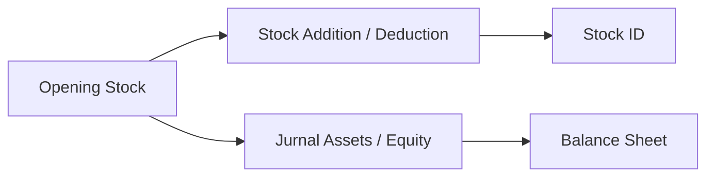

# Opening Stock — Panduan Pengguna

**Siapa yang baca:** finance, inventory accounting, operations support  
**Menu di sistem:** Accounting → **Opening Stock**  
**Kode transaksi:** diawali `OS-`  
**Feature Map / Lingo:** [feature-map.md](./feature-map.md)

---

## 1. Apa Itu & Kenapa Penting

Opening Stock dipakai saat perusahaan **mulai mencatat stok & nilai awal** di sistem. Lewat menu ini kamu mengisi qty dan harga per SKU di lokasi gudang, lalu setelah Approve stok masuk dan jurnal Assets/Equity terbit.

Ini berbeda dari [Stock Opname](#sf-lingo:SF-OS-05) rutin (hitung ulang stok berkala). Opening Stock khusus **saldo awal**.

---

## 2. Overview Flow & Proses Bisnis

### Rantai proses

**Versi teks:**

1. Buat dokumen Opening Stock + isi akun Debit (Assets) & Credit (Equity).  
2. Tambah baris SKU: lokasi, qty yang diinginkan, harga.  
3. Sistem membuat dokumen Addition/Deduction otomatis.  
4. Approve → Stock ID digenerate (bisa background) + satu jurnal opening.  
5. Stok & neraca terisi.

### Siklus status

| Status | Artinya | Bisa diubah? |
|--------|---------|--------------|
| **Draft / Open** | Masih diisi | Ya |
| **Approved** | Final — stok & jurnal sudah jalan | Tidak (production) |
| **Rejected** | Ditolak — bisa diperbaiki | Ya |

---

## 3. Sebelum Mulai

Pastikan:

- [ ] Periode fiskal tanggal transaksi terbuka.  
- [ ] Akun **Assets** (Debit) & **Equity** (Credit) sudah ada di Chart of Account.  
- [ ] Produk Active tipe Single/Variant (bukan jasa/random).  
- [ ] Lokasi gudang = rack terkecil yang Active.  
- [ ] Kamu punya privilege Opening Stock (buat + approve).

🎬 [Interactive demo akan ditambahkan di sini]

---

## 4. Setelah Selesai

Setelah **Approve**:

1. Pantau **Item Stock Status** sampai selesai (banyak baris = lebih lama).  
2. Cek **Generated Trx** (Stock Addition / Deduction).  
3. Cek jurnal opening di Journal / dampak di Balance Sheet.  
4. Dokumen **tidak bisa dibatalkan** di production.

🎬 [Interactive demo akan ditambahkan di sini]

---

## 5. Yang Perlu Diperhatikan

- **Kalau COA Debit/Credit kosong**, simpan/approve ditolak — keduanya wajib.  
- **Kalau harga atau qty desimal**, sistem menolak — pakai bilangan bulat.  
- **Kalau produk jasa/random**, tidak bisa ditambah.  
- **Kalau lokasi beda company**, ditolak.  
- **Kalau kamu mencari Building Origin di header**, tidak ada — lokasi hanya di baris detail.  
- **Kalau Item Stock Status lama loading**, tunggu job background (ribuan SKU wajar lebih lama).  
- **Kalau sudah Approved**, tidak bisa diedit/dibatalkan di production.

---

## 6. Langkah-Langkah

### Langkah 1 — Buat header

1. Buka **Opening Stock → Create**.  
2. Isi tanggal, [**Opening Balance COA**](#sf-lingo:SF-OS-01) Debit (Assets) & Credit (Equity), deskripsi opsional.  
3. Simpan.

### Langkah 2 — Tambah SKU

1. Pilih produk.  
2. Isi **Location**, [**Expected Stock**](#sf-lingo:SF-OS-02), **Unit Price**.  
3. Cek **Adjustment Qty** (selisih vs stok yang tercatat saat baris dibuat).  
4. Ulangi untuk SKU lain — boleh ratusan/ribuan baris.  
5. Opsional: **Import** Excel (path Opening Stock tidak kena batas 500 baris opname).

🎬 [Interactive demo akan ditambahkan di sini]

### Langkah 3 — Approve

1. Pastikan status siap approve.  
2. Klik **Approve**.  
3. Tunggu pesan generate background + pantau [**Item Stock Status**](#sf-lingo:SF-OS-04).

### Langkah 4 — Lanjutan

| Kebutuhan | Lakukan |
|-----------|---------|
| Cek dokumen turunan | Kolom [**Generated Trx**](#sf-lingo:SF-OS-03) |
| Cek jurnal / neraca | Journal · Balance Sheet |
| Remap variant nanti | Menu **Stock Remapping** (terpisah) |

---

## 7. Tips & Hal yang Sering Bikin Bingung

- **[Bukan Stock Opname?](#sf-lingo:SF-OS-05)** Opname = hitung rutin + Building Origin. Opening Stock = saldo awal + COA Assets/Equity.  
- **Kenapa ada [Stock Addition](#sf-lingo:SF-OS-03)?** Otomatis dari Adjustment Qty — bukan berarti kamu buat Addition manual.  
- **Contoh:** Expected 100, snapshot 0 → Adjustment +100 → Addition; setelah Approve baru ada Stock ID ([Item Stock Status](#sf-lingo:SF-OS-04)).  
- **Menu di SCM?** Tidak ada Opening Stock terpisah di SCM — yang muncul di SCM biasanya Addition/Deduction hasil generate.  
- **Satu jurnal untuk banyak SKU?** Ya (AS-IS) — pakai pasangan [COA header](#sf-lingo:SF-OS-01), bukan satu Debit per SKU.

---

## 8. Referensi

| Dokumen | Isi |
|---------|-----|
| [feature-map.md](./feature-map.md) | Indeks sub-feature + Lingo |
| [knowledge-base.md](./knowledge-base.md) | SOP, troubleshooting, FAQ |
| [requirement.md](./requirement.md) | Aturan bisnis, gap |
| [technical.md](./technical.md) | API, job, jurnal |

**Menu terkait:** Stock Addition · Stock Deduction · Journal · Balance Sheet · Stock Remapping · Benchmark COGS

---

*Derivatif dari requirement / knowledge-base / technical v1.0 — Feature Map v1.0 ditautkan untuk Lingo.*
