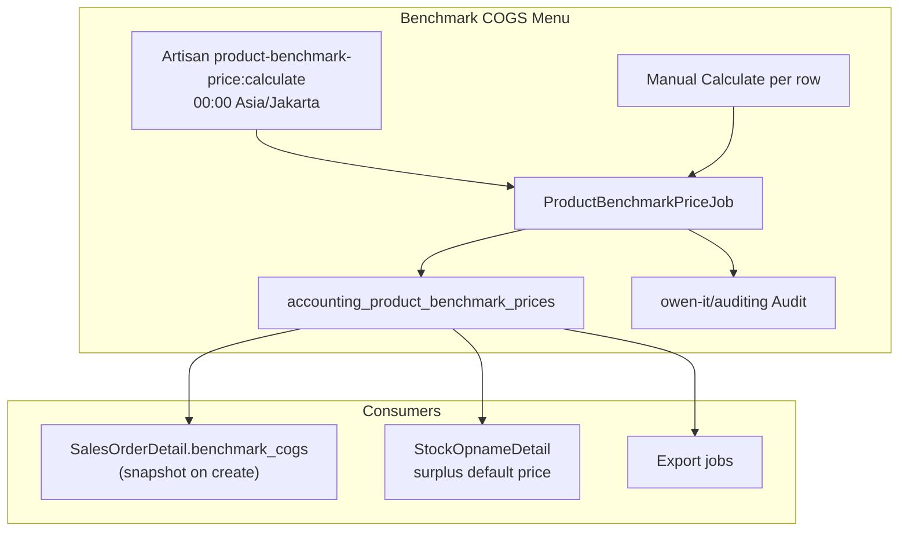

# Benchmark COGS — Technical Documentation

## 0. Metadata & Changelog

| Version | Date | Author | Changes |
|---------|------|--------|---------|
| 1.0 | 2026-07-05 | QA - Yemima | Initial technical — calculation job, API, SO snapshot, gaps |

**Stack:** Laravel 13 · Horizon · Vue 3 · MariaDB  
**Module:** Accounting (+ cross-module reads SupplyChain / OmniChannel)

---

## 1. Architecture Overview



---

## 2. Routes & API

### 2.1 Frontend

| Item | Path |
|------|------|
| Route | `/accounting/product-benchmark-price` |
| Component | `olshoperp-frontend/src/pages/Accounting/Report/ProductBenchmarkPrice/Datalist.vue` |
| Calculate Log | `.../ProductBenchmarkPrice/CalculateLog.vue` |
| Menu seeder | `Modules/Gate/Database/Seeders/ModuleMenu/AccountingMenuSeeder.php` |
| Policy class | `Modules\Accounting\Entities\ProductBenchmarkPrice` |

### 2.2 Backend API (`auth:sanctum`, prefix `accounting`)

| Method | Path | Controller | Notes |
|--------|------|------------|-------|
| GET | `/product-benchmark-price` | `index` | Datalist |
| GET | `/product-benchmark-price/{product}/sync` | `manualCalculate` | Queue job |
| GET | `/product-benchmark-price/calculate-log` | `CalculateLog` | Audit datalist |
| GET | `/product-benchmark-price/export-file` | `exportFile` | Export batch list |
| GET | `/product-benchmark-price/export-progress` | `exportProgress` | Poll |
| GET | `/product-benchmark-price/export-excel` | `exportExcelAll` | Download |

**Routes file:** `Modules/Accounting/Routes/api.php`

---

## 3. Database Schema

### 3.1 `accounting_product_benchmark_prices`

**Migration:** `Modules/Accounting/Database/Migrations/2026_01_27_130442_create_product_benchmark_prices_table.php`

| Column | Type | Notes |
|--------|------|-------|
| `id` | bigint | PK |
| `product_id` | FK → `scm_products.id` | One row per product |
| `benchmark_price` | decimal(21,4) | Default 0 |
| `description` | string nullable | `Highest Price` / `Last Buy` / `No Purchase` |
| `status`, `is_all_company`, `owned_by`, `created_by` | | From `baseColumns` |
| timestamps, soft deletes | | |

**Model:** `Modules/Accounting/Entities/ProductBenchmarkPrice.php`

- Traits: `ConsoleAuditTrait` (audit on console/queue only)
- `transformAudit()` — maps `product_id` → SKU label in audit payload
- `$auditExclude` — skips metadata fields

**Product relation:** `Modules/SupplyChain/Entities/Product::benchmarkPrice()` hasOne

### 3.2 Sales order snapshot

**Migration:** `2023_12_06_145423_create_sales_order_details_table.php`

```php
$table->decimal('benchmark_cogs', 21, 4)->default(0)->comment('Benchmark COGS');
```

Also on `omni_sales_order_detail_randoms` and export temp `sales_order_data_temps.benchmark_cogs`.

### 3.3 Export tracking

`accounting_product_benchmark_price_export_files` — `ProductBenchmarkPriceExportFile`

---

## 4. Calculation Job

**Class:** `Modules/Accounting/Jobs/ProductBenchmarkPriceJob.php`

### 4.1 Entry points

| Trigger | Caller | Args |
|---------|--------|------|
| Daily 00:00 WIB | `App\Console\Commands\ProductBenchmarkPriceCalculate` | `manualCalculate(null, false)` — all products chunked 100 |
| Manual row | `ProductBenchmarkPriceController@manualCalculate` | `$product_id`, `all_data: false`, scope list parent+variants |

**Schedule:** `app/Console/Kernel.php` — `daily()->at('00:00')->timezone('Asia/Jakarta')`

### 4.2 `processProduct($product_id, ...)`

```
if has variant children:
    exclude random variant from MAX loop
    foreach variant: getBenchmarkPrice → updateOrCreate variant row
    parent row = MAX(variant benchmarks)
    random variant row = parent MAX (if exists)
else:
    single: getBenchmarkPrice → updateOrCreate
```

### 4.3 `getBenchmarkPrice($product_id, $start30DaysAgo, $endToday)`

**Step 1 — 30-day highest:**

```php
InboundMutationDetail::query()
    ->join stock_mutation (approved)
    ->join item_stock on inbound detail
    ->whereNull(transaction_reference_class)
    ->whereNotNull(purchase_order_detail_id)
    ->whereBetween(transaction_date, [start30, endToday])
    ->where(item_stock.product_id, $product_id)
    ->max('item_stock.each_price_before_vat');
```

**Step 2 — Last Buy** if step 1 empty: same joins, `transaction_date < start30DaysAgo`, `orderByDesc`, take first `COALESCE(NULLIF(item_stock.each_price_before_vat,0), inbound.each_price_before_vat)`.

**Returns:** `[price, description]`

---

## 5. Controller Highlights

**File:** `Modules/Accounting/Http/Controllers/ProductBenchmarkPriceController.php`

| Method | Logic |
|--------|-------|
| `indexQuery` | `show_detail` ? all products : join tree `parent_id IS NULL` |
| `index` | datalist columns + `render_sync: true` for Calculate action |
| `manualCalculate` | Build product ID list; dispatch job batch; `sleep(1)` |
| `CalculateLog` | `Audit::where('auditable_type', ProductBenchmarkPrice::class)` |

**Export:** `ProductBenchmarkPriceExportJob` + `ProductBenchmarkPriceExport` class

---

## 6. Sales Order Integration

### 6.1 Snapshot on create

**Files:**

- `Modules/OmniChannel/Entities/SalesOrderDetail.php` — `handleBenchmarkCogsOnCreating()` on `creating`
- `Modules/OmniChannel/Entities/SalesOrderDetailRandom.php` — same pattern

```php
if ($this->benchmark_cogs > 0) return;
if (! $this->product_id) return;
$this->benchmark_cogs = ProductBenchmarkPrice::where('product_id', $this->product_id)->value('benchmark_price');
```

### 6.2 Binding update (Platform)

`Modules/OmniChannel/Http/Controllers/ProductController.php` (~3277):

On bind → set `product_id` + `benchmark_cogs` from `product_system_id` benchmark.

Also: `Modules/SupplyChain/Http/Controllers/ProductController.php` (~3900) for SCM binding path.

### 6.3 Detail update

`SalesOrderDetailController@update` — if `product_id` changes → re-fetch benchmark.

### 6.4 Datalist columns

`SalesOrderDetailController` (general + platform datalist):

- `price_before_vat_formatted` — bundle header sums children `each_price_before_discount_before_vat × qty`
- `benchmark_cogs_formatted` — `unitConverterFromProduct(benchmark_cogs, ...)`

**FE column config:**

- `BusinessDevelopment/SalesOrderGeneral/DatalistDetail.vue` — both columns `visible: false`
- `Omni/SalesOrder/DatalistDetail.vue` — platform uses `each_price_before_discount_before_vat_so_formatted` for Price Before VAT label

### 6.5 Auto-approve flag

**File:** `SalesOrderDetailController::updateAutoApproveFlagForSalesOrder()` (~3128)

```php
$unit_price = $detail->each_price_after_vat_primary_currency;
if ($unit_price < $detail->benchmark_cogs) {
    $shouldPreventAutoApprove = true;
}
```

**Observer:** `Modules/OmniChannel/Observers/SalesOrderDetailPriceObserver.php` — watches price, qty, product_id, benchmark_cogs.

**UI flag:** `Modules/OmniChannel/Concerns/CanManageOrderDetailError.php` — dollar icon when below benchmark.

**Header field:** `omni_sales_orders.prevent_auto_approve` boolean.

### 6.6 Export

- `SalesOrderGeneralExportAll` / `SalesOrderPlatformExport` — include `benchmark_cogs`
- `SalesOrderGeneralExportAllJob::resolveBenchmarkCogs()` — fallback to live master if snapshot 0

---

## 7. Stock Opname Integration

**File:** `Modules/SupplyChain/Http/Controllers/StockOpnameDetailController.php`

Surplus path (~579):

```php
$price = $product?->benchmarkPrice?->benchmark_price ?? 0;
$price = ($price * $base_unit); // unit conversion
```

Commented: `$product->MaPrice30Days()`.

---

## 8. Frontend File Map

| File | Role |
|------|------|
| `ProductBenchmarkPrice/Datalist.vue` | Columns, Show Detail, Export All, Calculate Log trigger |
| `ProductBenchmarkPrice/CalculateLog.vue` | Audit slideover |
| `DataTables/DataTablesV3.vue` | `is_show_details`, sync action `product-benchmark-price` |
| `SalesOrderGeneral/DatalistDetail.vue` | SO General hidden columns |
| `Omni/SalesOrder/DatalistDetail.vue` | SO Platform hidden columns |

---

## 9. Testing Notes

1. **Job isolation:** Run `php artisan product-benchmark-price:calculate` — verify audit rows in calculate-log
2. **30-day window:** Seed approved PO inbound with known `each_price_before_vat` dates
3. **Parent MAX:** Parent COGS = max(child) not sum
4. **Random variant:** Excluded from MAX calculation; row = parent value
5. **SO snapshot:** Create SO → change master → assert `benchmark_cogs` unchanged
6. **Auto-approve:** Set price below snapshot → `prevent_auto_approve = 1`
7. **Regression GAP-BM-05:** Compare using `each_price_before_vat` vs current after-VAT accessor

---

## 10. Cross-References

| Topic | Doc |
|-------|-----|
| Business rules & AC | [requirement.md](./requirement.md) |
| Operator guide | [knowledge-base.md](./knowledge-base.md) |
| SO detail columns & auto-approve | [../sales-order-general/requirement.md §11](../sales-order-general/requirement.md#11-benchmark-cogs--price-before-vat-detail-order) |
| Stock opname default price | [../supplychain-stock-opname/requirement.md](../supplychain-stock-opname/requirement.md) |
| Random SKU | [../random-sku/technical.md](../random-sku/technical.md) |

---

## Related Documents

| Doc | Path |
|-----|------|
| Requirement | [requirement.md](./requirement.md) |
| Knowledge Base | [knowledge-base.md](./knowledge-base.md) |
