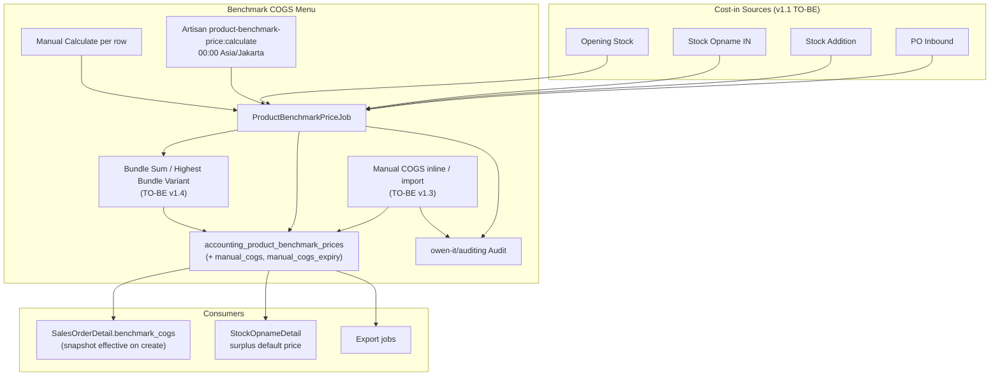

# Benchmark COGS — Technical Documentation

## 0. Metadata & Changelog

| Version | Date | Author | Changes |
|---------|------|--------|---------|
| 1.4 | 2026-09-01 | QA - Yemima | TO-BE Product Bundle: job phases Bundle Sum / Highest Bundle Variant; gate ≠ BOM; GAP-BM-15 · ETM-15688 |
| 1.3 | 2026-08-11 | QA - Yemima | TO-BE Manual COGS: schema, effective COGS, import/inline, job respects override (§3.4, §4.4, §5); GAP-BM-14 |
| 1.2 | 2026-08-11 | QA - Yemima | AS-IS auto-approve uses without-VAT accessors; TO-BE Error Flag Below Benchmark COGS + FX primary (§6.5–§6.6); GAP-BM-13 |
| 1.1 | 2026-07-09 | QA - Yemima | v1.1 source allowlist TO-BE; AS-IS code gap §4.3; pending items cross-ref §13 requirement |
| 1.0 | 2026-07-05 | QA - Yemima | Initial technical — calculation job, API, SO snapshot, gaps |

**Stack:** Laravel 13 · Horizon · Vue 3 · MariaDB  
**Module:** Accounting (+ cross-module reads SupplyChain / OmniChannel)

---

## 1. Architecture Overview


```mermaid
flowchart TB
    subgraph Sources["Cost-in Sources (v1.1 TO-BE)"]
        PO["PO Inbound"]
        SA["Stock Addition"]
        SO_IN["Stock Opname IN"]
        OS["Opening Stock"]
    end

    subgraph Master["Benchmark COGS Menu"]
        CMD["Artisan product-benchmark-price:calculate\n00:00 Asia/Jakarta"]
        MAN["Manual Calculate per row"]
        MANUAL["Manual COGS inline / import\n(TO-BE v1.3)"]
        JOB["ProductBenchmarkPriceJob"]
        BND["Bundle Sum / Highest Bundle Variant\n(TO-BE v1.4)"]
        TBL["accounting_product_benchmark_prices\n(+ manual_cogs, manual_cogs_expiry)"]
        AUD["owen-it/auditing Audit"]
    end

    subgraph Consumers["Consumers"]
        SO["SalesOrderDetail.benchmark_cogs\n(snapshot effective on create)"]
        OP["StockOpnameDetail\nsurplus default price"]
        EXP["Export jobs"]
    end

    PO --> JOB
    SA --> JOB
    SO_IN --> JOB
    OS --> JOB
    CMD --> JOB
    MAN --> JOB
    JOB --> BND
    MANUAL --> TBL
    JOB --> TBL
    BND --> TBL
    JOB --> AUD
    MANUAL --> AUD
    TBL --> SO
    TBL --> OP
    TBL --> EXP
```

---

## 2. Routes & API

### 2.1 Frontend

| Item | Path |
|------|------|
| Route | `/accounting/product-benchmark-price` |
| Component | `olshoperp-frontend/src/pages/Accounting/Report/ProductBenchmarkPrice/Datalist.vue` |
| Calculate Log | `.../ProductBenchmarkPrice/CalculateLog.vue` |
| Menu seeder | `Modules/Gate/Database/Seeders/ModuleMenu/AccountingMenuSeeder.php` |
| Policy class | `Modules\Accounting\Entities\ProductBenchmarkPrice` |

### 2.2 Backend API (`auth:sanctum`, prefix `accounting`)

| Method | Path | Controller | Notes |
|--------|------|------------|-------|
| GET | `/product-benchmark-price` | `index` | Datalist — COGS = **effective** (TO-BE) |
| GET | `/product-benchmark-price/{product}/sync` | `manualCalculate` | Queue job |
| GET | `/product-benchmark-price/calculate-log` | `CalculateLog` | Audit datalist |
| GET | `/product-benchmark-price/export-file` | `exportFile` | Export batch list |
| GET | `/product-benchmark-price/export-progress` | `exportProgress` | Poll |
| GET | `/product-benchmark-price/export-excel` | `exportExcelAll` | Download |
| PATCH/PUT | `/product-benchmark-price/{id}` (TO-BE) | update Manual fields | Inline — Single/Variant only |
| POST | `/product-benchmark-price/import` (TO-BE) | import Manual COGS | Partial success + log |

**Routes file:** `Modules/Accounting/Routes/api.php`  
Pola inline/import: samakan Price List / standar import OlshopERP terbaru.

---

## 3. Database Schema

### 3.1 `accounting_product_benchmark_prices`

**Migration AS-IS:** `Modules/Accounting/Database/Migrations/2026_01_27_130442_create_product_benchmark_prices_table.php`

| Column | Type | Notes |
|--------|------|-------|
| `id` | bigint | PK |
| `product_id` | FK → `scm_products.id` | One row per product |
| `benchmark_price` | decimal(21,4) | AS-IS = calculated; TO-BE = **effective** *atau* keep calculated + expose effective accessor |
| `description` | string nullable | + `Manual Input` when override active |
| `manual_cogs` | decimal(21,4) nullable | **TO-BE** |
| `manual_cogs_expiry` | date nullable | **TO-BE** — interpret EOD **23:59:59 Asia/Jakarta** |
| `status`, `is_all_company`, `owned_by`, `created_by` | | From `baseColumns` |
| timestamps, soft deletes | | |

**Recommended storage:** simpan `manual_cogs` / `manual_cogs_expiry` terpisah; `benchmark_price` (atau accessor `effective_cogs`) = nilai yang dibaca konsumen + UI.

**Model:** `Modules/Accounting/Entities/ProductBenchmarkPrice.php`

- Traits: `ConsoleAuditTrait` (audit on console/queue only) — **extend** agar inline/import UI juga audited
- `transformAudit()` — maps `product_id` → SKU label in audit payload
- `$auditExclude` — skips metadata fields

**Product relation:** `Modules/SupplyChain/Entities/Product::benchmarkPrice()` hasOne

### 3.2 Effective COGS helper (TO-BE)

```
effective =
  manual_cogs IS NOT NULL
  AND (manual_cogs_expiry IS NULL OR now(Asia/Jakarta) <= expiry@23:59:59)
  ? manual_cogs
  : calculated_from_formula
```

Description = `Manual Input` iff effective from manual; else formula labels.

### 3.3 Sales order snapshot

**Migration:** `2023_12_06_145423_create_sales_order_details_table.php`

```php
$table->decimal('benchmark_cogs', 21, 4)->default(0)->comment('Benchmark COGS');
```

Also on `omni_sales_order_detail_randoms` and export temp `sales_order_data_temps.benchmark_cogs`.

**TO-BE:** `handleBenchmarkCogsOnCreating()` harus copy **effective** COGS (bukan rumus mentah jika Manual aktif).

### 3.4 Export tracking

`accounting_product_benchmark_price_export_files` — `ProductBenchmarkPriceExportFile`

---

## 4. Calculation Job

**Class:** `Modules/Accounting/Jobs/ProductBenchmarkPriceJob.php`

### 4.1 Entry points

| Trigger | Caller | Args |
|---------|--------|------|
| Daily 00:00 WIB | `App\Console\Commands\ProductBenchmarkPriceCalculate` | `manualCalculate(null, false)` — all products chunked 100 |
| Manual row | `ProductBenchmarkPriceController@manualCalculate` | `$product_id`, `all_data: false`, scope list parent+variants |

**Schedule:** `app/Console/Kernel.php` — `daily()->at('00:00')->timezone('Asia/Jakarta')`

### 4.2 `processProduct($product_id, ...)` — AS-IS

```
if has variant children:
    exclude random variant from MAX loop
    foreach variant: getBenchmarkPrice → updateOrCreate variant row
    parent row = MAX(variant benchmarks)
    random variant row = parent MAX (if exists)
else:
    single: getBenchmarkPrice → updateOrCreate
```

**AS-IS gap:** tidak ada cabang Product Bundle → header bundle jatuh ke `getBenchmarkPrice` (biasanya 0). Lihat **GAP-BM-15**.

### 4.2b Job phases (TO-BE v1.4) — dependency order

```
1. Calculate non-bundle Single/Variant via getBenchmarkPrice (respect Manual)
2. Resolve non-bundle random = MAX sibling effective (respect Manual)
3. For each Product Bundle header (non-random):
     if Manual active → skip
     else SUM(effective_cogs(component) * qty) → description "Bundle Sum"
4. For each Product Bundle random header:
     if Manual active → skip
     else MAX(sibling non-random header effective) → "Highest Bundle Variant"
5. Parent ProductTree row = MAX(children exclude random) as today
```

**Gate:** hanya SKU **Product Bundle** (non-stockable header). **BOM / `is_bom` assembly** harus tetap path §4.2/`getBenchmarkPrice` — jangan pakai SUM bundle meski tabel struktur shared (`scm_bill_of_materials` / billOfMaterial relation).

**Qty:** baca qty baris detail bundle; wajib `× qty` (bukan asumsi 1).

**Komponen:** pakai **effective** B.COGS komponen (Manual/rumus/random inherit sudah final). Nested bundle sebagai detail: tidak didukung (selaras master).

### 4.3 `getBenchmarkPrice($product_id, $start30DaysAgo, $endToday)`

#### TO-BE (v1.1) — allowlist 4 sumber

Join: `InboundMutationDetail` → `StockMutation` (approved) → `ItemStock`.

Filter sumber — salah satu kondisi berikut (OR):

| # | Sumber | Query hint |
|---|--------|------------|
| 1 | PO Inbound | `purchase_order_detail_id IS NOT NULL` AND `is_inventory_adjustment = 0` |
| 2 | Stock Addition manual | `is_inventory_adjustment = 1` · `supplier_id IS NULL` · `is_return_process = 0` · bukan ref `StockOpname` |
| 3 | Stock Opname IN | `transaction_reference_class = StockOpname` · parent tanpa `OpeningStockCoa` |
| 4 | Opening Stock | `transaction_reference_class = StockOpname` · parent punya `accounting_opening_stock_coas` |

**Step 1 — 30-day highest:** `whereBetween(transaction_date, ...)` → `max(item_stock.each_price_before_vat)`

**Step 2 — Last Inbound** if empty: `transaction_date < start30DaysAgo` → `orderByDesc` → `COALESCE(NULLIF(item_stock.each_price_before_vat,0), inbound.each_price_before_vat)`

**Returns:** `[price, description]`

#### AS-IS (kode per 2026-07-09) — belum allowlist

Filter PO **di-comment** di `ProductBenchmarkPriceJob.php` — semua inbound approved ikut terhitung. Lihat [requirement §13 P-01](./requirement.md#131-fungsi-utama-benchmark-cogs).

### 4.4 Job vs Manual COGS (TO-BE — GAP-BM-14)

Saat override aktif (`manual_cogs` set + not expired):

- Jangan overwrite nilai **efektif** yang ditampilkan / di-snapshot konsumen dengan rumus
- Berlaku juga untuk header Bundle (skip Bundle Sum / Highest Bundle Variant)
- Boleh refresh calculated di kolom terpisah jika diimplementasi
- Prefer jangan bump `updated_at` / COGS Last Updated user-facing hanya karena midnight job

### 4.5 Description strings (TO-BE v1.4)

| Condition | `description` |
|-----------|---------------|
| Tier 1 inbound | `Highest Price` |
| Tier 2 inbound | `Last Inbound` |
| No history | `No Inbound` |
| Manual override | `Manual Input` |
| Bundle SUM | `Bundle Sum` |
| Bundle random header MAX | `Highest Bundle Variant` |

---

## 5. Manual COGS — Inline & Import (TO-BE)

| Concern | Guidance |
|---------|----------|
| Validation | `manual_cogs` ≥ 0 (nullable to clear); expiry date ≥ today EOD or null; product type Single/Variant |
| Inline UX | Mirror Price List editable cells + tooltips (requirement §3.5) |
| Import headers | `SKU Code` \| `Manual COGS` \| `Manual COGS Expiry` |
| Blank Manual on import | Clear override + expiry |
| Partial | Commit valid rows; failed rows only in import log |
| Audit | Set **and** clear must appear in Calculate Log |
| Updated by / COGS Last Updated | Update on inline + import |

**FE:** extend `ProductBenchmarkPrice/Datalist.vue` — columns Manual COGS / Expiry; Parent cells disabled.

---

## 6. Controller Highlights

**File:** `Modules/Accounting/Http/Controllers/ProductBenchmarkPriceController.php`

| Method | Logic |
|--------|-------|
| `indexQuery` | `show_detail` ? all products : join tree `parent_id IS NULL` |
| `index` | datalist columns + `render_sync: true` for Calculate action |
| `manualCalculate` | Build product ID list; dispatch job batch; `sleep(1)` |
| `CalculateLog` | `Audit::where('auditable_type', ProductBenchmarkPrice::class)` |

**Export:** `ProductBenchmarkPriceExportJob` + `ProductBenchmarkPriceExport` class

---

## 7. Sales Order Integration

### 7.1 Snapshot on create

**Files:**

- `Modules/OmniChannel/Entities/SalesOrderDetail.php` — `handleBenchmarkCogsOnCreating()` on `creating`
- `Modules/OmniChannel/Entities/SalesOrderDetailRandom.php` — same pattern

```php
if ($this->benchmark_cogs > 0) return;
if (! $this->product_id) return;
$this->benchmark_cogs = ProductBenchmarkPrice::where('product_id', $this->product_id)->value('benchmark_price');
```

**TO-BE:** resolve **effective** COGS (Manual if active).

### 7.2 Binding update (Platform)

`Modules/OmniChannel/Http/Controllers/ProductController.php` (~3277): On bind → set `product_id` + `benchmark_cogs`.  
Also: `Modules/SupplyChain/Http/Controllers/ProductController.php` (~3900).

### 7.3 Detail update

`SalesOrderDetailController@update` — if `product_id` changes → re-fetch benchmark.

### 7.4 Datalist columns

- `price_before_vat_formatted` / platform `each_price_before_discount_before_vat_so_formatted`
- `benchmark_cogs_formatted` — `unitConverterFromProduct(...)`
- FE: `SalesOrderGeneral/DatalistDetail.vue`, `Omni/SalesOrder/DatalistDetail.vue` — `visible: false`

### 7.5 Auto-approve flag

**File:** `SalesOrderDetailController::updateAutoApproveFlagForSalesOrder()` — AS-IS compares `each_price_without_vat` vs `benchmark_cogs`.  
**TO-BE:** Price Before VAT × rate → primary; skip if COGS 0; strict `<` — requirement §6.4.

**Observer:** `SalesOrderDetailPriceObserver` · header `prevent_auto_approve`.

### 7.6 Error Flag `cogs-error` (TO-BE — GAP-BM-13)

Icon `money-bill-trend-down`, label **Below Benchmark COGS**, header+detail SKU — lihat requirement §6.5.

### 7.7 Export

`SalesOrderGeneralExportAll` / platform export include `benchmark_cogs`; `resolveBenchmarkCogs()` fallback live master if snapshot 0.

---

## 8. Stock Opname, Stock Addition & Opening Stock

### 8.1 Opname surplus fallback

`StockOpnameDetailController` (~579) — `product.benchmarkPrice.benchmark_price`. TO-BE: baca **effective**.

### 8.2 Opname / Opening Stock → addition inbound

Auto `StockMutationAddition` → `InboundMutationDetail.each_price_before_vat` masuk job (v1.1).

### 8.3 Stock Addition manual

User input `each_price_before_vat` setelah approve masuk rantai yang sama.

---

## 9. Frontend File Map

| File | Role |
|------|------|
| `ProductBenchmarkPrice/Datalist.vue` | Columns, Show Detail, Export · TO-BE Manual COGS + import |
| `ProductBenchmarkPrice/CalculateLog.vue` | Audit slideover |
| `DataTables/DataTablesV3.vue` | `is_show_details`, sync action |
| `SalesOrderGeneral/DatalistDetail.vue` | SO General hidden columns |
| `Omni/SalesOrder/DatalistDetail.vue` | SO Platform hidden columns |

---

## 10. Testing Notes

1. Job: `php artisan product-benchmark-price:calculate` + calculate-log
2. 30-day window / Parent MAX / random inherit
3. SO snapshot unchanged after master edit
4. Auto-approve + GAP-BM-13 Error Flag
5. **GAP-BM-14:** permanent / expiry EOD WIB / clear / import partial / Parent reject / job respects override / SO snapshot effective
6. **GAP-BM-15:** Bundle Sum qty×cogs · Highest Bundle Variant · job phase order · Manual skip · BOM not gated as bundle · description labels

---

## 11. Cross-References

| Topic | Doc |
|-------|-----|
| Business rules & AC | [requirement.md](./requirement.md) |
| Operator guide | [knowledge-base.md](./knowledge-base.md) |
| Manual COGS | [requirement.md §3.5](./requirement.md#35-manual-cogs-override-to-be-v13) |
| Product Bundle COGS | [requirement.md §3.6](./requirement.md#36-product-bundle-header-to-be-v14) |
| SO auto-approve | [../sales-order-general/requirement.md §11](../sales-order-general/requirement.md#11-benchmark-cogs--price-before-vat-detail-order) |
| Pending items | [requirement.md §13](./requirement.md#13-hal-yang-perlu-diperhatikan--pending-items) |

---

## Related Documents

| Doc | Path |
|-----|------|
| Requirement | [requirement.md](./requirement.md) |
| Knowledge Base | [knowledge-base.md](./knowledge-base.md) |
