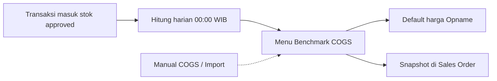
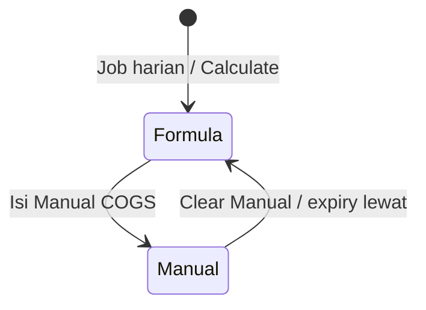

# Benchmark COGS — Panduan Pengguna

**Siapa yang baca:** finance ops, accounting, support  
**Menu di sistem:** Finance Accounting → Report → **Benchmark COGS**  
**Untuk apa:** Memantau **nilai acuan HPP** per produk internal (bukan jurnal stok accounting)

---

## 1. Apa Itu & Kenapa Penting

Benchmark COGS menampilkan **harga pokok acuan** tiap System Product yang dihitung ulang otomatis setiap hari. Nilai ini dipakai sebagai:

1. **Harga default** saat Stock Opname surplus (kalau kamu tidak isi harga manual)  
2. **Acuan margin** di Sales Order — kalau harga jual sebelum pajak di bawah acuan ini, order tidak ikut auto-approve (masih bisa approve manual)  
3. **Monitoring** — lihat COGS per SKU dan riwayat perubahannya

Ini **bukan** HPP di jurnal accounting. Ini acuan operasional supaya harga jual dan opname punya patokan yang sama.

---

## 2. Overview Flow & Proses Bisnis

**Versi teks:**

1. Barang masuk lewat PO inbound, Stock Addition, Opname surplus, atau Opening Stock (yang sudah disetujui).  
2. Setiap hari jam **00:00 WIB** sistem menghitung ulang acuan COGS.  
3. Kamu bisa trigger **Calculate** per baris, atau (setelah fitur live) set **Manual COGS** / import Excel.  
4. Nilai di menu dipakai Opname (default surplus) dan tersimpan sebagai snapshot di detail Sales Order saat order dibuat.

🎬 [Interactive demo akan ditambahkan di sini]

### Bagaimana nilai COGS ditentukan?

| Situasi | Yang muncul di kolom COGS | Description |
|---------|---------------------------|-------------|
| Ada transaksi valid ≤ 30 hari terakhir | Harga **tertinggi** (sebelum pajak) | **Highest Price** |
| Tidak ada di 30 hari, tapi ada history lebih lama | Harga transaksi **terakhir** | **Last Inbound** |
| Belum ada history valid | **0** | **No Inbound** |
| **Manual COGS** terisi dan belum lewat expiry *(TO-BE)* | Nilai Manual | **Manual Input** |

**Sumber transaksi rumus:** Purchase Inbound (PO), Stock Addition, Stock Opname IN, Opening Stock.

### Siklus update (bukan status draft/approve)

| Kondisi | Artinya | Bisa diubah manual? |
|---------|---------|---------------------|
| Hasil rumus | Sistem hitung dari transaksi masuk stok | Calculate ulang · Manual COGS *(TO-BE)* |
| Manual Input *(TO-BE)* | Override aktif | Edit / clear Manual · Import |

---

## 3. Sebelum Mulai (Flow Sebelum)

- [ ] Kamu punya akses menu **Benchmark COGS**.  
- [ ] Produk sudah ada di System Product (Single / Parent / Variant).  
- [ ] Kalau mau cek COGS per varian: siapkan toggle **Show Detail**.  
- [ ] Untuk override manual *(setelah fitur live)*: siapkan nilai COGS dan (opsional) tanggal expiry **DD-MM-YYYY**.  
- [ ] Untuk import massal *(TO-BE)*: siapkan Excel 3 kolom — **SKU Code**, **Manual COGS**, **Manual COGS Expiry**.

🎬 [Interactive demo akan ditambahkan di sini]

---

## 4. Setelah Selesai (Flow Sesudah)

Setelah nilai COGS di menu ter-update:

1. **Sales Order baru** menyimpan snapshot COGS saat baris dibuat — mengubah master **tidak** mengubah order lama.  
2. **Stock Opname** surplus tanpa harga manual memakai nilai dari menu ini.  
3. Order yang harga jualnya di bawah snapshot Benchmark bisa tampil flag **Below Benchmark COGS** dan tidak ikut auto-approve *(perbaikan flag sedang TO-BE)*.

🎬 [Interactive demo akan ditambahkan di sini]

---

## 5. Yang Perlu Diperhatikan

Kalau kamu … maka …

- **Mengosongkan Manual COGS Expiry** → override **permanen** sampai Manual COGS dikosongkan (bukan “kembali ke rumus otomatis”).  
- **Mengisi expiry (tanggal)** → Manual berlaku sampai **akhir hari itu (23:59:59 WIB)**; setelah itu kembali ke rumus.  
- **Mengosongkan Manual COGS** → langsung kembali ke rumus, tanpa tunggu expiry.  
- **Mengisi Manual COGS = 0** → diterima — artinya kamu sengaja set acuan 0.  
- **Mengisi Manual COGS negatif** → sistem menolak.  
- **Mengedit Manual di Parent** → tidak bisa; hanya **Single** dan **Variant**. Import baris Parent gagal; baris lain yang valid tetap masuk.  
- **Menunggu job harian saat Manual masih aktif** → kolom COGS efektif **tetap Manual** (sistem tidak menimpa override).  
- **Mengubah COGS di menu setelah Sales Order dibuat** → angka Benchmark di order **tidak berubah** (sudah di-snapshot).  
- **Opname surplus tanpa isi harga** → harga default = COGS menu ini; transaksi itu bisa ikut mempengaruhi hitungan berikutnya.

---

## 6. Langkah-Langkah (Step by Step)

### A. Membuka & membaca daftar

1. Buka **Finance Accounting → Report → Benchmark COGS**.  
2. Baca kolom **COGS** dan **Description**.  
3. Matikan/nyalakan **Show Detail**: Off = Single + Parent; On = termasuk Variant.  
4. Pakai filter / SearchBuilder bila perlu SKU tertentu.  
5. **Export All** jika butuh Excel seluruh hasil filter.

### B. Calculate ulang satu SKU

1. Cari baris produk.  
2. Klik aksi **Calculate** (icon sync).  
3. Tunggu beberapa detik, lalu **refresh** halaman — proses berjalan di background.  
4. Cek **Calculate Log** di toolbar untuk riwayat nilai lama → baru.

### C. Manual COGS *(TO-BE — setelah fitur live)*

1. Pastikan baris **Single** atau **Variant** (buka Show Detail bila perlu).  
2. Isi **Manual COGS** (boleh 0).  
3. Opsional: isi **Manual COGS Expiry** (DD-MM-YYYY). Kosongkan expiry jika override ingin permanen.  
4. Pastikan **Description** jadi **Manual Input** dan kolom **COGS** = nilai Manual.  
5. Untuk kembali ke rumus: kosongkan Manual COGS.  
6. Import massal: unduh template → isi 3 kolom → upload; baris gagal hanya di log import (partial success).

🎬 [Interactive demo akan ditambahkan di sini]

---

## 7. Tips & Hal yang Sering Bikin Bingung

**COGS = 0 dan Description No Inbound**  
Belum ada transaksi masuk stok valid. Pastikan PO / Addition / Opname IN / Opening Stock sudah disetujui.

**COGS = 0 tapi Description Manual Input**  
Kamu (atau import) set Manual = 0 dengan sengaja. Kosongkan Manual jika ingin rumus.

**Baru ada inbound, COGS belum berubah**  
Job harian belum jalan, atau Manual override masih aktif. Klik **Calculate**, lalu cek kolom Manual.

**Parent COGS beda dari satu variant**  
Parent = nilai **tertinggi** dari seluruh variant (bukan rata-rata). Nyalakan Show Detail untuk bandingkan.

**Tidak bisa edit Manual di Parent**  
By design. Edit di Variant, atau biarkan Parent mengikuti MAX variant.

**Contoh cepat Manual COGS**

| Situasi | Manual | Expiry | Hasil di COGS |
|---------|--------|--------|----------------|
| Override tetap | 15000 | (kosong) | 15000 · Manual Input |
| Sampai akhir tahun | 0 | 31-12-2026 | 0 · Manual Input |
| Kembali ke rumus | (dikosongkan) | — | Highest Price / Last Inbound / No Inbound |

**Order kena Below Benchmark COGS**  
Harga jual sebelum pajak (setara mata uang utama) di bawah snapshot Benchmark di baris order. Naikkan harga atau approve manual.

**Ini sama dengan HPP di jurnal?**  
Tidak. Ini acuan operasional saja.

---

## 8. Referensi

| Butuh | Buka |
|-------|------|
| Aturan lengkap + acceptance | [requirement.md](./requirement.md) |
| SOP operator / troubleshooting | [knowledge-base.md](./knowledge-base.md) |
| API, job, schema (developer) | [technical.md](./technical.md) |
| Manual COGS detail | [requirement §3.5](./requirement.md#35-manual-cogs-override-to-be-v13) |
| Index menu | [README.md](./README.md) |
