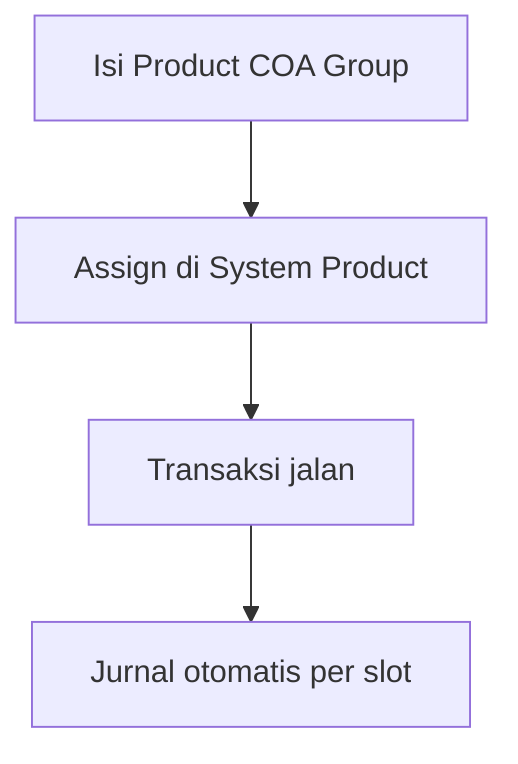

# Product COA Group — Knowledge Base

> **Audience:** Finance / Accounting. **Route:** `/accounting/product-coa-group`

---

## 1. Apa itu?

**Product COA Group** = **setelan akun otomatis per jenis produk** (Purchased, Manufactured, Service, Fix Asset). Kamu isi slot akun sekali; produk yang memakai group ini memakai akun itu saat transaksi di-approve (jual, beli, gudang, assembly, dll.).

---

## 2. Glosarium

| Istilah | Arti awam |
|---------|-----------|
| **Slot Transaction COA** | Kolom akun yang harus diisi sesuai tipe produk |
| **Unbilled Goods** | Utang sementara ke supplier sebelum ada tagihan |
| **WIP** | Nilai barang sedang diproduksi |
| **Return Expense** | Akun biaya barang hilang (Lost Items) |
| **COA leaf** | Akun paling bawah (bukan kelompok parent) |
| **Default** | Group otomatis terpilih saat create System Product baru |

---

## 3. Cara pakai

1. **Create** → pilih Type → isi semua slot wajib (tanda required).  
2. **Return Expense** boleh kosong di form — **isi kalau** produk bisa masuk Failed Ship / Sales Return Lost Items.  
3. Set **Default** bila ini template utama company (hanya **satu** Default untuk semua tipe).  
4. Di **System Product**, pilih group ini (untuk PARENT: sekali di header, berlaku semua variant).  
5. Edit group yang sudah dipakai → sistem sync ulang ke produk (bisa ada delay).

**Jangan** cari daftar produk di form ini — binding hanya dari System Product.

---

## 4. Troubleshooting

| Gejala | Solusi |
|--------|--------|
| Approve SI/OB/Inbound: Configure … COA | Lengkapi slot yang disebut di group SKU |
| Failed Ship gagal Return Expense | Isi Return Expense meski sempat dikosongkan |
| Tidak bisa Delete / Inactive | Masih dipakai Product atau sedang Default |
| Service/Fix Asset ditolak di Opname | Normal — tipe itu tanpa Inventory |
| Export hanya baris di layar | Basic export — filter dulu lalu export |

---

## 5. FAQ

**Q: Pajak PPN di mana?**  
A: Di menu **Tax**, bukan di Product COA Group.

**Q: Hutang supplier dari slot mana?**  
A: Dari setting Supplier / Company Accounting — Unbilled di group hanya “utang sementara” sebelum PI.

---

## Related Documents

| Doc | Path |
|-----|------|
| Requirement | [requirement.md](./requirement.md) |
| Technical | [technical.md](./technical.md) |
| User Guide | [user-guide.md](./user-guide.md) |
