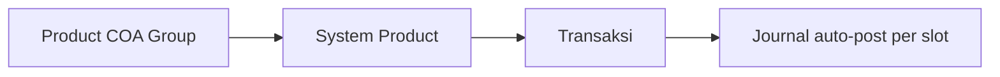
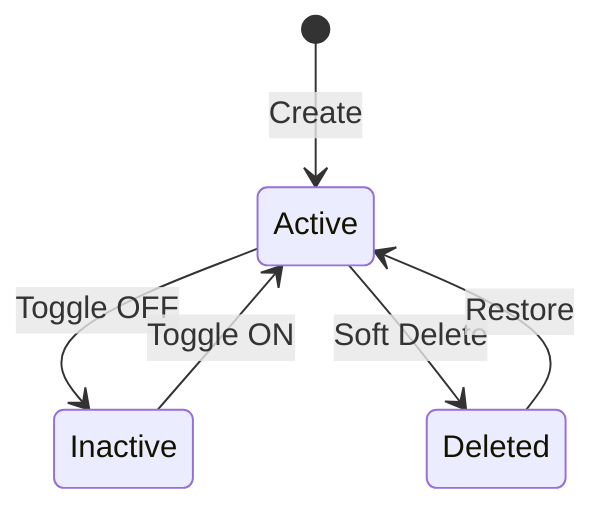

# Product COA Group — Requirement Documentation

**Modul:** Finance Accounting → Master  
**UI route:** `/accounting/product-coa-group`  
**API prefix:** `accounting/product-coa-group`  
**Audience:** PM, Finance/Accounting, QA, Developer  
**PM source:** Product COA Group Source of Truth **v1.0** (5 Agustus 2026)

> AS-IS diverifikasi 5 Agu 2026 (`ProductCoaGroupController`, `JournalProcess`, FE Form/DataList).

---

## 0. Metadata & Changelog

| Version | Date | Author | Changes |
|---------|------|--------|---------|
| 2.0 | 2026-08-05 | QA - Yemima | Full rewrite dari SoT v1.0; slot per Type; journal how-it-works; Gap `GAP-PCG-01..05`; Default = **1 per company** (bukan per Type) |
| 1.3 | 2026-08-04 | QA - Yemima | Draft TO-BE Cash/Bank (digantikan) |

---

## 1. Ringkasan Eksekutif

**Product COA Group** adalah template mapping akun (COA) per tipe System Product: **Purchased Item**, **Manufactured Item**, **Service**, **Fix Asset**. Slot Transaction COA (Sales, Inventory, COGS, WIP, …) diikat ke COA leaf. Saat System Product di-assign ke group, konfigurasi disalin ke identitas akun produk (`ProductAccounting`) dan dipakai auto-journal di SO/SI/PO/Inbound/Outbound/Opname/Assembly/Addition/Deduction/Failed Ship/Sales Return/Purchase Return, dll.

Audience: Finance yang menyiapkan setup akun sebelum modul transaksi dipakai.

---

## 2. Prasyarat

| Prasyarat | Sumber | Catatan |
|-----------|--------|---------|
| COA leaf (class sesuai slot) | Chart of Account | Bukan parent; bukan Default Current P/L |
| System Product | System Product | Assign group di **Product**, bukan di form PCG. PARENT: group di level header/variant — **satu group untuk semua variant** |
| Supplier AP | Company Accounting / General Company | Lawan Unbilled Goods di PI — **bukan** dari PCG |
| Tax | Master Tax | PPN terpisah — PCG **tidak** simpan akun pajak |

---

## 3. Siklus status

| Status | Editable? | Catatan |
|--------|-----------|---------|
| Active | Ya | Bisa assign & Default |
| Inactive | Ya | Tidak untuk assign baru; **Default tidak boleh Inactive** |
| Deleted | Read-only | Syarat: tidak dipakai Product aktif & bukan Default |

Setiap **Edit Save** → job async re-sync akun ke semua Product terikat (banner di form). Ubah Type dari/ke Fix Asset ditolak jika group dipakai di Sales Order.

---

## 4. Datalist

| Fitur | Perilaku |
|-------|----------|
| Global Search | Lintas kolom |
| Create / Show Deleted / Column Show-Hide | Standar |
| Export | **Basic** — data tampil di halaman (bukan Advanced builder) |
| Bulk Delete | Multi-checkbox |

Kolom: Code, Name, Type, Default, Active, Created By\|At, Action.

---

## 5. Form & field

### 5.1 Basic Information

| Field | Wajib | Catatan |
|-------|-------|---------|
| Code | Ya | Unique per company |
| Name | Ya | Unique per company (AS-IS) |
| Type | Ya | Purchased / Manufactured / Service / Fix Asset — menentukan slot |
| Description | Tidak | Max 150 |
| Set as Default System Product | Tidak | **AS-IS: 1 default tunggal per company** (clear semua default lain) — bukan 4 default per Type |
| Active | Tidak | Default ON |

### 5.2 COA Binding — slot per Type

Semua slot: leaf only; bukan Current P/L. **Purchase Return** ada di master list tapi **hidden** di form (GAP-PCG-01).

| Slot | Purchased | Manufactured | Service | Fix Asset | Filter class (ringkas) |
|------|-----------|--------------|---------|-----------|------------------------|
| Sales | Wajib | Wajib | Wajib | — | Revenue / Other Rev&Exp / Equity |
| Sales Return | Wajib | Wajib | Wajib | — | sama Sales — **pemakaian journal belum ditemukan** (§6.2) |
| COGS | Wajib | Wajib | Wajib | — | Expense, COGS |
| Inventory | Wajib | Wajib | — | — | Assets |
| Operational Expense | Wajib | Wajib | Wajib | — | Exp/COGS atau Exp/Equity (Service) |
| Inventory Adjustment | Wajib | Wajib | — | — | Expense, Equity |
| Return Inventory | Wajib | Wajib | — | — | Expense, Assets |
| Unbilled Goods | Wajib | Wajib | Wajib | Wajib | Assets, Liabilities |
| Return Expense | Opsional* | Opsional* | — | — | Expense, COGS |
| Work In Progress | Wajib | Wajib | — | — | Assets |
| Assets | — | — | — | Wajib | Assets |
| Depreciation / Accum / Profit Disposal | — | — | — | Wajib | Passiva / Revenue — **belum dipakai JournalProcess** (GAP-PCG-04) |

\*Opsional di form; **wajib praktik** untuk Lost Items (GAP-PCG-05).

---

## 6. How It Works (journal)

| Slot / area | Ringkas |
|-------------|---------|
| **Sales** | Kredit SI (value = DPP). Coefficient ON: UI boleh tampil DPP 12%; **journal pakai DPP effective 11%** agar balance (GAP-PCG-02 vs Tax SoT) |
| **Sales Return** (slot) | Wajib di form; journal Sales Return invoice memakai slot **Sales** — slot ini belum terpakai di `JournalProcess` |
| **COGS** | Debit Outbound refer SO; credit Inventory (atau Return Inventory jika OB terkait Sales Return) |
| **Inventory** | Debit Inbound/Assembly inbound; Credit Outbound (order/others/assembly komponen) |
| **Operational Expense** | Debit Outbound Others |
| **Inventory Adjustment** | Opname/Deduction: Dr Adj / Cr Inventory; Addition: arah terbalik (Dr Inventory / Cr Adj) — pola AS-IS adjustment flag |
| **Return Inventory** | Credit inventory khusus OB Sales Return |
| **Unbilled Goods** | Credit di Inbound; reverse Debit di PI + Credit AP (AP dari Supplier, bukan PCG) |
| **Return Expense** | Lost Items (Failed Ship / Sales Return → Stock Deduction): Dr Return Expense / Cr Inventory |
| **WIP** | Assembly: Dr WIP / Cr Inv (outbound komponen); Dr Inv / Cr WIP (inbound FG) |
| **Fix Asset** | Inbound: Dr Assets / Cr Unbilled; depresiasi slots deferred |

---

## 7. Validasi

### 7.1 Header

| Rule | Behavior |
|------|----------|
| Code, Name unique | Required |
| Default + Inactive | `Default Product COA Group cannot be inactive.` |
| Clear last default | Minimal 1 default aktif per company |
| Type ↔ Fix Asset | Ditolak jika dipakai Sales Order |

### 7.2 Binding

| Rule | Behavior |
|------|----------|
| Slot wajib kosong | 422 + field errors + “(and N more errors)” |
| COA missing/inactive | `COA not found.` |
| Current P/L | `COA has been set as Default Current Profit/Loss` |
| Cash/Bank exclusion | **Belum** — GAP-PCG-03 |

### 7.3 Delete

Ditolak jika dipakai Product atau adalah Default.

### 7.4 Efek transaksi

| Kondisi | Behavior |
|---------|----------|
| Slot wajib kosong di SKU | Approve gagal — `Please Configure "… COA" for this Product` |
| Return Expense kosong + Lost Items | Approve diblok |
| Service/Fix Asset di Opname/Addition/Deduction/Remapping | Diblok (tidak punya Inventory + Adj) |

---

## 8. Relasi menu

| Menu | Peran |
|------|-------|
| System Product | Assign group |
| SI / OB / Inbound / PI / Assembly / Opname / Remapping | Baca slot via `product_coa_name` |
| Instant Settlement | Retry journal pakai mapping **terkini** (bukan snapshot gagal pertama) |
| Failed Ship / Sales Return | Lost Items → Return Expense |
| Tax | Akun PPN terpisah |
| General Company | AP lawan Unbilled |

---

## 9. Acceptance Criteria

| ID | Kriteria |
|----|----------|
| PCG-01 | Slot wajib sesuai Type; Return Expense boleh kosong di form |
| PCG-02 | 1 Default per company; Default tidak boleh Inactive |
| PCG-03 | Edit → async sync ProductAccounting |
| PCG-04 | Journal Sales (coefficient) pakai DPP effective 11% |
| PCG-05 | Gap registry terdokumentasi |

---

## 10. FAQ

**Q: Bind product dari form PCG?**  
A: Tidak — dari System Product.

**Q: Approve gagal Configure COA?**  
A: Lengkapi slot di group SKU.

**Q: Return Expense kosong lalu Failed Ship gagal?**  
A: Wajib untuk Lost Items meski opsional di form.

**Q: Edit group yang dipakai banyak produk?**  
A: Re-sync background ke semua produk terikat.

**Q: Export hanya data di layar?**  
A: Basic export by design.

---

## 11. Gap Registry

| ID | Deskripsi | Status |
|----|-----------|--------|
| GAP-PCG-01 | Slot Purchase Return hidden; sumber journal PR tidak jelas | Open |
| GAP-PCG-02 | Journal Sales/PI value = DPP 11% (coefficient) vs Tax SoT wording UI 12% — perlu sync Tax docs | Open |
| GAP-PCG-03 | Exclude Cash/Bank dari picker belum live | In Progress |
| GAP-PCG-04 | Depreciation / Accum / Profit Disposal belum di JournalProcess | Deferred |
| GAP-PCG-05 | Return Expense opsional di form, wajib di Lost Items | Open |

---

## Related Documents

| Doc | Path |
|-----|------|
| Knowledge Base | [knowledge-base.md](./knowledge-base.md) |
| Technical | [technical.md](./technical.md) |
| User Guide | [user-guide.md](./user-guide.md) |
| Tax | [../accounting-tax/requirement.md](../accounting-tax/requirement.md) |
