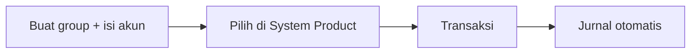

# Panduan Pengguna — Product COA Group

**Siapa yang baca:** tim Finance / Accounting  
**Menu:** Finance Accounting → Master → Product COA Group  
**Route:** `/accounting/product-coa-group`

---

## 1. Apa Itu & Kenapa Penting

**Product COA Group** adalah template akun untuk tiap jenis produk. Setelah dihubungkan ke System Product, sistem memakai akun ini otomatis saat menjurnal penjualan, pembelian, gudang, assembly, dan sejenisnya.

Tanpa group yang lengkap, approve transaksi sering gagal dengan pesan “Please Configure … COA”.

---

## 2. Overview Flow & Proses Bisnis

**Versi teks:**

1. Buat Product COA Group sesuai tipe produk.  
2. Isi semua akun wajib.  
3. Assign group di System Product.  
4. Jalankan transaksi — jurnal terbentuk dari slot yang sudah diisi.

### Status

| Status | Arti |
|--------|------|
| Active | Bisa dipakai & dijadikan Default |
| Inactive | Tidak untuk produk baru; Default tidak boleh Inactive |
| Deleted | Soft delete — restore bila perlu |

---

## 3. Sebelum Mulai

- Chart of Account leaf sudah siap (bukan akun induk).  
- Jangan pakai akun Current Profit/Loss.  
- Tahu tipe produk: Purchased, Manufactured, Service, atau Fix Asset.  
- Untuk barang yang bisa “hilang” di Failed Ship / Sales Return: siapkan juga **Return Expense**.

🎬 [Interactive demo akan ditambahkan di sini]

---

## 4. Setelah Selesai

- Group Active; slot wajib terisi.  
- System Product menunjuk group yang benar.  
- Uji approve satu transaksi sampel tanpa error Configure COA.

---

## 5. Yang Perlu Diperhatikan

- Binding produk **hanya** dari menu System Product.  
- Hanya **satu Default** untuk seluruh company (bukan satu per tipe).  
- Edit group → sync ke semua produk terikat (bisa delay).  
- Return Expense boleh kosong saat create, tapi **wajib** sebelum Lost Items.  
- Service / Fix Asset tidak dipakai di Stock Opname / Deduction.  
- Export hanya data yang tampil di daftar.  
- Akun pajak (PPN) di menu Tax; hutang supplier dari setting supplier.

---

## 6. Langkah-Langkah

1. Buka **Product COA Group** → Create.  
2. Pilih Type → isi Code, Name, slot akun.  
3. (Opsional) Set Default → Save.  
4. Di System Product, pilih group.  
5. Uji transaksi terkait.

🎬 [Interactive demo akan ditambahkan di sini]

---

## 7. Tips & Hal yang Sering Bikin Bingung

- **"Configure Sales/Inventory COA."** Buka group SKU → lengkapi slot.  
- **"Return Expense not configured."** Isi Return Expense di group.  
- **"Tidak bisa hapus."** Lepas dari produk / ganti Default dulu.  
- **"Kenapa Fix Asset banyak field depresiasi?"** Belum aktif di jurnal — setup untuk pengembangan nanti.

---

## 8. Referensi

| Sumber | Untuk apa |
|--------|-----------|
| [Knowledge Base](./knowledge-base.md) | Troubleshooting |
| [Requirement](./requirement.md) | Slot & validasi |
| [Technical](./technical.md) | Developer |
| [Tax](../accounting-tax/README.md) | Akun PPN |
| [System Product](../system-product/README.md) | Assign group |
