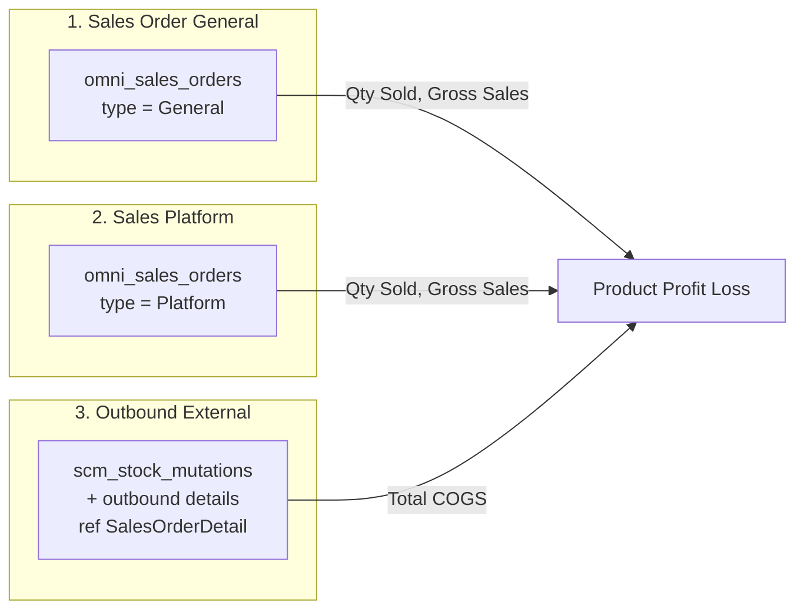

# Product Profit Loss — Requirement Documentation

> **DRAFT** — Konsolidasi requirement bisnis (23 Juni 2026) + verifikasi AS-IS codebase (29 Juni 2026). Belum final review QA/PM.

**Modul:** Accounting  
**Menu UI:** FA → Report → Product Profit Loss (`/accounting/product-profit-loss`)  
**Audience:** PM, QA, Support, Developer

---

## 0. Metadata & Changelog

| Version | Date | Author | Changes |
|---------|------|--------|---------|
| 1.0 | 2026-06-23 | QA - Yemima | Requirement bisnis awal (sumber: diskusi Finance) |
| 1.1 | 2026-06-29 | QA - Yemima | Verifikasi codebase; tambah AS-IS vs TO-BE; gap analysis; section import (N/A) |
| 1.2 | 2026-06-29 | QA - Yemima | Roadmap gap (G-01/02 dev, G-03/06/11 AS-IS); penjelasan `wh_process_id` |
| 1.3 | 2026-06-29 | QA - Yemima | Related menus: Sales Order, Sales Platform, Outbound — peran & fungsi |

**Sumber requirement bisnis:** `product_profit_loss_requirement.md` (internal, 23 Juni 2026)

---

## 1. Ringkasan Eksekutif

**Product Profit Loss** adalah menu **reporting read-only** yang menampilkan analisis profit & loss **per Product (SKU)** — qty terjual, gross sales, COGS (HPP), net profit, dan margin — untuk periode tertentu.

Data diagregasi dari **Sales Order** (General & Platform) dan **Outbound** (approved, ber-referensi order detail). Hasil perhitungan disimpan sementara di tabel snapshot `accounting_product_profit_losses`, di-generate **on-demand** saat user membuka menu / mengubah periode, lalu dibersihkan oleh scheduler **hourly** (bukan job refresh otomatis setiap jam).

**Tidak ada fitur import file** (Excel/CSV per marketplace) di menu ini — lihat [§8 Import](#8-import--tidak-berlaku-n-a).

---

## 2. Pemetaan Istilah Bisnis → Sistem

| Istilah Finance (awal) | Kolom UI / DB |
|------------------------|---------------|
| Jumlah Penjualan | **Qty Sold** (`total_qty_sold`) |
| Satuan Produk | **Primary Unit** (`product_unit`) |
| Jumlah Penjualan Kotor | **Gross Sales** (`total_gross_sales`) |
| Total HPP | **Total COGS** (`total_hpp`) |
| Jumlah Penjualan Bersih | **Net Profit** (`total_net_sales`) |
| Prosentase Keuntungan | **Profit Margin (%)** (`profit_percentage`) |
| Harga Jual Rata-rata | **Avg. Selling Price** (`avg_selling_price`) |
| Harga Beli Rata-rata | **Avg. Buying Price** (`avg_buying_price`) |

Mata uang tampilan: **IDR** (primary currency via `CurrencyProcess::getPrimaryCurrencyRow()`).

---

## 3. Acceptance Criteria

### 3.1 TO-BE (Requirement Bisnis)

| ID | Kriteria | Sumber |
|----|----------|--------|
| A-01 | Period maks. 3 bulan; default 3 bulan terakhir | Req §3.1 |
| A-02 | Category dari Master Category Product **Active** | Req §3.2 |
| A-03 | Variant Status: All / Non-Random / Random | Req §3.3 |
| A-04 | Global Search seluruh konteks datatable | Req §4.1 |
| A-05 | Advanced Filter (SearchBuilder) semua kolom | Req §4.2 |
| A-06 | Column Show/Hide | Req §4.3 |
| A-07 | Export filtered & export all | Req §4.4 |
| A-08 | Formula kolom sesuai §5 requirement | Req §5 |
| A-09 | Modal detail 14 kolom audit (§6.2) | Req §6 |
| A-10 | Order Approved/Processed eligible | Req §7 |
| A-11 | COGS = 0 jika belum Outbound Approved | Req §7.2 |
| A-12 | Bundle → value ke komponen | Req §8 |
| A-13 | SKU Random tidak muncul sampai Send to Default Waves | Req §9 |
| A-14 | Snapshot refresh otomatis tiap 1 jam | Req §10 |

### 3.2 AS-IS (Codebase — status implementasi)

| ID | Kriteria | Status | Catatan |
|----|----------|--------|---------|
| A-01 | Period maks. 3 bulan | ✅ | FE validasi 93 hari; BE `normalizeDatePeriod()` clamp 3 bulan |
| A-02 | Category Active only | ⚠️ | API `supplychain/item-categories/select2/item` — tidak difilter eksplisit di FE; verifikasi endpoint |
| A-03 | Variant Status 3 opsi | ✅ | Filter `variant_status` di `reportQuery()` & `orders()` |
| A-04 | Global Search | ✅ | DataTables global search + `filterColumn` per kolom di controller |
| A-05 | Advanced Filter SearchBuilder | ❌ | `advanced_filter="false"` di `DataList.vue` |
| A-06 | Column Show/Hide | ✅ | Standar DataTablesV3 |
| A-07 | Export | ⚠️ | Opsi **All** + **This Page Only**; filter period/category ikut via `applyFilters` |
| A-08 | Formula kolom | ✅ | Lihat [technical.md §6](./technical.md) |
| A-09 | Modal 14 kolom | ❌ | AS-IS hanya 6 kolom — lihat [§7 Gap](#7-known-gaps--open-questions) |
| A-10 | Order Approved/Processed | ✅ | `TS_APPROVED`, `TS_PROCESSED` |
| A-11 | COGS = 0 tanpa Outbound | ✅ | `generateDailyData()` |
| A-12 | Bundle → komponen | ✅ | `applySalesDetailRowFilter()` exclude bundle parent |
| A-13 | SKU Random | ✅ | Exclude variant `like '%random%'` + random child rows saat generate |
| A-14 | Refresh tiap 1 jam | ⚠️ | **AS-IS by design** — cleanup hourly + lazy regenerate; lihat [§7.1](#71-keputusan-desain-as-is) |

**Aturan AS-IS (dokumentasi resmi):**

| ID | Rule AS-IS | Lokasi |
|----|------------|--------|
| A-15 | Order wajib punya `wh_process_id` NOT NULL | `generateDailyData()` — lihat [§5.2](#52-aturan-wh_process_id-warehouse-process) |
| A-16 | Profit Margin = 0 jika Gross Sales = 0 | Hindari division by zero |
| A-17 | Tombol **Refresh Data** manual (`refresh=1`) | Hapus snapshot periode & queue ulang job |

---

## 4. Validasi & Rules

| ID | Rule | Trigger | Pesan / Perilaku AS-IS |
|----|------|---------|-------------------------|
| V-01 | Period maks. 3 bulan | Ubah date picker | FE: `"The maximum period is 3 months."` |
| V-02 | End date tidak boleh > hari ini | BE `normalizeDatePeriod()` | Clamp ke today |
| V-03 | Period format | `datePeriod=start,end` (comma) | Query param ke API index |
| V-04 | Category multi-select | `category_ids` comma-separated | Filter `scm_products.category_id` |
| V-05 | Variant Status | `variant_status`: `''`, `non_random`, `random` | Lihat [technical.md §6.3](./technical.md) |
| V-06 | Company scope | Sanctum token `company_id` | `owned_by` pada snapshot |
| V-07 | Auth | `auth:sanctum`, `auth_verified` | Semua route API |
| V-08 | Permission | `ProductProfitLossPolicy` / Gate menu class | Sidebar + API policy |

### 4.1 Filter Period (detail)

| Aspek | Requirement | AS-IS |
|-------|-------------|-------|
| Format | Date range `dd-MM-yyyy` | VueDatePicker `yyyy-MM-dd` model |
| Default | 3 bulan terakhir | `created()`: today − 3 months → today |
| Max range | 3 bulan | FE: 93 hari; BE: `subMonthsNoOverflow(3)` |
| Waktu | 00:00:00 – 23:59:59 | BE filter `whereDate(so.transaction_date, $date)` per hari |

### 4.2 Filter Category

| Aspek | AS-IS |
|-------|-------|
| Sumber | `GET supplychain/item-categories/select2/item` |
| UI | PrimeVue MultiSelect, placeholder "All Categories" |
| Kosong | Semua kategori |

### 4.3 Filter Variant Status

| Opsi UI | Value API | Perilaku AS-IS |
|---------|-----------|----------------|
| All Variant Status | `''` (null) | Semua baris snapshot |
| Non-Random | `non_random` | Exclude baris yang punya `omni_sales_order_details.so_detail_random_id` |
| Random | `random` | Hanya baris dengan `so_detail_random_id` NOT NULL |

> **Catatan:** Saat **generate** snapshot, baris dengan variant master `option LIKE '%random%'` dan bundle parent **sudah di-exclude**. Filter Variant Status berlaku pada data yang **sudah ada** di snapshot (mis. membedakan baris hasil konversi random vs non-random).

---

## 5. Fitur & Behavior

| ID | Fitur | Trigger | Expected (AS-IS) |
|----|-------|---------|------------------|
| F-01 | Period picker | VueDatePicker range | Reload datatable |
| F-02 | Category filter | MultiSelect change | Reload datatable |
| F-03 | Variant Status | Select change | Reload datatable |
| F-04 | **Refresh Data** | Button click | `refresh=1` → hapus snapshot periode → queue batch job per hari |
| F-05 | Loading overlay | `is_calculating=true` dari API | Overlay + progress bar; polling `check-status` tiap 5 detik |
| F-06 | Datalist agregat per SKU | GET index | Group by `product_id` dari snapshot |
| F-07 | **Detail Orders** | Link di kolom Action | Modal dialog + datatable order per SKU |
| F-08 | Export Excel | Export slider | Async job; history di tab export file |
| F-09 | Global search | DataTables search box | Search semua kolom ter-format |
| F-10 | Column filter | `filter_column=true` | Filter per kolom header (bukan SearchBuilder panel) |
| F-11 | SKU link | Klik SKU di datalist | Buka `/supplychain/product/edit/{id}` tab baru |
| F-12 | SO link di modal | Klik SO Code | Buka `/businessdevelopment/all-sales-order/edit/{id}` |

### 5.1 Kolom Datalist & Formula (AS-IS = Requirement)

| Kolom | Formula / Sumber (verified code) |
|-------|----------------------------------|
| Product SKU / Name | `product_sku`, `product_name` dari snapshot |
| Qty Sold | `SUM(sod.sales_order_quantity_in_base_unit) / stock_conversion_rate` per SO+product, lalu `SUM` per SKU |
| Primary Unit | `scm_units.code` dari `p.stock_unit_id` |
| Gross Sales | `each_price` (atau before discount) × discount% × VAT rule × qty × `exchange_rate`; **tanpa** additional discount summary order |
| Total COGS | Outbound approved: `somd.outbound_quantity_in_base_unit × sis.each_price_before_vat`, proporsional ke primary unit |
| Net Profit | Gross Sales − Total COGS |
| Profit Margin (%) | `(Net Profit / Gross Sales) × 100`; jika Gross Sales = 0 → 0 |
| Avg. Selling Price | Gross Sales / Qty Sold |
| Avg. Buying Price | Total COGS / Qty Sold |

### 5.2 Aturan `wh_process_id` (Warehouse Process)

> **Bukan gap** — perilaku sengaja diimplementasi di codebase. Requirement bisnis awal tidak menyebut eksplisit, tetapi selaras dengan aturan SKU Random & alur fulfillment.

#### Apa itu `wh_process_id`?

Kolom `wh_process_id` pada `omni_sales_orders` adalah FK ke **Warehouse Process** (gudang proses / *Building Process* — area fulfillment tempat order diproses: wave, picking, outbound).

| Aspek | Detail |
|-------|--------|
| Kolom DB | `omni_sales_orders.wh_process_id` → `scm_warehouses.id` |
| Label UI (SO) | **Warehouse Process** / Building Process |
| Sumber default | `omni_stores.warehouse_process_id` saat SO dibuat dari store |
| Di-set saat wave | `WaveService` mengisi `wh_process_id` ketika order **Send to Default Waves** (bersamaan dengan pembuatan picklist) |

#### Mengapa Product Profit Loss memfilter `wh_process_id IS NOT NULL`?

Query `generateDailyData()` hanya mengambil order yang **sudah terikat ke gudang proses fulfillment**. Order yang statusnya Approved/Processed tetapi `wh_process_id` masih **NULL** **tidak masuk** laporan.

| Tujuan bisnis (interpretasi dari implementasi) | Penjelasan |
|------------------------------------------------|------------|
| Hanya penjualan yang sudah masuk jalur gudang | Order tanpa WH Process dianggap belum siap dihitung dalam konteks fulfillment & COGS |
| Konsistensi dengan SKU Random | Proses **Send to Default Waves** mengisi `wh_process_id` sekaligus mengonversi SKU Random → SKU riil; order random yang belum wave biasanya juga belum punya `wh_process_id` |
| Kualitas data COGS | Outbound terkait order biasanya mengikuti alur setelah order masuk warehouse process |

#### Kapan order **tidak** muncul karena `wh_process_id`?

| Kondisi order | Masuk laporan? |
|---------------|----------------|
| Approved/Processed + `wh_process_id` terisi | ✅ (jika rule lain terpenuhi) |
| Approved/Processed + `wh_process_id` NULL | ❌ |
| Sudah Send to Default Waves (WH Process ter-set) | ✅ |

#### Implikasi untuk operator / Finance

- Jika order Approved terlihat di SO tetapi **tidak** di Product Profit Loss, cek apakah **Warehouse Process** sudah ter-assign di header SO atau order sudah melalui **Send to Default Waves**.
- Ini **bukan bug** — filter teknis yang memisahkan order “belum masuk fulfillment” dari order yang siap dianalisis P/L per SKU.

#### Referensi codebase

- Filter: `ProductProfitLossController::generateDailyData()` — `->whereNotNull('so.wh_process_id')`
- Set saat wave: `Modules/OmniChannel/Services/WaveService.php` — update `wh_process_id` pada Send to Default Waves
- Store default: `SalesOrderController` — `wh_process_id` dari `store->warehouse_process_id` atau input form

### 5.4 Aturan Order Eligible (ringkasan)

| Kondisi | Masuk snapshot? |
|---------|-------------------|
| `transaction_status` Approved atau Processed | ✅ |
| `wh_process_id` NOT NULL | ✅ — lihat [§5.2](#52-aturan-wh_process_id-warehouse-process) |
| `deleted_at` null (SO & detail) | ✅ |
| Belum Outbound Approved | ✅ masuk; COGS & turunannya = 0 |
| SKU bundle parent | ❌ (exclude) |
| SKU variant random (master) | ❌ (exclude saat generate) |
| Outbound manual tanpa referensi SO detail | ❌ (tidak masuk HPP query) |

### 5.5 Modal Detail Order (TO-BE vs AS-IS)

**TO-BE (requirement §6.2):** 14 kolom — SO/Platform code, Trx Date, Store/Customer, Qty/Unit, Unit Price, Disc, VAT, Total Item Price, Additional Disc/Cost, Net Sales, Outbound, DO, Invoice.

**AS-IS:** 6 kolom saja:

| Kolom AS-IS | Sumber |
|-------------|--------|
| SO Code | `sales_order_code` (link edit SO) |
| Date | `sales_order.transaction_date` |
| Store | `store_name` |
| Platform | `platform_name` |
| Qty | `total_qty_sold` (primary unit, agregat per SO) |
| Gross Sales | `total_gross_sales` per SO |

---

## 6. Related Menus — Sumber Data

Product Profit Loss **hanya membaca** data transaksi yang sudah ada di menu lain. Tidak ada input transaksi dari menu ini.

### 6.1 Sales Order General (Internal)

| Aspek | Detail |
|-------|--------|
| **Sidebar** | Busdev → **Dev - Sales Order** |
| **Route UI** | `/businessdevelopment/sales-order-general` |
| **QA doc** | [sales-order-general](../sales-order-general/README.md) |
| **Tabel utama** | `omni_sales_orders`, `omni_sales_order_details` |
| **Tipe order** | `type_sales_order = General` — penjualan internal (B2B, offline, POS, import Excel) |

**Peran terhadap Product Profit Loss:**

| Kontribusi | Field / logika di PPL |
|------------|----------------------|
| **Qty Sold** | `sales_order_quantity_in_base_unit` per detail → konversi primary unit |
| **Gross Sales** | `each_price`, `sales_discount`, `vat`, qty, `exchange_rate` per detail |
| **Filter eligible** | Status Approved/Processed, `wh_process_id` terisi, tanggal SO dalam periode |
| **Modal detail** | `sales_order_code`, `store_name`, `transaction_date`; link edit ke All Sales Order |

**Yang operator lakukan di menu ini (dampak ke PPL):**

1. Buat / import SO internal → **Approve** → proses wave & fulfillment
2. Pastikan **Warehouse Process** ter-assign (dari store atau setelah Send to Default Waves)
3. Tanpa SO Approved yang memenuhi rule, SKU **tidak muncul** di Product Profit Loss

---

### 6.2 Sales Platform (Marketplace)

| Aspek | Detail |
|-------|--------|
| **Sidebar** | Omni Channel → **Dev - Sales Platform** |
| **Route UI** | `/omni/sales-order` |
| **QA doc** | [sales-order-general](../sales-order-general/README.md) *(folder doc sama — mencakup SO Platform & General)* |
| **Tabel utama** | `omni_sales_orders`, `omni_sales_order_details` |
| **Tipe order** | `type_sales_order = Platform` — order dari Shopee, TikTok, Lazada, dll. (sync / authorize store) |

**Peran terhadap Product Profit Loss:**

| Kontribusi | Field / logika di PPL |
|------------|----------------------|
| **Qty Sold & Gross Sales** | Sama seperti SO General — agregasi per `product_id` |
| **Identitas platform** | `platform_name` di snapshot & kolom Platform di modal detail |
| **Platform Order ID** | Tersimpan di `platform_order_id` — **belum** ditampilkan di modal PPL (G-01 backlog) |
| **SKU Random** | Order platform sering punya SKU random → exclude sampai **Send to Default Waves** |
| **Store binding** | `store_id` → `store_name`; WH Process default dari konfigurasi Store |

**Yang operator lakukan di menu terkait (dampak ke PPL):**

1. **Store** — authorize & sync order dari marketplace ([omni-store-binding](../omni-store-binding/README.md))
2. **Dev - Sales Platform** — monitor & approve order platform
3. **Send to Default Waves** — wajib untuk SKU random & pengisian `wh_process_id`
4. Order platform & general **digabung per SKU** dalam satu baris PPL jika periode sama

---

### 6.3 Outbound External

| Aspek | Detail |
|-------|--------|
| **Sidebar** | Supply Chain → **Outbound External** |
| **Route UI** | `/supplychain/mutation-outbound` |
| **QA doc** | [supplychain-mutation-outbound](../supplychain-mutation-outbound/README.md) |
| **Tabel utama** | `scm_stock_mutations`, `scm_outbound_mutation_details`, `scm_item_stocks` |
| **Kode dokumen** | `OT` |

**Peran terhadap Product Profit Loss:**

| Kontribusi | Field / logika di PPL |
|------------|----------------------|
| **Total COGS** | `SUM(outbound_quantity_in_base_unit × each_price_before_vat)` per SO + product |
| **Syarat masuk HPP** | Outbound **Approved** + `transaction_reference_class = SalesOrderDetail` |
| **Outbound manual** | Tanpa referensi SO detail → **tidak** masuk kalkulasi COGS PPL |
| **Jika belum Outbound Approved** | Qty Sold & Gross Sales tetap terhitung; **Total COGS = 0** |

**Yang operator lakukan di menu / alur terkait (dampak ke PPL):**

1. Outbound untuk SO biasanya terbentuk dari alur fulfillment (wave → picking → outbound approve) — bisa juga dilihat/dikelola lewat **Outbound External** jika punya referensi order
2. **Approve Outbound** → baru COGS terhitung di PPL
3. Outbound void/reject → tidak masuk query HPP (status harus Approved)

---

### 6.4 Menu pendukung (tidak langsung baca tabel, tapi mempengaruhi data)

| Menu | Route | Peran untuk PPL |
|------|-------|-----------------|
| **All Sales Order** | `/businessdevelopment/all-sales-order` | View gabungan General + Platform; link dari modal Detail Orders |
| **Store** | `/omni/store-binding` | Default WH Process, sync order platform, COA |
| **Waves / Send to Default Waves** | `/omni/waves-management`, alur unassign wave | Set `wh_process_id`, konversi SKU random |
| **Master Product** | `/supplychain/product` | Primary unit, category, flag bundle/random |
| **Item Category** | Master category | Opsi filter Category di PPL |

### 6.5 Ringkasan: data apa diambil dari mana?

| Metrik PPL | Menu sumber | Kondisi |
|------------|-------------|---------|
| Qty Sold | Sales Order General + Sales Platform | SO Approved/Processed, `wh_process_id` NOT NULL |
| Gross Sales | Sales Order General + Sales Platform | Formula per detail item (tanpa additional disc summary) |
| Total COGS | Outbound External *(ref SO)* | Outbound Approved, referensi `SalesOrderDetail` |
| Net Profit / Margin | Kalkulasi PPL | Gross − COGS |
| Store / Platform label | Sales Platform (+ General) | Denormalized ke snapshot |

---

## 7. Permission & Technical Dependencies

| Dependency | Peran teknis |
|------------|--------------|
| Master Product / Category | Primary unit, filter category |
| Gate menu `ProductProfitLoss` | Sidebar & `viewAny` policy |
| Horizon / queue `platformproduct` | Batch generate snapshot |
| Queue `import` | Export Excel job |
| Delivery Order / Sales Invoice | **TO-BE** referensi modal — **belum AS-IS** |

### 7.1 Relasi — Next MVP (AS-IS by design)

Requirement end user **tidak membahas** topik berikut. Perilaku codebase **dipertahankan**; evaluasi dampak ke akurasi laporan masuk **Next MVP**.

| Area | Status AS-IS | Next MVP |
|------|--------------|----------|
| Sales Return | Tidak mengurangi qty/gross di query | Evaluasi apakah retur harus mengurangi metrik periode retur |
| Failed Ship (Restock/Lost/Scrap) | Tidak ada join khusus | Evaluasi dampak qty/COGS dari failed ship |
| Instant Settlement adjustment | Tidak ada join khusus | Evaluasi koreksi settlement terhadap Gross Sales |

---

## 8. Roadmap & Gap Status

### 8.1 Keputusan desain AS-IS (dipertahankan)

| Item | Keputusan | Dokumentasi |
|------|-----------|-------------|
| **G-03** Snapshot refresh | **Bukan** auto-regenerate tiap jam. Scheduler `clean-product-profit-loss` **hourly** menghapus snapshot >1 jam; data di-generate **lazy** saat buka menu / **Refresh Data** | [technical.md §7](./technical.md) |
| **G-06** Summary / daily chart | FE siap (`handleDataFetched`); BE belum kirim `summary` | [Next MVP §8.3](#83-next-mvp-planned) |
| **G-11** Sales Return / Failed Ship / Settlement | Tidak di query; bukan scope requirement end user | [Next MVP §8.3](#83-next-mvp-planned) |
| **G-10** `wh_process_id` wajib | **Bukan gap** — filter fulfillment; lihat [§5.2](#52-aturan-wh_process_id-warehouse-process) | — |

### 8.2 TO-BE — rencana perbaikan tim dev

| # | Item | Requirement | AS-IS | Action |
|---|------|-------------|-------|--------|
| **G-01** | Modal detail 14 kolom audit | §6.2 | 6 kolom | **Tim dev akan implementasi** sesuai requirement |
| **G-02** | Advanced Filter SearchBuilder | §4.2 | `advanced_filter=false` | **Tim dev akan implementasi** (`advanced_filter=true` + operator per kolom) |

Item terkait G-01 (ikut backlog modal): G-08 Platform order number, G-09 Customer column.

### 8.3 Next MVP (planned backlog)

| # | Item | Catatan |
|---|------|---------|
| MVP-01 | Summary cards & daily chart (G-06) | Aktifkan response `summary` di BE; wiring FE yang sudah ada |
| MVP-02 | Sales Return dalam kalkulasi (G-11) | Butuh analisis bisnis Finance |
| MVP-03 | Failed Ship impact (G-11) | Butuh analisis bisnis Finance |
| MVP-04 | Instant Settlement adjustment (G-11) | Butuh analisis bisnis Finance |
| MVP-05 | WebSocket progress (G-07) | Uncomment `broadcastStatus` + Echo listener |
| MVP-06 | Export label / opsi tambahan (G-04, G-05) | Low priority |
| MVP-07 | Category filter hanya Active (G-12) | Verifikasi endpoint select2 |

### 8.4 Open questions (low priority)

| # | Item | Catatan |
|---|------|---------|
| G-12 | Category hanya Active | Perlu verifikasi endpoint `item-categories/select2/item` |

---

## 9. Import — Tidak Berlaku (N/A)

Menu **Product Profit Loss** adalah **laporan agregasi** — **tidak memiliki fitur import file** (Excel/CSV/template per platform marketplace).

| Pertanyaan umum | Jawaban |
|-----------------|---------|
| Template import Shopee/Tokopedia/TikTok? | **Tidak ada** — data tidak diimpor ke menu ini |
| Dari mana data berasal? | Sales Order + Outbound yang sudah ada di sistem |
| Order Platform vs General? | Keduanya masuk agregasi jika memenuhi rule eligible (§5.2) |
| Apakah ada menu import terkait? | Order masuk via menu Sales Order / sync platform — bukan Product Profit Loss |

Jika requirement masa depan menambah import, buat section terpisah di menu sumber data (bukan report ini).

---

## 10. QA Test Notes

| Skenario | Langkah | Expected AS-IS |
|----------|---------|----------------|
| T-01 | Buka menu pertama kali (periode 3 bln) | Overlay calculating; progress bar; data muncul setelah batch selesai |
| T-02 | Period > 3 bulan | Error toast FE |
| T-03 | Order Approved tanpa Outbound | SKU muncul; Total COGS = 0 |
| T-04 | Order bundle | Parent tidak muncul; komponen muncul |
| T-05 | SKU random belum wave | Tidak muncul di datalist |
| T-06 | Refresh Data | Snapshot periode dihapus & dihitung ulang |
| T-07 | Export All | File `Product Profit Loss_{dd-mm-yyyy H.i.s}.xlsx` |
| T-08 | Detail Orders | Modal 6 kolom |
| T-09 | Variant Status Random | Hanya baris dengan `so_detail_random_id` |
| T-10 | Tunggu >1 jam tanpa refresh | Snapshot lama terhapus scheduler → buka menu trigger generate lagi |

---

## 11. FAQ (Requirement + AS-IS)

**Q: Kenapa Total COGS = 0 padahal Qty Sold terisi?**  
A: Order belum punya Outbound Approved — perilaku normal (§5.2).

**Q: Kenapa loading lama pertama kali?**  
A: Sistem generate snapshot per hari dalam periode via queue batch.

**Q: Apakah data real-time?**  
A: Tidak — snapshot sementara; dibersihkan tiap jam; regenerate saat buka menu / Refresh Data.

**Q: Apakah ada import Excel per platform?**  
A: Tidak (§8).

---

## Related Documents

| Doc | Path |
|-----|------|
| Knowledge Base | [knowledge-base.md](./knowledge-base.md) |
| Technical | [technical.md](./technical.md) |
| Sales Order General / Platform | [../sales-order-general/](../sales-order-general/) |
| Outbound External | [../supplychain-mutation-outbound/](../supplychain-mutation-outbound/) |
| Store (sync platform) | [../omni-store-binding/](../omni-store-binding/) |
| Sales Order Profit Loss | [../accounting-sales-order-profit-loss/](../accounting-sales-order-profit-loss/) |
| Failed Ship (konteks SKU Random) | [../supplychain-failed-ship/](../supplychain-failed-ship/) |
