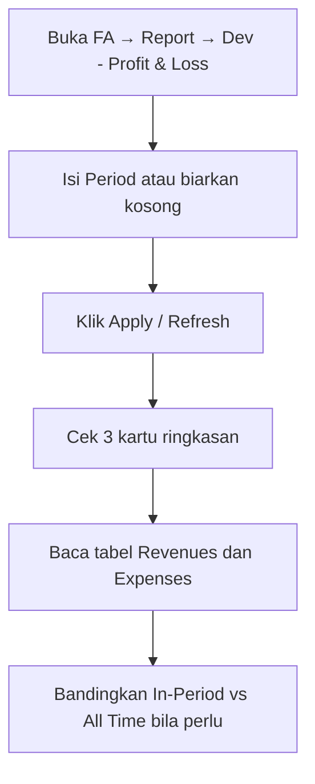

# Dev - Profit & Loss — Knowledge Base (Operator)

**Audience:** Finance, Accounting ops, Support  
**Route:** `/accounting/profit-loss-v1`  
**Menu di sidebar:** FA → Report → Dev - Profit & Loss

---

## 1. Apa itu Dev - Profit & Loss?

Menu laporan **laba rugi** (Income Statement) versi legacy. Dipakai untuk melihat:

- Berapa total **pendapatan** (Revenues)
- Berapa total **beban** (Expenses)
- Berapa **laba atau rugi berjalan** (Current Profit/Loss)

Angka diambil dari transaksi jurnal akuntansi yang sudah **disetujui (Approved)**, dikelompokkan per akun (Chart of Account).

Menu ini **hanya lihat** — tidak bisa create, edit, atau export. Versi yang lebih baru (multi-periode + export) ada di menu **Profit & Loss** terpisah.

---

## 2. Kapan dipakai?

| ✅ Pakai menu ini jika | ❌ Jangan andalkan untuk |
|------------------------|---------------------------|
| Mau cek ringkas laba/rugi satu rentang tanggal | Bandingkan banyak periode sekaligus |
| Mau lihat rincian per akun pendapatan & beban | Export Excel / unduh file |
| Mau bandingkan saldo periode vs saldo sepanjang masa (kolom All Time) | Melihat jurnal mentah di balik satu angka akun |

---

## 3. Alur kerja standar

Pilih periode (opsional), Apply, lalu baca kartu ringkasan dan dua tabel detail.

**Keterangan langkah:**

- **Period:** rentang tanggal laporan. Boleh dikosongkan. Perilaku default saat kosong sedang diselaraskan (lihat Tips) — pastikan kamu paham angka yang tampil sebelum dipakai keputusan.
- **Apply:** dipakai setelah Period diganti, agar filter baru dipakai.
- **Refresh:** reload data tanpa ganti Period (kalau Period tidak berubah).
- **Kartu ringkasan:** Total Revenues, Total Expenses, Current Profit/Loss (= Revenues dikurangi Expenses).
- **Tabel kiri (Revenues):** akun pendapatan; induk tebal, anak menjorok.
- **Tabel kanan (Expenses):** akun beban / HPP; pola tampilan sama.

---

## 4. Membaca kartu ringkasan

| Kartu | Artinya |
|-------|---------|
| **Total Revenues** | Total pendapatan dari akun class pendapatan (+ pendapatan & beban lain terkait) |
| **Total Expenses** | Total beban dari akun class beban + HPP |
| **Current Profit/Loss** | Revenues dikurangi Expenses — positif = laba, negatif = rugi |

Hanya jurnal **Approved** yang masuk. Jurnal draft/pending/ditolak/void tidak dihitung.

---

## 5. Membaca tabel detail

| Kolom | Padanan awam |
|-------|----------------|
| **CODE** | Kode akun |
| **NAME** | Nama akun (induk tebal, anak menjorok) |
| **In-Period Balance** | Saldo sesuai tanggal Period yang dipakai |
| **All Time Balance** | Saldo akumulasi dari awal sampai sekarang |

- Tabel **Revenues** = akun pendapatan.
- Tabel **Expenses** = akun beban / HPP.
- Angka di akun **induk** adalah jumlah dari akun-akun di bawahnya, bukan jurnal terpisah ke akun induk itu sendiri.
- Tidak ada tombol expand/collapse — semua baris langsung tampil (sampai sekitar 1000 baris per tabel).
- Tidak ada pencarian kolom dan tidak ada export.

### Kenapa saldo bisa minus?

Setiap jenis akun punya arah “normal” bertambah. Kalau jurnal di periode itu lebih banyak ke arah **kebalikan**, sistem menampilkan angka sebagai **pengurang** (minus). Contoh: pendapatan yang banyak dikoreksi/retur bisa tampil minus.

---

## 6. Relasi menu lain (ringkas)

| Menu | Hubungan |
|------|----------|
| Chart of Account | Sumber daftar akun & hierarki |
| Journal | Sumber angka (hanya yang Approved) |
| Profit & Loss | Versi produksi yang lebih lengkap (multi-periode, export) |

---

## 7. Troubleshooting

| Gejala | Penyebab umum | Solusi |
|--------|---------------|--------|
| Total Revenues beda dari laporan lain | Jurnal belum Approved, atau laporan lain pakai filter beda | Cek status jurnal; samakan periode & sumber |
| Angka minus padahal “harusnya” pendapatan/beban | Koreksi/retur membalik arah normal akun | Cek jurnal koreksi di periode yang sama |
| Period kosong tapi angka tetap ada | Sistem tetap menghitung dengan basis default (hari ini di implementasi sekarang; ke depan diarahkan ke seluruh masa) | Isi Period eksplisit lalu Apply agar rentang jelas |
| Mau lihat jurnal di balik satu akun | Fitur drill-down jurnal belum ada | Buka menu Journal / General Ledger terpisah dengan filter akun & tanggal |
| Tabel kosong padahal ada transaksi | Class akun salah, atau jurnal belum Approved | Cek Class COA dan status jurnal |

---

## 8. FAQ

**Q: Bedanya dengan menu Profit & Loss biasa?**  
A: Menu biasa = versi baru (banyak periode + export). Dev - Profit & Loss = versi legacy, satu periode, dua tabel sejajar, tanpa export.

**Q: Harus isi Period?**  
A: Tidak wajib. Kalau kosong, sistem tetap menampilkan angka dengan basis default — isi Period kalau mau rentang yang pasti.

**Q: Kenapa Apply dan Refresh berganti-ganti?**  
A: Setelah Period diubah, tombol jadi Apply. Kalau Period sama, tombol jadi Refresh untuk reload.

**Q: Bisa export Excel?**  
A: Tidak di menu ini. Pakai Profit & Loss produksi jika butuh export.
