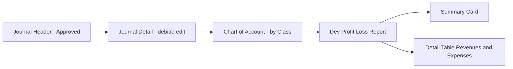
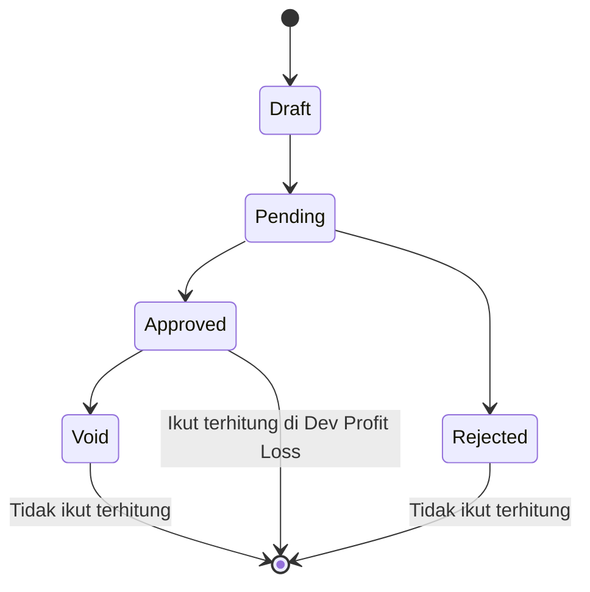
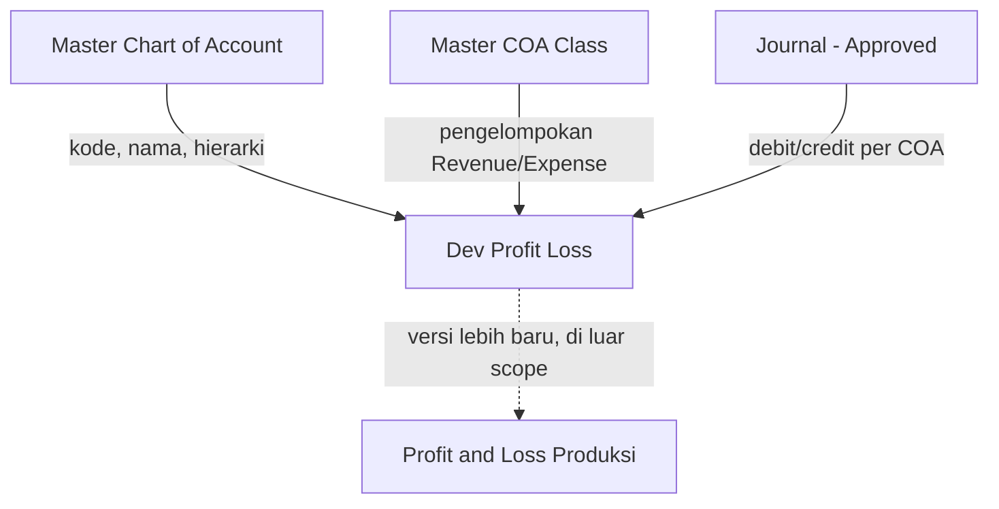

# Dev - Profit & Loss — Requirement Documentation

**Modul:** Finance & Accounting / Report  
**Prefix:** `DPL-`  
**Audience:** PM, Finance, QA  
**UI route:** `/accounting/profit-loss-v1`  
**SoT:** `dev-profit-loss-source-of-truth.md` v1.0 (17 Jul 2026)

Related: [Profit & Loss (produksi)](../accounting-profit-loss/) — di luar scope dokumen ini.

---

## 0. Metadata & Changelog

| Version | Date | Author | Changes |
|---------|------|--------|---------|
| 1.0 | 2026-07-17 | QA - Yemima | Draft awal dari SoT v1.0 + verifikasi codebase AS-IS |

---

## 1. Ringkasan Eksekutif

Dev - Profit & Loss adalah menu **report legacy** (read-only) yang menampilkan laporan laba rugi (Income Statement) dari saldo Chart of Account class Revenue dan Expense, dihitung dari transaksi Journal berstatus **Approved**. Dipakai tim Finance/Accounting untuk melihat ringkasan Total Revenues, Total Expenses, dan Current Profit/Loss dalam satu periode, plus detail per akun COA dalam struktur parent-child.

Berbeda dari Profit & Loss produksi: **satu rentang periode saja**, tanpa multi-period comparison, tanpa export.

| Kebutuhan bisnis | Jawaban menu ini |
|------------------|-----------------|
| Ringkas laba/rugi periode | 3 kartu: Total Revenues, Total Expenses, Current Profit/Loss |
| Rincian per akun | Dua tabel sejajar: Revenues dan Expenses |
| Hanya angka final | Hanya journal Approved yang ikut |
| Bandingkan in-period vs all-time | Kolom In-Period Balance + All Time Balance per baris COA |

### 1.1 Rantai proses

---

## 2. Prasyarat

| Prasyarat | Sumber | Catatan |
|-----------|--------|---------|
| Master Chart of Account sudah setup dengan Class benar | Master COA | Class yang relevan: Revenue, Other Revenue & Expenses, Expense, Cost Of Goods Sold |
| Struktur parent-child COA benar | Master COA | Agregasi saldo parent bergantung ke hierarki ini |
| Journal sudah dibuat dan Approved | Journal (Accounting) | Draft, Pending, Rejected, Void tidak ikut dihitung |

---

## 3. Siklus Status

Menu ini **report murni** — tidak punya siklus status sendiri. Yang menentukan data ikut terhitung adalah status Journal sumber.

| Status Journal | Ikut terhitung? | Catatan |
|----------------|-----------------|---------|
| Draft / Pending | Tidak | Belum final |
| Approved | Ya | Satu-satunya status yang masuk summary dan detail |
| Rejected | Tidak | Dianggap batal |
| Void | Tidak | Ter-eksklusi lewat filter Approved saja (tanpa filter Void terpisah) — verified codebase |

---

## 4. Datalist

Dua datalist berdampingan: **Revenues** (kiri) dan **Expenses** (kanan).

### 4.1 Kolom

| Kolom | Visible default | Sumber | Keterangan |
|-------|-----------------|--------|------------|
| CODE | Ya | Kode COA | Indentasi mengikuti kedalaman hierarki |
| NAME | Ya | Nama COA | Parent ditampilkan **bold** |
| In-Period Balance | Ya | Mutasi journal dalam Period | Jika Period kosong: mengikuti basis All Time (requirement) / hari ini (AS-IS) — lihat GAP-DPL-01 |
| All Time Balance | Ya | Mutasi journal sepanjang masa | Selalu terhitung, terlepas Period diisi atau tidak |

### 4.2 Karakteristik

| Aspek | Requirement | AS-IS codebase |
|-------|-------------|----------------|
| Search/filter kolom | Tidak ada | Tidak ada |
| Export | Tidak ada | Tidak ada |
| Baris per load | Sampai 1000 per tabel | `pageLength` 1000 |
| Struktur | Hierarki parent-child | Indent + bold parent; **bukan** expand/collapse interaktif — semua baris flat |
| Pemisahan | Revenues = Revenue + Other Revenue & Expenses; Expenses = Expense + Cost Of Goods Sold | Sama |

---

## 5. Form & Field

Tidak ada form create/edit — hanya filter periode.

### 5.1 Field Period

| Field | Wajib? | Default (requirement) | Default (AS-IS) | Sumber | Catatan |
|-------|--------|----------------------|-----------------|--------|---------|
| Period (date range) | Tidak | Kosong → All Time | Kosong → rentang **hari ini** | Date range picker | Format tampilan `dd-MM-yyyy`; model `yyyy-MM-dd` |

### 5.2 Tombol

| Tombol | Behavior AS-IS | Catatan requirement |
|--------|----------------|---------------------|
| Apply | Aktif setelah Period diganti (`modified`); commit period lalu reload | Memicu kalkulasi ulang |
| Refresh | Aktif jika Period tidak berubah; reload data | Keputusan 1 vs 2 tombol masih open — GAP-DPL-02 |

Tombol disabled saat summary atau salah satu tabel masih loading.

---

## 6. How It Works

### 6.1 Summary Card

| Kartu | Formula |
|-------|---------|
| Total Revenues | Absolut akumulasi saldo seluruh COA class Revenue + Other Revenue & Expenses |
| Total Expenses | Absolut akumulasi saldo seluruh COA class Expense + Cost Of Goods Sold |
| Current Profit/Loss | Total Revenues dikurangi Total Expenses |

Contoh: Revenues 50.000.000, Expenses 35.000.000 → Current Profit/Loss 15.000.000.

### 6.2 Struktur Detail COA — Parent/Child

- Section Revenues: COA class Revenue + Other Revenue & Expenses
- Section Expenses: COA class Expense + Cost Of Goods Sold
- Baris **leaf**: saldo dari journal langsung ke COA tersebut, dengan sign rule (§6.3)
- Baris **parent**: akumulasi dari seluruh descendant; **tanpa** re-apply sign rule di level parent (AS-IS: `abs` dari sum anak)

### 6.3 Aturan Posisi (Sign Rule) di Level Leaf

| Class | Posisi normal (bertambah) |
|-------|---------------------------|
| Revenue / Other Revenue & Expenses | Kredit |
| Expense / Cost Of Goods Sold | Debit |

Jika posisi transaksi dominan **berlawanan** dari posisi normal class, nilai ditampilkan sebagai faktor pengurang (minus).

Contoh Revenue "Pendapatan Jasa": Kredit 10jt + Debit 2jt → tampil +8jt. Debit 5jt + Kredit 1jt → tampil minus 4jt.

`[VERIFY: CODEBASE]` — arah flip sign di implementasi (`getInPeriodBalanceWithPostion` + `positionNegatif`) perlu dicek dengan data riil sebelum dianggap final selaras aturan bisnis di atas.

### 6.4 Basis Data — In-Period vs All Time

| Kondisi Period | Requirement (TO-BE) | AS-IS |
|----------------|---------------------|-------|
| Kosong | Summary + In-Period column memakai **All Time** | Default rentang **hari ini** |
| Diisi + Apply | Basis In-Period sesuai rentang | Sama |
| Kolom All Time Balance | Selalu all-time | Fixed range `1970-01-01` … `2999-12-31` |

Lihat GAP-DPL-01.

### 6.5 Drill-Down

Tidak ada modal detail journal entry. Drill-down = melihat hierarki parent-child COA (indent/bold). Tidak ada link ke General Ledger dari angka COA.

---

## 7. Validasi

| # | Kondisi | Behavior | Error Message |
|---|---------|----------|---------------|
| 1 | Journal selain Approved | Tidak ikut summary maupun detail | — |
| 2 | Period kosong | Requirement: All Time; AS-IS: hari ini (GAP-DPL-01) | — |
| 3 | Period diisi | Basis In-Period; dihitung ulang saat Apply/Refresh | — |
| 4 | COA tanpa Class valid untuk report | Dikecualikan dari kedua section (`whereHas` class name) | — |
| 5 | COA parent tanpa child | Tetap tampil; saldo parent 0 jika tidak ada descendant dengan mutasi | — |
| 6 | `className` request bukan `revenue` / `expense` | API error "Invalid class name" | Invalid class name |

---

## 8. Relasi Menu Lain

| Menu | Peran |
|------|-------|
| Master Chart of Account | Struktur akun di detail table |
| Master COA Class | Menentukan section Revenues vs Expenses |
| Journal | Sumber debit/credit |
| Profit & Loss (produksi) | Versi baru multi-period + export — di luar scope |

---

## 9. Gap Registry

| ID | Deskripsi | Dampak | Status |
|----|-----------|--------|--------|
| GAP-DPL-01 | Default Period kosong: requirement = All Time; AS-IS = hari ini | Dev perlu ubah fallback FE/BE; test case default filter | Open |
| GAP-DPL-02 | Apply vs Refresh terpisah (AS-IS) vs satu tombol Apply (belum diputuskan) | UI + test interaksi tombol | Open |

---

## 10. FAQ

**Q: Kenapa saldo COA revenue saya minus?**  
A: Posisi transaksi journal periode itu dominan Debit — kebalikan posisi normal Revenue (Kredit). Sistem menganggap ini pengurang.

**Q: Period kosong tapi data tetap keluar?**  
A: Requirement: All Time. AS-IS: rentang hari ini. Lihat GAP-DPL-01.

**Q: Kenapa parent beda dari jumlah child yang saya hitung manual?**  
A: Parent = akumulasi seluruh descendant (bukan hanya anak langsung) dengan aturan `abs` di AS-IS, tanpa sign flip ulang.

**Q: Bisa lihat journal entry di balik angka COA?**  
A: Belum — tidak ada modal drill-down journal.

---

## 11. Changelog

| Tanggal | Versi | Perubahan |
|---------|-------|-----------|
| 2026-07-17 | 1.0 | Draft dari SoT v1.0; AS-IS notes + GAP-DPL-01/02 |
