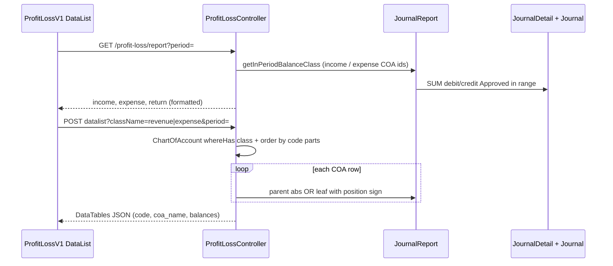

# Dev - Profit & Loss — Technical Documentation

**API prefix:** `accounting/profit-loss/report`  
**Module:** `Modules/Accounting`  
**UI route:** `/accounting/profit-loss-v1`  
**Behavior SoT:** [requirement.md](./requirement.md) v1.0

> Menu produksi terpisah: `accounting/profit-loss` memakai `indexV2` — **bukan** scope file ini.

---

## 1. File Map

### Backend

| Layer | Path |
|-------|------|
| Routes | `Modules/Accounting/Routes/api.php` (`/profit-loss/report`, `/profit-loss/report/datalist`) |
| Controller | `Modules/Accounting/Http/Controllers/ProfitLossController.php` — `index`, `get_income_expense_return` |
| Entity (privilege) | `Modules/Accounting/Entities/ProfitLossOld.php` |
| Policy | `Modules/Accounting/Policies/ProfitLossOldPolicy.php` (`menu_link` = `accounting/profit-loss-v1`) |
| Balance helper | `app/Helpers/Accounting/JournalReport.php` |
| COA | `Modules/Accounting/Entities/ChartOfAccount.php` + class + `coaTree` |
| Journal | `Modules/Accounting/Entities/Journal.php`, `JournalDetail.php` |
| Menu seeder | `Modules/Gate/Database/Seeders/ModuleMenu/AccountingMenuSeeder.php` |

### Frontend

| Layer | Path |
|-------|------|
| Route | `olshoperp-frontend/src/router/index.ts` → `accounting_profit-loss-v1_index` |
| Page | `olshoperp-frontend/src/pages/Accounting/Report/ProfitLossV1/DataList.vue` |
| Table | `DataTablesV3` (POST, `pageLength` 1000, `dom: t`) |
| Period UI | `VueDatePicker` range + Apply/Refresh |

---

## 2. API Routes

| Method | Path | Action | Auth policy |
|--------|------|--------|-------------|
| GET | `accounting/profit-loss/report` | `get_income_expense_return` | `viewAny` **ProfitLoss** (entity produksi) — inkonsisten vs menu Dev |
| GET/POST | `accounting/profit-loss/report/datalist` | `index` | `viewAny` **ProfitLossOld** |

Query/body penting:

| Param | Dipakai di | Keterangan |
|-------|------------|------------|
| `period` | keduanya | `"yyyy-MM-dd,yyyy-MM-dd"` (FE kirim comma-separated dari range) |
| `className` | datalist | `revenue` \| `expense` |

---

## 3. Database — Key Tables

| Table | Role |
|-------|------|
| `accounting_chart_of_accounts` | Kode/nama COA, FK class |
| `accounting_chart_of_account_classes` | Nama class: Revenue, Other Revenue & Expenses, Expense, Cost Of Goods Sold |
| COA tree (parent/child) | Hierarki untuk indent & agregasi parent |
| `accounting_journals` | `transaction_date`, `transaction_status` |
| `accounting_journal_details` | `coa_id`, `debit`, `credit` |

Tidak ada tabel khusus “profit_loss_v1” — report aggregator read-only.

---

## 4. Services / Calculation

Semua lewat `JournalReport` (default `approved = 1` → status Approved).

| Method | Digunakan untuk |
|--------|-----------------|
| `getInPeriodBalanceClass($coaIds, $from, $to)` | Summary card income/expense |
| `getInPeriodBalanceWithPostion($coaId, $from, $to)` | Leaf: abs(debit−credit) + posisi Debit/Credit |
| `getInPeriodBalanceParent($coaId, $from, $to)` | Parent: sum debit/credit seluruh child IDs |
| `getInPeriodDebit` / `getInPeriodCredit` | Leaf aggregates via `getInPeriodAmount` |

Filter journal detail (inti):

```
DATE(transaction_date) BETWEEN start AND end
AND transaction_status = APPROVED
```

### Class mapping (`index`)

| `className` | COA class names | `positionNegatif` (sign flip) |
|-------------|-----------------|-------------------------------|
| `revenue` | Revenue, Other Revenue & Expenses | Debit |
| `expense` | Expense, Cost Of Goods Sold | Credit |

Leaf signed amount: jika posisi hasil = `positionNegatif` → nilai diganti negatif.

Parent: `abs(getInPeriodBalanceParent(...))` — **tidak** pakai sign flip leaf.

All Time di datalist AS-IS: `1970-01-01` … `2999-12-31`.

Summary card:

```
income  = abs(getInPeriodBalanceClass(revenueIds))
expense = abs(getInPeriodBalanceClass(expenseIds))
return  = income - expense
```

---

## 5. Flow utama



---

## 6. Invariants

| ID | Invariant |
|----|-----------|
| INV-DPL-01 | Journal included ⇒ `transaction_status = APPROVED` |
| INV-DPL-02 | `Current Profit/Loss = Total Revenues − Total Expenses` (card) |
| INV-DPL-03 | `Total Revenues = abs(class balance Revenue + Other Revenue & Expenses)` |
| INV-DPL-04 | `Total Expenses = abs(class balance Expense + Cost Of Goods Sold)` |
| INV-DPL-05 | Parent balance = aggregate descendants only (no leaf sign re-apply on parent) |
| INV-DPL-06 | Datalist `className` ∉ {revenue, expense} ⇒ error |

---

## 7. Validation Highlights

| Rule | Implementation |
|------|----------------|
| Class filter | `whereHas('chart_of_account_class', whereIn name)` |
| Invalid className | `$this->error("Invalid class name")` |
| Period missing (AS-IS) | Controller fallback `date('Y-m-d')` … `date('Y-m-d')` — **bukan** All Time (GAP-DPL-01) |
| Period missing (TO-BE) | Fallback All Time equivalent (`1970-01-01`…`2999-12-31`) |
| Currency format | `renderCurrencyAmount` / `renderCurrencyAmountDatalist` |
| HTML indent/bold | `escapeColumns([])` on datalist |

---

## 8. Frontend Behaviors

| Behavior | Detail |
|----------|--------|
| Period commit | `period` vs `committedPeriod`; Apply copies when `modified` |
| Parallel load | SWRV for cards; two DataTables with separate URLs |
| Loading gate | Button disabled while `isLoading` or either table loading |
| Hierarchy UI | Indent `&emsp;` + bold parent name — no expand/collapse |
| Breadcrumb | FA → Report → Dev - Profit & Loss (link aktif masih ke `/accounting/profit-loss`) |

---

## 9. Failure Modes & Transaction Boundary

| Scenario | Behavior |
|----------|----------|
| Report read path | No writes; no DB transaction boundary for mutations |
| COA tanpa class valid | Excluded from query |
| Parent tanpa child | Tampil; parent helper return 0 jika child list kosong |
| Broken/circular COA tree | Depth walk / `getAllChilds` bisa mahal atau salah agregasi — no explicit cycle guard |
| Policy mismatch | Summary authorize `ProfitLoss`; datalist authorize `ProfitLossOld` — role tanpa privilege produksi bisa gagal load kartu |
| Cache | Beberapa helper JournalReport cache ~1 menit — Refresh cepat bisa lihat angka stale singkat |

---

## 10. Data Lifecycle

| Flag / state | Arah |
|--------------|------|
| — | Tidak ada. Menu tidak menulis balik ke Journal/COA. |

---

## 11. Tests & QA Notes

- Feature test disarankan: period kosong (AS-IS hari ini vs TO-BE All Time), className invalid, Approved-only inclusion, parent abs vs leaf sign.
- Manual QA: bandingkan Total Revenues card vs sum leaf signed di tabel (parent abs bisa membuat sum manual beda).
- Cross-check privilege: user hanya punya `ProfitLossOld` vs juga `ProfitLoss`.

---

## 12. Known Issues

| Ref | Issue |
|-----|-------|
| GAP-DPL-01 | Default period kosong ≠ All Time |
| GAP-DPL-02 | Apply/Refresh dual button undecided |
| Auth | `get_income_expense_return` memakai `ProfitLoss` bukan `ProfitLossOld` |
| Sign rule | Arah flip vs aturan bisnis §6.3 requirement masih `[VERIFY: CODEBASE]` dengan data riil |
| Breadcrumb | Active link mengarah ke path produksi `/accounting/profit-loss` |
