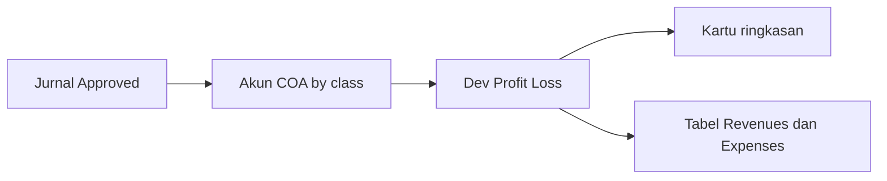
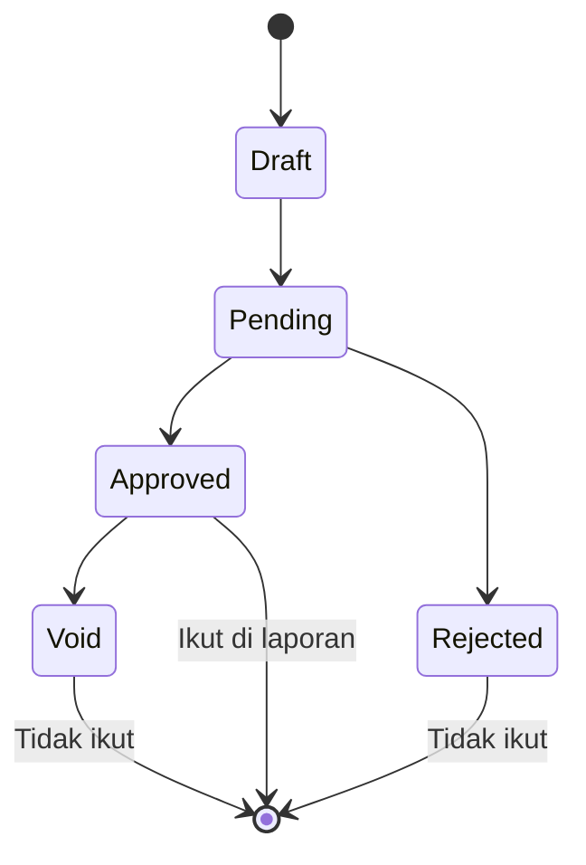

# Dev - Profit & Loss — Panduan Pengguna

**Siapa yang baca panduan ini:** finance, accounting ops, support  
**Menu di sistem:** FA → Report → Dev - Profit & Loss

---

## 1. Apa Itu & Kenapa Penting

Dev - Profit & Loss adalah laporan **laba rugi** sederhana: berapa pendapatan, berapa beban, dan berapa laba atau rugi berjalan dalam periode yang kamu pilih.

Angka diambil dari jurnal akuntansi yang sudah **disetujui**. Menu ini hanya untuk melihat — tidak untuk membuat transaksi, dan tidak ada export. Kalau butuh banding banyak periode atau unduh file, pakai menu **Profit & Loss** yang lebih baru.

---

## 2. Overview Flow & Proses Bisnis

### Dari jurnal sampai laporan

**Versi teks (tanpa diagram):**

1. Tim accounting membuat dan **menyetujui** jurnal.
2. Setiap baris jurnal masuk ke akun pendapatan atau beban.
3. Menu Dev - Profit & Loss menjumlahkan akun-akun itu.
4. Kamu melihat 3 kartu ringkasan plus dua tabel detail (pendapatan di kiri, beban di kanan).

### Status yang ikut dihitung

**Versi teks — status jurnal sumber:**

| Status jurnal | Ikut di laporan? |
|---------------|------------------|
| Draft / Pending | Tidak |
| Approved | Ya |
| Rejected / Void | Tidak |

Menu laporan sendiri **tidak punya** status Draft/Open/Approve — sifatnya hanya baca.

---

## 3. Sebelum Mulai (Flow Sebelum)

Pastikan:

- Daftar akun (Chart of Account) sudah punya **class** yang benar (pendapatan / beban / HPP).
- Hierarki akun induk–anak sudah sesuai (supaya total induk masuk akal).
- Jurnal yang relevan sudah **Approved**.

🎬 [Interactive demo akan ditambahkan di sini]

---

## 4. Setelah Selesai (Flow Sesudah)

Setelah membaca laporan:

- Tidak ada langkah “approve” di menu ini.
- Kalau angka janggal, cek jurnal sumber atau master akun — lalu **Refresh** laporan.
- Untuk analisis multi-periode atau export, lanjut ke menu **Profit & Loss** produksi.

---

## 5. Yang Perlu Diperhatikan

- Kalau jurnal belum disetujui, angka **tidak** muncul di laporan.
- Kalau Period dikosongkan, sistem tetap menampilkan angka dengan basis default (saat ini: hari ini). Isi Period lalu Apply kalau mau rentang yang pasti.
- Angka minus di akun pendapatan/beban sering berarti ada koreksi/retur yang membalik arah normal akun — bukan selalu error sistem.
- Tidak ada jendela untuk melihat jurnal mentah dari satu angka akun; buka menu Journal / General Ledger terpisah.
- Tidak ada export di menu ini.

---

## 6. Langkah-Langkah (Step by Step)

1. Buka **FA → Report → Dev - Profit & Loss**.
2. Isi **Period** (rentang tanggal), atau biarkan kosong jika memang mau basis default.
3. Klik **Apply** (setelah ganti Period) atau **Refresh** (kalau Period tidak berubah).
4. Baca tiga kartu: **Total Revenues**, **Total Expenses**, **Current Profit/Loss**.
5. Baca tabel **Revenues** (kiri) dan **Expenses** (kanan): kode, nama, saldo periode, saldo sepanjang masa.
6. Bandingkan kolom **In-Period** dan **All Time** bila perlu konteks tren.
7. Jika data tidak masuk akal: pastikan jurnal Approved, class akun benar, lalu Refresh ulang.

🎬 [Interactive demo akan ditambahkan di sini]

---

## 7. Tips & Hal yang Sering Bikin Bingung

- **Bedanya dengan Profit & Loss biasa?** Yang biasa lebih lengkap (banyak periode + export). Yang “Dev” ini versi lama, lebih sederhana.
- **Kenapa tombol kadang Apply, kadang Refresh?** Setelah Period diubah → Apply. Kalau Period sama → Refresh untuk reload.
- **Kenapa pendapatan saya minus?** Biasanya ada jurnal yang lebih banyak ke arah kebalikan (misalnya koreksi). Cek jurnal di periode yang sama.
- **Kenapa induk beda dari jumlah anak yang saya hitung manual?** Induk menjumlahkan semua turunan di bawahnya dengan aturan tampilan sendiri — jangan bandingkan seperti penjumlahan spreadsheet sederhana tanpa cek struktur akun.
- **Mau unduh Excel?** Tidak di sini — pakai Profit & Loss produksi.

---

## 8. Referensi

| Dokumen | Untuk siapa |
|---------|-------------|
| [requirement.md](./requirement.md) | PM / QA — aturan & gap |
| [knowledge-base.md](./knowledge-base.md) | Operator / support — troubleshooting |
| [technical.md](./technical.md) | Developer — API & kalkulasi |
