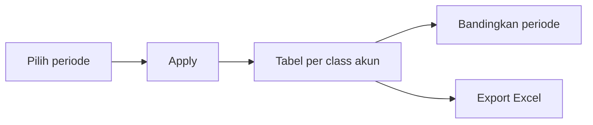
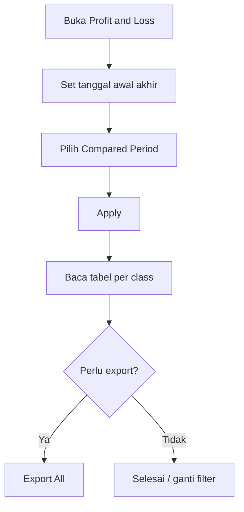

# Profit & Loss — Knowledge Base

> **Audience:** Finance / Controller · **Route:** `/accounting/profit-loss`

---

## 1. Apa itu?

**Profit & Loss** = laporan laba rugi perusahaan dari akun Revenue, Other Revenue & Expenses, HPP (COGS), dan Expense. Angka diambil dari **journal yang sudah Approved**, dalam mata uang utama (IDR).

Menu ini **hanya baca** — tidak ada create/edit transaksi. Pilih periode → **Apply** → lihat tabel → opsional bandingkan sampai 11 periode sebelumnya → export Excel.

**Bukan menu ini:** Dev Profit & Loss (versi lama), Product / Sales Order Profit Loss (per SKU / SO).

---

## 2. Glosarium

| Istilah | Arti awam |
|---------|-----------|
| **Compared Period** | Berapa periode ke belakang yang ditampilkan berdampingan |
| **Leaf akun** | Akun paling bawah (bukan induk) — dipakai hitung total class |
| **In-period** | Hanya transaksi dalam rentang tanggal filter |
| **Whole-month** | Kalau filter pas 1 bulan kalender penuh, bandingkan per bulan (bukan jumlah hari sama) |
| **Current Profit/Loss** | Akun khusus laba rugi berjalan (path berbeda dari akun biasa) |

---

## 3. Alur kerja standar

1. Buka menu → default periode = **bulan berjalan**.  
2. Opsional: preset **1 / 2 / 3 weeks / 1 month**, atau Compared Period **0–11**.  
3. Klik **Apply** — tanpa Apply, tabel belum terisi.  
4. Baca kolom amount + % (hijau naik / merah turun vs periode lebih lama).  
5. **Export All** jika perlu Excel (async — cek progress/log).

---

## 4. Cara baca tabel

- Group: **Revenue → Other Revenue & Expenses → Cost Of Goods Sold → Expense**.  
- Induk akun **tebal** + indent; total class di footer = jumlah akun paling bawah saja.  
- Hover amount → tooltip: basis journal Approved + konversi FX saat transaksi.  
- **%** = banding ke kolom sebelah kanan (periode lebih lama). 0% tidak ditampilkan. Kolom paling lama tanpa %.

**Contoh:** Periode 1 Apr–15 Mei, Compared = 2 → tiga kolom jendela 45 hari mundur tanpa tumpang tindih. Amount kolom baru 8 jt vs lama 6 jt → sekitar +33% (hijau).

---

## 5. Troubleshooting

| Gejala | Penyebab | Solusi |
|--------|----------|--------|
| Tabel kosong / tidak muncul | Belum Apply; period kosong | Isi tanggal → **Apply** |
| Angka 0 padahal ada transaksi | Journal belum Approved; tanggal di luar range; class bukan 4 class P&L | Cek status journal & tanggal; pastikan akun Revenue/Expense/COGS/Other |
| Revenue terlihat negatif | Laporan pakai debit − credit mentah | Normal AS-IS; beda dari Dev P&L yang di-flip — konfirmasi ke Finance jika butuh tampilan “pendapatan positif” |
| Export gagal | Tidak ada data / privilege / queue | Baca pesan “no data”; cek akses menu; coba lagi |
| Kolom periode “aneh” (bukan full month) | Kemungkinan beda hitung hari FE vs BE | Catat tanggal header vs angka; laporkan ke Dev |
| Butuh P&L per toko / SKU | Bukan scope menu ini | Pakai Product / Sales Order Profit Loss (sampai filter tag P&L ada) |

---

## 6. FAQ

**Q: Beda dengan Dev Profit & Loss?**  
A: Menu ini = multi-period + export. Dev = kartu ringkas + dua tabel, tanpa bandingkan periode / export.

**Q: Journal Draft ikut?**  
A: Tidak, untuk akun biasa. Hanya **Approved**.

**Q: Kurs USD dihitung ulang?**  
A: Tidak — pakai kurs yang tersimpan saat journal dibuat.

**Q: Max berapa kolom?**  
A: 12 (1 periode dipilih + 11 pembanding).

**Q: Fiscal Period memfilter laporan?**  
A: Tidak langsung — Fiscal Period mengatur boleh/tidaknya posting tanggal; laporan tetap filter dari tanggal yang kamu Apply.

---

## Related Documents

| Doc | Path |
|-----|------|
| Requirement | [requirement.md](./requirement.md) |
| Technical | [technical.md](./technical.md) |
| User Guide | [user-guide.md](./user-guide.md) |
| Dev P&L | [../accounting-profit-loss-v1/knowledge-base.md](../accounting-profit-loss-v1/knowledge-base.md) |
| Journal | [../journal/knowledge-base.md](../journal/knowledge-base.md) |
