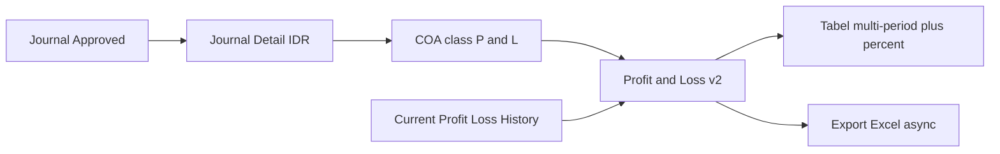

# Profit & Loss — Requirement Documentation

**Modul:** Finance & Accounting / Report  
**Audience:** PM, Finance, QA  
**UI route:** `/accounting/profit-loss`  
**API:** `GET …/profit-loss/v2?from=&to=&periods=`  
**SoT:** `_meta/sot/accounting-profit-loss-source-of-truth.md` v1.0 (12 Agustus 2026)

Sibling: [Dev - Profit & Loss](../accounting-profit-loss-v1/) · Sumber angka: [Journal](../journal/) · Struktur akun: [Chart of Account](../accounting-chart-of-account/)

> AS-IS = P&L v2 (multi-period + %). TO-BE Mekari-like filter/template/Gross-Net → Gap Registry (banyak Pending Decision).

---

## 0. Metadata & Changelog

| Version | Date | Author | Changes |
|---------|------|--------|---------|
| 1.0 | 2026-08-12 | QA - Yemima | Full 5-file dari SoT v1.0; Gap GAP-PL-01..17 |

---

## 1. Ringkasan Eksekutif

**Profit & Loss** = Income Statement perusahaan: saldo **in-period** COA class Revenue, Other Revenue & Expenses, Cost Of Goods Sold, dan Expense dari **journal Approved**, dalam primary currency (IDR). Menu **read-only** — filter periode → Apply → tabel multi-kolom → bandingkan hingga 11 periode sebelumnya → export Excel async.

Bukan menu ini: Dev P&L (`/profit-loss-v1`), Product P&L, Sales Order P&L.

---

## 2. Prasyarat

| Prasyarat | Sumber | Catatan |
|-----------|--------|---------|
| COA aktif class Revenue / Other Revenue & Expenses / COGS / Expense | Chart of Account | Hanya 4 class ini di P&L produksi |
| Hierarki parent–child COA benar | COA Tree | Parent = agregasi; indent + bold |
| Mapping Current Profit/Loss | Company accounting | Path history khusus |
| Journal Approved di rentang tanggal | Journal (+ dokumen sumber) | Draft/Open/Rejected tidak ikut path normal |
| Privilege `viewAny` Profit & Loss | Gate | Export cek policy; `indexV2` tanpa authorize eksplisit (GAP-PL-16) |
| Primary currency (IDR) | Company | Amount tampil IDR dari nilai journal |

---

## 3. Siklus Status

Menu **tidak punya status dokumen**. Angka mengikuti status **Journal**.

| Status Journal | Leaf / parent COA biasa | Current Profit/Loss (history) |
|----------------|-------------------------|-------------------------------|
| **Approved** | Ya | Ikut jika ada di history |
| Draft / Open / Rejected | Tidak | Query history **tidak** filter Approved (GAP-PL-03) |

---

## 4. Datalist (tabel laporan)

Tabel muncul setelah **Apply**.

### 4.1 Kolom tetap

| Kolom | Default visible | Catatan |
|-------|-----------------|---------|
| COA (id) | Tidak | Search Builder |
| **Code** | Ya | Indent per level; parent **bold** |
| **Name** | Ya | Parent **bold** |
| COA Class / Class Name | Tidak | Row-group by class name |

### 4.2 Kolom dinamis

`periods` = jumlah **pembanding**; total kolom balance = `periods + 1` (max **12**).

| Kolom | Muncul | Isi |
|-------|--------|-----|
| `balance-{from}_{to}` | Selalu | Amount IDR per COA |
| `difference-{…}` | Jika `i < periods` | % vs periode sebelah kanan (lebih lama) |

Tooltip amount (AC5):

> Amount based on approved journals from {start} to {end}. Foreign currency values converted to IDR using the exchange rate recorded at the time of each transaction.

### 4.3 Row group & footer

- Group order: Revenue → Other Revenue & Expenses → Cost Of Goods Sold → Expense.
- Footer `"{Class} Total"` = sum **leaf only** (hindari double-count parent).

### 4.4 Toolbar / filter (AS-IS)

| Kontrol | Behavior |
|---------|----------|
| Period | Default = **bulan berjalan** |
| Preset | **1 / 2 / 3 weeks / 1 month** dari start bulan berjalan |
| Compared Period | **None (0) … 11** |
| Apply / Refresh | Apply rebuild + reload; Refresh = redraw |
| Search Builder | Filter COA / Class (4 class P&L) |
| Export All | Async — log + progress |

**TO-BE (belum AS-IS):** Filter Lainnya (Bandingkan periode, Urutan, Tag, Include all/Either, Tampilkan akun, Template, Terakhir diperbarui) → GAP-PL-01, 07–14.

### 4.5 Action

Tidak ada edit/approve/delete. Hanya Apply/Refresh, Export, Search Builder.

---

## 5. Form & Field (filter)

Tidak ada create/edit dokumen.

| Field | AS-IS | TO-BE |
|-------|-------|-------|
| Tanggal awal / akhir | Ya | Ya |
| Periode shortcut | 1–3 week, 1 month | Bulan Lalu/Ini/Kuartal — list pending (GAP-PL-01) |
| Compared Period | 0–11 | Label “Bandingkan dengan” pending UX |
| Bandingkan periode / Urutan / Tag / Template / … | Tidak | GAP-PL-07…14 |

---

## 6. How It Works

### 6.1 Multi-period (AC1)

**Requirement (locked, non-whole-month):**

1. Kolom 1 = selected `from`–`to`.
2. `durasi = (end − start) + 1` hari inklusif.
3. Kolom tambahan mundur **durasi** hari; **tanpa overlap, tanpa gap**.
4. Max 12 kolom (1 + 11).

**Contoh (45 hari):** 1 Apr 2026 – 15 Mei 2026 → kolom 2 = 15 Feb – 31 Mar 2026 → kolom 3 = 1 Jan – 14 Feb 2026 → …

**AS-IS whole-month:** jika `from` = start of month **dan** `to` = end of month yang sama → mundur pakai **kalender bulan** (`subMonth`), bukan window hari tetap (GAP-PL-02).

**AS-IS FE vs BE (non-month):** FE `diffDays + 1`; BE Carbon `diffInDays` tanpa +1 → risiko mismatch key header (GAP-PL-04).

### 6.2 Sumber angka (AC5 / AC7)

| Path | Rumus |
|------|--------|
| Leaf | Σ debit − Σ credit, tanggal dalam range, journal **Approved** |
| Parent | Agregasi descendant Approved |
| Current P/L | Sum **CurrentProfitLossHistory** — **tanpa** filter Approved (GAP-PL-03) |

Nilai dari `debit`/`credit` (IDR transaksi) — **tidak** ada kurs rata-rata / penutup di P&L (AC7).

### 6.3 Persentase (AC6)

`((Kolom N − Kolom N+1) / |Kolom N+1|) × 100%` — N lebih baru.

| Kondisi | Expected | AS-IS |
|---------|----------|-------|
| N > N+1 | % positif; tidak merah | Hijau jika % > 0 |
| N < N+1 | % negatif; merah | Merah jika % < 0 |
| 0% | Tidak ditampilkan | Ya |
| Kolom terakhir / Compared None | Tanpa % | Ya |
| prev = 0, current ≠ 0 | Undefined di formula | AS-IS **+100 / −100** |

Warna nature akun (beban turun = hijau?) → GAP-PL-11.

### 6.4 Sign tampilan

Produksi = **raw debit − credit** (tidak flip seperti Dev P&L). Revenue credit-normal sering **negatif** (GAP-PL-05).

### 6.5 Struktur baris (AC4)

AS-IS: 4 row-group class + footer total. **Tidak ada** baris computed Laba Kotor / Laba Bersih (GAP-PL-06).

### 6.6 Tag / store (AC8)

Belum ada di P&L v2 (GAP-PL-14).

### 6.7 Export

POST `from`, `to`, `periods` → 4 chunk (per class) → combine Excel. Empty → *"There is no data to export"*. Privilege `viewAny`.

### 6.8 Performa (AC11)

Tidak ada max range. 12 × ~365 hari = high risk timeout (GAP-PL-15).

### 6.9 Contoh kasus

| # | Situasi | Expected |
|---|---------|----------|
| T01 | 1 Apr–15 Mei 2026 (45 hari), 11 tambahan | 12 kolom × 45 hari, no overlap/gap |
| T02 | 1 bulan penuh, 3 tambahan | Requirement: 4×31 hari; AS-IS whole-month = calendar months (GAP-PL-02) |
| T03 | Journal USD rate 16.000 | IDR = nilai × rate tersimpan di journal |
| T04 | Kolom1 8jt, Kolom2 6jt | +33,3% tidak merah |
| T05 | Kolom1 5jt, Kolom2 6jt | −16,7% merah |
| T06 | Kolom1 = Kolom2 | % tidak tampil |
| T07 | Kolom terakhir | Tanpa % |
| T08 | Journal Draft/Open | Tidak dihitung (leaf/parent) |
| T09 | Compared None | 1 kolom, tanpa % |
| T10 | Hover amount | Tooltip periode + basis kalkulasi |

---

## 7. Validasi

| Kondisi | Behavior |
|---------|----------|
| `from` / `to` / `periods` kosong / format salah | API: required; date `d-m-Y`; periods numeric |
| Belum Apply | Tabel belum load |
| Export kosong | *"There is no data to export"* |
| Periods UI | Opsi 0–11; API numeric tanpa max eksplisit |
| Range sangat panjang | Tidak diblok (GAP-PL-15) |

---

## 8. Relasi Menu Lain

| Menu | Relasi |
|------|--------|
| [Journal](../journal/README.md) | Sumber angka Approved |
| [Chart of Account](../accounting-chart-of-account/README.md) | Baris & class |
| [Dev - Profit & Loss](../accounting-profit-loss-v1/README.md) | Legacy 2-panel; tanpa multi-period/export |
| [Balance Sheet](../accounting-balance-sheet/README.md) / Trial Balance / GL | Sibling report |
| [Product Profit Loss](../accounting-product-profit-loss/README.md) / [SO P&L](../accounting-sales-order-profit-loss/README.md) | Dimensi SKU/SO |
| [Fiscal Period](../accounting-fiscal-period/README.md) | Tidak filter report; mempengaruhi posting |

---

## 9. Acceptance Criteria

| ID | Kriteria |
|----|----------|
| PL-01 | Apply period → tabel 4 class P&L dari journal Approved (leaf/parent) |
| PL-02 | Compared Period 0–11 → max 12 kolom balance + % antar kolom |
| PL-03 | Whole-month vs fixed-duration terdokumentasi (GAP-PL-02) |
| PL-04 | Tooltip FX; nilai dari kurs transaksi journal |
| PL-05 | Export async; empty message; privilege viewAny |
| PL-06 | Gap registry OI + contradiction terdokumentasi |

---

## 10. FAQ

**Q: Beda dengan Dev Profit & Loss?**  
A: Produksi = multi-period + export + 1 tabel. Dev = kartu + 2 tabel + All Time, tanpa compare/export.

**Q: Kenapa Revenue negatif?**  
A: Raw debit − credit. Credit-normal jadi negatif. Keputusan flip → GAP-PL-05.

**Q: Hanya journal Approved?**  
A: Akun biasa: ya. Current P/L history: belum filter Approved (GAP-PL-03).

**Q: Kurs USD?**  
A: Kurs saat transaksi journal — tidak dihitung ulang di P&L.

**Q: Max kolom?**  
A: 12 (1 + 11).

**Q: Filter store/tag?**  
A: Belum (GAP-PL-14).

---

## 11. Gap Registry

| ID | Deskripsi | Status |
|----|-----------|--------|
| GAP-PL-01 | OI-01: list/logic dropdown Periode (Bulan Lalu/Ini/Kuartal vs preset week/month) | Pending Decision — Yemima |
| GAP-PL-02 | Contradiction: requirement fixed-duration vs AS-IS whole-month `subMonth` | Pending Decision — Yemima |
| GAP-PL-03 | Current P/L history tanpa filter Approved | Pending Decision — Yemima |
| GAP-PL-04 | FE `diffDays+1` vs BE `diffInDays` non-month | Open — verify + align |
| GAP-PL-05 | Sign raw → Revenue negatif vs tampilan “normal” AC4 | Pending Decision — Yemima |
| GAP-PL-06 | Tidak ada baris Laba Kotor / Laba Bersih | Pending Decision — Yemima |
| GAP-PL-07 | OI-02: Bandingkan dengan vs Bandingkan periode | Pending Decision — Yemima |
| GAP-PL-08 | OI-03: Urutan Naik/Turun | Pending Decision — Yemima |
| GAP-PL-09 | OI-04: Include all vs Either | Pending Decision — Yemima |
| GAP-PL-10 | OI-05: Tampilkan akun unchecked = summary only? | Pending Decision — Yemima |
| GAP-PL-11 | OI-06: Warna % by nature akun? | Pending Decision — Yemima |
| GAP-PL-12 | OI-07: Basis “Terakhir diperbarui” | Pending Decision — Yemima |
| GAP-PL-13 | OI-08: Fungsi Template | Pending Decision — Yemima |
| GAP-PL-14 | OI-09/10: Tag store — input & treatment non-SI/OB | Pending Decision — Yemima |
| GAP-PL-15 | OI-11: Mitigasi performa MVP (max range / job / lazy) | Pending Decision — Yemima + Dev |
| GAP-PL-16 | `indexV2` tanpa authorize viewAny eksplisit | Open — note for Dev |
| GAP-PL-17 | Framing “belum multi-period” vs AS-IS sudah Compared Period | **Resolved** — treat as enhance v2 |

---

## Related Documents

| Doc | Path |
|-----|------|
| Knowledge Base | [knowledge-base.md](./knowledge-base.md) |
| Technical | [technical.md](./technical.md) |
| User Guide | [user-guide.md](./user-guide.md) |
| SoT | [../_meta/sot/accounting-profit-loss-source-of-truth.md](../_meta/sot/accounting-profit-loss-source-of-truth.md) |
