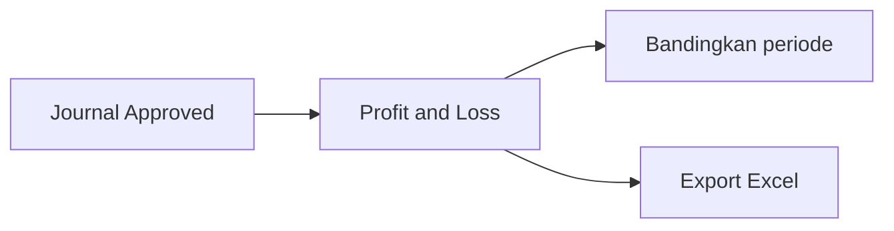

# Panduan Pengguna — Profit & Loss

**Siapa yang baca:** Finance / Controller  
**Menu:** Finance Accounting → Profit & Loss  
**Route:** `/accounting/profit-loss`

---

## 1. Apa Itu & Kenapa Penting

**Profit & Loss** menampilkan laba rugi perusahaan dari akun pendapatan, beban, dan HPP berdasarkan journal yang sudah disetujui. Dipakai untuk melihat performa per periode dan membandingkan beberapa periode sekaligus, lalu export ke Excel bila perlu.

---

## 2. Overview Flow & Proses Bisnis

**Versi teks:**

1. Transaksi di modul lain menghasilkan journal.  
2. Setelah journal **Approved**, angka masuk laporan ini ([cara hitung](#sf-lingo:SF-PL-03)).  
3. Kamu pilih periode → **[Apply](#sf-lingo:SF-PL-01)** → baca tabel.  
4. Opsional [bandingkan sampai 11 periode](#sf-lingo:SF-PL-02) ke belakang, lalu [export](#sf-lingo:SF-PL-05).

### Status

Menu ini **tidak punya status dokumen**. Yang penting: journal sumber harus **Approved** agar masuk angka (kecuali kasus khusus akun Current Profit/Loss yang masih dalam tinjauan Finance/Dev).

---

## 3. Sebelum Mulai

- Chart of Account untuk Revenue / Expense / COGS / Other sudah lengkap.  
- Journal di periode yang ingin dilihat sudah **Approved**.  
- Kamu punya akses menu Profit & Loss.

🎬 [Interactive demo akan ditambahkan di sini]

---

## 4. Setelah Selesai

- Tidak ada “approve” di menu ini — laporan hanya dibaca.  
- Kalau export, unduh file dari progress/log export.  
- Untuk analisa per produk atau sales order, pakai menu Product / Sales Order Profit Loss (bukan menu ini).

---

## 5. Yang Perlu Diperhatikan

- Kalau kamu belum klik **[Apply](#sf-lingo:SF-PL-01)**, tabel belum terisi.  
- Kalau kamu lihat angka 0 padahal ada transaksi, cek dulu apakah journal sudah Approved dan tanggalnya masuk filter ([sumber angka](#sf-lingo:SF-PL-03)).  
- Kalau pendapatan terlihat negatif, itu perilaku laporan saat ini (debit dikurangi credit) — beda dari tampilan Dev Profit & Loss.  
- Kalau kamu pilih [Compared Period](#sf-lingo:SF-PL-02) besar + rentang panjang, laporan bisa lambat — mulai dari 1–2 periode dulu.  
- Kalau export bilang tidak ada data, longgarkan filter atau pastikan ada journal Approved.  
- **Contoh:** 1 Apr–15 Mei (45 hari), Compared = 2 → tiga kolom jendela 45 hari mundur. Amount baru 8 jt vs lama 6 jt ≈ naik 33% ([%](#sf-lingo:SF-PL-04) hijau).

---

## 6. Langkah-Langkah

1. Buka **Profit & Loss**.  
2. Set **tanggal awal–akhir** (default: bulan berjalan). Opsional pakai preset 1/2/3 minggu atau 1 bulan ([Period & Apply](#sf-lingo:SF-PL-01)).  
3. Pilih **[Compared Period](#sf-lingo:SF-PL-02)** (None sampai 11).  
4. Klik **Apply**.  
5. Baca tabel per class akun; hover amount untuk melihat penjelasan periode. Cek **[%](#sf-lingo:SF-PL-04)** antar kolom.  
6. Opsional **[Export All](#sf-lingo:SF-PL-05)** → tunggu file Excel siap.

🎬 [Interactive demo akan ditambahkan di sini]

---

## 7. Tips & Hal yang Sering Bikin Bingung

- **Ini bukan Dev Profit & Loss** — menu produksi punya bandingkan periode + export.  
- **Bulan kalender penuh** (mis. 1–31 Maret) dibandingkannya per bulan, bukan “jumlah hari yang sama” — beda sedikit dari jendela tanggal bebas.  
- **Filter toko/tag** belum ada di menu ini.  
- **Tidak ada baris Laba Kotor / Laba Bersih** terpisah saat ini — yang ada total per class akun.  
- Butuh detail journal → buka menu **Journal** untuk periode yang sama.

---

## 8. Referensi

| Sumber | Untuk apa |
|--------|-----------|
| [Knowledge Base](./knowledge-base.md) | Troubleshooting |
| [Feature Map](./feature-map.md) | Indeks Lingo / sub-feature |
| [Requirement](./requirement.md) | Aturan & Gap |
| [Technical](./technical.md) | Developer |
| [Dev - Profit & Loss](../accounting-profit-loss-v1/user-guide.md) | Versi legacy |
| [Journal](../journal/) | Sumber angka |
| [Product Profit Loss](../accounting-product-profit-loss/) | Analisa per produk |
