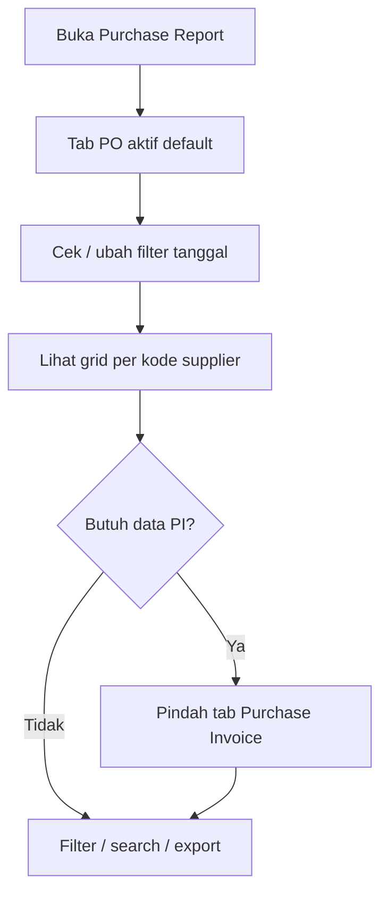

# Purchase Report — Knowledge Base

## 1. Apa itu Purchase Report?

Laporan pembelian **per SKU per supplier**. Satu menu, **dua tab**:

- **Purchase Order** — isi dari dokumen PO (**TO-BE:** + retur **unbilled**)  
- **Purchase Invoice** — isi dari dokumen PI / faktur beli (**TO-BE:** + retur **billed**)

Data digroup per **kode supplier** (bukan nama). Ini **bukan** laporan utang (Account Payable Report), dan **tidak** menghubungkan PO ke PI di dalam grid.

**Path:** Accounting → Report → **Purchase Report**  
**Route:** `/accounting/purchase-report`

---

## 2. Alur kerja standar

1. Buka menu — tab **Purchase Order** langsung menampilkan data (default filter tanggal = **bulan ini**).  
2. Lihat group per **kode** supplier; total supplier ada di header group (kanan).  
3. Butuh faktur beli → klik tab **Purchase Invoice** (data terpisah).  
4. Filter, search, atau export sesuai kebutuhan.

**Contoh:** Cari semua baris PO supplier dengan kode/nama LUKAS di bulan berjalan → tetap di tab Purchase Order, filter/search — hasil grid menampilkan **kode**. Untuk PI supplier yang sama → pindah tab Purchase Invoice.

**Supplier tampilan:** kode saja di grid, header group, dan export. Cari tetap boleh by nama atau kode. Nama hanya di Print (jika ada).

---

## 3. Kolom penting

| Kolom | Arti singkat |
|-------|----------------|
| Trx. Code | Nomor PO/PI/(TO-BE return) — klik untuk buka dokumen |
| Type | Purchase Order / Purchase Invoice / (**TO-BE**) Purchase Return |
| SKU / Qty / Unit | Baris barang · **TO-BE return:** qty **negatif** |
| Unit Price / Total Price | Harga baris (tanpa Other Cost/Disc dokumen) · return = negatif |
| Total Tagihan | **AS-IS:** nilai line. **TO-BE (ETM-16011):** kolom **disembunyikan** — pakai Total Price; total supplier tetap di header group |
| Currency | Sesuai transaksi / POV |
| Trx. Status | **AS-IS:** semua. **TO-BE:** hanya Approved / Processed / Complete |

---

## 4. Filter & export

- **Search / Advanced Filter** — tanggal, kode, SKU, supplier, status, dll.  
- **Export All** / **This Page** — terpisah per tab (PO vs PI punya daftar file export sendiri).  
- Kolom yang di-hide mengikuti preferensi Columns (**TO-BE:** Total Tagihan tidak ada di daftar).

---

## 5. Bisa / Tidak bisa

| Bisa | Tidak bisa |
|------|------------|
| Lihat PO/PI (**TO-BE:** + return) status Approved/Processed/Complete | Campur PO+PI dalam satu tabel |
| PO With PR dan Without PR | Pakai report ini sebagai aging AP |
| Hyperlink ke dokumen sumber | Mengedit transaksi dari report |
| Export per tab | Menghubungkan kolom PI ke nomor PO di report ini |
| (**TO-BE**) Lihat net pembelian − return di group supplier | Mengubah currency di form Purchase Return dari report |

---

## 6. Troubleshooting

| Gejala | Solusi |
|--------|--------|
| Tidak ketemu PI | Pastikan tab **Purchase Invoice** |
| Data sepi | Longgarkan filter **Trx. Date** (default bulan berjalan); cek status dokumen (TO-BE: Draft tidak ikut) |
| Total Price ≠ grand total dokumen | Other Cost/Disc sengaja tidak dihitung |
| Export file tab salah | Cek export dari tab yang sama (PO/PI) |
| (**TO-BE**) Return tidak muncul | Cek tipe: unbilled hanya di tab PO; billed hanya di tab PI; status harus Approved/Processed/Complete |

---

## 7. FAQ

**Q: Kenapa tidak bisa lihat PO dan PI sekaligus?**  
A: Sengaja — satu tab satu sumber supaya jelas dan tidak tercampur.

**Q: Default tanggal 30 hari?**  
A: Di sistem sekarang defaultnya **bulan kalender berjalan**. Ubah lewat Advanced Filter bila perlu.

**Q: Draft PO ikut?**  
A: **AS-IS:** ya. **TO-BE (ETM-16011):** tidak — hanya Approved / Processed / Complete.

**Q: Kenapa header group hanya kode supplier?**  
A: Kebijakan tampilan code-only. Cari tetap by nama; nama tidak di grid/export; Print boleh menampilkan nama.

**Q: (TO-BE) Return unbilled vs billed di mana?**  
A: Unbilled di tab **Purchase Order**; billed di tab **Purchase Invoice**. Angka return **negatif**.

**Q: (TO-BE) Hilang kolom Total Tagihan?**  
A: Ya — sengaja; isinya sama dengan Total Price. Total per supplier tetap di header group.

---

## 8. Referensi

- [requirement.md](./requirement.md) — aturan bisnis & gap (GAP-PURREP-03 / ETM-16011)  
- [user-guide.md](./user-guide.md) — panduan singkat end-user  
- [Purchase Return](../accounting-purchase-return/) — sumber retur
