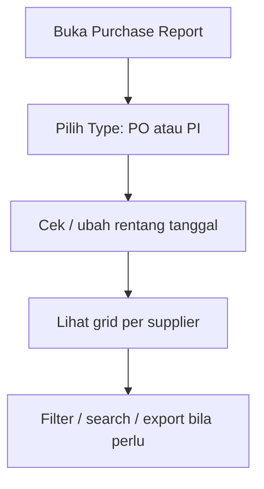

# Purchase Report — Knowledge Base

## 1. Apa itu Purchase Report?

Laporan pembelian **per SKU per supplier**. Satu menu, dua sudut pandang — pilih dulu **Purchase Order** atau **Purchase Invoice**. Data digroup per nama supplier, lengkap dengan akumulasi tagihan.

**Path:** Accounting → Report → **Purchase Report**  
**Route (rencana):** `/accounting/purchase-report`

Ini **bukan** Account Payable Report (utang supplier). Juga tidak menghubungkan PO ke PI di dalam laporan.

---

## 2. Alur kerja standar

**Keterangan langkah:**

1. Saat pertama buka, tabel **kosong** sampai Type dipilih.
2. Tanggal default **30 hari terakhir** — boleh diubah.
3. Ganti Type = ganti seluruh data (PO tidak dicampur dengan PI).
4. Nama supplier jadi header group; angka Total Tagihan mengikuti akumulasi di group.

---

## 3. Kolom penting

| Kolom | Arti singkat |
|-------|----------------|
| Trx. Code | Nomor PO/PI — klik untuk buka dokumen |
| SKU / Qty / Unit | Baris barang |
| Unit Price / Total Price | Harga baris (tanpa Other Cost/Disc) |
| Total Tagihan | Akumulasi Total Price dalam supplier yang sama |
| Currency | Sesuai transaksi (tidak dipaksa IDR) |
| Trx. Status | Semua status ikut tampil |

---

## 4. Filter & export

- **Search:** kode transaksi, SKU, supplier  
- **Advanced Filter:** tanggal, type, kode, SKU, supplier, status  
- **Export All** / **This Page Only** — kolom yang di-hide ikut tidak diexport  

---

## 5. Troubleshooting

| Gejala | Solusi |
|--------|--------|
| Tabel kosong | Pilih **Type Transaction** dulu |
| Data terlalu banyak / lambat | Persempit **Trx. Date** |
| Cari PI di mode PO | Ganti Type ke Purchase Invoice |
| Total Price beda dengan total dokumen | Other Cost/Disc sengaja tidak dihitung di report ini |

---

## 6. FAQ

**Q: Kenapa tidak bisa lihat PO dan PI sekaligus?**  
A: Sengaja satu POV per load agar jelas dan ringan.

**Q: Apakah termasuk PO With PR dan Without PR?**  
A: Ya, keduanya.

**Q: Apakah ini laporan utang (AP)?**  
A: Tidak.

---

## Related Documents

| Doc | Path |
|-----|------|
| Requirement | [requirement.md](./requirement.md) |
| Technical | [technical.md](./technical.md) |
| Purchase Order | [../supplychain-purchase-order/knowledge-base.md](../supplychain-purchase-order/knowledge-base.md) |
| Purchase Invoice | [../accounting-supplier-invoice/knowledge-base.md](../accounting-supplier-invoice/knowledge-base.md) |
