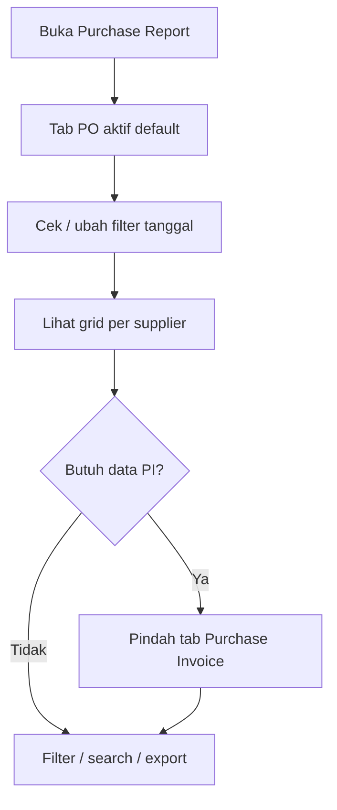

# Purchase Report — Knowledge Base

## 1. Apa itu Purchase Report?

Laporan pembelian **per SKU per supplier**. Satu menu, **dua tab**:

- **Purchase Order** — isi dari dokumen PO  
- **Purchase Invoice** — isi dari dokumen PI (faktur beli)

Data digroup per nama supplier. Ini **bukan** laporan utang (Account Payable Report), dan **tidak** menghubungkan PO ke PI di dalam grid.

**Path:** Accounting → Report → **Purchase Report**  
**Route:** `/accounting/purchase-report`

---

## 2. Alur kerja standar

1. Buka menu — tab **Purchase Order** langsung menampilkan data (default filter tanggal = **bulan ini**).  
2. Lihat group per supplier; total supplier ada di header group (kanan).  
3. Butuh faktur beli → klik tab **Purchase Invoice** (data terpisah).  
4. Filter, search, atau export sesuai kebutuhan.

**Contoh:** Cari semua baris PO supplier LUKAS di bulan berjalan → tetap di tab Purchase Order, filter/search supplier atau kode `PO-…`. Untuk PI supplier yang sama → pindah tab Purchase Invoice.

---

## 3. Kolom penting

| Kolom | Arti singkat |
|-------|----------------|
| Trx. Code | Nomor PO/PI — klik untuk buka dokumen |
| SKU / Qty / Unit | Baris barang |
| Unit Price / Total Price | Harga baris (tanpa Other Cost/Disc dokumen) |
| Total Tagihan | Nilai line; jumlah supplier di **header group** |
| Currency | Sesuai transaksi |
| Trx. Status | Semua status ikut tampil |

---

## 4. Filter & export

- **Search / Advanced Filter** — tanggal, kode, SKU, supplier, status, dll.  
- **Export All** / **This Page** — terpisah per tab (PO vs PI punya daftar file export sendiri).  
- Kolom yang di-hide mengikuti preferensi Columns.

---

## 5. Bisa / Tidak bisa

| Bisa | Tidak bisa |
|------|------------|
| Lihat semua status PO/PI | Campur PO+PI dalam satu tabel |
| PO With PR dan Without PR | Pakai report ini sebagai aging AP |
| Hyperlink ke dokumen sumber | Mengedit transaksi dari report |
| Export per tab | Menghubungkan kolom PI ke nomor PO di report ini |

---

## 6. Troubleshooting

| Gejala | Solusi |
|--------|--------|
| Tidak ketemu PI | Pastikan tab **Purchase Invoice** |
| Data sepi | Longgarkan filter **Trx. Date** (default bulan berjalan) |
| Total Price ≠ grand total dokumen | Other Cost/Disc sengaja tidak dihitung |
| Export file tab salah | Cek export dari tab yang sama (PO/PI) |

---

## 7. FAQ

**Q: Kenapa tidak bisa lihat PO dan PI sekaligus?**  
A: Sengaja — satu tab satu sumber supaya jelas dan tidak tercampur.

**Q: Default tanggal 30 hari?**  
A: Di sistem sekarang defaultnya **bulan kalender berjalan**. Ubah lewat Advanced Filter bila perlu.

**Q: Draft PO ikut?**  
A: Ya — semua status ikut, selama tidak soft-deleted.

---

## 8. Referensi

- [requirement.md](./requirement.md) — aturan bisnis & gap  
- [user-guide.md](./user-guide.md) — panduan singkat end-user  
