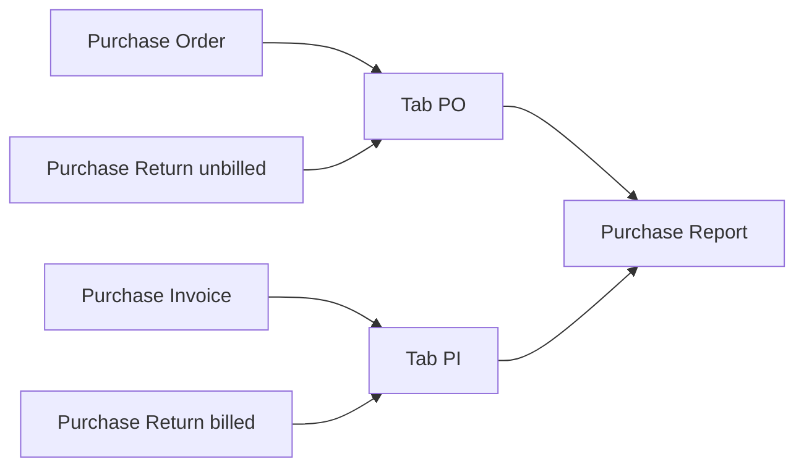

# Purchase Report — Requirement Documentation

**Modul:** Accounting → Report  
**Menu UI:** **Purchase Report** (`/accounting/purchase-report`)  
**Audience:** PM, QA, Procurement, Finance, Developer  
**Status:** **AS-IS** v2.1 + **TO-BE** GAP-PURREP-03 (ETM-16011)  
**SoT:** [`_meta/sot/accounting-purchase-report-source-of-truth.md`](../_meta/sot/accounting-purchase-report-source-of-truth.md) v1.0  
**Jira SoT:** [ETM-15673](https://erpintegration.atlassian.net/browse/ETM-15673) (POV PO) · [ETM-15674](https://erpintegration.atlassian.net/browse/ETM-15674) (POV PI) · [ETM-16011](https://erpintegration.atlassian.net/browse/ETM-16011) (return + status + hide Total Tagihan)

---

## 0. Metadata & Changelog

| Version | Date | Author | Changes |
|---------|------|--------|---------|
| 1.0 | 2026-08-12 | QA - Yemima | TO-BE awal (belum implementasi) |
| 2.0 | 2026-08-31 | QA - Yemima | AS-IS dari ETM-15673/15674 + verifikasi kode; shell = dual tab |
| 2.1 | 2026-09-02 | QA - Yemima | Supplier display **code-only** (ETM-15729): group header = **Supplier Code** + total; ColVis/export tanpa name |
| 2.2 | 2026-09-23 | QA - Yemima | **GAP-PURREP-03** (ETM-16011): return unbilled/billed, status filter, qty negatif, hide Total Tagihan |

---

## 1. Ringkasan Eksekutif

**Purchase Report** adalah report **read-only** yang menampilkan pembelian **per SKU**, digroup per **Supplier**, dengan **dua POV** dalam satu menu:

| Tab (POV) | Sumber baris (AS-IS) | Sumber baris (TO-BE · GAP-PURREP-03) |
|-----------|----------------------|-------------------------------------|
| **Purchase Order** | Detail PO (With PR + Without PR) | PO + Purchase Return **unbilled** |
| **Purchase Invoice** | Detail Purchase Invoice / Supplier Invoice | PI + Purchase Return **billed** |

Satu load API = satu POV — **tidak** menampilkan PO dan PI bersamaan. **Tidak** terkait Account Payable Report. POV PO **tidak** mereferensikan PI (dan sebaliknya).

---

## 2. UI / UX (AS-IS)

### 2.1 Shell Type — dual tab (implementasi sekarang)

| Control | Rule AS-IS |
|---------|------------|
| **Tab Purchase Order / Purchase Invoice** | Satu menu; ganti tab = ganti dataset (`select_menu`) |
| Default tab | **Purchase Order** (tab pertama) — data load langsung |
| Trx. Date filter | Advanced Filter default: **awal–akhir bulan berjalan** (boleh diubah) |
| Global Search | Ya |
| Advanced Filter | Ya (SearchBuilder) |
| Columns Show/Hide | Ya |
| Export | Export All (async) · This Page · file list **per** tab |

> Draft card menyebut “blank sampai Type” + default **30 hari**. AS-IS shell = tab (bukan blank). Default tanggal: lihat **GAP-PURREP-01**.

### 2.2 Grouping & Total Tagihan

- Group header = **Supplier Code** + nominal total supplier (kanan header) — **bukan** nama supplier (ETM-15729 / parent ETM-15721).
- Total supplier = sum line amounts terfilter untuk supplier itu (**TO-BE:** termasuk line return negatif).
- Kolom **Total Tagihan** per baris = amount line (bukan running Excel per row) — **GAP-PURREP-02**.
- **TO-BE (GAP-PURREP-03 / ETM-16011):** kolom **Total Tagihan di-hide** (UI + export) — redundan dengan Total Price; total supplier tetap di header group.
- Group/sort key konsisten ke `supplier_code` saat mode code-only.

**Contoh konsep (card PI):** baris TROLIK100 → TROLIK80 → … Total Price bertambah; di UI, penjumlahan supplier tampil di **header group** berlabel **kode** supplier.

### 2.2b Supplier Display (code-only) — ETM-15729

Berlaku **semua role**. Exception nama: **Print** saja (jika ada).

| Surface | Rule |
|---------|------|
| Data List (tab PO & PI) | Kolom Supplier = **code only** |
| **Group header supplier** | **Supplier Code** + total (bukan name) |
| Column Show/Hide (ColVis) | **Tanpa** opsi Supplier Name |
| Advanced Filter / Search | Match **code + name**; tampilan grid/header = **code**; **tanpa** hover nama |
| Export per tab | **Tanpa** name |
| Print (jika ada) | Name **boleh** |

Jangan menambah field/surface Supplier Name di UI report.

### 2.3 Kolom

| Kolom | Keterangan |
|-------|------------|
| ID. Trx | Id detail |
| Trx. Date | Tanggal transaksi header |
| Type Transaction | **AS-IS:** Purchase Order / Purchase Invoice. **TO-BE:** + **Purchase Return** untuk baris return |
| Trx. Code | Hyperlink ke dokumen sumber (**TO-BE return** → edit Purchase Return) |
| SKU / Name | System Product |
| Description | PO: header; PI: line |
| Qty / Unit | PO order qty / PI invoice qty · **TO-BE return:** qty return (**negatif**) |
| DPP / VAT / Currency | Currency **as-is** dari dokumen POV |
| Unit Price | Line before disc before VAT |
| Total Price | Line product — **tanpa** Other Cost/Disc · **TO-BE return:** negatif |
| Total Tagihan | **AS-IS:** Line amount (+ total di header group). **TO-BE:** kolom **di-hide** |
| Trx. Status | **AS-IS:** Semua status. **TO-BE:** hanya Approved / Processed / Complete |

---

## 3. Business rules

| ID | Rule | Sumber |
|----|------|--------|
| R-01 | Tab PO → data PO (+ return unbilled TO-BE); tab PI → data PI (+ return billed TO-BE) | ETM-15673/15674 · ETM-16011 |
| R-02 | PO: With PR + Without PR | ETM-15673 |
| R-03 | **AS-IS:** Semua status dokumen masuk. **TO-BE:** PO/PI/Return hanya **Approved / Processed / Complete** | ETM-16011 |
| R-04 | Currency as-is dari dokumen POV (PO tab→PO; PI tab→PI; return unbilled→PO; return billed→PI) | ETM-15673/15674 · ETM-16011 |
| R-05 | Tidak join/relasi PO↔PI di report | ETM-15673/15674 |
| R-06 | Tidak relasi Account Payable Report | ETM-15673/15674 |
| R-07 | Total Price exclude Other Cost & Other Disc | ETM-15673/15674 |
| R-08 | Hyperlink Trx. Code ke edit PO / PI / (**TO-BE**) Purchase Return | ETM-15673/15674 · ETM-16011 |
| R-09 | Company scope `owned_by` | Kode |
| R-10 | Soft-deleted tidak tampil | Kode |
| R-11 | Supplier UI/export = code only; group header = code + total | ETM-15729 / ETM-15721 |
| R-12 | **TO-BE:** Baris return: Type = Purchase Return; qty & nominal line **negatif** | ETM-16011 |
| R-13 | **TO-BE:** Hide kolom Total Tagihan (UI + export) | ETM-16011 |

---

## 3b. GAP-PURREP-03 — Purchase Return + status filter (TO-BE · ETM-16011)

### Sumber data

| Tab | Sumber positif | Sumber negatif (return) |
|-----|----------------|-------------------------|
| Purchase Order | PO detail | Purchase Return **unbilled** (`type_billed = 0`) |
| Purchase Invoice | PI detail | Purchase Return **billed** (`type_billed = 1`) |

Supplier return mengikuti group/filter supplier yang sama.

### Status (semua sumber)

| Dokumen | Status yang masuk report |
|---------|--------------------------|
| Purchase Order | Approved, Processed, Complete |
| Purchase Invoice | Approved, Processed, Complete |
| Purchase Return | Approved, Processed, Complete |

### Angka & nominal baris return

| Field | Aturan |
|-------|--------|
| Qty | Dari qty return, **negatif** |
| Unit Price / DPP / VAT / Total Price / Currency | Tab PO+unbilled → dari **PO**; tab PI+billed → dari **PI** |
| Type | `Purchase Return` |
| Trx. Code | Link ke `/accounting/purchase-return/edit/{id}` |

**Contoh kasus:**

| Situasi | Hasil di report |
|---------|-----------------|
| PO 10 pcs + return unbilled 2 pcs (Approved) | Baris PO +10; baris return −2; total group net 8 (× harga PO) |
| PI IDR + return billed; PO asalnya USD | Baris return pakai **currency/harga PI** (selaras Debit Note) |
| Return Draft | Tidak muncul |

### Currency / Debit Note (konteks, bukan ubah form return)

| Tipe return | Saat approve | Currency |
|-------------|--------------|----------|
| **Billed** | Generate **Debit Note** | DN = currency + rate + harga dari **PI** |
| **Unbilled** | Journal saja (tanpa DN) | Journal header = primary currency |

Form Purchase Return (tampilan harga masih dari PO) **tidak diubah** di card ini — wait & see end user.

### UI

- Hide kolom **Total Tagihan** di datalist & export kedua tab.
- Total supplier di **header group** tetap (sum line termasuk return negatif).

---

## 4. Sumber field (mapping)

| Kolom | Purchase Order | Purchase Invoice | Purchase Return (TO-BE) |
|-------|----------------|------------------|-------------------------|
| Trx. Date | PO transaction date | PI transaction date | Return transaction date |
| Trx. Code | PO code → edit PO | PI code → edit supplier-invoice | Return code → edit purchase-return |
| SKU / Qty / Unit / DPP / VAT / Unit Price | PO Detail | PI Detail | Qty return (−); harga/currency dari PO (unbilled) atau PI (billed) |
| Description | PO header | PI detail line | Sesuai implementasi (header/line return) |
| Total Price | Line PO (product) | Line invoice total (product) | Negatif |
| Status | PO header (filtered) | PI header (filtered) | Return header (filtered) |
| Supplier | PO supplier (**code** display) | PI supplier (**code** display) | Return supplier (**code** display) |

---

## 5. Export

| Mode | Behavior |
|------|----------|
| Export All | Async batch; filter aktif; terpisah per `select_menu` |
| This Page Only | Halaman aktif |
| Progress / file list | Per tab (PO vs PI) |

---

## 6. Out of scope

- Chart / KPI dashboard  
- Campur PO+PI satu load  
- AP aging / settlement  
- Kolom linkage PO→PI atau PI→PO  
- Ubah tampilan currency/harga di form Purchase Return (ETM-16011 wait & see)  
- Bug summary Total Tagihan kanan atas vs global search (bukan bagian SOT ini)

---

## 7. Acceptance Criteria

### AS-IS (tetap)

- [x] Menu Accounting → Report → Purchase Report + privilege  
- [x] Dual tab PO / PI; dataset terisolasi  
- [x] Group Supplier (**code**) + total di header group  
- [x] Hyperlink; Search/Filter/Columns/Export per tab  
- [x] Tidak ada relasi AP atau PO↔PI  
- [ ] Supplier ColVis tanpa Name; export tanpa name; group header code-only (ETM-15729)

### TO-BE GAP-PURREP-03 (ETM-16011)

- [ ] Tab PO: PO + return unbilled; tab PI: PI + return billed (status Approved/Processed/Complete)  
- [ ] Baris return: Type Purchase Return; qty & nominal negatif; link ke Purchase Return  
- [ ] Nominal/currency: unbilled→PO, billed→PI  
- [ ] Kolom Total Tagihan hidden (UI + export)

---

## 8. Gap Registry

| ID | Ringkas | Status |
|----|---------|--------|
| GAP-PURREP-01 | Card: default 30 hari · FE: bulan berjalan | Open — docs ikuti FE |
| GAP-PURREP-02 | Card: running Excel per row · FE/BE: line + sum header | Open — docs ikuti kode |
| GAP-PURREP-03 | Return unbilled/billed + status filter + qty negatif + hide Total Tagihan | Open — ETM-16011 |

---

## 9. Related Documents

| Doc | Path |
|-----|------|
| SoT | [../_meta/sot/accounting-purchase-report-source-of-truth.md](../_meta/sot/accounting-purchase-report-source-of-truth.md) |
| Knowledge Base | [knowledge-base.md](./knowledge-base.md) |
| Technical | [technical.md](./technical.md) |
| User Guide | [user-guide.md](./user-guide.md) |
| Feature Map | [feature-map.md](./feature-map.md) |
| Purchase Order | [../supplychain-purchase-order/](../supplychain-purchase-order/) |
| Purchase Invoice | [../accounting-supplier-invoice/](../accounting-supplier-invoice/) |
| Purchase Return | [../accounting-purchase-return/](../accounting-purchase-return/) |
