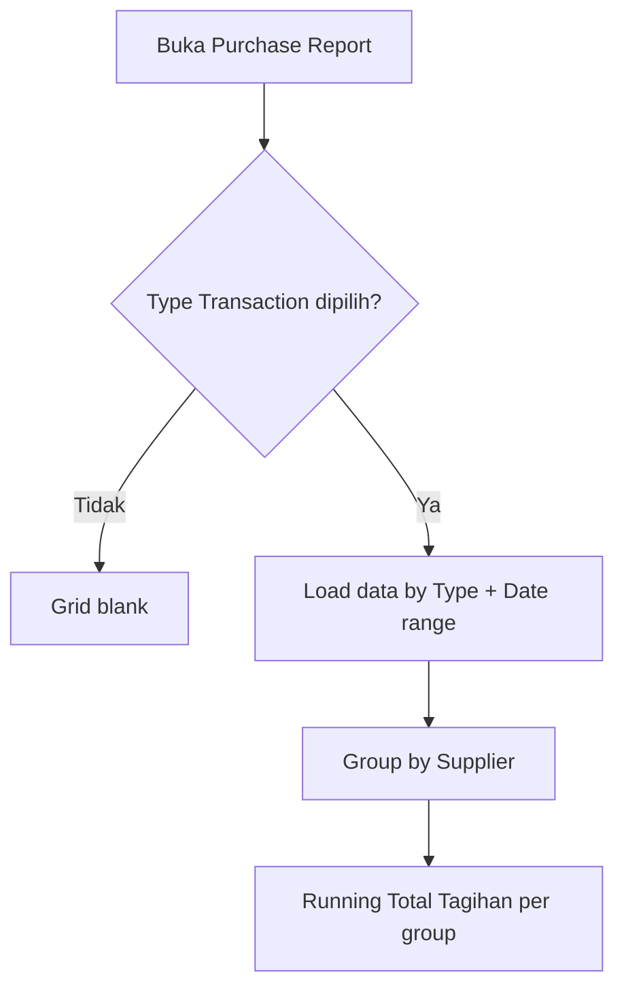

# Purchase Report — Requirement Documentation

**Modul:** Accounting → Report  
**Menu UI:** **Purchase Report** (`/accounting/purchase-report`)  
**Audience:** PM, QA, Procurement, Finance, Developer  
**Status:** TO-BE v1.0 — belum implementasi

**Sumber user:** `Template Report Pembelian SKU per Supplier (1).xlsx` (UI & INFO + Format Export)

---

## 0. Metadata & Changelog

| Version | Date | Author | Changes |
|---------|------|--------|---------|
| 1.0 | 2026-08-12 | QA - Yemima | Initial TO-BE dari template user + keputusan UI/UX (Accounting Report, all status, Excel Total Tagihan) |

---

## 1. Ringkasan Eksekutif

**Purchase Report** adalah report **read-only** yang menampilkan pembelian **per SKU**, digroup per **Supplier**, dengan dua POV yang dipilih user:

| Type Transaction | Sumber baris |
|------------------|--------------|
| **Purchase Order** | Detail PO (With PR + Without PR) |
| **Purchase Invoice** | Detail PI |

Satu grid — **tidak** menampilkan PO dan PI bersamaan. **Tidak** terkait Account Payable Report. POV PO **tidak** mereferensikan PI (dan sebaliknya).

---

## 2. UI / UX

### 2.1 Layout

| Control | Rule |
|---------|------|
| **Type Transaction** | Radio/segment: Purchase Order \| Purchase Invoice — **wajib**; gate blank |
| **Trx. Date** | Range **wajib**; **default last 30 days** (editable) — proteksi query |
| Global Search | Trx. Code, SKU, Supplier (contains) |
| Advanced Filter | Trx. Date, Type, Trx. Code, SKU, Supplier, Status |
| Columns Show/Hide | Ya |
| Export | Export All (filter) · This Page Only · hormati visible columns |

### 2.2 Grouping & Total Tagihan

- Group header = **nama Supplier**
- **Total Tagihan** = running sum `Total Price` dalam group (sama Excel):

| Row | Total Tagihan |
|-----|---------------|
| 1 | = Total Price₁ |
| 2 | = Total Tagihan₁ + Total Price₂ |
| n | = Total Tagihanₙ₋₁ + Total Priceₙ |

- Akumulasi ditampilkan di **header grouping** supplier (design Excel: nominal di area Total Tagihan group).
- Order default: **Trx. Date desc** (dalam batasan group).

### 2.3 Kolom

| Kolom | Visible default | Keterangan |
|-------|-----------------|------------|
| ID. Trx | true | ID detail PO/PI per SKU |
| Trx. Date | true | Transaction date header |
| Type Transaction | true | Purchase Order / Purchase Invoice |
| Trx. Code | true | Hyperlink ke dokumen |
| SKU | true | System Product SKU |
| Description | true | Description line |
| Qty | true | PO Qty / PI Qty |
| Unit | true | |
| DPP | true | |
| VAT | true | |
| Currency | true | **As-is** per trx |
| Unit Price | true | Sebelum disc / after VAT sesuai kolom sumber UI |
| Total Price | true | Line only — **tanpa** Other Cost/Disc |
| Total Tagihan | true | Running per supplier |
| Trx. Status | true | Semua status dokumen |
| Data Owner | true | |
| Created At / By | true | |

Supplier = group key (di export menjadi kolom flat).

---

## 3. Business rules

| ID | Rule |
|----|------|
| R-01 | Blank sampai Type dipilih |
| R-02 | Date range wajib (default 30 hari) |
| R-03 | Type PO → hanya data PO; Type PI → hanya data PI |
| R-04 | PO: With PR + Without PR |
| R-05 | Semua status dokumen masuk |
| R-06 | Currency as-is (tidak convert paksa ke IDR) |
| R-07 | Tidak ada join/relasi PO↔PI di report |
| R-08 | Tidak ada relasi ke Account Payable Report |
| R-09 | Total Price exclude Other Cost & Other Disc |
| R-10 | Data Owner / company scope seperti report Accounting lain |

---

## 4. Sumber field (mapping)

| Kolom | Purchase Order | Purchase Invoice |
|-------|----------------|------------------|
| Trx. Date | PO Transaction Date | PI Transaction Date |
| Trx. Code | PO code | PI code |
| SKU / Description / Qty / Unit | PO Detail | PI Detail |
| DPP / VAT / Unit Price | PO Detail | PI Detail |
| Total Price | PO Detail Total Price | PI line Invoice Total |
| Status / Owner / Created | PO header | PI header |
| Supplier | PO Supplier | PI Supplier |

---

## 5. Export

| Mode | Behavior |
|------|----------|
| Export All | Sesuai filter aktif |
| This Page Only | Halaman aktif |
| Format | Flat rows + kolom Supplier; Total Tagihan running dipertahankan |
| Columns | Ikuti Show/Hide user |

---

## 6. Out of scope

- Chart / KPI dashboard  
- Campur PO+PI satu load  
- AP aging / settlement  
- Kolom linkage PO→PI atau PI→PO  

---

## 7. Acceptance Criteria

- [ ] Menu Accounting → Report → Purchase Report + privilege
- [ ] Blank sampai Type; Date default 30 hari
- [ ] Switch PO/PI dataset benar; group Supplier + Total Tagihan Excel-accurate
- [ ] All status; PO With+Without PR; currency as-is
- [ ] Hyperlink; Search/Filter/Columns/Export
- [ ] Tidak ada relasi AP atau PO↔PI

---

## 8. Related Documents

| Doc | Path |
|-----|------|
| Knowledge Base | [knowledge-base.md](./knowledge-base.md) |
| Technical | [technical.md](./technical.md) |
| Purchase Order | [../supplychain-purchase-order/](../supplychain-purchase-order/) |
| Purchase Invoice | [../accounting-supplier-invoice/](../accounting-supplier-invoice/) |
