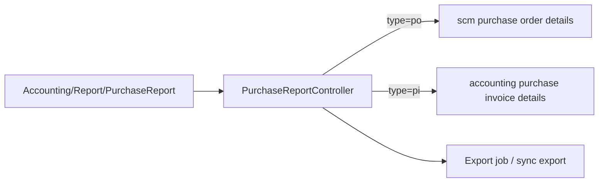

# Purchase Report — Technical Documentation

**Behavior SoT:** [requirement.md](./requirement.md) v1.0 (TO-BE)  
**UI route (proposed):** `/accounting/purchase-report`  
**API prefix (proposed):** `accounting/purchase-report`

---

## 1. Architecture (TO-BE)

- Read-only report; **no** snapshot table required for v1 (query on demand) — optional cache later if slow.
- **Must not** join PO↔PI for display columns.
- Company / Data Owner scope via existing Accounting report patterns.

---

## 2. Suggested file map

| Layer | Path (proposed) |
|-------|-----------------|
| FE | `olshoperp-frontend/src/pages/Accounting/Report/PurchaseReport/**` |
| BE | `Modules/Accounting/Http/Controllers/PurchaseReportController.php` |
| Export | `Modules/Accounting/Exports/PurchaseReportExport.php` (+ job if async) |
| Routes | `Modules/Accounting/Routes/api.php` |
| Gate menu | seed / `gate_menus` — parent Report Accounting |

---

## 3. API (proposed)

| Method | Path | Notes |
|--------|------|-------|
| GET | `/accounting/purchase-report` | Datalist; require `type` ∈ {`purchase_order`,`purchase_invoice`}; require date from/to |
| GET | `/accounting/purchase-report/export` | Export All / page; respect columns |

Query params: `type`, `date_from`, `date_to`, search/filter builders, pagination.

**400 / empty:** missing `type` → FE shows blank (no full-table query).

---

## 4. Query notes

### Purchase Order mode

- From PO detail (+ header: supplier, code, date, status, currency, owned_by, audit).
- Include With PR & Without PR.
- All `transaction_status` values.
- Line total = product line total (exclude other cost/disc tables).

### Purchase Invoice mode

- From PI detail (+ header fields parallel).
- All statuses.
- Line total = invoice line total (exclude other cost/disc).

### Total Tagihan

Computed in result set **per supplier partition** ordered by `transaction_date` desc (or stable sort documented in AC):

`running_sum = sum(total_price) over (partition by supplier_id order by … rows unbounded preceding)`

FE row-group header shows last running / group sum per Excel design.

---

## 5. Invariants

| ID | Invariant |
|----|-----------|
| INV-01 | Never return mixed PO+PI rows in one response |
| INV-02 | No FK traversal PO↔PI for this report |
| INV-03 | Currency fields not auto-converted |
| INV-04 | Date range required server-side |

---

## 6. Testing notes

1. Missing type → no heavy query / blank UI  
2. PO mode: only PO codes; With+Without PR; all statuses  
3. PI mode: only PI codes  
4. Running Total Tagihan matches Excel example math  
5. Export flat + Supplier column; hide column respected  
6. Hyperlink targets correct FE routes  

---

## Related Documents

| Doc | Path |
|-----|------|
| Requirement | [requirement.md](./requirement.md) |
| Knowledge Base | [knowledge-base.md](./knowledge-base.md) |
| Purchase Order technical | [../supplychain-purchase-order/technical.md](../supplychain-purchase-order/technical.md) |
| Purchase Invoice technical | [../accounting-supplier-invoice/technical.md](../accounting-supplier-invoice/technical.md) |
