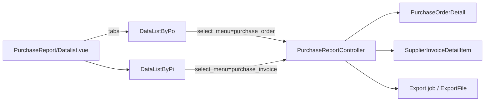

# Purchase Report — Technical Documentation

**Behavior SoT:** [requirement.md](./requirement.md) v2.0 (AS-IS) · [_meta/sot/…](../_meta/sot/accounting-purchase-report-source-of-truth.md)  
**UI route:** `/accounting/purchase-report`  
**API prefix:** `accounting/purchase-report`

---

## 1. Architecture

- Read-only; query on demand (no snapshot table).  
- **Must not** join PO↔PI for display.  
- Company scope: `owned_by` = token company.

---

## 2. File map

| Layer | Path |
|-------|------|
| FE shell | `olshoperp-frontend/src/pages/Accounting/Report/PurchaseReport/Datalist.vue` |
| FE PO | `…/DataListByPo.vue` |
| FE PI | `…/DataListByPi.vue` |
| BE | `Modules/Accounting/Http/Controllers/PurchaseReportController.php` |
| Export | `Modules/Accounting/Exports/PurchaseReportExport.php` |
| Job | `Modules/Accounting/Jobs/PurchaseReportExportJob.php` |
| Export file entity | `Modules/Accounting/Entities/PurchaseReportExportFile.php` |
| Policy | `Modules/Accounting/Policies/PurchaseReportPolicy.php` |
| Routes | `Modules/Accounting/Routes/api.php` |

---

## 3. API

| Method | Path | Notes |
|--------|------|-------|
| GET | `/accounting/purchase-report` | Datalist; **`select_menu`** = `purchase_order` \| `purchase_invoice` (default BE: `purchase_order`) |
| GET | `/accounting/purchase-report/export-excel` | Export All (batch) |
| GET | `/accounting/purchase-report/export-progress` | Progress; filter by `select_menu` |
| GET | `/accounting/purchase-report/export-file` | Datalist file export; filter by `select_menu` |

Date range untuk total supplier grouping: `resolveStartEndDate($request)` + SearchBuilder criteria dari FE.

---

## 4. Query notes

### Purchase Order (`purchaseOrderReportQuery`)

- From `PurchaseOrderDetail` join PO, product, supplier, currency, unit.  
- Soft-delete header/detail excluded.  
- No filter on PR type or `transaction_status` → With/Without PR + all statuses.  
- Line amounts: `order_quantity * each_price_*` (before/after disc VAT fields).  
- No Other Cost/Disc tables.

### Purchase Invoice (`purchaseInvoiceReportQuery`)

- From `SupplierInvoiceDetailItem` join SI (aliased fields reuse `purchase_order_id` for SI id in link).  
- Parallel soft-delete + company rules.  
- Qty aliased as `order_quantity` from `invoice_quantity`.

### Group total (`supplier_formatted_grouping`)

- Per supplier_id: sum filtered lines (`price_after_disc_vat` else `price_before_disc_vat`) within date window.  
- Rendered in group header HTML.

### Hyperlink (`code_formatted`)

- PO → `/supplychain/purchase-order/edit/{id}`  
- PI → `/accounting/supplier-invoice/edit/{id}`

---

## 5. FE shell notes

- Tabs HeadlessUI — PO panel vs PI panel are **separate** DataTablesV3 instances.  
- Default date filter (if no saved SearchBuilder): `dayjs` **startOf('month') … endOf('month')** — **GAP-PURREP-01** vs card “30 days”.  
- `additionalData` / export params carry `select_menu`.

---

## 6. Invariants

| ID | Invariant |
|----|-----------|
| INV-01 | Never return mixed PO+PI rows in one response |
| INV-02 | No FK traversal PO↔PI for report columns |
| INV-03 | Currency not auto-converted |
| INV-04 | Soft-deleted excluded |
| INV-05 | Export progress/files scoped by `select_menu` label |

---

## 7. Testing notes

- Switch tab → assert only PO- or PI-prefixed codes.  
- PO With + Without PR both appear.  
- Draft/Approved/etc. status appear when in date range.  
- Export All from PO tab does not list under PI export-file query.  
- Regression: group header total vs sum of visible line amounts for one supplier.

---

## 8. Related

- [requirement.md](./requirement.md) · [knowledge-base.md](./knowledge-base.md)  
- Jira: ETM-15673 · ETM-15674  
