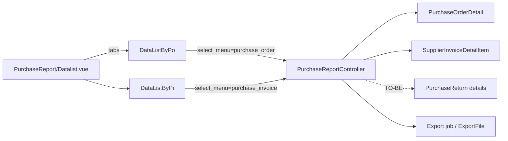

# Purchase Report — Technical Documentation

**Behavior SoT:** [requirement.md](./requirement.md) v2.2 (AS-IS + GAP-PURREP-03) · [_meta/sot/…](../_meta/sot/accounting-purchase-report-source-of-truth.md)  
**UI route:** `/accounting/purchase-report`  
**API prefix:** `accounting/purchase-report`  
**Supplier display:** parent [ETM-15721](https://erpintegration.atlassian.net/browse/ETM-15721) · child [ETM-15729](https://erpintegration.atlassian.net/browse/ETM-15729)  
**Return + status + hide Total Tagihan:** [ETM-16011](https://erpintegration.atlassian.net/browse/ETM-16011)

---

## 0. Changelog

| Version | Date | Changes |
|---------|------|---------|
| 2.1 | 2026-09-02 | Supplier code-only |
| 2.2 | 2026-09-23 | GAP-PURREP-03 TO-BE: union return, status filter, negative qty, hide Total Tagihan |

---

## 1. Architecture

- Read-only; query on demand (no snapshot table).  
- **Must not** join PO↔PI for display.  
- Company scope: `owned_by` = token company.

---

## 2. File map

| Layer | Path |
|-------|------|
| FE shell | `olshoperp-frontend/src/pages/Accounting/Report/PurchaseReport/Datalist.vue` |
| FE PO | `…/DataListByPo.vue` |
| FE PI | `…/DataListByPi.vue` |
| BE | `Modules/Accounting/Http/Controllers/PurchaseReportController.php` |
| Export | `Modules/Accounting/Exports/PurchaseReportExport.php` |
| Job | `Modules/Accounting/Jobs/PurchaseReportExportJob.php` |
| Export file entity | `Modules/Accounting/Entities/PurchaseReportExportFile.php` |
| Policy | `Modules/Accounting/Policies/PurchaseReportPolicy.php` |
| Routes | `Modules/Accounting/Routes/api.php` |
| Return (related) | `PurchaseReturn` / `PurchaseReturnDetailController` · DN: `DebitNoteService::generateFromPurchaseReturn` |

---

## 3. API

| Method | Path | Notes |
|--------|------|-------|
| GET | `/accounting/purchase-report` | Datalist; **`select_menu`** = `purchase_order` \| `purchase_invoice` (default BE: `purchase_order`) |
| GET | `/accounting/purchase-report/export-excel` | Export All (batch) |
| GET | `/accounting/purchase-report/export-progress` | Progress; filter by `select_menu` |
| GET | `/accounting/purchase-report/export-file` | Datalist file export; filter by `select_menu` |

Date range untuk total supplier grouping: `resolveStartEndDate($request)` + SearchBuilder criteria dari FE.

---

## 4. Query notes

### Purchase Order (`purchaseOrderReportQuery`) — AS-IS

- From `PurchaseOrderDetail` join PO, product, supplier, currency, unit.  
- Soft-delete header/detail excluded.  
- **AS-IS:** No filter on PR type or `transaction_status` → With/Without PR + all statuses.  
- Line amounts: `order_quantity * each_price_*` (before/after disc VAT fields).  
- No Other Cost/Disc tables.

### Purchase Invoice (`purchaseInvoiceReportQuery`) — AS-IS

- From `SupplierInvoiceDetailItem` join SI (aliased fields reuse `purchase_order_id` for SI id in link).  
- Parallel soft-delete + company rules.  
- Qty aliased as `order_quantity` from `invoice_quantity`.

### TO-BE GAP-PURREP-03 (ETM-16011)

| Item | Rule |
|------|------|
| Status filter | PO / PI / Purchase Return: `transaction_status IN (approved, processed, complete)` (nilai exact = konstanta `MainModel`) |
| Tab PO + return | Union / append detail return **unbilled** (`type_billed = 0`); supplier dari return header |
| Tab PI + return | Union / append detail return **billed** (`type_billed = 1`) |
| Signs | Qty & line amounts return **negated** |
| Currency/price | Unbilled lines: from linked **PO**; billed lines: from linked **PI** (`invoice_*`) |
| `transaction_type` | `'Purchase Return'` for return rows |
| Link | `/accounting/purchase-return/edit/{id}` |
| Total Tagihan | Remove / hide column in FE ColVis + export mapping |

**Currency note (related code, not report rewrite):**

- Billed approve → `DebitNoteService` copies `currency_id` / `exchange_rate` / invoice prices from **PI**.  
- Unbilled approve → `JournalProcess::stockPurchaseReturnAutoJournal` (primary currency; **no** Debit Note).

### Group total (`supplier_formatted_grouping`)

- Per supplier: sum filtered lines (`price_after_disc_vat` else `price_before_disc_vat`) within date window.  
- **TO-BE:** includes negative return lines.  
- Rendered in group header HTML.  
- **ETM-15729:** header label = **Supplier Code** (+ total) saat `SUPPLIER_DISPLAY_MODE=code_only`.

### Supplier display mode (ETM-15721 / ETM-15729)

| Item | Rule |
|------|------|
| Flag | `SUPPLIER_DISPLAY_MODE=code_only` (rollback: `code_and_name`) |
| Helpers | Shared FE helpers dari foundation — jangan hardcode hide name |
| ColVis / datalist (both tabs) | Code only; no Supplier Name option |
| Group header | **Code** + total |
| Export | Omit name |
| Search/filter | Match name+code; display code |
| Print | Keep name (jika ada) |

### Hyperlink (`code_formatted`)

- PO → `/supplychain/purchase-order/edit/{id}`  
- PI → `/accounting/supplier-invoice/edit/{id}`  
- **TO-BE** Return → `/accounting/purchase-return/edit/{id}`

---

## 5. FE shell notes

- Tabs HeadlessUI — PO panel vs PI panel are **separate** DataTablesV3 instances.  
- Default date filter (if no saved SearchBuilder): `dayjs` **startOf('month') … endOf('month')** — **GAP-PURREP-01** vs card “30 days”.  
- `additionalData` / export params carry `select_menu`.  
- **TO-BE:** drop `total_tagihan_formatted` from column defs in `DataListByPo` / `DataListByPi` + export.

---

## 6. Invariants

| ID | Invariant |
|----|-----------|
| INV-01 | Never return mixed PO+PI rows in one response |
| INV-02 | No FK traversal PO↔PI for report columns |
| INV-03 | Currency not auto-converted beyond document POV (return billed uses PI; unbilled uses PO) |
| INV-04 | Soft-deleted excluded |
| INV-05 | Export progress/files scoped by `select_menu` label |
| INV-06 | Group header / supplier column respect `SUPPLIER_DISPLAY_MODE` (code_only → code label) |
| INV-07 | **TO-BE:** Return rows do not flip sign twice (qty and amount both negative once) |

---

## 7. Testing notes

- Switch tab → assert only PO- or PI-prefixed codes (+ return codes TO-BE).  
- PO With + Without PR both appear.  
- **AS-IS:** Draft status appear when in date range. **TO-BE:** Draft excluded.  
- Export All from PO tab does not list under PI export-file query.  
- Regression: group header total vs sum of visible line amounts for one supplier.  
- **TO-BE:** unbilled return only on PO tab; billed only on PI tab; negative qty; Total Tagihan absent.
