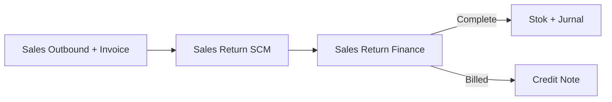
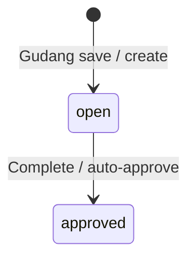

# Sales Return Approval — Panduan Pengguna

**Siapa yang baca panduan ini:** finance, AR/AP support yang ikut retur penjualan  
**Menu di sistem:** Finance Accounting → **Sales Return**  
**Route:** `/accounting/sales-return`  
**Feature Map / Lingo:** [feature-map.md](./feature-map.md)

> Input qty gudang ada di menu SCM terpisah. Menu ini fokus **review harga/COGS** dan **Complete**.

---

## 1. Apa Itu & Kenapa Penting

Sales Return di sisi Finance dipakai untuk **menyelesaikan retur penjualan** yang sudah diinput gudang. Tanpa Complete dari Finance (atau auto-approve), stok/jurnal/Credit Note retur belum final.

---

## 2. Overview Flow & Proses Bisnis

### Rantai proses

**Versi teks (tanpa diagram):**

1. Order sudah outbound (+ biasanya ada Sales Invoice).
2. Gudang buat Sales Return di SCM: isi Restock / Broken / Lost.
3. Finance buka menu ini, review harga/COGS, lalu **Complete**.
4. Sistem post stok + jurnal; jika **Billed** → **Credit Note** otomatis.

🎬 [Interactive demo akan ditambahkan di sini]

### Siklus status (fokus Finance)

**Versi teks:**

| Status | Artinya | Bisa diubah qty? |
|--------|---------|------------------|
| **Open** | Menunggu Complete Finance | Ya (sebelum Complete) |
| **Approved / Complete** | Stok + jurnal sudah jalan | Tidak |

---

## 3. Sebelum Mulai (Flow Sebelum)

Pastikan:

- [ ] Order sudah pernah **outbound** (bukan jalur Failed Ship pre-settlement).
- [ ] Gudang sudah input qty Restock/Broken/Lost (atau kamu isi di form yang sama).
- [ ] Privilege **approval** aktif untuk user Finance.
- [ ] Periode fiskal terbuka; COA produk valid.
- [ ] Jika ada **Lost**: produk punya **Return Expense COA**.
- [ ] Sadari [auto-approve](#sf-lingo:SF-SRA-05) — SR open lama bisa Complete sendiri jika setting aktif.

🎬 [Interactive demo akan ditambahkan di sini]

---

## 4. Setelah Selesai (Flow Sesudah)

Setelah **Complete**:

1. **Restock** → stok masuk gudang return.
2. **Broken** → transfer ke scrap (otomatis).
3. **Lost** → pengurangan stok + jurnal expense.
4. Jurnal sesuai [Billed / Unbilled](#sf-lingo:SF-SRA-02).
5. **Billed** → cek [Credit Note](../accounting-credit-note/) (biasanya sudah Approved).
6. Dokumen menjadi **read-only**.

Dialog ringkasan “Sales Return Processed” + print summary **belum** tersedia di sistem saat ini.

🎬 [Interactive demo akan ditambahkan di sini]

---

## 5. Yang Perlu Diperhatikan

- **Kalau kamu Complete tanpa qty > 0**, sistem menolak — isi minimal satu Restock/Broken/Lost.
- **Kalau ada Lost tanpa Return Expense COA**, Complete ditolak — lengkapi master produk dulu.
- **Kalau kamu mencari tombol Complete di menu SCM**, tidak ada — hanya di `/accounting/sales-return`.
- **Kalau invoice sudah pernah dibayar**, retur biasanya **Billed** → akan ada Credit Note; jangan kaget.
- **Kalau invoice belum dibayar**, **Unbilled** → tanpa Credit Note; jurnal sales/AR.
- **Kalau auto-approve aktif**, SR open lama bisa selesai tanpa klik manual — pantau antrian open.
- **Kalau kamu mengharapkan Reject**, tombol/endpoint belum aktif.
- **Kalau tooltip COGS menyebut stock ID terbaru**, acuannya yang benar untuk nilai = **rata-rata outbound** order.

---

## 6. Langkah-Langkah (Step by Step)

### Cek dulu

1. SR sudah ada / order bisa di-scan.
2. COA & privilege siap.

### Langkah 1 — Buka menu Finance

1. Buka **Finance Accounting → Sales Return**.
2. Cari dokumen atau scan order yang sama dengan gudang.

### Langkah 2 — Review

1. Cek qty [Restock / Broken / Lost](#sf-lingo:SF-SRA-04).
2. Cek kolom [Order / Return Price & COGS](#sf-lingo:SF-SRA-03).
3. Kenali tipe [Billed vs Unbilled](#sf-lingo:SF-SRA-02).

### Langkah 3 — Complete

1. Klik [**Complete**](#sf-lingo:SF-SRA-01).
2. Isi catatan approval jika diminta.
3. Pastikan sukses; cek Credit Note jika Billed.

🎬 [Interactive demo akan ditambahkan di sini]

---

## 7. Tips & Hal yang Sering Bikin Bingung

- **Gudang vs Finance:** gudang input qty; Finance review & Complete (meski form bisa sama).
- **Failed Ship vs Sales Return:** belum SI & outbound → Failed Ship; sudah SI & outbound → Sales Return.
- **Credit Note di mana?** Auto saat Complete **Billed** — lihat menu Credit Note.
- **Tidak bisa Complete?** Status open, qty > 0, fiscal, COA, lost expense COA.
- **Auto-approve:** cek Global Setting Sales Return Configuration.

---

## 8. Referensi

| Dokumen | Isi |
|---------|-----|
| [feature-map.md](./feature-map.md) | Indeks sub-feature + Lingo |
| [knowledge-base.md](./knowledge-base.md) | SOP Finance singkat |
| [requirement.md](./requirement.md) | Aturan Finance layer |
| [technical.md](./technical.md) | API approve & jurnal |
| [SCM Sales Return](../supplychain-sales-returns/) | Alur gudang E2E |
| [Credit Note](../accounting-credit-note/) | Hasil auto CN billed |

---

*Derivatif dari requirement / knowledge-base / technical v2.0 — tanpa menambah fakta baru di luar sumber.*
