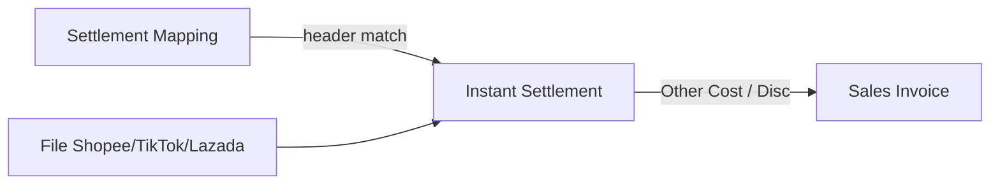
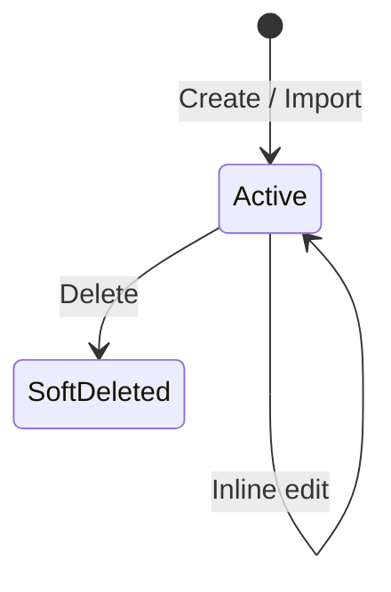
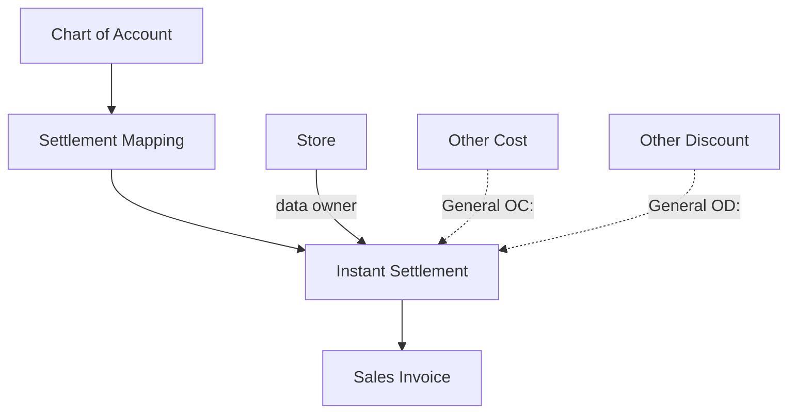

# Settlement Mapping — Requirement Documentation

**Modul:** Accounting  
**UI route:** `/accounting/settlement-mapping`  
**Audience:** PM, Finance, QA  
**SoT:** `accounting-settlement-mapping-source-of-truth.md` v1.0 (09 Oct 2026)  
**Jira:** [ETM-11147](https://erpintegration.atlassian.net/browse/ETM-11147) · [ETM-11150](https://erpintegration.atlassian.net/browse/ETM-11150)

Downstream: [Instant Settlement](../accounting-settlement-upload/requirement.md)

---

## 0. Metadata & Changelog

| Version | Date | Author | Changes |
|---------|------|--------|---------|
| 1.0 | 2026-06-23 | QA - Yemima | Stub cross-ref Instant Settlement |
| 2.0 | 2026-10-09 | QA - Yemima | Full rewrite dari SoT v1.0 + verifikasi codebase; private ownership; Plus/Minus; exact Source Column |

---

## 1. Ringkasan Eksekutif

**Settlement Mapping** adalah master per **platform marketplace** (accordion) untuk memetakan **judul kolom** file Excel/CSV settlement ke **Internal Label**, **COA**, dan **Value Type** (Plus / Minus). Saat Instant Settlement mengunggah file, sistem mencocokkan header kolom ke mapping milik **data owner** company store, lalu membentuk baris **Other Cost** / **Other Discount** pada Sales Invoice.

Tanpa mapping yang cocok, Instant Settlement tetap dapat memproses **nilai produk**; adjustment fee dari kolom platform **tidak** masuk SI.

| Kebutuhan bisnis | Jawaban Settlement Mapping |
|------------------|----------------------------|
| Fee marketplace → akun | Source Column + COA + Internal Label |
| Penambah vs pengurang | Value Type Plus / Minus × tanda angka Excel |
| Isolasi per company | Ownership **private** (`owned_by`) |
| Platform yang didukung UI | Shopee, TikTok, Lazada |

---

## 2. Prasyarat

| Prasyarat | Sumber | Catatan |
|-----------|--------|---------|
| Privilege menu | Gate / policy | create, update, delete, viewAny |
| Platform master | Omni Platform | Accordion: **Shopee, TikTok, Lazada** |
| COA | Chart of Account | Dipilih via Choose COA |
| Company login | Session / token | Mapping private per company |
| Store data owner | Master Store | Instant Settlement memakai mapping `owned_by` = data owner store |

---

## 3. Siklus Status

Master tanpa approve. Record **Active** sampai dihapus; hapus = **soft delete**. Soft-deleted tidak dipakai Instant Settlement.

| Status | Editable? | Dipakai Instant Settlement? |
|--------|-----------|------------------------------|
| Active | Ya | Ya (platform + owned_by cocok) |
| SoftDeleted | Tidak (tidak di datalist default) | Tidak |

**Ownership (ETM-11150 — AS-IS):** private per company; tidak dibagikan ke company lain.

---

## 4. Datalist / Layout

Multi **accordion** per platform (Shopee, TikTok, Lazada).

### 4.1 Form tambah

| Kontrol UI | Field | Wajib |
|------------|-------|-------|
| Internal Label | label | Ya |
| Choose COA | coa_id | Ya |
| Source Column | excel_column_name | Ya |
| Value Type | type | Ya — UI **Plus** / **Minus** |

### 4.2 Tabel

| Kolom | Catatan |
|-------|---------|
| Internal Label | Inline edit |
| COA | Inline edit |
| Source Column | Inline edit; judul kolom / fee name Lazada |
| Value Type | Plus / Minus; inline |
| Created By / Updated By | Read-only |
| Data Owner | Company pemilik |
| Action | Soft delete |

### 4.3 Audit & Import/Export

Audit before/after. Import template: Internal Label, COA Code, COA Name, Source Column, Value Type (`plus`/`minus`), Platform (`shopee`/`tiktok`/`lazada`). Export Excel/CSV. Import log per row.

---

## 5. Form & Field

| Field | Wajib | Aturan |
|-------|-------|--------|
| Internal Label | Ya | Bebas teks; **boleh sama** dalam satu atau beda platform |
| Source Column | Ya | Unik per platform dalam company; exact match ke header Excel |
| Value Type | Ya | Plus (`positive`) \| Minus (`negative`) |
| COA | Ya | Harus ada di master; import lebih ketat (child, class, aktif) — lihat GAP-SM-01 |
| Platform | Ya | Dari accordion |
| Ownership | Auto | Private per company |

---

## 6. How It Works

### 6.1 Matching Instant Settlement

1. Load mapping: platform upload **dan** owned_by = data owner store.
2. Header file di-trim. Kolom penting (Order ID, Date, Total, Type Shopee) match **case-insensitive** — **bukan** lewat Settlement Mapping (hardcode).
3. Kolom fee: match Source Column **exact setelah trim, case-sensitive**. Tidak match → kolom diabaikan (bukan error).
4. Amount **0** (atau kosong) → **skip** — tidak buat cost/disc.

### 6.2 Value Type × tanda angka (ETM-11147)

| Value Type | Angka Excel | Hasil di SI |
|------------|-------------|-------------|
| Plus | ≥ 0 | Other Cost |
| Plus | &lt; 0 | Other Discount |
| Minus | ≥ 0 | Other Discount |
| Minus | &lt; 0 | Other Cost |

Nominal baris = nilai absolut. Deskripsi = Internal Label; COA dari mapping.

### 6.3 Contoh kasus

**Plus — kolom X**

- Excel `5000` → Cost 5.000  
- Excel `-3000` → Disc 3.000  

**Minus — kolom Y**

- Excel `8000` → Disc 8.000  
- Excel `-2000` → Cost 2.000  

### 6.4 Tidak ada mapping

Instant Settlement tetap proses produk; fee kolom tidak masuk SI.

### 6.5 Ubah / hapus mapping

Hanya berlaku upload **berikutnya**. SI lama tidak berubah.

### 6.6 Platform Other / General

Accordion menu **tidak** mencakup Other. Instant Settlement General memakai pola `OC:` / `OD:` dari master Other Cost/Discount — bukan baris Settlement Mapping.

---

## 7. Validasi

| ID | Kondisi | Behavior / pesan |
|----|---------|------------------|
| V-SM-01 | Field wajib kosong (store) | Internal Label / Source Column / Platform / Value Type / COA is missing |
| V-SM-02 | Duplikat Source Column + platform | Unable to create duplicate {column} for {platform} |
| V-SM-03 | COA tidak ketemu | Unable to find COA |
| V-SM-04 | Platform tidak ketemu | Unable to find Platform ID {id} |
| V-SM-05 | Inline value kosong | The inputted value cannot be empty |
| V-SM-06 | Import Value Type invalid | Value Type must be either "plus" or "minus". |
| V-SM-07 | Import Platform invalid | Platform must be one of: shopee, tiktok, lazada. |
| V-SM-08 | Import COA inactive / parent / class salah / beda company | Pesan per baris di import log |
| V-SM-09 | Import lain masih jalan | Please wait, other import is being process |

---

## 8. Relasi Menu Lain

| Menu | Relasi |
|------|--------|
| Instant Settlement | Membaca mapping saat parse file marketplace |
| Sales Invoice | Menerima Other Cost / Other Discount hasil mapping |
| Chart of Account | Akun tiap baris mapping |
| Store | Data owner menentukan mapping yang dipakai |
| Other Cost / Discount | Jalur General (`OC:`/`OD:`), bukan accordion SM |

Detail alur upload: [Instant Settlement](../accounting-settlement-upload/requirement.md).

---

## 9. Gaps / Keputusan

| ID | Deskripsi | Type | Dampak | Status |
|----|-----------|------|--------|--------|
| GAP-SM-01 | UI create/inline hanya cek COA exists; Import enforce child/class/active | Unverified | Mapping via UI bisa lebih longgar dari import | Open |
| GAP-SM-02 | Source Column case-sensitive exact | Resolved | Operator salin judul kolom persis | Resolved |
| GAP-SM-03 | Tippy FE masih Addition/Deduction; opsi UI Plus/Minus | Unverified | Label tippy vs select | Open |
| GAP-SM-04 | Ownership private (ETM-11150) | Resolved | — | Resolved |

---

## 10. FAQ

**Q: Fee Excel tidak masuk SI?**  
A: Cek Source Column exact (termasuk huruf besar/kecil), platform benar, Data Owner = owner store upload, amount bukan 0.

**Q: Ubah mapping, SI lama berubah?**  
A: Tidak — hanya Instant Settlement berikutnya.

**Q: Plus vs Minus?**  
A: Plus cenderung Cost jika angka positif; Minus cenderung Disc jika angka positif. Tanda negatif Excel membalik (lihat §6.2).

**Q: Company lain pakai mapping saya?**  
A: Tidak — private per company.

---

## Related Documents

| Doc | Path |
|-----|------|
| Knowledge Base | [knowledge-base.md](./knowledge-base.md) |
| Technical | [technical.md](./technical.md) |
| User Guide | [user-guide.md](./user-guide.md) |
| Instant Settlement | [../accounting-settlement-upload/requirement.md](../accounting-settlement-upload/requirement.md) |
