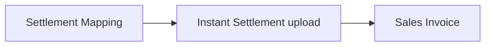
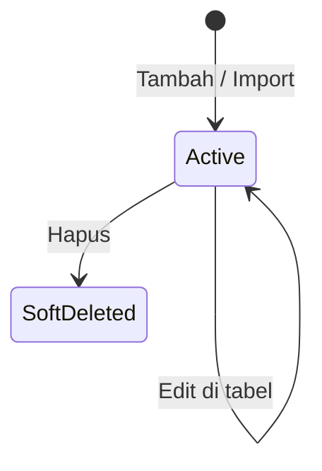

# Settlement Mapping — Panduan Pengguna

**Siapa yang baca panduan ini:** finance, ops settlement, support  
**Menu di sistem:** Accounting → Settlement Mapping

---

## 1. Apa Itu & Kenapa Penting

Settlement Mapping adalah daftar **aturan** yang menghubungkan judul kolom di file settlement marketplace (Shopee, TikTok, Lazada) ke nama internal, akun, dan cara baca angka (Plus / Minus).

Tanpa mapping yang benar, upload Instant Settlement tetap bisa memproses nilai produk, tetapi **biaya/fee dari kolom file** tidak masuk Sales Invoice — sehingga total bisa tidak cocok dengan settlement marketplace.

---

## 2. Overview Flow & Proses Bisnis

### Rantai proses

**Versi teks (tanpa diagram):**

1. Isi mapping di **Settlement Mapping** per platform.
2. Upload file settlement di **Instant Settlement**.
3. Sistem mencocokkan judul kolom → menambah biaya atau diskon di **Sales Invoice**.

🎬 [Interactive demo akan ditambahkan di sini]

### Status data mapping

**Versi teks:**

| Status | Artinya | Bisa diubah? |
|--------|---------|--------------|
| Aktif | Muncul di daftar; dipakai saat upload Instant Settlement | Ya |
| Sudah dihapus | Tidak muncul / tidak dipakai upload baru | Tidak (SI lama tidak berubah) |

---

## 3. Sebelum Mulai (Flow Sebelum)

Pastikan:

- Kamu punya akses menu Settlement Mapping.
- Sudah tahu **judul kolom** di export Shopee / TikTok / Lazada yang mau dipetakan (salin persis dari file).
- Akun (COA) untuk fee tersebut sudah ada di Chart of Account.
- Company / data owner store yang dipakai Instant Settlement sudah jelas — mapping **hanya milik company kamu**.

---

## 4. Setelah Selesai (Flow Sesudah)

Setelah mapping siap:

1. Buka **Instant Settlement**.
2. Upload file sesuai platform.
3. Cek Sales Invoice yang terbentuk: biaya/diskon tambahan mengikuti label dan aturan Plus/Minus.

Ubah atau hapus mapping **tidak** mengubah invoice yang sudah pernah digenerate — hanya upload berikutnya.

---

## 5. Yang Perlu Diperhatikan

- Kalau **Source Column** tidak sama persis dengan judul di Excel (termasuk huruf besar/kecil), kolom itu **diabaikan** — fee tidak masuk invoice.
- Kalau angka di kolom **0**, sistem **melewati** kolom itu.
- Kalau kamu isi Source Column yang **sudah ada** di platform yang sama, sistem menolak karena duplikat.
- Kalau Value Type di import bukan `plus` atau `minus`, baris import gagal (cek import log).
- Kalau platform di import bukan shopee / tiktok / lazada, baris gagal.
- Kalau field wajib kosong saat tambah atau edit inline, sistem menolak.
- Mapping **private** — company lain tidak memakai daftarmu.
- Platform **Other / General** tidak diatur di accordion ini — pakai jalur Other Cost / Other Discount di Instant Settlement.

---

## 6. Langkah-Langkah (Step by Step)

1. Buka **Accounting → Settlement Mapping**.
2. Buka accordion **Shopee**, **TikTok**, atau **Lazada**.
3. Isi **Internal Label** (nama yang akan muncul di invoice).
4. Pilih **COA**.
5. Ketik **Source Column** = judul kolom di Excel **persis**.
6. Pilih **Plus** atau **Minus**.
7. Klik tombol tambah.
8. (Opsional) Edit langsung di baris tabel, atau hapus baris yang tidak dipakai.
9. (Opsional) Download template → isi → Import; atau Export untuk backup.
10. Lanjut upload di **Instant Settlement**.

🎬 [Interactive demo akan ditambahkan di sini]

---

## 7. Tips & Hal yang Sering Bikin Bingung

**Contoh Plus:** angka Excel `5000` → biaya 5.000; angka `-3000` → diskon 3.000.

**Contoh Minus:** angka Excel `8000` → diskon 8.000; angka `-2000` → biaya 2.000.

**Label boleh sama** berkali-kali. Yang tidak boleh dobel: Source Column di platform yang sama.

**Fee tidak masuk SI?** Salin judul kolom dari file tanpa diubah; pastikan store yang di-upload memakai data owner yang sama dengan pemilik mapping; pastikan angka bukan 0.

**Sudah ubah mapping tapi SI lama sama?** Normal — hanya file yang di-upload setelah perubahan yang terpengaruh.

---

## 8. Referensi

| Butuh detail | Buka |
|--------------|------|
| Aturan bisnis & validasi | [requirement.md](./requirement.md) |
| Cara operator / troubleshooting | [knowledge-base.md](./knowledge-base.md) |
| API / kode | [technical.md](./technical.md) |
| Upload settlement | [Instant Settlement](../accounting-settlement-upload/user-guide.md) |
