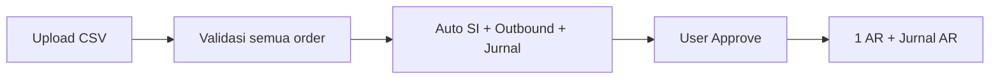
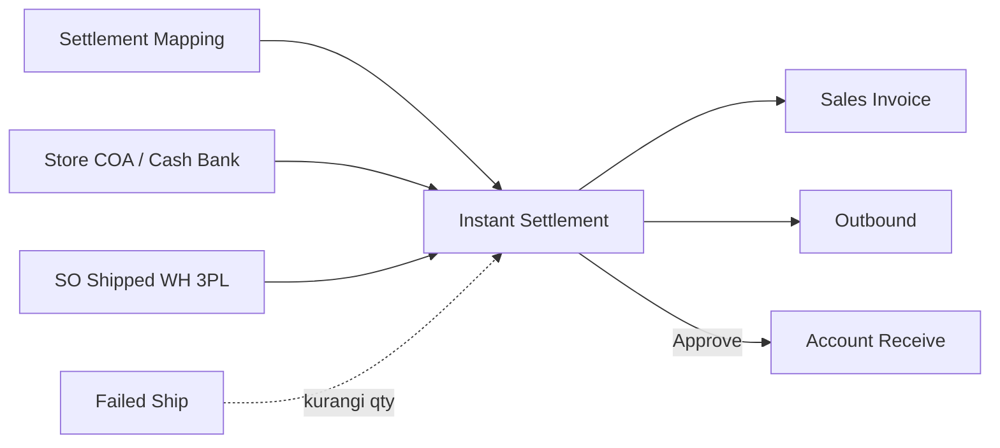

# Instant Settlement — Knowledge Base

## 1. Apa itu Instant Settlement?

**Instant Settlement** (juga: Upload Settlement, Settlement Order, Platform Settlement) adalah fitur **rekonsiliasi dana cair marketplace** — Anda upload file settlement dari Shopee/TikTok/Lazada (atau template internal untuk order General), lalu sistem otomatis membuat:

- **Outbound** (potong stok dari gudang 3PL / kurir)
- **Sales Invoice** (piutang penjualan)
- **Receive / AR** (pelunasan piutang ke kas/bank) — setelah Anda klik **Approve**

> 💡 **Singkatnya:** Satu file CSV bisa menyelesaikan ratusan order sekaligus, tanpa input manual satu per satu.

**Menu:** FA → Settlement → **Instant Settlement** (`/accounting/settlement-upload`)

### Alur singkat

---

## 2. Istilah Kunci

| Istilah | Artinya |
|---------|---------|
| **Batch / Upload** | Satu kali import file = satu transaksi settlement (`ST-xxxxx`) |
| **SO File** | Jumlah order unik dalam file |
| **SO Success / Failed** | Order lolos / gagal validasi |
| **All-or-Nothing** | 1 order gagal → **seluruh file** dibatalkan |
| **Re-settlement** | Upload ulang order yang sama untuk dana susulan (adjustment) |
| **WH 3PL** | Gudang virtual shipper — order harus sudah **Shipped** ke sini |
| Settlement Mapping | Menu pemetaan kolom biaya CSV ke akun (Other Cost/Disc) — **platform marketplace saja** |
| **OC: / OD:** | Kolom template General dari master Other Cost / Other Discount |
| **Smart AR** | Saat approve, sistem skip invoice yang sudah punya AR manual |
| **Upload Progress** | 5 tahap otomatis setelah import |
| **Approve Progress** | 4 tahap setelah user approve settlement |
| **Difference Settlement-SI** | Selisih nilai file vs invoice — cek rekonsiliasi |

---

## 3. Yang Bisa / Tidak Bisa Dilakukan

### Bisa
- Upload settlement per **store** (satu file = satu toko)
- Download template per platform (CSV/Excel)
- Pantau progress real-time (2 progress bar)
- Retry jika proses macet (ikon ⚠️ kuning)
- Approve settlement untuk generate **1 AR** per batch
- Hapus settlement (jika belum terkunci AR manual)
- Lihat detail order, invoice, outbound, AR, jurnal lewat angka di tabel
- Export daftar settlement & audit log

### Tidak Bisa
- Partial success dalam 1 file — **semua order harus valid**
- Upload tanpa pilih store
- Generate outbound **kedua kali** untuk order yang sama
- Hapus settlement jika ada Sales Invoice yang sudah dipakai AR manual
- Approve AR jika **Receiving Destination COA** belum di-set di Store Setting
- Approve jika **semua** Sales Invoice batch sudah punya AR

---

## 4. Prasyarat Sebelum Upload

1. **Settlement Mapping** sudah lengkap untuk platform toko Anda  
2. **Store Setting:** Account Receivable COA + Cash/Bank Receiving  
3. Order sudah **Shipped (WH 3PL)** — selesai proses gudang & DO  
4. **Product COA Group** SKU terkait sudah lengkap  
5. **Fiscal period** aktif & open pada tanggal settle  
6. File settlement dalam format **CSV** (lihat §5)

> Status **Store Authorized** tidak dicek saat settlement — by design.

---

## 5. Format File per Platform

> ⚠️ **Upload hanya `.csv`** — bukan Excel. Order ID TikTok/Shopee berupa angka panjang; Excel mengubahnya jadi `1.23E+17` sehingga order tidak ketemu dan **seluruh batch gagal**.

### Shopee
- **File:** export native Seller Centre (disarankan sheet/tab **Income**)
- **Kolom wajib:** `No. Pesanan`, `Tanggal Dana Dilepaskan`, `Total Penghasilan`
- **Format tanggal:** `Y-m-d` (contoh: `2026-06-19`)
- **Biaya lain:** kolom sesuai Settlement Mapping (nama kolom harus sama persis dengan mapping)

### TikTok Shop
- **File:** export native TikTok Seller (sheet **Order details**) → **simpan sebagai CSV**
- **Kolom wajib:** `Order/Adjustment ID`, `Order Settled Time`, `Total Settlement Amount`
- **Format tanggal:** `Y/m/d` (contoh: `2026/06/19`)
- **Download Template** di menu: file contoh statis **belum tersedia** — gunakan export resmi TikTok

### Lazada
- **File:** export native (sheet **Transaction Overview**)
- **Kolom wajib:** `Order No.`, `Transaction Date`, `Amount`
- **Format tanggal:** `d-M-Y` (contoh: `19-Jun-2026`)
- **Khusus:** banyak baris per order (per `Fee Name`) — sistem menjumlahkan otomatis

### Others (Sales Order General)

Template settlement untuk order **General** (bukan marketplace). **Tidak** pakai Settlement Mapping — biaya/diskon lewat kolom master Other Cost / Other Discount.

- **File:** menu Import → Download Template (pilih **Store Others** dulu)
- **Kolom wajib:** `Order Number` (= **kode SO internal**), `Date Settled` (`d-m-Y`), `Total`
- **Kolom dinamis:** `OC: {kode}` (Other Cost) dan `OD: {kode}` (Other Discount)

**Siapa yang muncul di template?**

| Master | Masuk template jika… |
|--------|----------------------|
| Other Cost (`OC:`) | Status **Active** dan Applied Store = **All** atau mencakup toko yang dipilih |
| Other Discount (`OD:`) | **Aturan sama** — Active + Applied Store applicable |

| Tidak muncul | Alasan |
|--------------|--------|
| Master **Inactive** | Hanya active yang masuk template |
| Applied Store **kosong** | Tidak applicable ke settlement manapun |
| Applied Store **toko lain** | Hanya toko yang dipilih saat download |

**Contoh:** Other Cost hanya untuk Toko A → download template dengan Toko A terpilih → kolom `OC:` ada. Download dengan Toko B → kolom itu **tidak** ada.

Detail teknis & skenario QA: [requirement.md §4.6](./requirement.md).

**Nilai di file:** isi angka per kolom OC/OD. Nilai positif pada `OC:` = biaya tambahan; positif pada `OD:` = diskon (mengurangi total invoice).

### Membaca nilai Total Penghasilan di UI

Setelah upload sukses, klik angka **SI Success** → panel kanan menampilkan per invoice:

| Label | Arti |
|-------|------|
| **Net Sales SO** | Total order asli |
| **Net Sales SI** | Total invoice yang di-generate |
| **Settlement Total** | Angka **Total Penghasilan dari file CSV** |
| **Difference Settlement-SI** | Selisih file vs invoice — gunakan untuk rekonsiliasi |

Sistem **tidak** memblokir upload jika ada selisih kecil; operator yang mengecek kolom Difference.

---

## 6. Cara Pakai (How-To)

### 6.1 Upload settlement baru

1. Buka **Instant Settlement**
2. Pilih **Store** di dropdown kanan atas
3. Klik **Import** → **Import** → pilih file `.csv`
4. Tunggu **Progress Status** sampai 5 bar penuh (jurnal SI & Outbound approved)
5. Cek **SO Success** — jika ada **SO Failed**, klik angka merah untuk detail error
6. Jika sukses, klik **Approve** (✓) → isi catatan → **Approve** (atau **Reject** jika tidak jadi lunasi piutung batch ini)
7. Pantau **Progress** (kolom kanan) sampai AR & jurnal AR selesai

> **Reject** = tolak generate AR; dokumen SI/Outbound dari upload **tetap ada**. Bukan hapus settlement.

### 6.2 Re-settlement (dana susulan)

1. Upload file baru yang memuat **Order ID yang sama** lagi
2. Settle pertama: Outbound + SI dengan SKU  
3. Settle kedua dst.: **hanya SI adjustment** (Other Cost/Disc), Outbound tidak dibuat ulang

### 6.3 Hapus settlement salah

1. Pastikan belum ada AR manual pada invoice batch tersebut
2. Klik **Delete** (🗑) pada baris settlement
3. Konfirmasi — sistem hapus dokumen yang di-generate settlement
4. Status gudang tetap Shipped — bisa upload ulang tanpa proses fisik dari awal

---

## 7. Membaca Tampilan Tabel

| Kolom / Area | Arti |
|--------------|------|
| **Trx. Code & Date** | Kode `ST-xxx` + badge status import |
| **Store Name & File Name** | Toko + nama file; klik nama file untuk unduh ulang |
| **Sales Order** | SO File / Success / Failed |
| **Sales Invoice** | Generated, Failed, Approved, Journal (+ varian Failed) |
| **Outbound** | Sama struktur dengan SI |
| **Account Receive** | AR + jurnal AR (setelah approve) |
| **Progress Status** | 5 tahap upload |
| **Progress** | 4 tahap approve |
| **Imported By** | User yang upload |
| **Action** | Approve ✓ / Delete 🗑 |

**Tooltip:** arahkan ke setiap label (SO Success, SI Journal, dll.) untuk penjelasan singkat.

---

## 8. Tombol Header & Fungsinya

| Tombol | Fungsi |
|--------|--------|
| **Import → Import** | Upload file CSV untuk store terpilih |
| **Import → Download Template → CSV / Excel** | Unduh template contoh per platform |
| **Export** | Export daftar settlement (semua / halaman aktif) ke Excel |
| **Log Data** | Riwayat audit perubahan data settlement |
| **Refresh** | Muat ulang tabel |
| **Show Deleted** | Tampilkan settlement yang sudah dihapus |

---

## 9. Tombol Baris & Panel

| Aksi | Kapan dipakai |
|------|---------------|
| **Angka biru (klik)** | Buka panel detail: daftar order, invoice, outbound, AR, atau jurnal |
| **Angka merah (klik)** | Buka log error; jika ada ikon retry, klik untuk jalankan ulang job |
| **⚠️ di progress bar** | Proses macet >10 menit — klik untuk retry |
| **Approve (✓)** | Muncul jika upload selesai & user punya hak approval; disabled jika semua SI sudah punya AR |
| **Delete (🗑)** | Hapus settlement; disabled jika ada SI dengan AR manual |
| **ApprovalDialog Reject** | Tolak pelunasan AR batch — header settlement rejected, tanpa AR |
| **⚠️ di progress bar** | Proses macet — **klik ikon** untuk retry batch |
| **Log error (angka merah)** | Buka slideover kanan → lihat pesan; tombol **Retry** / **Continue** per baris |

### Retry — di mana tombolnya?

| Situasi | Lokasi tombol |
|---------|---------------|
| Proses macet >10 menit | Ikon **⚠️ kuning** di bar progress (kolom Progress Status / Progress) |
| Error generate/approve batch | Slideover **LogTable** — tombol retry di header |
| Error 1 order saja | Slideover LogTable — tombol **Continue** per baris (kolom Action) |

---

## 10. Relasi Menu (Ringkas)

Settlement tidak berdiri sendiri — butuh setup master dan fulfillment sebelum upload.

| Sebelum upload | Cek di menu |
|----------------|-------------|
| Mapping kolom biaya platform | Settlement Mapping |
| COA pendapatan & cash/bank receiving store | Store Setting |
| Order sudah Shipped (WH 3PL) | Sales Order + rantai gudang |
| Qty failed ship sudah benar | Failed Ship |
| Rantai gudang selesai (Wave → DO → Shipped) | Waves, Picking, Delivery Order |
| COA produk & periode fiskal | Product COA Group, Fiscal Period |
| Shipper & SKU valid | General Company (Shipper), System Product |

Detail integrasi lengkap: [requirement.md §10](./requirement.md#10-relasi-menu--integrasi).

---

## 11. Troubleshooting

| Gejala | Penyebab umum | Solusi |
|--------|---------------|--------|
| Seluruh batch gagal, SO Failed > 0 | Ada order belum Shipped / tidak ditemukan / stok | Klik SO Failed → perbaiki order → upload ulang file **baru** |
| *File does not match selected store* | File platform salah atau header tidak dikenali | Pastikan file dari platform yang sama dengan store; cek kolom wajib §5 |
| Import macet, ikon ⚠️ | Queue/job lambat atau error background | Klik ⚠️ atau tunggu; hubungi admin jika >1 jam |
| Tombol Approve disabled | Semua SI sudah punya AR | Normal jika piutang sudah lunas manual |
| Error saat Approve: Receiving Destination COA | Cash/Bank Receiving belum di Store Setting | Isi di menu Store Setting |
| SI/Outbound ada, jurnal gagal | COA produk/mapping belum lengkap | Lengkapi Product COA Group / Settlement Mapping → retry jurnal |
| Tidak bisa delete | Ada AR manual pada salah satu SI | Hapus/reverse AR manual dulu, atau biarkan settlement terkunci |
| Selisih Settlement Total vs SI | Rounding platform / mapping biaya | Normal jika kecil — cek **Difference Settlement-SI** di panel SI |
| Out Journal warnings | Nilai persediaan 0 saat posting jurnal | Buka **Out Journal** panel → tab **Warnings**; perbaiki COA/stock value |

---

## 12. FAQ

**Q: Kenapa AR cuma 1 padahal invoice ratusan?**  
A: Satu settlement = satu store = satu dokumen AR berisi banyak referensi invoice.

**Q: Bisa upload Excel?**  
A: Di layar ini upload **CSV**. Template Excel bisa diunduh sebagai referensi kolom, lalu simpan sebagai CSV.

**Q: Apakah delete mengembalikan status Wave/Pick/Pack?**  
A: **Tidak.** Hanya stok yang di-revert. Order tetap Shipped — bisa settle ulang langsung.

**Q: Saya sudah buat AR manual sebagian invoice, apa yang terjadi saat Approve?**  
A: Sistem hanya generate AR untuk invoice yang **belum** punya AR (Smart AR).

**Q: Apa beda Reject vs Delete?**  
A: **Reject** = tidak jadi generate AR (dokumen upload tetap). **Delete** = hapus rantai dokumen hasil settlement (jika allowed).

**Q: Kenapa kolom OC/OD di template beda-beda per toko?**  
A: Kolom di-generate dari master Other Cost/Discount yang **Applied Store**-nya mencakup toko yang Anda pilih. Lihat §5 Others.

**Q: Other Cost inactive masih ada di template?**  
A: **Tidak.** Hanya master **Active** yang masuk template General.

**Q: Kenapa harus CSV bukan Excel?**  
A: Order ID marketplace (terutama TikTok) angkanya panjang; Excel mengubah format jadi scientific notation sehingga sistem tidak menemukan order.

---

## Related Documents

| Doc | Path |
|-----|------|
| Requirement (QA) | [requirement.md](./requirement.md) |
| Technical | [technical.md](./technical.md) |
| Settlement Mapping | [../accounting-settlement-mapping/README.md](../accounting-settlement-mapping/README.md) |
| Master Other Cost | [../omni-other-cost/requirement.md](../omni-other-cost/requirement.md) |
| Master Other Discount | [../omni-other-discount/requirement.md](../omni-other-discount/requirement.md) |
