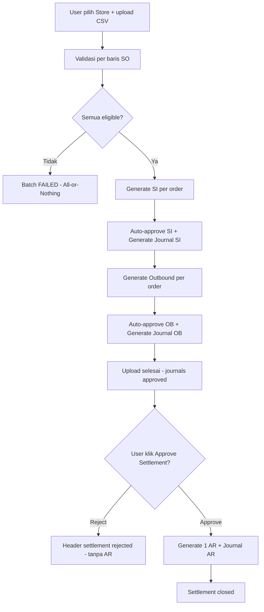
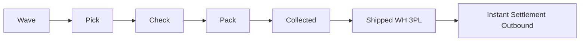
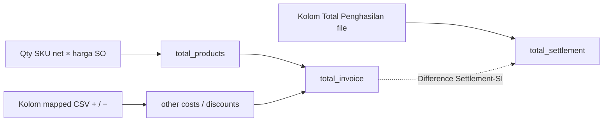
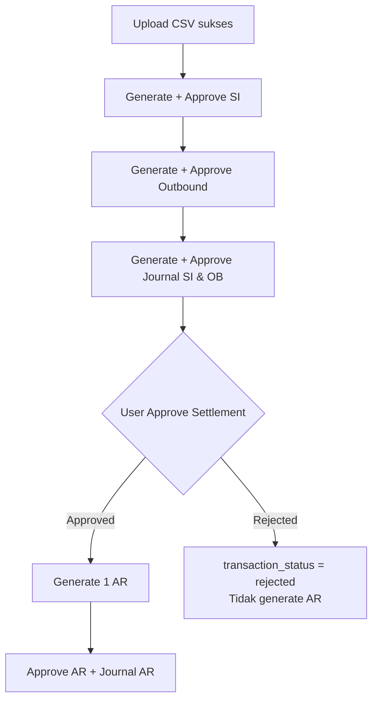
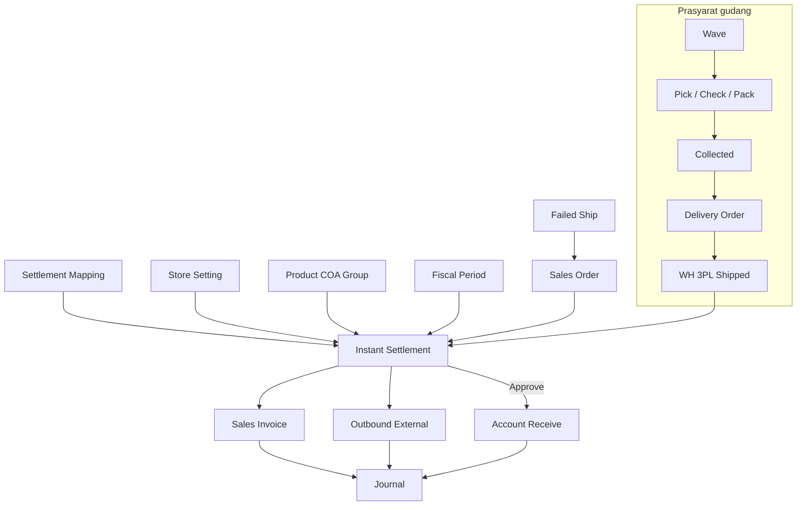
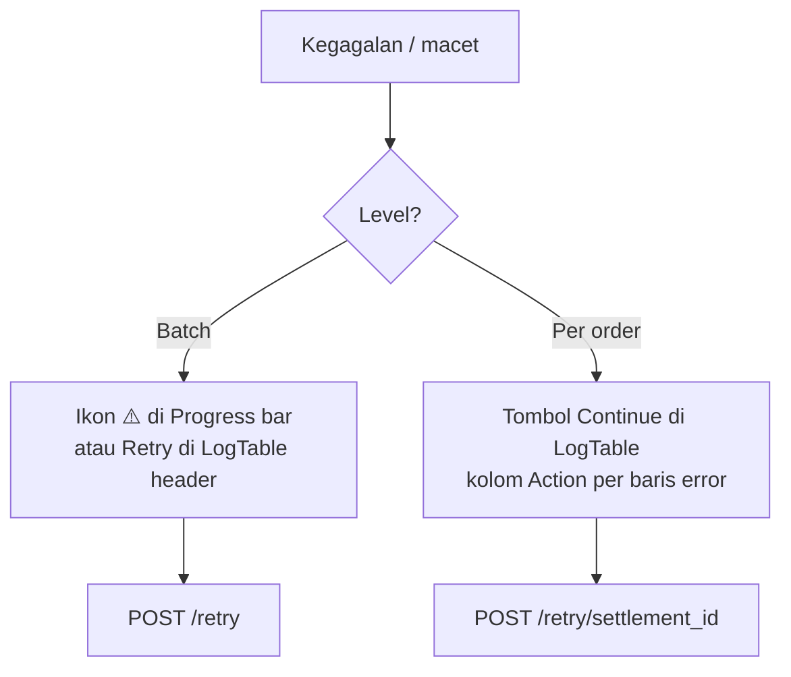

# Instant Settlement — Requirement Documentation

## 0. Metadata & Changelog

| Version | Date | Author | Changes |
|---------|------|--------|---------|
| 1.0 | 2026-06-23 | QA - Yemima | Konsolidasi requirement final (Juni 2026) + sinkronisasi AS-IS codebase backend & frontend |
| 1.1 | 2026-06-23 | QA - Yemima | Klarifikasi PM: CSV by design, total penghasilan, gap analysis, flowchart mermaid, retry/reject UI |
| 1.2 | 2026-06-23 | QA - Yemima | Diagram integrasi menu + matriks relasi Fase 1 cross-reference |
| 1.3 | 2026-06-23 | QA - Yemima | Matriks Fase 2 cross-reference (fulfillment chain, journal, master) |
| 1.4 | 2026-06-23 | QA - Yemima | Matriks Fase 3 — shipper, system product, check/pack chain |
| 1.5 | 2026-06-23 | QA - Yemima | §4.6 Template General — kolom `OC:`/`OD:` + filter Applied Store (master Other Cost/Discount) |
| 1.6 | 2026-07-15 | QA - Yemima | Booking unmatched (`platform_order_id` null) tidak match IS — cross-ref SP GAP-BOOK-01 |

**Nama lain menu:** Upload Settlement, Settlement Order, Order Settled, Platform Settlement, Settlement Platform, Platform Settled.

**UI route:** `/accounting/settlement-upload`  
**API prefix:** `accounting/settlement-upload/*`  
**Modul:** Finance Accounting

---

## 1. Ringkasan Eksekutif

**Instant Settlement** mengonversi file dana cair marketplace (`.CSV` / export native platform) menjadi dokumen finansial secara otomatis:

1. **Outbound** — 1 per order (maksimal 1x seumur order); memotong stok dari WH 3PL.
2. **Sales Invoice** — 1 per baris settle; re-settlement hanya Other Cost/Disc tanpa SKU.
3. **Receive (AR)** — **1 dokumen per batch/store**, di-generate saat user **Approve Settlement**.

Upload sukses (validasi lolos) → SI & Outbound + jurnal keduanya auto-approved. AR menunggu approval manual user.

**All-or-Nothing:** 1 file = 1 batch. Jika ada **1 SO gagal** validasi, seluruh batch gagal — tidak ada SI/Outbound yang terbentuk.

### 1.1 Diagram alur end-to-end

---

## 2. Acceptance Criteria (AS-IS)

| ID | Kriteria | Validasi | Fitur |
|----|----------|----------|-------|
| A-01 | User dapat upload file settlement per store terpilih | V-01, V-02, V-03 | F-01 |
| A-02 | Sistem validasi setiap baris SO (shipped, stok, relasi dokumen) | V-04–V-14 | F-02 |
| A-03 | Jika semua baris valid, auto-generate SI + Outbound per order | V-04 | F-03, F-04 |
| A-04 | SI & Outbound auto-approved; jurnal SI & Outbound auto-generated & approved | — | F-05–F-08 |
| A-05 | Progress bar upload (5 tahap) & approve (4 tahap) real-time | — | F-09 |
| A-06 | User approve settlement → generate 1 AR + jurnal AR (smart skip SI yang sudah punya AR) | V-15, V-16 | F-10–F-13 |
| A-07 | Re-settlement order yang sama: skip Outbound, SI baru hanya adjustment | V-17 | F-03 |
| A-08 | Delete settlement (hard delete rantai generate) dengan aturan blokir AR manual | V-18 | F-14 |
| A-09 | Retry job saat proses stuck/gagal | — | F-15 |
| A-10 | Export DataList, audit log, download file upload asli | — | F-16, F-17 |
| A-11 | Download template import per platform | V-01 | F-18 |

---

## 3. Prasyarat Sistem

| Prasyarat | Detail | Dicek saat upload? |
|-----------|--------|-------------------|
| Store terpilih di UI | Settlement scoped **1 store per batch**; platform diidentifikasi dari store terpilih | Ya (FE + V-13) |
| **Account Receivable COA** (Store Setting) | Piutang SO Platform | Saat generate SI |
| **Cash/Bank Receiving** (`cash_bank_account_id` di Store) | Kas/Bank untuk jurnal AR | Saat Approve Settlement (V-15) |
| **Settlement Mapping** | Kolom CSV ↔ COA Other Cost/Disc (+/−) | Saat parse header (V-03) |
| SO status **Shipped (WH 3PL)** | Transfer internal approved ke WH 3PL / ship DO | V-04 |
| **Product COA Group** lengkap | Sales, HPP, Persediaan per SKU | Saat generate jurnal |
| **Fiscal period** open pada tanggal settle | Settlement menimbulkan jurnal pembukuan | V-14 |
| File format | **`.csv` wajib di UI** (by design — lihat §4.4) | V-01, V-02 |

> **Catatan Store Authorized:** Status authorize store **tidak** dicek saat upload — **by design**. Settlement hanya butuh store valid di dropdown dan order milik store tersebut; authorize relevan untuk sync order/produk, bukan proses settlement itu sendiri.

**Alur stok sebelum settle:** Wave → Pick → Check → Pack → Collected → Shipped (WH 3PL) → Outbound via Settlement.

---

## 4. Format Template Import per Platform

### 4.1 Ringkasan

| Platform | Sumber file | Sheet (jika Excel) | Order ID | Tanggal settle | Total | Kolom biaya |
|----------|-------------|-------------------|----------|----------------|-------|-------------|
| **Shopee** | Export native Seller Centre | `Income` | `No. Pesanan` | `Tanggal Dana Dilepaskan` (`Y-m-d`, TZ +7) | `Total Penghasilan` | Kolom tambahan via **Settlement Mapping** (`excel_column_name` exact match) |
| **TikTok Shop** | Export native TikTok Seller | `Order details` | `Order/Adjustment ID` | `Order Settled Time` (`Y/m/d`, TZ UTC) | `Total Settlement Amount` | Settlement Mapping |
| **Lazada** | Export native Lazada | `Transaction Overview` | `Order No.` | `Transaction Date` (`d-M-Y`, TZ +7) | `Amount` (agregasi per order+date) | `Fee Name` → Settlement Mapping |
| **Others** (General) | Template sistem (`general-template` API) | — | `Order Number` (= **kode SO General**) | `Date Settled` (`d-m-Y`) | `Total` | Kolom dinamis `OC: {code}` / `OD: {code}` — lihat **§4.6** |

### 4.6 Template General (Sales Order General) — Other Cost & Other Discount

Digunakan **hanya** untuk store platform **Others** (Sales Order General). **Tidak** memakai Settlement Mapping — biaya/diskon tambahan diwakili kolom header dari master [Other Cost](../omni-other-cost/requirement.md) dan [Other Discount](../omni-other-discount/requirement.md).

#### 4.6.1 Kapan dipakai

| Kondisi | Detail |
|---------|--------|
| Store | Platform = **Others** (`Platform::PL_OTHER`) |
| Sumber order | **Sales Order General** — match baris file by kolom `Order Number` = **kode SO internal** (`SalesOrder.code`), bukan `platform_order_id` |
| Prasyarat master | Other Cost / Other Discount **Active** + Applied Store mencakup toko settlement |

#### 4.6.2 Download template (`GET general-template`)

User **wajib pilih Store** di UI (sama aturan I-01) — `store_id` dikirim ke API.

**Kolom tetap (3 kolom pertama):**

| Urutan | Header file | Konstanta | Contoh |
|--------|-------------|-----------|--------|
| 1 | `Order Number` | `SettlementMapping::ORDER_ID_COLUMNS[Others]` | `SO-GEN-2026-001` |
| 2 | `Date Settled` | `DATE_COLUMNS` — format `d-m-Y` | `23-06-2026` |
| 3 | `Total` | `TOTAL_COLUMNS` | `1500000` |

**Kolom dinamis (setelah Total):**

| Prefix | Sumber master | Format header | Contoh |
|--------|---------------|---------------|--------|
| `OC:` | [Master Other Cost](../omni-other-cost/requirement.md) | `OC: {code}` | `OC: BIAYA_ADMIN` |
| `OD:` | [Master Other Discount](../omni-other-discount/requirement.md) | `OD: {code}` | `OD: DISKON_LOYAL` |

Urutan: semua kolom **OC** dulu (urutan query master), lalu semua kolom **OD**.

#### 4.6.3 Filter Applied Store (sama pola OC & OD)

Master masuk template **hanya jika**:

| Rule | Other Cost | Other Discount |
|------|------------|----------------|
| Status | `status = 1` (Active) | `status = 1` (Active) |
| All Stores | `is_all_stores = 1` → selalu masuk | `is_all_stores = 1` → selalu masuk |
| Store spesifik | Pivot `accounting_other_cost_pivots` mencakup `store_id` terpilih | Pivot `omni_other_discount_pivots` mencakup `store_id` terpilih |
| Applied Store kosong | **Tidak** masuk template | **Tidak** masuk template |
| Inactive master | **Tidak** masuk template | **Tidak** masuk template |

> Konsisten dengan konfigurasi **Applied to Store** di form master — lihat [Other Cost §3.3](../omni-other-cost/requirement.md) / [Other Discount §3.3](../omni-other-discount/requirement.md).

**Implementasi:** `SettlementUploadController@generalTemplate` — query `OtherCost` / `OtherDiscount` dengan filter di atas saat `store_id` terisi.

#### 4.6.4 Parse file upload (platform General)

Saat upload CSV untuk store Others:

1. `SettlementSheet` mendeteksi header baris pertama.
2. Kolom `Order Number`, `Date Settled`, `Total` → kolom wajib (V-03).
3. Kolom lain yang **exact match** `OC: {code}` atau `OD: {code}` → di-map ke master & COA (`expense_coa_id`).
4. Nilai numerik per kolom → line Other Cost / Other Discount pada Sales Invoice hasil generate.
5. **Sign inversion** (§4.3): nilai (+) pada kolom `OC:` = biaya; (+) pada `OD:` = diskon (mengurangi total).

#### 4.6.5 Acceptance Criteria — Template General OC/OD

| ID | Kriteria |
|----|----------|
| G-01 | Download template dengan store Others terpilih → header memuat `Order Number`, `Date Settled`, `Total` |
| G-02 | Kolom `OC:` hanya untuk Other Cost **active** yang Applied Store mencakup store tersebut (atau All Stores) |
| G-03 | Kolom `OD:` hanya untuk Other Discount **active** dengan filter Applied Store **identik** G-02 |
| G-04 | Master inactive atau Applied Store tidak mencakup toko → **tidak** ada kolom di template |
| G-05 | Upload file dengan header template valid → nilai OC/OD masuk ke SI sebagai other cost/discount lines |
| G-06 | Re-settlement baris follow-up: minimal satu OC atau OD (V-12) |

#### 4.6.6 QA manual — contoh skenario

1. Buat Other Cost `OC_TEST` — Applied Store = Toko A. Other Discount `OD_TEST` — All Stores. Keduanya Active.
2. Pilih **Toko A** (Others) → Download Template General.
3. **Expected:** ada `OC: OC_TEST` dan `OD: OD_TEST`.
4. Pilih **Toko B** (Others) → Download Template lagi.
5. **Expected:** hanya `OD: OD_TEST` (OC tidak applicable ke Toko B).
6. Inactive `OD_TEST` → download ulang Toko A → kolom `OD: OD_TEST` hilang.

### 4.2 Aturan Import File

| Rule | Detail |
|------|--------|
| **I-01** | User **wajib pilih Store** di filter atas sebelum Import |
| **I-02** | Input file UI: **`accept=".csv"` wajib** — lihat §4.4 alasan teknis |
| **I-03** | Backend legacy masih bisa parse `.xlsx` multi-sheet jika di-upload via API; **bukan jalur operasional UI** |
| **I-04** | Header wajib terdeteksi: `order_id`, `date`, `total` (nama kolom per platform di §4.1). Jika tidak → *"Uploaded file does not match the selected store..."* |
| **I-05** | Kolom mapped (Shopee/TikTok): `excel_column_name` di Settlement Mapping harus **exact match** header file (case-sensitive untuk mapping; kolom penting di-match lowercase) |
| **I-06** | Platform **Others**: kolom `OC:` / `OD:` harus **exact match** header master (`OC: {code}`, `OD: {code}`). Template download sudah difilter Active + Applied Store (§4.6) |
| **I-07** | **Lazada**: banyak baris per order (`Fee Name` + `Amount`) di-**agregasi** per `Order No.` + `Transaction Date` sebelum validasi |
| **I-08** | **1 file = 1 store = 1 batch**; order di file harus milik store yang dipilih (V-13) |
| **I-09** | Duplikat Order ID dalam file: baris kedua+ dianggap **re-settlement/follow-up** jika settle pertama sudah punya detail |
| **I-10** | **Download Template:** Shopee/Lazada → file statis `public/files/upload_settlement_template_{platform}.*`. TikTok → lihat §4.4. Others → API `general-template` (dinamis) |
| **I-11** | Chunk import: 200 baris per job queue `import` |

### 4.3 Sign Inversion (Other Cost / Other Disc)

| Mapping type | Nilai (+) di CSV | Nilai (−) di CSV |
|--------------|------------------|------------------|
| **Addition** (`positive`) | Other Cost | Other Disc |
| **Deduction** (`negative`) | Other Disc | Other Cost |

Berlaku untuk kolom Settlement Mapping dan kolom `OC:`/`OD:` platform Others.

### 4.4 Format upload CSV — by design

Upload operasional **hanya CSV** (bukan Excel) karena risiko korupsi **Platform Order ID numerik panjang** (khususnya TikTok):

| Masalah Excel | Dampak |
|---------------|--------|
| Excel auto-format angka panjang | Order ID berubah jadi notasi ilmiah, mis. `1.23E+17` |
| Import ke sistem | Order tidak ditemukan → seluruh batch gagal (All-or-Nothing) |

**Operasional:** export dari Seller Centre → simpan/**convert ke CSV** tanpa mengubah kolom Order ID → upload di menu ini.

### 4.5 Download Template — maksud "template statis"

| Platform | Cara dapat template | Keterangan |
|----------|---------------------|------------|
| **Shopee** | Menu Import → Download Template → CSV/Excel | File contoh ada di `public/files/upload_settlement_template_shopee.*` — struktur header mirip export native |
| **Lazada** | Sama | File contoh `upload_settlement_template_lazada.*` |
| **TikTok Shop** | Menu Import → Download Template | UI mereferensikan `upload_settlement_template_tiktok.*`, tetapi **file statis belum disediakan di repo**. Operasional: gunakan **export settlement native** dari TikTok Seller Centre (sheet `Order details`), lalu **convert ke CSV** untuk upload |
| **Others** | Download Template → API `general-template?store_id={id}` | Header dinamis §4.6: `Order Number`, `Date Settled`, `Total`, lalu `OC:` / `OD:` sesuai master Active + Applied Store untuk store terpilih |

> Template statis = file contoh struktur kolom untuk QA/training. **Bukan** pengganti file settlement resmi dari marketplace — kecuali platform Others (template = format upload aktual).

---

## 5. Validasi & Rules

| ID | Rule | Trigger | Pesan / Perilaku |
|----|------|---------|------------------|
| V-01 | Store wajib dipilih | Klik Import tanpa store | FE: *"Please select store"* |
| V-02 | File tidak kosong / header valid | Upload | *"Uploaded file is empty"* / *"...does not match the selected store"* |
| V-03 | Settlement Mapping kolom ada di file | Parse header | Kolom tidak ter-map diabaikan; kolom penting wajib ada |
| V-04 | SO harus Shipped (WH 3PL) | Per baris | *"...not eligible... reaches 'Shipped' status first"* |
| V-05 | Order ID harus ada di sistem | Per baris | *"Unable to find order {id}"* |
| V-06 | Stock date / out of stock pada tanggal settle | Per baris (non follow-up) | *"...products were out of stock on {date}"* |
| V-07 | Settlement date > shipment date | Per baris | *"...settlement date must be after the shipment date"* |
| V-08 | **All-or-Nothing** | Ada ≥1 error order | Seluruh batch `failed`; tidak lanjut generate (observer) |
| V-09 | Pending Outbound/SI (Draft/Open) | extractOrderDetails | *"...pending transactions... approve or delete draft"* |
| V-10 | Outbound Approved manual ada | Generate outbound | **Skip** outbound baru (`without_outbound`) |
| V-11 | SI Approved manual ada | Upload baris | **Mode adjustment** — tanpa detail SKU |
| V-12 | Re-settlement tanpa OC/OD | Follow-up row | *"...must have at least one other cost or other discount"* |
| V-13 | Order milik store lain / platform file ≠ store terpilih | Per baris | *"File content mismatch..."* — 1 batch = 1 store; platform & format template mengikuti store |
| V-14 | **Fiscal period** harus exist & **open** pada tanggal settle | Per baris | Settlement menimbulkan jurnal — tidak boleh di periode closed / belum ada |
| V-15 | **Receiving Destination COA** terisi | Approve | *"Receiving Destination COA is not set"* |
| V-16 | Smart AR: skip SI yang sudah punya `payment_details` | Approve generate AR | Hanya SI tanpa AR; jika semua sudah AR → tombol disabled |
| V-17 | Outbound maks 1x per order | Re-upload | `without_outbound` / `outbound_exists` |
| V-18 | Delete diblokir jika SI punya AR manual | Delete | Tombol delete disabled; `settlements_with_ar >= generated_invoice_count` |
| V-19 | Failed Ship status **Open** | Per baris | *"...in failed shipment status"* |
| V-20 | Failed COD: settle date > failed ship date | Per baris | *"...marked as failed COD on..."* |
| V-20b | **Qty net setelah Failed Ship** | extractOrderDetails | Qty invoice/outbound = `invoicable_quantity` (order qty − failed ship). Failed ship + qty settled harus konsisten dengan qty order — tidak boleh over/under settle vs sisa fisik |
| V-21 | Format tanggal sesuai platform | Per baris | Expected format + contoh di pesan error |
| V-22 | Total file vs total kalkulasi SI | — | **Tidak di-enforce** (validasi di-comment). Nilai tetap disimpan & ditampilkan untuk rekonsiliasi manual — lihat §5.1 |

### 5.1 Perhitungan Total Penghasilan / Settlement Total

Saat import, sistem menghitung **dua nilai terpisah** per baris order (disimpan di `accounting_settlements`):

| Field DB | Sumber | Rumus / arti |
|----------|--------|--------------|
| **`total_invoice`** | Kalkulasi sistem | `total_products` + `total_other_costs` − `total_other_discounts` |
| **`total_products`** | `CustomerInvoiceHelper::extractOrderDetails` | Net sales SKU dari SO — qty = **invoicable qty** (sudah net failed ship) × harga − diskon baris |
| **`total_other_costs` / `total_other_discounts`** | Kolom mapped CSV (sign inversion §4.3) | Penjumlahan biaya/selisih dari file |
| **`total_settlement`** | Kolom total file CSV | Shopee: `Total Penghasilan`; TikTok: `Total Settlement Amount`; Lazada: agregasi `Amount`; Others: `Total` |

**Batch level** (`accounting_settlement_uploads`): setelah validasi sukses, observer menjumlahkan `SUM(total_invoice)` dan `SUM(total_settlement)` seluruh baris.

#### Label UI — di mana tampil

| Label UI | Halaman / panel | Field / sumber | Arti untuk operator |
|----------|-----------------|----------------|---------------------|
| *(tidak ada label batch total di grid utama)* | — | `total_invoice`, `total_settlement` di DB upload | Agregat batch; lihat per-SI di panel |
| **Other Costs** | ResultPanel → tab **Sales Invoice** (klik SI Success) | `other_cost_total_formatted` | Total other cost di SI hasil generate |
| **Other Discounts** | ResultPanel → SI | `other_discount_total_formatted` | Total other discount di SI |
| **Net Sales SO** | ResultPanel → SI | `reference_total_formatted` | `grand_total` Sales Order referensi |
| **Net Sales SI** | ResultPanel → SI | `total_formatted` | `grand_total_after_vat` Sales Invoice |
| **Difference SO-SI** | ResultPanel → SI | `difference_total_formatted` | Net Sales SO − Net Sales SI |
| **Settlement Total** | ResultPanel → SI | `settlement_total_formatted` | Nilai **Total Penghasilan dari file CSV** (`settlement.total_settlement`) |
| **Difference Settlement-SI** | ResultPanel → SI | `settlement_difference_formatted` | Settlement Total − Net Sales SI — **alat rekonsiliasi** apakah nilai file match SI |

> Validasi hard **Total Penghasilan = total_invoice** pernah direncanakan (`ImportSettlementJob` ~L473) tetapi **sengaja tidak aktif** — selisih wajar jika ada rounding platform; operator cek kolom **Difference Settlement-SI** di panel SI.

---

## 6. Alur Dokumen & Jurnal

### 6.1 Urutan saat Upload Sukses

| # | Dokumen | Status | Transaction Date |
|---|---------|--------|------------------|
| 1 | Sales Invoice | Auto-approved | Tanggal dana dilepas (CSV) |
| 2 | Journal SI | Auto-approved | Mengikuti SI |
| 3 | Outbound | Auto-approved | Tanggal dana dilepas (+20 detik di generator) |
| 4 | Journal Outbound | Auto-approved | Mengikuti Outbound |
| 5–6 | AR + Journal AR | **Belum** — menunggu Approve | — |

### 6.2 Saat Approve Settlement

Tombol **Approve** membuka `ApprovalDialog` dengan dua opsi:

| Opsi | Efek |
|------|------|
| **Approve** | `transaction_status` → approved; dispatch `SettlementGenerateCustomerPaymentJob` → 1 AR + jurnal AR (Smart AR) |
| **Reject** | `transaction_status` → **rejected**; **tidak** generate AR; upload & dokumen SI/OB/jurnal yang sudah terbentuk **tetap ada** — user menolak langkah pelunasan piutung batch ini |

> Reject ≠ Delete. Reject hanya menandai keputusan user **tidak** melanjutkan generate AR; reversal dokumen upload harus lewat Delete Settlement (jika memenuhi syarat §9).

### 6.3 Detail proses Approve (approved)

| # | Aksi | Status |
|---|------|--------|
| 1 | Generate Receive (AR) — 1 dokumen, detail per SI belum punya AR | Open → Auto-approved |
| 2 | Generate Journal AR | Auto-approved |
| AR Date | Max settlement date batch (+30 detik) | |

**COA Piutang SI:** Platform → Store Setting AR COA; General → Customer (General Company).  
**COA Kas AR:** Store `cash_bank_account_id` (Cash/Bank Receiving).

### 6.4 Jurnal (ringkas)

| Jurnal | Debit | Kredit |
|--------|-------|--------|
| Outbound | HPP/COGS (Product COA Group) | Persediaan (FIFO) |
| SI | Piutang | Penjualan (+ Other Cost kredit piutang, Other Disc debit penjualan) |
| AR | Kas/Bank | Piutang |

---

## 7. Progress Bar (9 Tahapan)

### Upload Progress (kolom **Progress Status**)

1. Validating  
2. Generating Invoices & Outbounds  
3. Approving Invoices & Outbounds  
4. Generating Invoice & Outbound Journals  
5. Approving Invoice & Outbound Journals  

### Approve Progress (kolom **Progress**)

1. Generating Receives  
2. Approving Receives  
3. Generating Receive Journals  
4. Approving Receive Journals  

**Sequencing:** Approve progress aktif setelah upload journal approved (`journals approved`).  
**Stuck:** `updated_at` > 10 menit & state retriable → ikon warning, klik retry.  
**Failed:** Progress berhenti; dokumen SI/Outbound approved **tidak di-rollback** jika jurnal gagal.

---

## 8. UI/UX — Tombol & Aksi

| Elemen | Lokasi | Fungsi | Enable / Disable |
|--------|--------|--------|------------------|
| **Store Select** | Kanan atas tabel | Filter & scope upload | Wajib sebelum import |
| **Import** | Header | Upload `.csv` | Butuh store; loading saat upload |
| **Download Template → CSV/Excel** | Sub-menu Import | Template per platform | Butuh store |
| **Export** | Header | Export DataList (all / active page) | — |
| **Log Data** | Header | Audit trail settlement upload | — |
| **Refresh** | DataTable | Reload data | — |
| **Show Deleted** | DataTable | Tampilkan soft-deleted upload | — |
| **Bulk Approve** | DataTable checkbox + toolbar ✓ | Approve banyak settlement sekaligus | **Hanya jika semua baris terpilih** `can_approve = true`. Jika selection campur approved/unapproved → bulk approve **gagal** untuk baris yang tidak eligible |
| **Trx. Code** (klik) | Kolom | Buka detail file (FileDetail panel) | — |
| **Filename** (underline) | Kolom Store | Download file upload asli | Jika `stored_filename` ada |
| **SO Success / Failed** | Kolom Sales Order | Slideover orders / log errors | — |
| **SI / Out / AR counters** | Kolom masing-masing | Slideover hasil / log error per tipe | Klik angka error → log + retry |
| **Progress Status / Progress** | 2 kolom | 5-bar upload & 4-bar approve | Polling `GET .../progress`; warning = retry |
| **Approve** (✓) | Action | Buka ApprovalDialog → approve/reject AR flow | `can_approve` & belum semua SI punya AR |
| **Delete** (🗑) | Action | Hard delete settlement + dokumen generate | `can_delete` & tidak semua SI punya AR manual |
| **ApprovalDialog** | Modal | **Approve** → lanjut AR; **Reject** → tolak pelunasan batch (tanpa AR) | Permission `approval`; progress upload harus `journals approved` |
| **LogTable slideover** | Kanan layar | Daftar error per tipe | Dibuka dari angka merah di kolom SO/SI/Out/AR |
| **Retry — batch** | (a) Ikon ⚠️ di progress bar; (b) Tombol di header LogTable slideover | `POST .../retry` — lanjutkan tahap job yang gagal/macet untuk **seluruh batch** | Muncul saat `stuck` atau error counter > 0 (kecuali SO Failed order) |
| **Retry — per settlement** | Tombol **Continue** di LogTable slideover | `POST .../retry/{settlement_id}` — retry generate/approve untuk **1 order** dalam batch | Kolom Action di log error SI/OB/journal (bukan log SO Failed) |
| **ResultPanel** | Slideover kanan | Orders / Invoices / Outbounds / Receives | Klik angka biru di grid |
| **JournalPanel** | Slideover kanan | Jurnal SI/OB + tab **Warnings** (outbound) | Klik SI Journal / Out Journal; Out Journal bisa tampilkan warnings |

**Badge import:** `In Progress X%` (estimasi sisa waktu), `Import Complete`, `Import Failed`.  
**Icon ⚠️** di Trx. Code jika `order_errors` > 0.

---

## 9. Delete Settlement

| Kondisi | Boleh delete? |
|---------|---------------|
| Rantai murni hasil settlement, belum ada AR manual pada SI | ✅ Hard delete Outbound, Jurnal OB, SI, Jurnal SI, AR, Jurnal AR |
| Upload sukses, AR belum ada, SI belum punya relasi AR | ✅ |
| Ada SI dengan AR manual (independen) | ❌ Tombol delete disabled |
| Setelah delete | Stok revert dari outbound; **status processing gudang TIDAK revert** (tetap Shipped/WH 3PL) |

Pesan sukses delete: jika ada dokumen manual (outbound/invoice) tidak ikut terhapus — user diminta reversal manual.

---

## 10. Relasi Menu & Integrasi

Instant Settlement berada di tengah rantai fulfillment → accounting. Menu di bawah punya doc cross-reference **Relasi Instant Settlement** (Fase 1–3); detail alur bulk tetap di dokumen ini.

### 10.1 Diagram integrasi

**Keterangan alur:**

| Arah | Arti |
|------|------|
| Prasyarat → IS | Mapping, store COA/cash bank, COA produk, fiscal period terbuka, SO Shipped WH 3PL |
| FS → SO | Qty failed ship mengurangi qty net yang boleh di-settle |
| IS → SI / OB | Generate otomatis per batch upload (all-or-nothing) |
| IS → AR | Hanya saat user **Approve** settlement; Smart AR skip invoice yang sudah punya AR manual |
| SI / OB / AR → J | Auto journal saat approve masing-masing dokumen |

### 10.2 Matriks menu — Fase 1 (doc cross-reference)

| Menu | Slug doc | Peran terhadap settlement |
|------|----------|---------------------------|
| Settlement Mapping | [accounting-settlement-mapping](../accounting-settlement-mapping/README.md) | Map kolom biaya CSV platform → COA / tipe biaya |
| Store | [omni-store-binding](../omni-store-binding/README.md) | `coa_id`, Cash/Bank Receiving — wajib sebelum Approve AR |
| Outbound External | [supplychain-mutation-outbound](../supplychain-mutation-outbound/README.md) | Dokumen keluar stok hasil generate; bisa dibuat manual terpisah |
| Sales Invoice | [accounting-customer-invoice](../accounting-customer-invoice/README.md) | Invoice platform hasil generate; independen dari AR |
| Account Receive | [accounting-customer-payment](../accounting-customer-payment/README.md) | AR batch hasil Approve; Smart AR hormati AR manual existing |
| Failed Ship | [supplychain-failed-ship](../supplychain-failed-ship/README.md) | Mengurangi qty settle-able pada SO yang sama |
| Master Other Cost | [omni-other-cost](../omni-other-cost/README.md) | Template General: kolom `OC:` + filter Applied Store (§4.6) |
| Master Other Discount | [omni-other-discount](../omni-other-discount/README.md) | Template General: kolom `OD:` + filter Applied Store (§4.6) |
| Master Other Cost | [omni-other-cost](../omni-other-cost/README.md) | Template General: kolom `OC:` + Applied Store filter |
| Master Other Discount | [omni-other-discount](../omni-other-discount/README.md) | Template General: kolom `OD:` + Applied Store filter |

### 10.3 Matriks menu — Fase 2 (doc cross-reference)

| Menu | Slug doc | Peran terhadap settlement |
|------|----------|---------------------------|
| Sales Order (General / Platform) | [sales-order-general](../sales-order-general/README.md) | Sumber order; match `platform_order_id` atau SO `code` (Others) |
| Waves Management | [omni-waves-management](../omni-waves-management/README.md) | Awal rantai fulfillment — assign SO & reserve stok |
| Picking Process | [omni-picking-process](../omni-picking-process/README.md) | Tahap pick (→ check → pack → collect) menuju DO |
| Delivery Order | [supplychain-delivery-order](../supplychain-delivery-order/README.md) | DO approved → shipping-DO → prasyarat **Shipped WH 3PL** |
| Product COA Group | [accounting-product-coa-group](../accounting-product-coa-group/README.md) | COA produk untuk jurnal SI/OB hasil generate |
| Fiscal Period | [accounting-fiscal-period](../accounting-fiscal-period/README.md) | Tanggal settlement harus dalam periode terbuka |
| Journal | [journal](../journal/README.md) | Auto journal SI / OB / AR saat approve job settlement |

**Rantai fulfillment (ringkas):** Wave → Pick → Check → Pack → Collect → DO → Shipped WH 3PL → Instant Settlement.

### 10.4 Matriks menu — Fase 3 (doc cross-reference)

| Menu | Slug doc | Peran terhadap settlement |
|------|----------|---------------------------|
| General Company (Shipper) | [generalsetting-general-company](../generalsetting-general-company/README.md) | Master shipper — rantai transfer ke **WH 3PL** (prasyarat V-04 Shipped) |
| System Product | [system-product](../system-product/README.md) | SKU di baris SO; produk aktif; dasar Product COA Group |
| Checking Process | [omni-checking-process](../omni-checking-process/README.md) | Tahap **Check** — transfer ke virtual WH checking |
| Packing Process | [omni-packing-process](../omni-packing-process/README.md) | Tahap **Pack** — transfer ke virtual WH packing → collecting |
| Checking List | [omni-checking-list](../omni-checking-list/README.md) | Dokumen operasional QC sebelum approve checking transfer |
| Packing List | [omni-packing-list](../omni-packing-list/README.md) | Dokumen operasional packing sebelum approve packing transfer |

**Collecting / Shipping List** — belum punya folder QA doc terpisah; prasyarat `PROCESS_TYPE_SHIPPING` dijelaskan di [Delivery Order](../supplychain-delivery-order/requirement.md) dan [Sales Order §2.4](../sales-order-general/requirement.md).

### 10.5 Ringkasan dependensi per menu

| Menu | Fungsi |
|------|--------|
| [Settlement Mapping](../accounting-settlement-mapping/README.md) | Mapping kolom biaya CSV |
| [Store Setting](../omni-store-binding/README.md) | AR COA + Cash/Bank Receiving |
| [Sales Order](../sales-order-general/README.md) | Sumber order — match by `platform_order_id` atau SO `code` (Others) |
| [Product COA Group](../accounting-product-coa-group/README.md) | COA jurnal SI/OB |
| [Fiscal Period](../accounting-fiscal-period/README.md) | Periode terbuka untuk tanggal upload/approve |
| [Delivery Order](../supplychain-delivery-order/README.md) / [Waves](../omni-waves-management/README.md) | Rantai gudang menuju Shipped WH 3PL |
| [Outbound](../supplychain-mutation-outbound/README.md) / [Sales Invoice](../accounting-customer-invoice/README.md) / [Account Receive](../accounting-customer-payment/README.md) | Dokumen generate & independen manual |
| [Failed Ship](../supplychain-failed-ship/README.md) | Pengurang qty bersih validasi |
| [Journal](../journal/README.md) | Output auto-posting SI/OB/AR |
| [General Company (Shipper)](../generalsetting-general-company/README.md) | Shipper SO → transfer WH 3PL |
| [System Product](../system-product/README.md) | Master SKU + status aktif |
| [Checking / Packing](../omni-checking-process/README.md) | Lanjutan rantai setelah Pick |

---

## 11. Catatan Desain & Sinkronisasi Codebase

### 11.1 Keputusan desain (bukan gap)

| Topik | Keputusan |
|-------|-----------|
| **Store Authorized tidak dicek** | By design — settlement tidak bergantung status authorize store |
| **Upload hanya CSV** | By design — cegah korupsi Platform Order ID numerik panjang (TikTok `1.23E+17`) saat Excel auto-format |
| **Total Penghasilan ≠ hard block** | By design — selisih ditampilkan di UI (**Difference Settlement-SI**) untuk rekonsiliasi manual; lihat §5.1 |
| **Template TikTok statis** | Belum disediakan di repo; operasional pakai export native TikTok → CSV. Menu Download Template TikTok perlu file asset atau redirect ke SOP export — lihat §4.5 |

### 11.2 Fitur tambahan di codebase (dokumentasi lengkap)

#### Fiscal period (V-14)
Guard ketat karena settlement **menimbulkan jurnal pembukuan**. User tidak boleh settle pada tanggal yang: (a) belum ada fiscal period, atau (b) fiscal period sudah **closed**.

#### Store / platform mismatch (V-13)
Memastikan file import sesuai **platform store terpilih** — format kolom & validasi berbeda per platform. Satu proses settlement = **1 store**, bukan multi-store.

#### Failed Ship & qty net (V-19, V-20, V-20b)
Failed ship terjadi **sebelum pengiriman** (retur pra-kirim); settlement terjadi **setelah Shipped/WH 3PL**. Sistem pakai `invoicable_quantity_in_base_unit` = qty order net setelah failed ship.

| Rule bisnis | Implementasi |
|-------------|--------------|
| Qty outbound/invoice = sisa setelah failed ship | `CustomerInvoiceHelper::extractOrderDetails` |
| Failed ship Open → batch gagal | `validateFailedShip` |
| Settle date harus > failed COD date | `validateFailedShip` |
| Failed ship + qty settled harus konsisten dengan qty order | Qty baris dengan `invoicable_quantity <= 0` di-skip; tidak boleh over-settle qty fisik |

#### Auto re-read file
Jika jumlah baris terbaca < `total_data_rows`, sistem dispatch `SettlementRereadExcelJob` (max **3** attempt) agar chunk import tidak miss baris.

#### Reject pada Approve Settlement
User menolak **langkah pelunasan AR** batch ini. Header `SettlementUpload` → `transaction_status = rejected`; **tidak** dispatch AR job. SI/OB/jurnal hasil upload **tetap ada**. Bukan reversal — gunakan Delete jika perlu hapus rantai dokumen.

#### Bulk approve
Checkbox + toolbar approve. FE: `bulkApprovable` = **AND** semua selected `can_approve`. Campur baris sudah approved / belum eligible → bulk gagal per baris (`MainModuleController::bulkApprove`).

#### Retry — lokasi UI

| Lokasi UI | Trigger | API |
|-----------|---------|-----|
| Kolom **Progress Status** / **Progress** — ikon ⚠️ kuning | `stuck` > 10 menit | `POST .../retry` |
| **LogTable** slideover — tombol retry header | Error SI/OB/AR/journal (bukan SO Failed) | `POST .../retry` |
| **LogTable** — tombol **Continue** per baris | Error terikat `settlement_id` | `POST .../retry/{settlement_id}` |

#### Progress bar & estimasi waktu
Dua kolom progress (5 + 4 tahap) + badge `In Progress X% - About N minutes remaining` — membantu operator memperkirakan durasi queue job.

#### Outbound journal warnings vs validasi stok

**Lapisan 1 — Validasi import (sebelum generate OB):**

| Cek | Pesan / efek |
|-----|--------------|
| SO punya transfer approved ke WH 3PL | V-04 Shipped |
| `checkShipping` — stok available pada tanggal settle; settle date > shipment date | V-06, V-07 |
| `checkInboundDate` — inbound/stock date consistency | Error inbound |

**Lapisan 2 — Counter `outbound_journal_warnings` (saat generate jurnal OB):**

| Kondisi | Pesan | Perilaku |
|---------|-------|----------|
| Nilai persediaan/HPP = 0 (`zero_prevention`) | *"No journal generated, inventory value is 0"* | Dicatat sebagai **warning** (bukan error hard) — counter `Out Journal` di grid bisa punya badge warnings |
| UI | **JournalPanel** → pill **Warnings** (hanya Out Journal generated) | `GET .../warnings?type=outbound_journal` |

#### WebSocket
`InstantSettlementChannel` — update progress real-time tanpa refresh manual halaman.

#### Platform Others — key order
SO General: match by **`code`** (internal order number). `platform_order_id` opsional/kosong. SO Platform: match by **`platform_order_id`** sebagai universal key ke marketplace.

**Booking Shopee unmatched:** SO Platform dengan `platform_order_id` **NULL** (tampil `-` di Sales Platform) **tidak** bisa di-match dari file settlement → *"Unable to find order"*. Tunggu match `order_sn` / Platform Order ID terisi. Approve booking amount 0 **tidak** auto-generate SI — lihat [Sales Platform §3b / GAP-BOOK-01](../omni-sales-platform/requirement.md).

#### Fitur standar (confirmed)
Export DataList async, Audit log (`Log Data`), bulk approve guard — pola standar PrimeDataTables OlshopERP.

---

## 12. QA Test Notes

- Siapkan SO Platform **Shipped WH 3PL** + mapping lengkap sebelum upload happy path.  
- Uji **All-or-Nothing**: campur 1 SO invalid dalam file → pastikan `order_errors` > 0, tidak ada SI terbentuk.  
- Uji **re-settlement**: upload ulang SO yang sama dengan baris adjustment only.  
- Uji **Smart AR**: buat AR manual untuk sebagian SI → approve → hanya sisanya masuk AR baru.  
- Uji **delete** dengan dan tanpa AR manual.  
- Uji tiap platform: header sheet/name sesuai §4.1.  
- Uji approve tanpa `cash_bank_account_id` → error V-15.  
- **Template General (Others):** uji G-01–G-06 §4.6 — filter `OC:`/`OD:` per Applied Store & status Active.  
- Regression: retry saat stuck, download file upload, export datalist.

---

## Related Documents

| Doc | Path |
|-----|------|
| Knowledge Base | [knowledge-base.md](./knowledge-base.md) |
| Technical | [technical.md](./technical.md) |
| Settlement Mapping | [../accounting-settlement-mapping/README.md](../accounting-settlement-mapping/README.md) |
| Master Other Cost | [../omni-other-cost/requirement.md](../omni-other-cost/requirement.md) | Kolom template `OC: {code}`; filter Applied Store §4.6 |
| Master Other Discount | [../omni-other-discount/requirement.md](../omni-other-discount/requirement.md) | Kolom template `OD: {code}`; filter Applied Store §4.6 |
