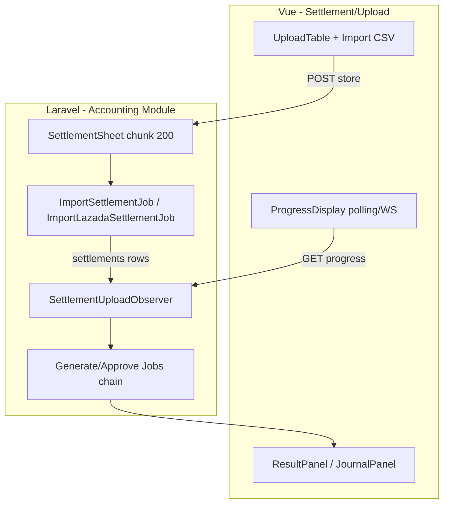
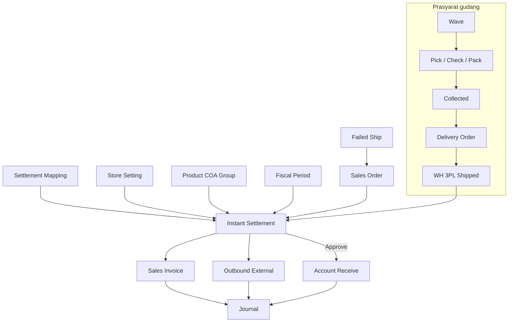

# Instant Settlement — Technical Documentation

## 1. Architecture Overview



**State machine** (`SettlementUploadStatus`): `validating` → `generating` → `approving` → `generating journals` → `approving journals` → (`journals approved`) → user approve → `generating receives` → … → `receive journals approved`.

**All-or-nothing:** `SettlementUploadObserver::afterValidation` set `failed` jika `!isSuccess()`; `processSettlement` hanya jalan jika `order_errors - skipped_rows <= 0`.

---

## 2. Frontend File Map

**Root:** `olshoperp-frontend/src/pages/Accounting/Settlement/Upload/`

| File | Role | Key API |
|------|------|---------|
| `Datalist.vue` | Page shell, modals, retry/delete/approve handlers | — |
| `components/UploadTable.vue` | PrimeDataTables, counters, progress, actions | `GET/POST accounting/settlement-upload` |
| `components/Import.vue` | Upload CSV + download template | `POST /`, `GET general-template` |
| `components/Export.vue` | Export datalist async | `POST export`, `GET exports` |
| `components/ProgressDisplay.vue` | 5/4 progress bars, polling | `GET {id}/progress` |
| `components/ApproveDialog.vue` | Approve/reject settlement | `POST {id}/approve` |
| `components/DeleteChecker.vue` | Poll delete completion | `GET deleting`, `GET delete-progress` |
| `components/ResultPanel.vue` | Slideover orders/invoices/outbounds/receives | `GET {id}/orders|invoices|outbounds|receives` |
| `components/JournalPanel.vue` | Slideover journals | `GET {id}/journals` |
| `components/LogTable.vue` | Error logs per type | `GET {id}/errors` |
| `components/AuditTable.vue` | Audit trail | `GET audit` |
| `components/FileDetail.vue` | SO file breakdown | embedded in upload row |
| `helpers/fetch.ts` | API wrappers (progress, approve, delete) | — |
| `helpers/functions.ts` | Progress %, stuck detection helpers | — |

**Route:** `src/router/index.ts` → `/accounting/settlement-upload`

**Static templates:** `public/files/upload_settlement_template_shopee.csv`, `upload_settlement_template_lazada.csv` (TikTok template **referenced but missing** in repo).

---

## 3. Backend File Map

| File | Role |
|------|------|
| `Http/Controllers/SettlementUploadController.php` | CRUD upload, datalists, approve, retry, delete, templates |
| `Http/Controllers/SettlementUploadRetryController.php` | Single settlement retry |
| `Import/SettlementSheet.php` | CSV/chunk parse, header detect, dispatch jobs |
| `Import/SettlementImport.php` | Multi-sheet Excel wrapper |
| `Jobs/ImportSettlementJob.php` | Per-row validation + `Settlement` create |
| `Jobs/ImportLazadaSettlementJob.php` | Lazada aggregate by order+date |
| `Jobs/SettlementGenerateInvoiceJob.php` | `Settlement::generateInvoice()` |
| `Jobs/SettlementGenerateOutboundJob.php` | `Settlement::generateOutbound()` |
| `Jobs/SettlementApproveInvoiceJob.php` | Auto-approve SI |
| `Jobs/SettlementApproveOutboundJob.php` | Auto-approve OB |
| `Jobs/SettlementGenerateInvoiceJournalJob.php` | SI journal |
| `Jobs/SettlementGenerateOutboundJournalJob.php` | OB journal |
| `Jobs/SettlementApproveInvoiceJournalJob.php` | Approve SI journal |
| `Jobs/SettlementApproveOutboundJournalJob.php` | Approve OB journal |
| `Jobs/SettlementGenerateCustomerPaymentJob.php` | 1 AR, smart skip `payment_details_exists` |
| `Jobs/SettlementApproveCustomerPaymentJob.php` | Approve AR |
| `Jobs/DeleteSettlementJob.php` | Hard delete chain |
| `Jobs/SettlementRereadExcelJob.php` | Re-parse file if row incomplete |
| `Jobs/SettlementUploadExportJob.php` | Export datalist |
| `Entities/SettlementUpload.php` | Model + `processSettlement`, `approve` |
| `Entities/Settlement.php` | Per-row settle + generate methods |
| `Entities/SettlementMapping.php` | Column constants per platform |
| `Observers/SettlementUploadObserver.php` | Pipeline orchestration |
| `Jobs/Traits/SettlementValidation.php` | Shared validation helpers |
| `Policies/SettlementUploadPolicy.php` | Gate (extends MainPolicy) |
| `Broadcasting/InstantSettlementChannel.php` | WS progress |
| `Constants/SettlementUploadStatus.php` | Progress states |

---

## 4. API Routes

Prefix: `accounting/settlement-upload` (middleware `auth:sanctum`, `auth_verified`)

| Method | Path | Controller | Notes |
|--------|------|------------|-------|
| GET | `/` | index | DataList uploads |
| POST | `/` | store | `store_id`, `file_attachment` (csv) |
| DELETE | `{id}` | delete | Dispatch `DeleteSettlementJob` |
| POST | `{id}/approve` | approve | Body: `approval_status`, `description` |
| POST | `{id}/retry` | retry | Resume failed step |
| POST | `{id}/retry/{settlement_id}` | retrySingle | Per-settlement |
| GET | `{id}/progress` | progress | Polling payload |
| GET | `{id}/errors` | errors | `?type=order|invoice|...` |
| GET | `{id}/warnings` | warning | Journal warnings |
| GET | `{id}/orders` | orders | Success SO list |
| GET | `{id}/invoices` | invoices | SI datalist |
| GET | `{id}/outbounds` | outbounds | OB datalist |
| GET | `{id}/journals` | journals | `?type=invoices|outbounds` |
| GET | `{id}/receives` | receives | AR (single) |
| GET | `{id}/uploaded-file` | downloadFile | Original upload blob |
| GET | `general-template` | generalTemplate | Others platform template — `?store_id=&format=csv\|xlsx` |

### `generalTemplate` — OC/OD header generation

**Controller:** `SettlementUploadController@generalTemplate`  
**Export class:** `SettlementGeneralExport`

```php
// Kolom tetap
Order Number | Date Settled | Total
// Lalu dinamis:
OC: {other_cost.code}   // semua OC eligible
OD: {other_discount.code}  // semua OD eligible
```

**Filter query (saat `store_id` terisi):**

| Model | Query |
|-------|-------|
| `OtherCost` | `status=1` AND (`is_all_stores=1` OR pivot store = `store_id`) |
| `OtherDiscount` | `status=1` AND (`is_all_stores=1` OR pivot store = `store_id`) |

Pivot: `accounting_other_cost_pivots` / `omni_other_discount_pivots`.

**Parse upload:** `SettlementSheet::getGeneralHeaders()` — match header exact `OC: {code}` / `OD: {code}` ke master; set `type` = `costs` / `discounts` + `other_cost_id` / `other_discount_id`. Lihat requirement §4.6.

**SO match:** `ImportSettlementJob` dengan `is_general=true` → `reference_class = SalesOrderGeneral`, order key = kolom `Order Number` → `SalesOrder.code`.
| GET | `audit` | audit | Model audit |
| POST | `export` | export | Async Excel |
| GET | `exports` | getExport | Export job list |
| GET | `deleting` | checkDeleteProgress | IDs in deleting state |
| GET | `delete-progress` | getDeleteProgress | `?ids=1,2` |

---

## 5. Database Schema

| Table | Purpose |
|-------|---------|
| `accounting_settlement_uploads` | Batch header, counters, progress, `receive_id` |
| `accounting_settlements` | Per-row: `reference_*`, `details` JSON, `without_outbound`, `invoice_id`, `receive_detail_id` |
| `accounting_settlement_upload_logs` | Errors/warnings per type |
| `accounting_settlement_upload_orders` | Dedup order IDs in file |
| `accounting_settlement_upload_export_files` | Export jobs |
| `accounting_settlement_mappings` | Column ↔ COA (menu terpisah) |

Key counters on upload: `order_count`, `order_errors`, `generated_invoice_count`, `approved_invoice_journal_count`, `generated_receive_count`, etc.

---

## 6. Jobs / Observers / Events

### Observer chain (`SettlementUploadObserver`)

| Dirty field | Action |
|-------------|--------|
| `validated_rows` == `total_rows` | Fail or → `generating` + `processSettlement()` |
| `processing_attempted` | → `approving` + dispatch approve SI/OB jobs |
| `approving_attempted` | → `generating journals` |
| `generating_journal_attempted` | → `approving journals` |
| `approving_journal_attempted` | → `journals approved` |
| `attempted_receive_count` | → approve AR job |

### Import validation highlights (`ImportSettlementJob`)

- Match SO by `platform_order_id` (platform) or `code` (general)
- `stock_mutations` approved with destination `PROCESS_GROUP_SHIP_DO`
- `extractOrderDetails` → pending doc check, failed ship qty
- Sign inversion on mapped columns (`positive`/`negative`)
- Fiscal period + inbound date checks on outbound path

### AR generation (`SettlementGenerateCustomerPaymentJob`)

- Creates one `CustomerPayment` per upload if absent
- Chunks settlements; skips `invoice.payment_details_exists`
- `bulkSelectStore` for payment details

### Delete (`DeleteSettlementJob`)

- Deletes receive, invoice (+ journals), outbound (+ journals), settlement rows
- Soft-deletes upload on success; sets `failed` on partial error

---

## 7. Platform Column Constants

Defined in `SettlementMapping.php`:

```php
DATE_COLUMNS, DATE_FORMATS, DATE_TIMEZONE,
TOTAL_COLUMNS, ORDER_ID_COLUMNS, TYPES_COLUMNS
```

`SettlementUploadController::selectSheet()` picks worksheet by platform name.

---

## 8. Permissions (Gate)

| Ability | Used for |
|---------|----------|
| `viewAny` | List, panels, progress |
| `create` | Upload, retry, reread |
| `approval` | Approve settlement (`can_approve`) |
| `delete` | Delete settlement (`can_delete`) |

---

## 9. Total Penghasilan — perhitungan & UI

| Field | Rumus import |
|-------|--------------|
| `total_products` | Sum line SO via `extractOrderDetails` (qty = `invoicable_quantity_in_base_unit`) |
| `total_invoice` | `total_products + total_other_costs - total_other_discounts` |
| `total_settlement` | Kolom CSV platform (`Total Penghasilan`, dll.) |

Hard validation `total_invoice == total_settlement` **disabled** (commented `ImportSettlementJob` ~L473).

**UI labels** (ResultPanel → `invoices`): `settlement_total_formatted`, `settlement_difference_formatted` — see requirement §5.1.

## 10. Outbound journal warnings vs stock validation

| Phase | Code | Check |
|-------|------|-------|
| Import validation | `SettlementValidation::checkShipping` | Stock available on settle date; settle after shipment |
| Import validation | `SettlementValidation::checkInboundDate` | Inbound date consistency |
| Journal generate | `Settlement::generateOutboundsJournal` → `StockMutationOutboundController::generateJournal` | If `JournalProcess` returns `zero_prevention` → Exception code **1** → logged as **warning** (`outbound_journal_warnings`), not batch error |

UI: `JournalPanel` pill **Warnings** → `WarningTable` → `GET {id}/warnings?type=outbound_journal`.

## 11. Retry endpoints & UI mapping

| UI | API |
|----|-----|
| Progress bar ⚠️ click → `@retry` | `POST accounting/settlement-upload/{id}/retry` |
| LogTable header retry | same |
| LogTable row **Continue** | `POST .../retry/{settlement_id}` body `{ type }` |

## 12. Reject approval

`SettlementUploadController::approve` → `SettlementUpload::approve` → `MainModel::approve`. If `approval_status != approved`, AR job **not** dispatched; `transaction_status = rejected`.

## 13. Bulk approve guard

`PrimeDataTables.bulkApprovable`: all selected rows must have `can_approve === true`. Backend `POST /api/bulk-approve` with `x_class = SettlementUploadController`.

## 14. Known implementation notes

| Topic | Detail |
|-------|--------|
| CSV-only UI | By design — TikTok/scientific notation; FE `accept=".csv"` |
| Store Authorized | Not checked — by design |
| Total match validation | Commented out — use UI Difference Settlement-SI |
| TikTok static template | `Import.vue` links `/files/upload_settlement_template_tiktok.*` — **file missing** in repo |
| Re-read | `MAX_REREAD_TIMES = 3` on `SettlementUpload` |
| Queue | `import` queue for validation & generation jobs |
| SO General key | `code` not `platform_order_id` when `$is_general` |

---

## 15. Related db-schema / API docs

- Settlement Mapping menu: `docs/qa-docs/accounting-settlement-mapping/`
- Customer Invoice / Payment modules share generate/approve controllers

## 16. Integration relationship diagram

Canonical diagram & Fase 1 cross-reference matrix: [requirement.md §10](./requirement.md#10-relasi-menu--integrasi).



| Related menu doc | Code touchpoints (settlement) |
|------------------|-------------------------------|
| `accounting-settlement-mapping` | Column → COA map in `ImportSettlementJob` |
| `omni-store-binding` | `cash_bank_account_id`, store COA on AR approve |
| `supplychain-mutation-outbound` | `SettlementGenerateOutboundJob`, `StockMutationOutbound` |
| `accounting-customer-invoice` | `SettlementGenerateCustomerInvoiceJob` |
| `accounting-customer-payment` | `SettlementGenerateCustomerPaymentJob` (Smart AR) |
| `supplychain-failed-ship` | Net qty validation vs `prepared_to_failed_ship_quantity` |
| `sales-order-general` | Match SO by `code` / `platform_order_id`; Shipped WH 3PL |
| `omni-other-cost` | Template General kolom `OC:` — `generalTemplate` filter Applied Store |
| `omni-other-discount` | Template General kolom `OD:` — filter identik OC |
| `supplychain-delivery-order` | Shipping-DO transfer → Shipped status |
| `omni-waves-management` / `omni-picking-process` | Fulfillment chain prerequisite |
| `accounting-product-coa-group` | COA on `JournalProcess` SI/OB lines |
| `accounting-fiscal-period` | `validate_fiscal_period()` on upload/approve |
| `journal` | `JournalProcess::*AutoJournal` from settlement jobs |
| `generalsetting-general-company` | Shipper on SO → WH 3PL shipping transfer (V-04) |
| `system-product` | Active SKU on SO lines; COA via Product COA Group |
| `omni-checking-process` / `omni-packing-process` | Fulfillment chain between pick and DO |

---

## Related Documents

| Doc | Path |
|-----|------|
| Knowledge Base | [knowledge-base.md](./knowledge-base.md) |
| Requirement | [requirement.md](./requirement.md) |
