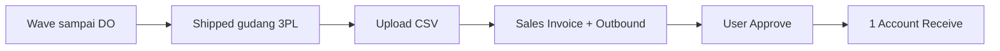
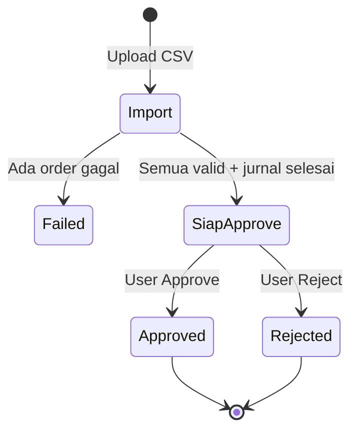

# Panduan Pengguna — Instant Settlement

**Siapa yang baca:** tim Finance / Accounting, AR clerk, marketplace ops  
**Menu:** Finance Accounting → Settlement → Instant Settlement  
**Route:** `/accounting/settlement-upload`  
**Kode transaksi:** dimulai dengan `ST-`

---

## 1. Apa Itu & Kenapa Penting

**Instant Settlement** dipakai untuk **rekonsiliasi dana cair marketplace**. Kamu upload file settlement dari Shopee, TikTok, Lazada, atau template internal untuk order General. Sistem lalu membuat dokumen penjualan dan stok secara otomatis.

Satu file CSV bisa menyelesaikan ratusan order sekaligus — tanpa input invoice dan outbound satu per satu. Pelunasan piutang (Account Receive) baru muncul setelah kamu klik **Approve**.

---

## 2. Overview Flow & Proses Bisnis

### Rantai proses (dari gudang sampai kas masuk)

**Versi teks (tanpa diagram):**

1. Order diproses gudang: Wave → Pick → Check → Pack → Collect → Delivery Order.  
2. Setelah kirim, status order jadi **Shipped** di gudang 3PL / kurir.  
3. Kamu pilih **satu toko**, lalu upload file CSV settlement.  
4. Kalau semua order lolos, sistem membuat **Sales Invoice** + **Outbound** (potong stok) + jurnal keduanya (langsung approved).  
5. Kamu klik **Approve** → sistem membuat **satu Account Receive** untuk seluruh batch (satu toko).  
6. Kalau kamu **Reject**, invoice dan outbound tetap ada — hanya pelunasan yang tidak jadi.

🎬 [Interactive demo akan ditambahkan di sini]

### Siklus status batch

**Versi teks — arti tiap status:**

| Status | Artinya | Bisa diedit? |
|--------|---------|--------------|
| **In Progress** | File sedang divalidasi / dokumen sedang dibuat | Tunggu; retry jika macet |
| **Import Failed** | Ada order gagal — seluruh file batal | Upload file baru setelah perbaiki order |
| **Import Complete** (jurnal siap) | Invoice + outbound + jurnal sudah ada | Approve / Reject / Delete (jika syarat terpenuhi) |
| **Approved** | Pelunasan AR batch sudah dibuat | Tidak untuk langkah AR ini |
| **Rejected** | Kamu menolak pelunasan; dokumen upload tetap | Bukan hapus; pakai Delete jika perlu hapus rantai |

---

## 3. Sebelum Mulai (Flow Sebelum)

Pastikan ini sudah siap sebelum upload:

- [ ] **Store** sudah dipilih di dropdown kanan atas (satu file = satu toko).  
- [ ] **Settlement Mapping** lengkap untuk toko marketplace (nama kolom biaya di file harus sama persis dengan mapping). Toko General **tidak** pakai mapping — biaya/diskon lewat kolom template.  
- [ ] Di **Store Setting:** akun piutang + **Cash/Bank Receiving** sudah terisi (wajib sebelum Approve).  
- [ ] Order sudah **Shipped** ke gudang 3PL — rantai gudang selesai.  
- [ ] **Product COA Group** SKU terkait sudah lengkap.  
- [ ] **Fiscal Period** terbuka pada tanggal settle di file.  
- [ ] File dalam format **CSV** (bukan Excel).  
- [ ] Qty **Failed Ship** (kalau ada) sudah benar — sisa itulah yang boleh di-settle.

Status **Store Authorized** tidak dicek di menu ini — by design. Yang dicek: toko terpilih dan order milik toko itu.

🎬 [Interactive demo akan ditambahkan di sini]

---

## 4. Setelah Selesai (Flow Sesudah)

Setelah upload **sukses**:

1. Cek angka **SO Success** dan panel invoice: **Settlement Total** (angka dari file) vs **Net Sales SI**, plus kolom **Difference Settlement-SI**. Selisih kecil tidak memblokir — kamu yang rekonsiliasi.  
2. Klik **Approve** (✓) → isi catatan → **Approve**. Satu batch = **satu AR** berisi banyak invoice.  
3. Pantau kolom **Progress** (4 tahap) sampai AR dan jurnal AR selesai.  
4. Kalau ada **dana susulan** untuk order yang sama → upload file baru (**re-settlement**): outbound tidak dibuat ulang, yang baru hanya invoice penyesuaian.  
5. Kalau salah upload dan belum ada AR manual: **Delete** — stok kembali, status gudang **tetap Shipped** (bisa settle ulang tanpa proses fisik dari awal).

🎬 [Interactive demo akan ditambahkan di sini]

---

## 5. Yang Perlu Diperhatikan

Ditulis dari yang kamu alami di layar:

- **Kalau 1 order di file gagal**, seluruh file batal. Tidak ada invoice/outbound sama sekali. Perbaiki order, lalu upload **file baru**.  
- **Kalau kamu belum pilih store**, Import tidak jalan — pilih toko dulu.  
- **Kalau kamu upload file toko lain** (atau header tidak dikenali), sistem menolak: file harus cocok dengan toko yang dipilih. **Satu file = satu toko.**  
- **Kalau kamu upload Excel**, jangan. Order ID marketplace (terutama TikTok) bisa berubah jadi `1.23E+17` — order tidak ketemu, seluruh batch gagal. Simpan sebagai CSV.  
- **Kalau order belum Shipped**, baris itu gagal dan menarik seluruh file.  
- **Kalau Order ID di file tidak ada di sistem**, pesan *Unable to find order*. Cek typo. Untuk **booking Shopee** yang ID-nya masih `-`, tunggu **MATCHED** dulu — belum bisa settle. Approve booking amount 0 juga **tidak** langsung buat invoice.  
- **Kalau tanggal settle lebih awal dari tanggal kirim**, atau stok habis pada tanggal itu, baris gagal.  
- **Kalau format tanggal salah** (beda per platform), baris gagal — ikuti format di template/export.  
- **Kalau Fiscal Period belum ada atau sudah Closed** pada tanggal settle, baris gagal.  
- **Kalau Failed Ship masih Open**, atau settle COD setelah tanggal failed ship tidak valid, baris gagal.  
- **Kalau ada draft invoice/outbound** yang belum selesai, selesaikan dulu (approve atau hapus draft).  
- **Kalau re-settlement tanpa biaya/diskon tambahan**, sistem menolak — settle susulan butuh minimal satu Other Cost atau Other Discount.  
- **Kalau Cash/Bank Receiving belum di-set**, Approve gagal (*Receiving Destination COA is not set*).  
- **Kalau tanggal transaksi Sales Invoice di batch campur beda hari**, Approve ditolak. Jam boleh beda di hari yang sama. Contoh: SI jam 09:00 dan 18:30 tanggal 1 → OK; tanggal 1 dan tanggal 2 → ditolak.  
- **Tanggal AR** setelah Approve = tanggal SI (yang sudah sama); **jam AR** = jam paling akhir di antara SI batch itu.  
- **Kalau semua invoice batch sudah punya AR**, tombol Approve disabled — itu normal.  
- **Kalau sebagian invoice sudah dilunasi manual**, Approve tetap boleh: sistem hanya memasukkan invoice yang **belum** punya AR (**Smart AR**).  
- **Kalau ada AR manual** pada invoice hasil settlement, Delete disabled. Reverse AR itu dulu, atau biarkan terkunci.  
- **Kalau kamu Reject** di dialog Approve: pelunasan tidak dibuat; invoice dan outbound **tetap ada**. Reject ≠ Delete.  
- **Kalau jurnal outbound tampil warning** (nilai persediaan 0), cek tab **Warnings** di panel jurnal — ini peringatan, bukan gagal seluruh batch.

---

## 6. Langkah-Langkah (Step by Step)

### Langkah 1 — Pilih toko & siapkan file

1. Buka **Instant Settlement**.  
2. Pilih **Store** di kanan atas.  
3. Ambil file dari Seller Centre (Shopee sheet **Income**, TikTok **Order details**, Lazada **Transaction Overview**) → **simpan CSV**.  
4. Atau **Import → Download Template** (CSV/Excel sebagai contoh kolom). TikTok: file contoh di menu belum tersedia — pakai export resmi TikTok.  
5. Toko **Others (General):** pilih store dulu, lalu download template. Kolom wajib: **Order Number** (kode SO internal), **Date Settled**, **Total**. Kolom `OC:` / `OD:` hanya muncul untuk master Active yang berlaku di toko itu.

### Langkah 2 — Upload

1. **Import → Import** → pilih file `.csv`.  
2. Tunggu **Progress Status** (5 tahap) sampai jurnal invoice & outbound approved.  
3. Badge bisa tampil *In Progress X%* plus perkiraan sisa waktu.  
4. Kalau macet lebih dari 10 menit, klik ikon **⚠️** kuning untuk retry.

### Langkah 3 — Cek hasil

1. Cek **SO Success**. Ada **SO Failed** (angka merah)? Klik untuk pesan error.  
2. Klik angka biru **SI Success** untuk panel invoice: **Net Sales SO**, **Net Sales SI**, **Settlement Total**, **Difference Settlement-SI**.  
3. Klik nama file untuk unduh ulang file yang kamu upload.

### Langkah 4 — Approve (atau Reject)

1. Tombol **Approve** (✓) muncul jika upload selesai dan kamu punya hak approval.  
2. Isi catatan → **Approve** (lanjut AR) atau **Reject** (tidak lunasi batch ini).  
3. Pantau kolom **Progress** (4 tahap) sampai AR selesai.  
4. Bisa **bulk approve** beberapa baris — semua yang dicentang harus eligible; campur yang sudah approved akan gagal untuk baris yang tidak boleh.

### Langkah 5 — Re-settlement / hapus / retry

1. **Dana susulan:** upload file baru berisi Order ID yang sama. Settle pertama: outbound + invoice SKU. Settle berikutnya: hanya invoice adjustment.  
2. **Hapus:** Delete (🗑) → konfirmasi. Gudang tetap Shipped.  
3. Error generate (bukan SO Failed): buka log angka merah → **Retry** batch atau **Continue** per baris.

🎬 [Interactive demo akan ditambahkan di sini]

---

## 7. Tips & Hal yang Sering Bikin Bingung

**All-or-nothing — 1 order gagal, seluruh file batal.**  
Misalnya 99 order sudah Shipped, 1 belum. Upload gagal total: tidak ada invoice sama sekali. Klik **SO Failed**, perbaiki order itu, upload file **baru**. Jangan harap 99 yang valid tetap jadi dokumen.

**Booking Shopee belum match.**  
Order ID di Sales Platform masih `-`. File settlement tidak akan ketemu order itu. Tunggu ID marketplace terisi, baru upload.

**Satu file = satu toko.**  
File settlement Toko A tidak boleh di-upload saat dropdown Toko B. Pisahkan file per toko.

**Smart AR.**  
Kamu sudah buat AR manual untuk 10 dari 100 invoice di batch. Saat Approve, sistem hanya lunasi 90 sisanya. Satu AR, banyak referensi invoice. Kalau 100/100 sudah punya AR, tombol Approve mati.

**Kenapa AR cuma 1 padahal invoice ratusan?**  
Sengaja: satu settlement = satu toko = satu dokumen pelunasan.

**CSV vs Excel.**  
Template Excel boleh diunduh sebagai contoh kolom, tapi upload di layar ini **hanya CSV**. Excel sering merusak Order ID panjang.

**Reject vs Delete.**  
Reject = tidak jadi generate AR. Delete = hapus rantai dokumen hasil settlement (jika belum terkunci AR manual). Delete **tidak** mengembalikan Wave/Pick/Pack.

**Kolom OC/OD beda per toko.**  
Other Cost hanya untuk Toko A → download template Toko A: kolom `OC:` ada. Download Toko B: kolom itu tidak ada. Master Inactive tidak masuk template.

**Selisih Settlement Total vs invoice.**  
Rounding platform / mapping biaya. Cek **Difference Settlement-SI** — sistem tidak memblokir selisih kecil.

**Import macet.**  
Klik ⚠️ atau tunggu. Hubungi admin jika lebih dari 1 jam.

**Jurnal outbound warning.**  
Nilai persediaan 0 saat posting — buka panel **Out Journal** → tab **Warnings**, perbaiki akun/nilai stok.

---

## 8. Referensi

| Sumber | Untuk apa |
|--------|-----------|
| [Knowledge Base](./knowledge-base.md) | Troubleshooting, format file, FAQ |
| [Requirement](./requirement.md) | Validasi & relasi menu |
| [Technical](./technical.md) | Developer |
| [Settlement Mapping](../accounting-settlement-mapping/README.md) | Pemetaan kolom biaya marketplace |
| [Store Binding](../omni-store-binding/README.md) | Akun piutang & Cash/Bank Receiving |
| [Sales Invoice](../accounting-customer-invoice/README.md) | Invoice hasil generate |
| [Account Receive](../accounting-customer-payment/README.md) | Pelunasan setelah Approve |
| [Failed Ship](../supplychain-failed-ship/README.md) | Pengurang qty sebelum settle |
| [Fiscal Period](../accounting-fiscal-period/README.md) | Periode terbuka untuk tanggal settle |
| [Sales Platform](../omni-sales-platform/README.md) | Booking unmatched — tunggu Platform Order ID |
