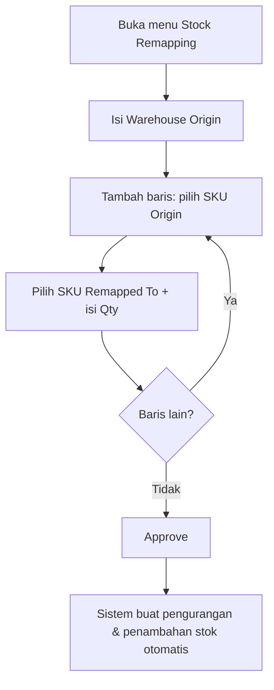

# Stock Remapping — Knowledge Base

> **Audience:** tim **Finance / Accounting** dan supervisor gudang yang diberi akses FA. Menu ini memuat **nilai harga (Unit Price)** yang tidak ditampilkan ke operator gudang biasa.

---

## 1. Apa itu Stock Remapping?

**Stock Remapping** (alias **Stock Acak**) memindahkan identitas stok dari satu SKU (SKU Origin) ke SKU lain (SKU Remapped To) — tanpa perlu membuat pengurangan dan penambahan stok manual satu per satu. Sistem yang mengerjakan pergerakan stoknya otomatis saat transaksi disetujui.

| Item | Nilai |
|------|-------|
| Menu | Finance Accounting → **Stock Remapping** |
| Kode transaksi | Diawali **`RM-`** |
| Kegunaan utama | Menyortir barang impor SKU acak (mixed container) menjadi variant sesungguhnya |

**Bukan ini:** Unit Conversion (ubah satuan, mis. Lusin → PCS). Stock Remapping mengubah **identitas SKU**, bukan satuannya.

### Contoh operasional

```
Beli 1.000 pcs SKU acak, setelah disortir:
  200 → SKU-pink
  300 → SKU-blue
  500 → SKU-white
→ 1 transaksi Stock Remapping berisi 3 baris
→ sistem otomatis membuat pengurangan + penambahan stok untuk tiap baris
```

---

## 2. Siapa yang memakai menu ini?

| Peran | Akses tipikal |
|-------|----------------|
| Finance / Accounting | Penuh — termasuk kolom **Unit Price** & Total Amount |
| Operator gudang biasa | **Tidak** punya menu ini — nilai barang tidak diekspos |
| Supervisor | Sesuai privilege FA |

---

## 3. Alur kerja standar



**Keterangan langkah:**

- **Warehouse Origin** (gudang asal barang) **wajib** diisi lebih dulu — sesudah ada baris, gudang ini tidak bisa diganti.
- **SKU Origin** = barang sumber yang stoknya mau dipindah identitasnya.
- **SKU Remapped To** = SKU tujuan hasil remap.
- **Qty** tidak boleh melebihi stok yang tersedia untuk SKU Origin di gudang tersebut.
- **Approve** memproses tiap baris berurutan: stok Origin berkurang dulu, lalu stok Remapped To bertambah (selisih waktu beberapa detik antara keduanya — normal).

---

## 4. Mengisi baris (Remapping Detail)

| Kolom | Bisa diisi? | Keterangan |
|-------|-------------|------------|
| SKU Origin | Ya | Barang sumber. Kamu bisa memilih batch stok lewat **Available Product** (**Single Use** = pilih satu, **Bulk Use** = pilih banyak sekaligus) |
| Remapped To | Ya | SKU tujuan — tidak boleh sama dengan Origin, bukan SKU acak |
| Qty | Ya | Tidak boleh melebihi stok tersedia |
| Unit | (mengikuti sistem) | Satuan pengukuran barang |
| **Unit Price** | **Tidak** | Otomatis dari nilai stok SKU Origin — **hanya tampil di FA** |
| Description | Ya | Opsional |

> **Sedang disiapkan (peningkatan):** pilihan SKU Remapped To akan dibuka lebih luas (tidak hanya variant satu induk), asalkan **kelompok satuannya (Unit Class) sama** dengan SKU Origin; input Qty akan dipatok ke satuan dasar; dan SKU tujuan yang sama boleh dipakai di beberapa baris. Untuk sementara, sistem masih membatasi Remapped To ke variant dari induk yang sama dan satu SKU tujuan hanya sekali per transaksi.

---

## 5. Aturan SKU

| Aturan | Detail |
|--------|--------|
| Status | Hanya SKU **Active** |
| Kelompok barang | Hanya **Purchased Item** & **Manufactured Item** (Service & Asset ditolak) |
| SKU acak (random) | **Ditolak** — tidak bisa jadi Origin maupun Remapped To |
| Self-remap | Origin = Remapped To → **ditolak** |

---

## 6. Approve — apa yang terjadi?

Setelah **Approve**, untuk tiap baris (berurutan, tidak bersamaan):

1. **Stok SKU Origin berkurang** (muncul sebagai dokumen di menu Adjustment Outbound).
2. **Stok SKU Remapped To bertambah** dengan nilai harga yang sama (muncul di menu Adjustment Inbound).

Sistem menolak Approve bila: ada barang bertipe **Service**, **Unit Price** mengandung angka desimal (harus bilangan bulat), atau **gudang asal** sedang non-aktif. Perbaiki dulu lalu Approve ulang.

---

## 7. Import banyak baris

Pakai template Excel **5 kolom**: **SKU Origin**, **Remapped To SKU**, **Qty**, **Unit**, **Description**.

- Diproses baris demi baris. Baris yang benar tetap masuk, baris yang gagal muncul di **import log** (partial import).
- Stok dihitung menumpuk per SKU Origin — kalau qty besar melebihi stok, urutkan yang besar dulu atau pecah ke transaksi terpisah.

---

## 8. Troubleshooting

| Gejala | Penyebab | Solusi |
|--------|----------|--------|
| Tidak bisa simpan saat create | Warehouse Origin belum diisi | Isi Warehouse Origin lebih dulu |
| Warehouse Origin tidak bisa diganti | Sudah ada baris detail | Hapus dulu semua baris bila memang perlu ganti gudang |
| Qty ditolak padahal stok terlihat cukup | Qty melebihi stok tersedia, atau sudah terpakai baris lain dengan SKU Origin sama | Kurangi qty atau cek baris lain |
| SKU ditolak | Inactive / Service / Asset / random | Cek Master System Product & kelompok barang |
| Remapped To tidak muncul / ditolak | SKU tujuan bukan dari induk yang sama, atau sudah dipakai di baris lain | Pilih SKU tujuan lain (sementara masih dibatasi satu induk) |
| Tidak bisa Approve | Ada barang Service, Unit Price desimal, atau gudang non-aktif | Perbaiki sesuai pesan lalu Approve ulang |
| Import baris terakhir gagal | Total qty melebihi stok (dihitung menumpuk) | Urutkan qty besar dulu atau pisah transaksi |
| Tidak melihat Unit Price | Peran tanpa akses FA | Menu & nilai harga hanya untuk role Finance Accounting |

---

## 9. FAQ

**Q: Kenapa menu ada di Finance Accounting, bukan Supply Chain?**
A: Karena baris detail memuat nilai harga (Unit Price). Operator gudang biasa tidak boleh melihat nilai persediaan.

**Q: Bisa remap ke SKU dari produk lain (beda induk) atau ke SKU Single/BOM/Bundle?**
A: Itu peningkatan yang sedang disiapkan. Untuk sekarang sistem masih membatasi ke variant dari induk yang sama.

**Q: Bisa edit Unit Price?**
A: Tidak — diisi otomatis dari nilai stok SKU Origin.

**Q: Kenapa ada jeda beberapa detik antara stok berkurang dan bertambah?**
A: Normal — sistem memproses pengurangan dulu, lalu penambahan menyusul beberapa detik kemudian.

**Q: Dokumen pengurangan/penambahan bisa diedit manual?**
A: Sebaiknya tidak. Dokumen itu dibuat otomatis dari Approve Stock Remapping; membuat manual untuk kasus yang sama berisiko dobel pergerakan stok.

---

## Related Documents

| Doc | Path |
|-----|------|
| Requirement | [requirement.md](./requirement.md) |
| Technical | [technical.md](./technical.md) |
| User Guide | [user-guide.md](./user-guide.md) |
