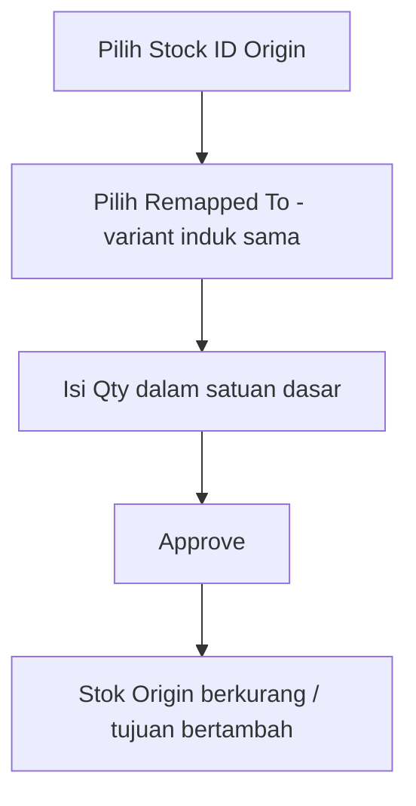

# Stock Remapping — Knowledge Base

> **Audience:** Finance / Inventory ops yang punya akses FA. **Route:** `/accounting/stock-remapping`

---

## 1. Apa itu?

**Stock Remapping** (Stock Acak) memindahkan identitas stok dari **SKU Origin** ke **SKU Remapped To**. Saat **Approve**, sistem otomatis mengurangi stok Origin lalu menambah stok tujuan — lengkap dengan nilai harga.

---

## 2. Glosarium

| Istilah | Arti awam |
|---------|-----------|
| **Stock ID** | Satu batch/baris stok masuk (bukan total gabungan SKU) |
| **Remapped To** | SKU tujuan — harus variant **induk yang sama** dengan Origin |
| **Base Unit** | Satuan terkecil (mis. PCS); qty diisi dengan satuan ini |
| **Avl. Base Unit** | Sisa stok Stock ID dalam Base Unit (batas max qty) |
| **Unit Class** | Kelompok satuan; Origin & tujuan harus sama (jaga data master rusak) |

---

## 3. Cara pakai (target perilaku baru)

1. Buat header Remapping (gudang origin, tanggal).  
2. Buka **Available Product** → pilih **Stock ID** spesifik (bukan total gabungan).  
3. Pilih **Remapped To** (variant induk sama). SKU tujuan **boleh sama** di baris lain.  
4. Unit terkunci ke Base Unit; isi Qty ≤ Avl. Base Unit.  
5. Approve — jika Unit Class tidak cocok / data tidak valid, sistem **menolak** (jangan force).

**Import:** isi SKU Origin, Remapped To, Qty (tanpa Unit). Qty besar otomatis dipecah ke beberapa baris mengikuti urutan stok masuk (FIFO).

---

## 4. Yang bisa / tidak bisa (setelah rilis v2.1)

| Aksi | Boleh? |
|------|--------|
| Remap ke variant induk yang sama | ✅ |
| Remap ke Single / BOM / Bundle | ❌ |
| Pakai Remapped To yang sama di 2+ baris | ✅ (baru) |
| Pilih Primary Unit lain untuk qty | ❌ — Base Unit saja |
| Lolos approve meski Unit Class beda | ❌ |

> **Sementara (sebelum rilis):** sistem masih menolak Remapped To duplikat, Unit masih bisa ganti, dan Origin masih agregat FIFO. Ikuti status rilis dari tech lead.

---

## 5. Troubleshooting

| Gejala | Cek |
|--------|-----|
| Remapped To tidak muncul | Bukan variant induk sama / inactive / random |
| Approve gagal Unit Class | Perbaiki unit di master System Product, lalu coba lagi |
| Qty ditolak | Melebihi Avl. Base Unit Stock ID itu |
| Harga terlihat “aneh” (sebelum rilis) | Blended FIFO lama — setelah rilis harus ikut Stock ID |

---

## 6. FAQ

**Q: Kenapa harus pilih Stock ID?**  
A: Supaya harga ikut batch yang benar, tidak digabung rata-rata.

**Q: Kenapa cek Unit Class kalau biasanya sama?**  
A: Kalau master product sempat salah unit, transaksi jangan sampai memposting data rusak.

---

## Related Documents

| Doc | Path |
|-----|------|
| Requirement | [requirement.md](./requirement.md) |
| Technical | [technical.md](./technical.md) |
| User Guide | [user-guide.md](./user-guide.md) |
