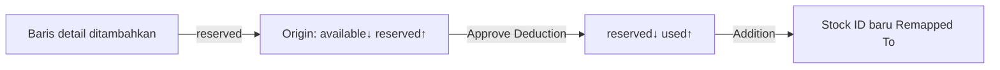
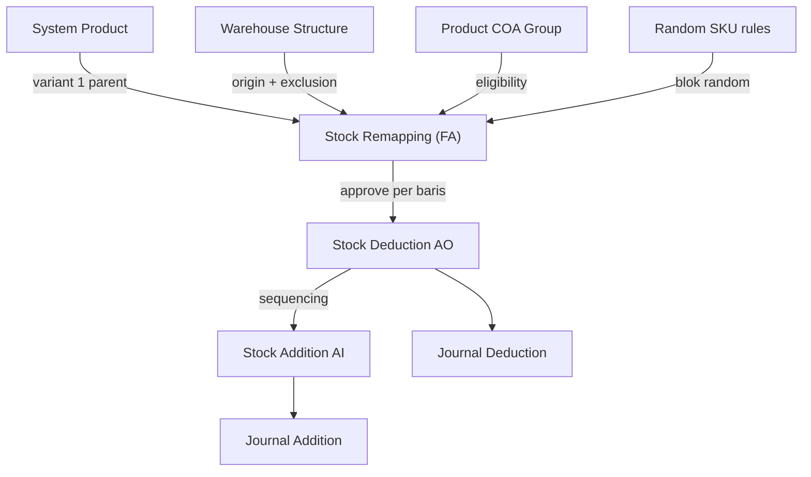

# Stock Remapping — Requirement Documentation

**Modul:** Finance Accounting (FA) — dengan integrasi pergerakan stok Supply Chain  
**UI route (TO-BE):** `/accounting/stock-remapping`  
**API base (TO-BE):** `{VITE_API_URL}accounting/stock-remapping`  
**Audience:** PM, Operations (Finance), QA, Support, Developer  
**Status:** Requirement TO-BE — fitur baru; sebagian item `[VERIFY: CODEBASE]`  
**PM source:** Stock Remapping Requirement v1.1 (5 Juli 2026)  
**Aliases operasional:** Stock Acak · Stock Conversion (nama draft lama)

---

## 0. Metadata & Changelog

| Version | Date | Author | Changes |
|---------|------|--------|---------|
| 1.0 | 2026-07-09 | QA - Yemima | Initial QA doc dari PM v1.1; modul FA; relasi SCM; prefix **RM-**; pending items §15 |

---

## Daftar Isi

1. [Ringkasan Eksekutif](#1-ringkasan-eksekutif)
2. [Penempatan Modul & Visibility](#2-penempatan-modul--visibility)
3. [Struktur SKU & Eligibilitas](#3-struktur-sku--eligibilitas)
4. [UI/UX — Datalist & Header](#4-uiux--datalist--header)
5. [Remapping Detail](#5-remapping-detail)
6. [Validasi Stok, SKU & Import](#6-validasi-stok-sku--import)
7. [Pergerakan Stok (Stock ID Lifecycle)](#7-pergerakan-stok-stock-id-lifecycle)
8. [Approval & Dokumen Auto-Generated](#8-approval--dokumen-auto-generated)
9. [Unit Price — Non-Editable](#9-unit-price--non-editable)
10. [Import Detail](#10-import-detail)
11. [Relasi Menu Lain](#11-relasi-menu-lain)
12. [Acceptance Criteria](#12-acceptance-criteria)
13. [QA Test Scenarios](#13-qa-test-scenarios)
14. [Do's and Don'ts](#14-dos-and-donts)
15. [Hal yang Perlu Diperhatikan / Pending Items](#15-hal-yang-perlu-diperhatikan--pending-items)

---

## 1. Ringkasan Eksekutif

**Stock Remapping** meremap stok dari **1 SKU variant ke SKU variant lain dalam 1 parent yang sama**, tanpa Deduction + Addition manual terpisah.

| Item | Nilai |
|------|-------|
| Prefix | **`RM-`** + autogenerate (max 8 karakter) `[VERIFY: CODEBASE]` tidak bentrok |
| Use case utama | Sortir impor SKU acak (mixed container) → variant sesungguhnya |
| Approve | Per baris: auto **Stock Deduction** (origin) → auto **Stock Addition** (remapped to), sequencing |
| Pembeda | **Bukan** Unit Conversion (konversi satuan antar unit) |

---

## 2. Penempatan Modul & Visibility

| Aspek | Keputusan |
|-------|-----------|
| **Modul menu utama** | **Finance Accounting** |
| Alasan | Baris detail menampilkan **Unit Price** / total amount (nilai persediaan) |
| Operator gudang (SCM) | **Tidak** memiliki akses menu ini — nilai barang tidak boleh dilihat tim operasional gudang |
| Pergerakan stok | Tetap melalui entitas SCM (`StockMutationDeduction` / `StockMutationAddition`) — auto-generated saat approve |
| Permission | Policy FA terpisah dari menu SCM Deduction/Addition manual |

**Implikasi QA:** Uji role gudang tidak melihat route FA `/accounting/stock-remapping` dan tidak melihat kolom unit price di transaksi turunan jika policy SCM menyembunyikan nilai.

---

## 3. Struktur SKU & Eligibilitas

### 3.1 Hierarki yang didukung

```
SKUPENSIL              → Parent
  SKUPENSIL-acak       → Variant — eligible sebagai Origin
  SKUPENSIL-pink       → Variant — eligible sebagai Remapped To
  SKUPENSIL-random     → DIBLOK semua posisi
```

### 3.2 Kriteria eligible

| Kriteria | Rule |
|----------|------|
| Type Product | Hanya **Variant** (1 parent) |
| Status | **Active** |
| Product COA Group | Hanya **Purchased Item** & **Manufactured Item** — **blok** Service & Asset |
| Flag random | **Blok** suffix/flag `random` |
| Parent | Origin & Remapped To **harus 1 parent** |
| Self-remap | Origin ≠ Remapped To |
| Unit | Primary unit sama antar variant (aturan System Product) |

Detail random: [random-sku/requirement.md](../random-sku/requirement.md)

---

## 4. UI/UX — Datalist & Header

**Path:** Finance Accounting → **Stock Remapping**

### 4.1 Kolom datalist

| Kolom | Field / keterangan |
|-------|-------------------|
| Trx Code \| Trx Date | `RM-` + tanggal |
| Building Origin | Warehouse origin |
| Description | — |
| Qty \| Total Amount | Akumulasi qty + (unit price × qty) detail |
| Trx Ref | Opsional |
| Trx Status | Draft / Open / Approved / Rejected `[VERIFY: CODEBASE]` Void? |
| Created / Updated | Audit standar |

### 4.2 Fitur datalist

Advanced Filter · Show Deleted · Column show/hide · Export `[VERIFY]` · Audit Log · Approval log (pola PO/PR)

### 4.3 Basic Information (create/edit)

Autosave seperti **Purchase Inbound** — save saat create jika required terisi.

| Field | Wajib | Default | Keterangan |
|-------|-------|---------|------------|
| Transaction Code | — | Auto `RM-` | — |
| Transaction Date | — | `now()` | — |
| Warehouse Origin | **Ya** | Last transaksi; NULL jika belum ada | Exclusion rules **sama** Stock Deduction & Outbound `[VERIFY: CODEBASE]` |
| Trx Ref | Opsional | NULL | Freetext |
| Description | Opsional | NULL | Freetext |

Warehouse NULL → autosave gagal + notifikasi user.

---

## 5. Remapping Detail

| Field | Wajib | Editable | Keterangan |
|-------|-------|----------|------------|
| SKU Origin | Ya | Ya | Boleh duplikat antar baris |
| Remapped To | Ya | Ya | Opsi setelah origin dipilih — exclude random, self, variant sudah dipakai |
| Qty | Ya | Ya | ≤ sisa quota origin |
| Unit | — | Ya | Default primary; alternate jika ada |
| Unit Price | — | **Tidak** | Auto dari stock ID origin — §9 |
| Description | Opsional | Ya | Max 150 char |

### Aturan opsi Remapped To

- Hanya variant **satu parent** dengan origin
- Exclude `-random`
- Exclude origin (no self-remap)
- Exclude variant yang sudah jadi Remapped To di baris lain

---

## 6. Validasi Stok, SKU & Import

### 6.1 Validasi SKU

| Kondisi | Pesan (contoh) |
|---------|----------------|
| Origin = Remapped To | SKU Origin and Remapped To cannot be the same. |
| SKU inactive | SKU [code] is inactive and cannot be used. |
| SKU random | Random SKU cannot be used in Stock Remapping. |
| COA Service/Asset | SKU [code] with Product COA Group type "[type]" is not allowed... |
| Beda parent | SKU [code] does not belong to the same parent as SKU Origin. |
| Remapped To duplikat | SKU [code] is already used as Remapped To in another row... |

### 6.2 Quota stok real-time (input manual)

```
Sisa quota Origin X =
  Availability Origin X di Warehouse Origin
  − Σ qty baris lain dengan Origin X dalam transaksi ini
```

### 6.3 Import — sequential row processing

- Baca file **atas → bawah**
- Akumulasi quota per SKU Origin
- Row valid tetap diimport; row gagal di error log (partial import)
- Row yang melebihi quota → FAILED + pesan availability

### 6.4 Validasi import tambahan

SKU not found · Qty ≤ 0 · format file invalid → reject / row fail sesuai aturan standar import OlshopERP.

---

## 7. Pergerakan Stok (Stock ID Lifecycle)

### 7.1 Saat baris detail ditambahkan (pre-approve)

Qty masuk **`reserved`** stock ID SKU Origin — `available` berkurang.

### 7.2 Saat approve — Deduction origin

`reserved` → 0 untuk qty baris; `used` bertambah.

### 7.3 Stock Addition remapped to

Stock ID **baru** untuk SKU Remapped To — qty & **unit price sama** origin.



`[VERIFY: CODEBASE]` — mekanisme reservation & cleanup saat delete baris/header — §15.

---

## 8. Approval & Dokumen Auto-Generated

### 8.1 Status flow

Create → **OPEN** (default) → Approve / Reject → Reject → edit → **DRAFT** → OPEN

`[VERIFY: CODEBASE]` — siklus lengkap termasuk Void.

### 8.2 Sequencing per baris (wajib)

Untuk setiap baris valid:

| Step | Dokumen | Trx date | Referensi |
|------|---------|----------|-----------|
| 1 | Stock Deduction auto-approved | = trx date RM | Nomor RM |
| 2 | Stock Addition auto-approved | = trx date RM **+ 10 detik** | Nomor RM |

**Aturan:**

- Deduction **harus** approved sebelum Addition
- Satu baris **selesai** sebelum baris berikutnya
- **Tidak paralel** antar baris
- Re-validasi stok saat approve — baris gagal dilaporkan; baris valid tetap diproses

Relasi: [supplychain-adjustment-deduction](../supplychain-adjustment-deduction/requirement.md) · [supplychain-adjustment-addition](../supplychain-adjustment-addition/requirement.md)

---

## 9. Unit Price — Non-Editable

| Rule | Detail |
|------|--------|
| Edit | **Tidak** bisa di form maupun import |
| Sumber | Nilai persediaan **stock ID SKU Origin** saat masuk gudang `[VERIFY: CODEBASE]` FIFO vs average |
| Deduction & Addition | **Unit price sama** — tidak ada selisih nilai inventory |
| Tampilan | Read-only di datatable detail FA |
| Template import | **Tidak ada** kolom Unit Price |

---

## 10. Import Detail

### 10.1 Template (5 kolom)

| Kolom | Wajib | Contoh |
|-------|-------|--------|
| SKU Origin | Ya | `SKUPENSIL-acak` |
| Remapped To SKU | Ya | `SKUPENSIL-pink` |
| Qty | Ya | `200` |
| Unit | Opsional | `PCS` |
| Description | Opsional | Text max 150 |

### 10.2 Retensi file

File upload disimpan **maks 1 hari** — `[VERIFY: CODEBASE]` storage & cleanup job.

Format template mengikuti standar import menu lain (Addition/Opname).

---

## 11. Relasi Menu Lain



| Menu | Arah | Peran |
|------|------|-------|
| [System Product](../system-product/requirement.md) | Master → RM | Sumber SKU origin & remapped to |
| [Random SKU](../random-sku/requirement.md) | Rule → RM | Blok SKU `-random` |
| [Warehouse Structure](../supplychain-warehouse-structure/requirement.md) | Master → RM | Warehouse origin; exclusion WIP/Outrack/virtual |
| [Product COA Group](../accounting-product-coa-group/requirement.md) | Master → RM | Filter Purchased/Manufactured Item |
| [Stock Deduction](../supplychain-adjustment-deduction/requirement.md) | RM → | Auto-generate `AO` per baris origin |
| [Stock Addition](../supplychain-adjustment-addition/requirement.md) | RM → | Auto-generate `AI` per baris remapped to |
| [Journal](../journal/requirement.md) | Deduction/Addition → | Jurnal adjustment dari dokumen auto-generated |
| [Transaction History](../supplychain-transaction-history/requirement.md) | RM → | `[VERIFY]` apakah `RM-` tampil sebagai tipe sendiri |
| [Mutation Inbound](../supplychain-mutation-inbound/requirement.md) | Upstream | Use case: inbound SKU acak dari PO/impor |

**Catatan journal:** Trx Ref jurnal mengikuti aturan existing — merujuk dokumen **langsung** yang posting (AO/AI), bukan hanya nomor RM. Lihat [journal requirement §6](../journal/requirement.md).

---

## 12. Acceptance Criteria

### Header & datalist

| ID | Kriteria |
|----|----------|
| SRM-01 | Menu di modul **Finance Accounting** |
| SRM-02 | Role gudang SCM tanpa FA **tidak** akses menu & unit price |
| SRM-03 | Autosave pola Purchase Inbound |
| SRM-04 | Prefix `RM-` unik |
| SRM-05 | Warehouse origin exclusion = Deduction/Outbound |

### SKU & detail

| ID | Kriteria |
|----|----------|
| SRM-06 | Semua validasi §6.1 |
| SRM-07 | Quota real-time §6.2 |
| SRM-08 | Unit Price non-editable; tidak di template import |
| SRM-09 | Reserved saat baris ditambahkan §7.1 |

### Approve & generate

| ID | Kriteria |
|----|----------|
| SRM-10 | Deduction then Addition per baris; trx date +10s pada Addition |
| SRM-11 | Sequencing tidak paralel |
| SRM-12 | Referensi ke nomor RM di AO/AI |
| SRM-13 | Re-validasi stok saat approve |

### Import

| ID | Kriteria |
|----|----------|
| SRM-14 | Template 5 kolom |
| SRM-15 | Sequential quota §6.3 |
| SRM-16 | Partial import + error log standar |
| SRM-17 | Retensi file 1 hari |

---

## 13. QA Test Scenarios

| # | Skenario | Expected |
|---|----------|----------|
| T-01 | 1.000 acak → pink 200, blue 300, white 500 | 1 transaksi RM approved → 3 AO + 3 AI |
| T-02 | Baris 3 qty melebihi sisa quota | Baris 3 ditolak |
| T-03 | Origin = Remapped To | Error self-remap |
| T-04 | Pakai SKU `-random` | Ditolak |
| T-05 | Service/Asset COA group | Ditolak |
| T-06 | Import 3 baris, baris 3 over quota | Baris 1–2 OK, baris 3 error log |
| T-07 | Hapus baris setelah reserved | `[VERIFY]` reserved dilepas |
| T-08 | Approve saat stok berubah | Baris gagal dilaporkan; valid tetap proses |
| T-09 | Role gudang buka `/accounting/stock-remapping` | 403 / tidak ada menu |
| T-10 | Unit price di detail = nilai stock ID origin | Sama di AO & AI |

---

## 14. Do's and Don'ts

| Do | Don't |
|----|-------|
| Urutkan import qty besar dulu jika stok terbatas | Edit Unit Price |
| Cek availability sebelum qty besar | Masukkan Unit Price di import |
| Simpan file import 1 hari jika perlu reproduce | Pakai random/service/asset SKU |
| — | Remap ke parent berbeda |
| — | Buat AO/AI manual untuk kasus yang sudah ada transaksi RM |

---

## 15. Hal yang Perlu Diperhatikan / Pending Items

### 15.1 Fungsi utama & implementasi

| ID | Topik | Deskripsi | Status |
|----|-------|-----------|--------|
| **P-SRM-01** | Prefix `RM-` | Konfirmasi tidak bentrok prefix transaksi lain | `[VERIFY: CODEBASE]` |
| **P-SRM-02** | Warehouse exclusion | Daftar exact warehouse di-exclude (WIP Assembly, Outrack, virtual) | `[VERIFY: CODEBASE]` — samakan Deduction/Outbound |
| **P-SRM-03** | Unit price lookup | FIFO batch vs average cost dari stock ID origin | `[VERIFY: CODEBASE]` |
| **P-SRM-04** | Reservation | Mekanisme `reserved` — cleanup saat delete baris/header | `[VERIFY: CODEBASE]` |
| **P-SRM-05** | Sequencing failure | Deduction OK, Addition gagal — rollback vs retry vs error state | `[VERIFY: CODEBASE]` |
| **P-SRM-06** | Approve semua gagal | Status transaksi jika tidak ada baris valid | `[VERIFY: CODEBASE]` |
| **P-SRM-07** | Status lifecycle | Apakah ada Void; transisi Draft/Open/Rejected lengkap | `[VERIFY: CODEBASE]` |
| **P-SRM-08** | Export datalist | Format & kolom | `[VERIFY: CODEBASE]` |

### 15.2 Modul FA vs SCM & visibility

| ID | Topik | Deskripsi | Status |
|----|-------|-----------|--------|
| **P-SRM-09** | Penempatan modul FA | Menu hanya di Accounting — **bukan** SCM | **Requirement** — wajib saat implementasi |
| **P-SRM-10** | Unit price visibility | Operator gudang tidak lihat nilai — policy route & kolom | **Requirement** — uji permission |
| **P-SRM-11** | AO/AI auto-generated di SCM | Dokumen turunan muncul di menu Deduction/Addition — apakah kolom harga disembunyikan untuk role SCM? | **Pending PM** — konsistensi dengan P-SRM-10 |
| **P-SRM-12** | Total Amount di datalist | Hanya role FA — jangan expose di export/report SCM | **Requirement** |

### 15.3 Relasi & loophole operasional

| ID | Topik | Deskripsi | Status |
|----|-------|-----------|--------|
| **P-SRM-13** | Double movement | User buat AO/AI manual + Stock Remapping untuk SKU/qty sama | **Risiko** — SOP: hanya lewat Stock Remapping untuk remap variant |
| **P-SRM-14** | Partial approve | Sebagian baris gagal — status transaksi RM & dokumen turunan | **Pending** — dokumentasikan behavior final |
| **P-SRM-15** | Journal COA | Apakah COA Deduction dari konteks Remapping sama dengan AO reguler | `[VERIFY: CODEBASE]` |
| **P-SRM-16** | Benchmark COGS | Unit price dari stock ID — dampak ke benchmark jika addition masuk sumber v1.1 | **Catatan** — [Benchmark COGS §7](../accounting-product-benchmark-price/requirement.md#7-integrasi-stock-opname-stock-addition--opening-stock) |
| **P-SRM-17** | Import retensi 1 hari | Storage & scheduled cleanup | `[VERIFY: CODEBASE]` |
| **P-SRM-18** | Availability realtime vs snapshot | Form qty vs stok aktual saat approve | `[VERIFY: CODEBASE]` |
| **P-SRM-19** | Transaction History | Apakah `RM-` punya tipe sendiri di monitoring | `[VERIFY: CODEBASE]` |

---

## Related Documents

| Doc | Path |
|-----|------|
| Knowledge Base | [knowledge-base.md](./knowledge-base.md) |
| Technical | [technical.md](./technical.md) |
| Random SKU | [../random-sku/requirement.md](../random-sku/requirement.md) |
