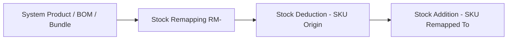
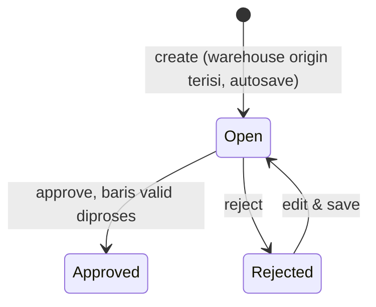
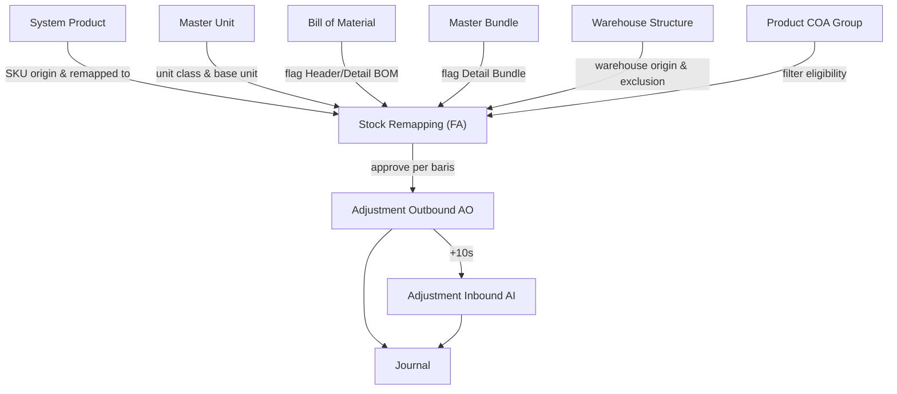

# Stock Remapping — Requirement Documentation

**Modul:** Finance Accounting (FA) — mutasi stok memakai entitas Supply Chain
**UI route:** `/accounting/stock-remapping`
**API base:** `{VITE_API_URL}accounting/stock-remapping`
**Audience:** PM, Operations (Finance), QA, Support, Developer
**PM source:** Stock Remapping Source of Truth v2.0 (30 Juli 2026)
**Rounding/precision:** qty disimpan & dijurnal dalam Base Unit
**Aliases operasional:** Stock Acak · Stock Conversion (nama draft lama)

---

## 0. Metadata & Changelog

| Version | Date | Author | Changes |
|---------|------|--------|---------|
| 1.0 | 2026-07-09 | QA - Yemima | Initial QA doc dari PM v1.1; modul FA; relasi SCM; prefix **RM-** |
| 2.0 | 2026-07-30 | QA - Yemima | Selaras SoT v2.0: Remapped To dibuka lintas parent (Single/Detail BOM/Header BOM/Detail Bundle) syarat Unit Class sama; SKU Origin per Stock ID; Unit read-only Base Unit + kolom Avl. Base Unit; Unit Price 1:1 per Stock ID; duplicate Remapped To diperbolehkan; Identification Icon; import auto-split FIFO per Stock ID. Ditambah tabel **Status implementasi v2.0** (AS-IS vs TO-BE) + Gap Registry `GAP-RM-*` |

---

## 1. Ringkasan Eksekutif

**Stock Remapping** (prefix **`RM-`**) meremap identitas stok dari **1 SKU Origin** ke **SKU Remapped To** tanpa harus membuat Stock Deduction + Stock Addition manual terpisah. Use case utama: tim Warehouse/Inventory yang menyortir barang impor SKU acak menjadi variant sesungguhnya. Menu berada di **Finance Accounting** karena baris detail memuat **Unit Price / nilai persediaan** yang tidak boleh dilihat operator gudang murni.


```mermaid
flowchart LR
    SP[System Product / BOM / Bundle] --> RM[Stock Remapping RM-]
    RM --> SD[Stock Deduction - SKU Origin]
    SD --> SA[Stock Addition - SKU Remapped To]
```

**Perubahan inti v2.0:** scope SKU Remapped To yang tadinya hanya sesama Variant dalam 1 parent, dibuka untuk SKU **Single**, SKU **Detail BOM**, **Header BOM**, atau **Detail Bundle** — selama **Unit Class identik** dengan SKU Origin. Konsekuensi: Unit dikunci ke Base Unit, SKU Origin dipilih per Stock ID spesifik, dan duplicate Remapped To antar baris diperbolehkan.

---

## 2. Status implementasi v2.0 (AS-IS vs TO-BE)

> Requirement di dokumen ini = **target v2.0** (approved SoT). Sebagian perilaku masih AS-IS v1.1 di codebase. Kolom Status wajib dipakai QA saat menguji supaya tidak melaporkan false-negative.

| Area v2.0 | Target v2.0 | Status codebase saat ini | Gap |
|-----------|-------------|--------------------------|-----|
| Eligibilitas Remapped To lintas parent (Single/Detail BOM/Header BOM/Detail Bundle) | Dibuka, syarat Unit Class sama | **Belum** — masih block "same parent" di manual & import | GAP-RM-04 |
| Validasi **Unit Class** sama (block total) | Wajib, digate di manual/import/approve | **Belum ada** cek unit class eksplisit | GAP-RM-05 |
| Duplicate Remapped To antar baris | Diperbolehkan | **Masih diblok** di manual & import | GAP-RM-06 |
| SKU Origin per **Stock ID** spesifik (modal Available Product) | Pilih baris per Stock ID | **Parsial** — modal `available-products` ada, penyimpanan detail masih per SKU + FIFO otomatis | GAP-RM-07 |
| Unit **read-only = Base Unit** + kolom **Avl. Base Unit** | Wajib Base Unit | **Belum** — Unit masih terima Primary/Base/Alternate | GAP-RM-08 |
| Unit Price 1:1 dari Stock ID | Fixed per Stock ID | **Masih blended** rata-rata FIFO per warehouse | GAP-RM-07 |
| Identification Icon (warning lintas parent) | Tampil non-blocking | **Belum** (karena lintas parent belum dibuka) | GAP-RM-04 |
| Import auto-split FIFO per Stock ID | 1 baris file → N baris detail per Stock ID | **Belum** — 1 baris file = 1 baris detail, FIFO di-generate saat approve | GAP-RM-07 |

Selebihnya (header, status lifecycle, prefix RM-, sequencing Deduction→Addition, blok random/Service/Asset, export, retensi import) sudah **Live** — lihat §6–§8.

---

## 3. Penempatan Modul & Visibility

| Aspek | Keputusan |
|-------|-----------|
| **Modul menu utama** | **Finance Accounting** (`Modules/Accounting`) |
| Alasan | Baris detail menampilkan **Unit Price** / total amount (nilai persediaan) |
| Operator gudang murni | **Tidak** memiliki menu ini — nilai barang tidak boleh diekspos |
| Pergerakan stok | Auto-generate dokumen adjustment (Deduction/Addition) saat approve |
| Permission | `StockRemappingPolicy` (Gate FA) terpisah dari menu adjustment SCM manual |

**Implikasi QA:** uji role tanpa privilege FA tidak melihat route `/accounting/stock-remapping` dan tidak melihat kolom unit price/total amount.

---

## 4. Prasyarat

| Prasyarat | Sumber | Catatan |
|-----------|--------|---------|
| System Product Active | Master System Product | Sumber SKU Origin (Variant) & Remapped To |
| Unit Class & Base Unit per SKU | Master Unit | Base Unit = unit terkecil di 1 Unit Class. **Wajib identik** Origin ↔ Remapped To (target v2.0) |
| Flag Header/Detail BOM | Master Bill of Material | Sumber eligibilitas kategori baru Remapped To (target v2.0) |
| Flag Detail Bundle | Master Bundle | Sumber eligibilitas kategori baru Remapped To (target v2.0) |
| Warehouse Origin Active | Master Warehouse Structure | Exclusion rules sama dengan transaksi keluar (Deduction/Outbound) |
| Product COA Group | Master Product COA Group | Hanya **Purchased Item** & **Manufactured Item** (Service & Asset diblok) |
| Stock tersedia SKU Origin | Stock Ledger / Item Stock | Availability dihitung per warehouse tree origin, dalam Base Unit |

---

## 5. Siklus Status


```mermaid
stateDiagram-v2
    [*] --> Open: create (warehouse origin terisi, autosave)
    Open --> Approved: approve, baris valid diproses
    Open --> Rejected: reject
    Rejected --> Open: edit & save
```

| Status | Kondisi Transisi | Editable? | Tombol |
|--------|------------------|-----------|--------|
| Open | Header dibuat (default `TS_OPEN`), warehouse origin terisi | Ya | Save, Approve, Reject |
| Approved | Baris valid lolos saat Approve; Deduction+Addition ter-approve | Tidak | — (Unapprove khusus) |
| Rejected | User klik Reject | Ya setelah edit | Save |

Catatan: header dibuat langsung berstatus **Open** saat create (bukan Draft). `Void` di-handle sistem (render update saja) tapi bukan aksi user standar.

---

## 6. Form & Field

### 6.1 Basic Information

| Field | Wajib | Default | Keterangan / Validasi |
|-------|-------|---------|-----------------------|
| Transaction Code | — | Auto `RM-` (`generateCode`) | Read-only |
| Transaction Date | — | `now()` | `nullable, date` |
| **Warehouse Origin** | **Ya** | Transaksi terakhir | `required, exists`; exclusion sama transaksi keluar; **tidak bisa diubah** bila sudah ada detail |
| Trx Ref | Opsional | NULL | `max:150` |
| Description | Opsional | NULL | `max:150` |

Autosave pola Purchase Inbound: header tersimpan saat create bila Warehouse Origin terisi.

### 6.2 Remapping Detail

| # | Field | Wajib | Editable | Sumber | Keterangan v2.0 |
|---|-------|-------|----------|--------|-----------------|
| 1 | SKU Origin (Stock ID) | Ya | Via modal Available Product (Single Use & Bulk Use) | Item Stock per Stock ID | **Target:** pilih baris per Stock ID. **AS-IS:** dipilih per SKU (FIFO otomatis) — GAP-RM-07 |
| 2 | Remapped To | Ya | Ya | Lihat §7.1 | **Target:** boleh lintas parent + duplicate. **AS-IS:** masih same-parent & unik — GAP-RM-04/06 |
| 3 | Identification Icon | — | Read-only (kolom tanpa judul, setelah Remapped To) | Auto | Muncul bila Remapped To beda parent (target v2.0) — GAP-RM-04 |
| 4 | Unit | — | **Target: read-only Base Unit** | Master Unit SKU Origin | **AS-IS:** masih terima Primary/Base/Alternate — GAP-RM-08 |
| 5 | Availability | — | — | Item Stock (Primary Unit) | Info stok |
| 6 | Avl. Base Unit | — | — | Availability × conversion rate → Base Unit | Batas maksimum qty (target v2.0) — GAP-RM-08 |
| 7 | Qty | Ya | Ya | — | `numeric, gt:0`; **target:** input Base Unit; tidak melebihi Avl. Base Unit |
| 8 | Unit Price | — | **Tidak** | Stock ID/FIFO SKU Origin | **Target:** 1:1 per Stock ID. **AS-IS:** blended FIFO per warehouse — GAP-RM-07 |
| 9 | Description | Opsional | Ya | — | `max:150` |

---

## 7. How It Works

### 7.1 Eligibilitas Remapped To (target v2.0)

Opsi Remapped To untuk SKU Origin (Variant) kini mencakup:

| Kategori | Keterangan |
|----------|------------|
| (a) Variant dalam parent yang sama | Rule lama v1.1 — tetap valid |
| (b) SKU tipe Single | Baru — tak perlu 1 parent |
| (c) SKU ter-flag Detail BOM | Baru — komponen Bill of Material |
| (d) SKU ter-flag Header BOM | Baru — finished good hasil Assembly |
| (e) SKU ter-flag Detail Bundle | Baru — komponen Bundle |

Syarat umum semua kategori: Active · bukan Random · bukan self-remap · **Unit Class identik** dengan Origin · Product COA Group Purchased/Manufactured Item.

> **AS-IS:** codebase masih membatasi Remapped To ke variant satu parent yang sama (manual & import). Pembukaan lintas parent + cek Unit Class = TO-BE (GAP-RM-04/05).

### 7.2 SKU Origin berbasis Stock ID (target v2.0)

Modal **Available Product** menampilkan stok SKU Origin dipecah per Stock ID (batch masuk), masing-masing dengan Availability & Unit Price sendiri. User memilih Stock ID spesifik; Unit Price mengikuti Stock ID apa adanya (1:1), sehingga Stock Addition SKU Remapped To konsisten dengan batch asal.

Contoh:

```
SKU Origin punya 2 Stock ID:
  Stock ID 529670  Availability 10  Unit Price 24.000
  Stock ID 529671  Availability 5   Unit Price 15.000
User pilih Stock ID 529670 → Unit Price detail = 24.000 (tidak berubah oleh qty)
```

> **AS-IS:** detail disimpan per SKU; alokasi & Unit Price dihitung FIFO (blended rata-rata per warehouse) saat generate mutasi. Selection per Stock ID = TO-BE (GAP-RM-07).

### 7.3 Unit wajib Base Unit & kolom Avl. Base Unit (target v2.0)

```
Primary Unit = BOX, Base Unit = PCS (1 BOX = 10 PCS), Stock IN = 100 BOX
Availability   : 100    (Primary Unit)
Avl. Base Unit : 1.000  (100 × 10)
Remap semua → input Qty = 1.000 (Base Unit)
```

Alasan: 1 Unit Class pasti punya 1 Base Unit yang sama, sehingga qty Origin ↔ Remapped To selalu apple-to-apple meski Primary Unit berbeda. Reporting tetap konversi balik ke Primary Unit masing-masing SKU.

> **AS-IS:** Unit detail masih menerima Primary/Base/Alternate SKU Origin (validasi hanya "unit aktif untuk SKU"), belum dipaksa Base Unit (GAP-RM-08).

### 7.4 Identification Icon — warning lintas parent (target v2.0)

Icon di kolom tanpa judul setelah Remapped To, muncul bila Remapped To bukan variant parent yang sama dengan Origin. Bersifat **informasi (non-blocking)** — berbeda dengan validasi Unit Class yang block total.

Tooltip (EN): *"This SKU does not belong to the same parent product as SKU Origin. Please confirm this remap is intentional before approving."*

### 7.5 Duplicate Remapped To antar baris (target v2.0)

```
Baris 1: Origin (Stock ID A) → Remapped To SKU-X, qty 100
Baris 2: Origin (Stock ID B) → Remapped To SKU-X, qty 50
Target v2.0: keduanya DIIZINKAN → 2 Stock Addition terpisah untuk SKU-X
```

> **AS-IS:** baris ke-2 masih **ditolak** ("already used as Remapped To in another row") di manual & import (GAP-RM-06).

### 7.6 Pergerakan stok & sequencing approve (Live)

1. Saat approve, per baris: sistem membuat/approve **Stock Deduction** (SKU Origin) lalu **Stock Addition** (SKU Remapped To).
2. Stock Addition memakai `transaction_date` = tanggal RM **+ 10 detik**.
3. Alokasi Origin memakai FIFO per warehouse leaf; Unit Price Addition = rata-rata tertimbang alokasi per warehouse.
4. Deduction & Addition di-generate per baris, di-approve berurutan; jumlah qty Addition harus sama dengan Deduction (guard: `remapping_quantity_in_base_unit`).
5. Dokumen turunan tampil di menu **Adjustment Inbound** (AI) & **Adjustment Outbound** (AO) beserta jurnalnya.

### 7.7 Import (Live)

Template **5 kolom** (header wajib: `SKU Origin`, `Remapped To SKU`, `Qty`, `Unit`, `Description`). Diproses baris-per-baris (partial import): baris valid dibuat sebagai job, baris gagal masuk import log. Availability diakumulasi per SKU Origin (sequential).

> **Target v2.0:** sistem otomatis split 1 baris file menjadi N baris detail per Stock ID (FIFO), qty dalam Base Unit. **AS-IS:** 1 baris file = 1 baris detail; FIFO diselesaikan saat generate mutasi (GAP-RM-07).

---

## 8. Validasi

| # | Kondisi | Behavior | Pesan (AS-IS dari codebase / EN) |
|---|---------|----------|----------------------------------|
| 1 | Origin = Remapped To | Ditolak | (rule `different`) |
| 2 | SKU inactive | Ditolak | `SKU [sku] is inactive and cannot be used.` |
| 3 | SKU Random | Ditolak | `Random SKU cannot be used as [Origin/Remapped To] in Stock Remapping.` |
| 4 | Parent SKU (import) | Ditolak | `SKU ... is a Parent SKU, which is not allowed.` |
| 5 | COA Group Service/Asset | Ditolak | `SKU [sku] with Product COA Group type "[type]" is not allowed. Only Purchased Item and Manufactured Item are supported.` |
| 6 | Unit tidak aktif untuk SKU | Ditolak | `The selected unit is inactive or unavailable for SKU [sku].` |
| 7 | Qty melebihi availability origin | Ditolak | `The quantity exceeds the available stock of origin product. Maximum allowed quantity is [n] [unit].` / `Insufficient stock. [sku] only has [n] base units available in [warehouse].` |
| 8 | Warehouse origin inactive (approve) | Ditolak | `Warehouse [name] is inactive in Master Warehouse Structure. Please select an active warehouse.` |
| 9 | Produk Service (approve) | Ditolak | `Product with SKU [sku] are Service type and cannot be used for transactions.` |
| 10 | Unit Price desimal (approve) | Ditolak | `Product with SKU [sku] must be entered with a Unit Price in whole numbers not decimals.` |
| 11 | Format file import salah | Ditolak | `The file format doesn't match the system template. Required headers: SKU Origin, Remapped To SKU, Qty, Unit, Description.` |
| — | **Unit Class Origin ≠ Remapped To** | **Target: block total** (manual/import/approve) | Belum diimplementasi — GAP-RM-05 |

**AS-IS yang akan berubah di v2.0:**

| Kondisi | AS-IS | Target v2.0 |
|---------|-------|-------------|
| Remapped To beda parent | Ditolak (`does not belong to the same parent as SKU Origin.`) | Diizinkan (memicu Identification Icon) — GAP-RM-04 |
| Remapped To dipakai di baris lain | Ditolak (`already used as Remapped To in another row...`) | Diizinkan — GAP-RM-06 |

---

## 9. Relasi Menu Lain


```mermaid
flowchart TB
    RM["Stock Remapping (FA)"]
    SP[System Product] -->|SKU origin & remapped to| RM
    MU[Master Unit] -->|unit class & base unit| RM
    BOM[Bill of Material] -->|flag Header/Detail BOM| RM
    BDL[Master Bundle] -->|flag Detail Bundle| RM
    WH[Warehouse Structure] -->|warehouse origin & exclusion| RM
    PCG[Product COA Group] -->|filter eligibility| RM
    RM -->|approve per baris| SD[Adjustment Outbound AO]
    SD -->|+10s| SA[Adjustment Inbound AI]
    SD --> J[Journal]
    SA --> J
```

| Menu | Peran |
|------|-------|
| [System Product](../system-product/requirement.md) | Sumber SKU Origin (Variant) & Remapped To |
| [Master Unit](../supplychain-unit/requirement.md) | Unit Class & Base Unit — wajib identik (target v2.0) |
| [Bill of Material](../bill-of-material/requirement.md) | Flag Header/Detail BOM (eligibilitas Remapped To) |
| [Product COA Group](../accounting-product-coa-group/requirement.md) | Filter Purchased/Manufactured Item |
| [Random SKU](../random-sku/requirement.md) | Blok SKU random |
| [Warehouse Structure](../supplychain-warehouse-structure/requirement.md) | Warehouse origin & exclusion |
| [Adjustment Inbound](../accounting-adjustment-inbound/README.md) | Dokumen `AI` auto-generated (Addition) |
| [Journal](../journal/requirement.md) | Jurnal dari dokumen adjustment auto-generated |

**Catatan journal:** Trx Ref jurnal merujuk dokumen langsung yang posting (AO/AI), bukan hanya nomor RM.

---

## 10. Acceptance Criteria

| ID | Kriteria |
|----|----------|
| SRM-01 | Menu di modul Finance Accounting; role tanpa FA tidak akses & tidak lihat unit price |
| SRM-02 | Prefix `RM-` unik; autosave pola Purchase Inbound; warehouse origin tidak bisa diubah bila ada detail |
| SRM-03 | Blok Random, inactive, COA Service/Asset (Origin & Remapped To) |
| SRM-04 | Qty tidak melebihi availability origin (per warehouse tree, Base Unit) |
| SRM-05 | Approve: Deduction lalu Addition per baris; Addition trx date +10 detik; qty Addition = Deduction |
| SRM-06 | Approve blok warehouse inactive, produk Service, unit price desimal |
| SRM-07 | Import 5 kolom, partial import + import log, sequential quota per SKU |
| SRM-08 | Dokumen AO/AI + jurnal tampil & tertaut ke RM |
| SRM-09 *(v2.0)* | Remapped To eligible lintas parent (Single/BOM/Bundle) syarat Unit Class sama — GAP-RM-04/05 |
| SRM-10 *(v2.0)* | Unit read-only Base Unit + kolom Avl. Base Unit — GAP-RM-08 |
| SRM-11 *(v2.0)* | SKU Origin per Stock ID; Unit Price 1:1; duplicate Remapped To diizinkan — GAP-RM-06/07 |

---

## 11. Gap Registry

| ID | Deskripsi | Dampak | Status |
|----|-----------|--------|--------|
| GAP-RM-01 | Bundle Header (bukan Detail Bundle) tidak disebut eligible Remapped To — asumsi tetap diblok. Perlu konfirmasi PM | Bila seharusnya eligible, perlu tambahan kategori §7.1 + validasi | Open |
| GAP-RM-02 | Restriction COA Group (hanya Purchased/Manufactured) diasumsikan berlaku ke semua kategori baru Remapped To | Bila ada kategori dikecualikan, validasi §8 #5 perlu disesuaikan | Open |
| GAP-RM-03 | Release reserved saat baris/header dihapus perlu dipastikan bekerja per Stock ID (bukan per SKU) | Reserved bisa macet di Stock ID tertentu | Open |
| GAP-RM-04 | Eligibilitas Remapped To lintas parent (Single/Detail BOM/Header BOM/Detail Bundle) + Identification Icon belum ada; codebase masih block same-parent | Fitur inti v2.0 belum aktif | Open (TO-BE) |
| GAP-RM-05 | Validasi Unit Class identik (block total di manual/import/approve) belum ada | Remap lintas Unit Class bisa lolos → qty tidak apple-to-apple | Open (TO-BE) |
| GAP-RM-06 | Duplicate Remapped To antar baris masih diblok; target v2.0 diizinkan | Operator tak bisa remap ke SKU tujuan sama dari 2 Stock ID | Open (TO-BE) |
| GAP-RM-07 | SKU Origin belum dipilih per Stock ID; Unit Price masih blended FIFO; import belum auto-split per Stock ID | Unit Price bisa tidak konsisten dengan batch asal | Open (TO-BE) |
| GAP-RM-08 | Unit belum dipaksa Base Unit; kolom Avl. Base Unit belum wajib | Input qty bisa memakai Primary/Alternate → risiko salah baca batas | Open (TO-BE) |

---

## 12. FAQ

**Q: Kenapa menu ada di Finance Accounting, bukan Supply Chain?**
A: Baris detail memuat Unit Price / nilai persediaan yang tidak boleh dilihat operator gudang murni.

**Q: Apakah sudah bisa remap ke SKU beda parent atau SKU Single/BOM/Bundle?**
A: Itu target v2.0. Saat ini codebase masih membatasi ke variant satu parent (GAP-RM-04). Uji sesuai status implementasi di §2.

**Q: Kenapa Unit Price tidak bisa diedit?**
A: Diisi otomatis dari nilai stok SKU Origin (saat ini FIFO; target v2.0: 1:1 per Stock ID).

**Q: Kenapa qty saya ditolak padahal stok terlihat cukup?**
A: Cek satuan input vs availability dalam Base Unit, dan akumulasi qty dari baris lain dengan SKU Origin yang sama.

**Q: Bisa pakai SKU `-random`?**
A: Tidak — random diblok di semua posisi. Lihat [Random SKU](../random-sku/requirement.md).

---

## Related Documents

| Doc | Path |
|-----|------|
| Knowledge Base | [knowledge-base.md](./knowledge-base.md) |
| Technical | [technical.md](./technical.md) |
| User Guide | [user-guide.md](./user-guide.md) |
| Random SKU | [../random-sku/requirement.md](../random-sku/requirement.md) |
